# Tensorflow 中的“深度”独立分量分析[TF 中的手动背道具]

> 原文：<https://towardsdatascience.com/deep-independent-component-analysis-in-tensorflow-manual-back-prop-in-tf-94602a08b13f?source=collection_archive---------8----------------------->

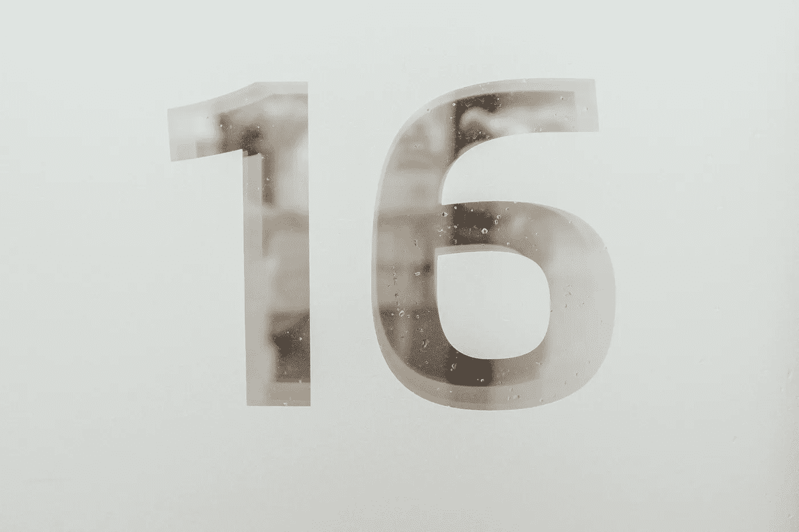

Photo by [Bernard Hermant](https://unsplash.com/photos/HcZP0fDM2yc?utm_source=unsplash&utm_medium=referral&utm_content=creditCopyText) on [Unsplash](https://unsplash.com/search/photos/math?utm_source=unsplash&utm_medium=referral&utm_content=creditCopyText)

我们可以使用独立分量分析来捕捉局部变化，然而，我们在现实生活中遇到的图像数据生活在非常高维的空间中。我想看看我们是否可以结合深度学习来执行 ICA。

> **请注意，这篇文章只是为了娱乐和自学。**

**人脸数据或 MRI 数据上的 ICA**

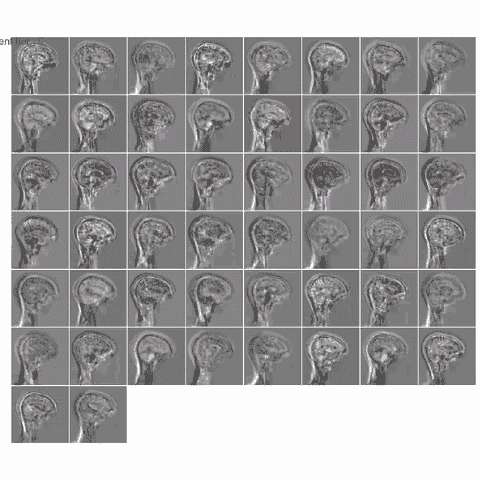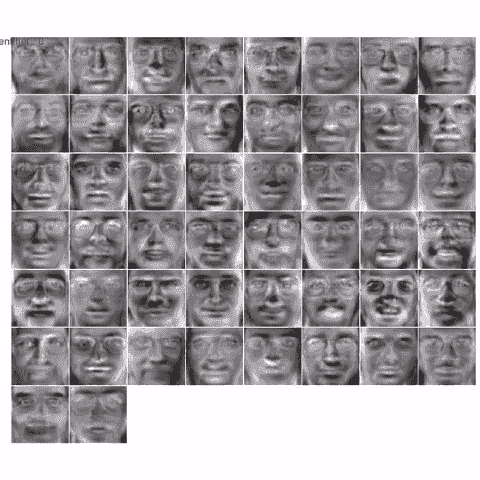

Image from this [website](https://medium.com/analytics-vidhya/fast-ica-vs-reconstruction-ica-vs-orthonormal-ica-in-tensorflow-matlab-manual-back-prop-in-tf-8b3212924ad0)

如上所述，当我们在人脸图像或脑部 MRI 上执行 ICA 时，我们可以注意到我们能够(清楚地)捕捉到局部变化。然而，这能在现实生活中的图像上工作吗？我的意思是，我们是否能够从包含许多差异的一组图像中捕捉到一个物体的大致结构。

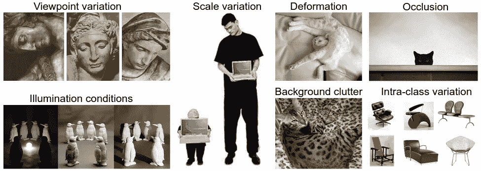

Image from this [website](http://cs231n.github.io/classification/)

如上所述，对于给定对象，图像看起来会有很多不同。(带刻度或方差)。但是如果我们仔细想想，面部图像和大脑核磁共振成像一样，已经是居中的，不包含太多的变化。STL 数据集中的鸟类图像子集怎么样？

如上所述，所有的图片都包含了鸟的图像，但是有些在飞，有些在坐。有不同的规模以及旋转，角度等。

**PCA、KPCA 和 ICA 的直接方法**

让我们使用高级 API 方法对 STL 数据集中的 500 幅鸟类图像执行一些降维技术。(我准备用 Sklearn。)还有，我只会得到前 40 个主分量以及独立分量。

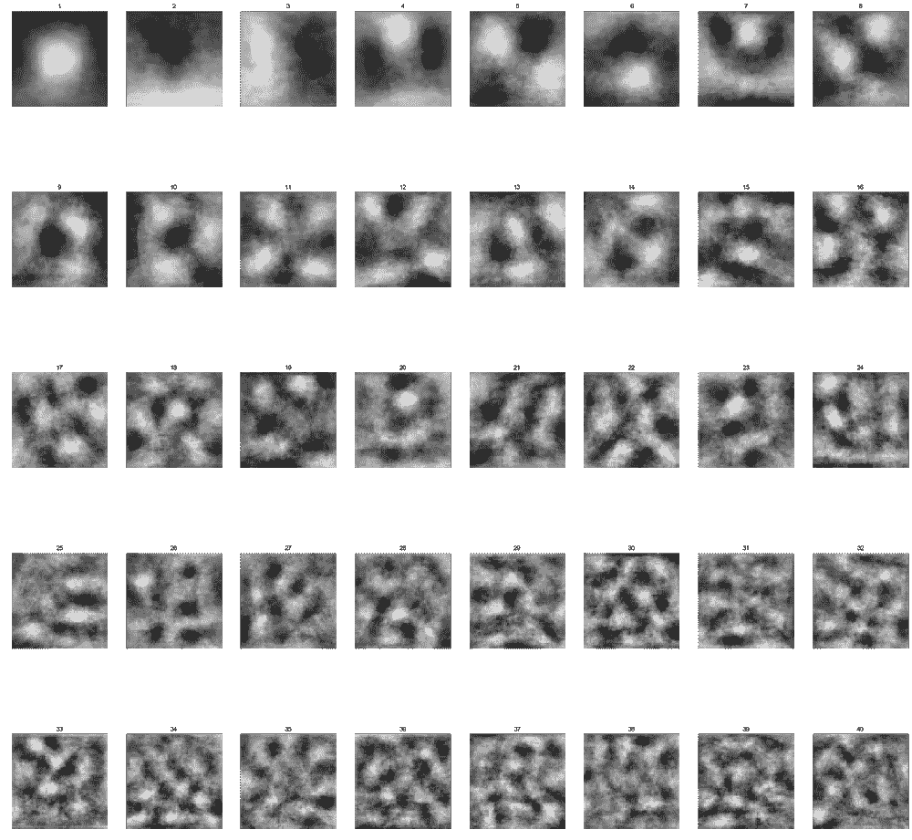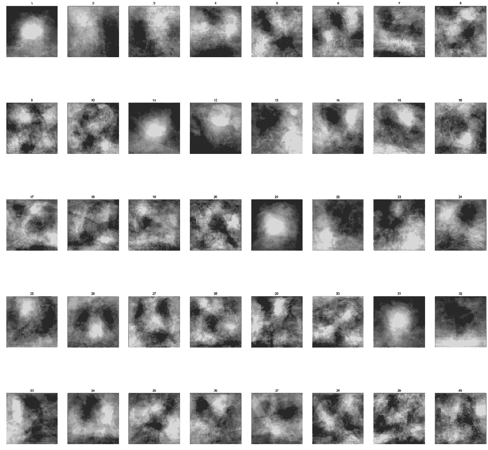

Left the whole data set \ Right split the data set in to 4 components

我们可以看到，在我们的第一张主图像中，我们的图像中心有一个白色斑点。(那看起来确实像一只鸟)。在轴上移动，我们可以观察到很少的主成分像鸟一样的图形。然而，在第三行之后，不清楚图像中到底有什么。

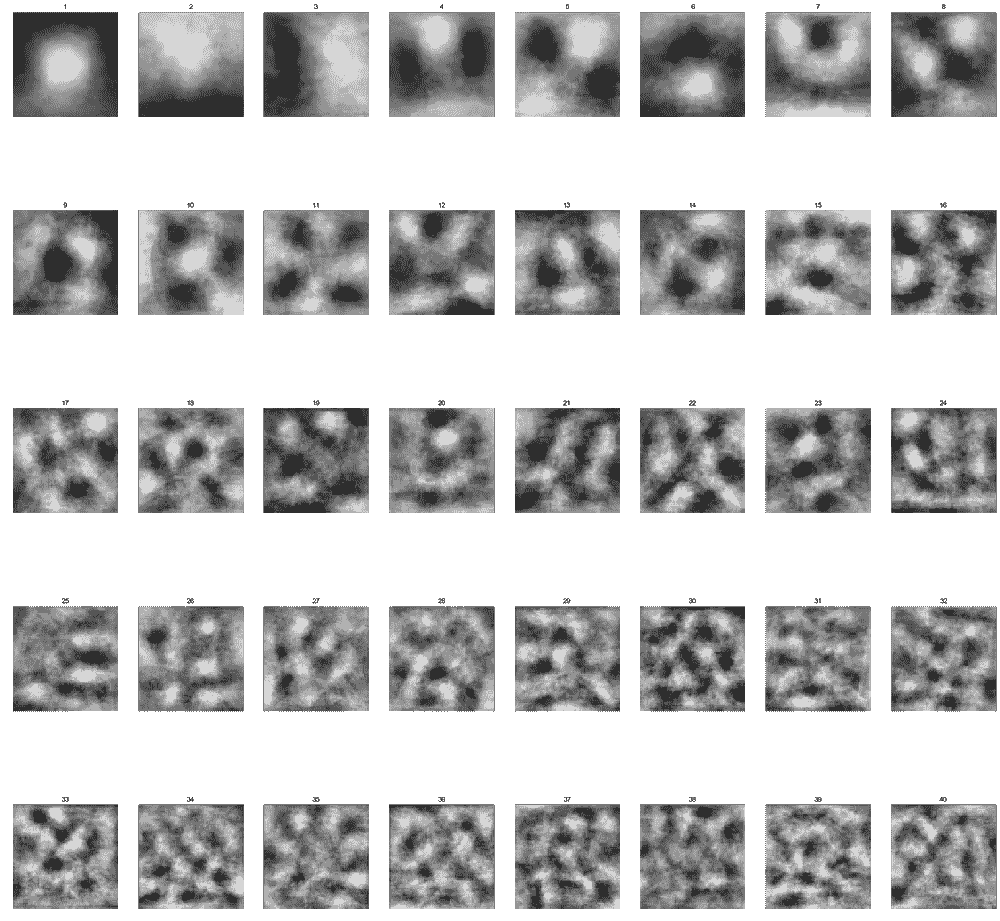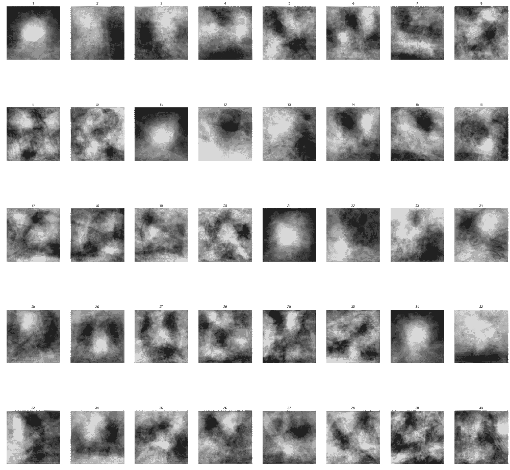

Left the whole data set \ Right split the data set in to 4 components

同样，让我们使用高级 api 方法来执行 KPCA，类似于 PCA 的结果。同样，前几个主要图像确实像一个鸟一样的数字。

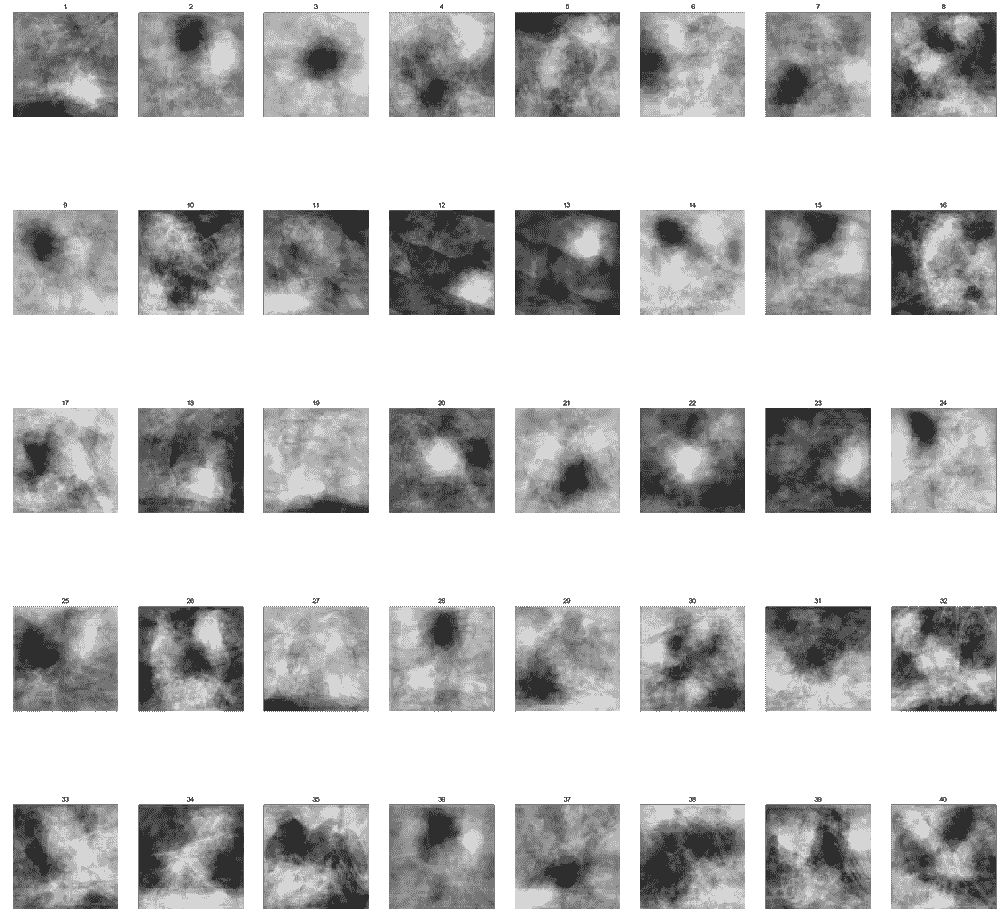

Left the whole data set \ Right split the data set in to 4 components

最后，高级 ICA 方法。我们可以看到，总的来说，它捕捉到了图像中的局部变化。如果我看得足够近，我真的可以在图像中看到一些鸟一样的人物。

**“深度”学习方法**

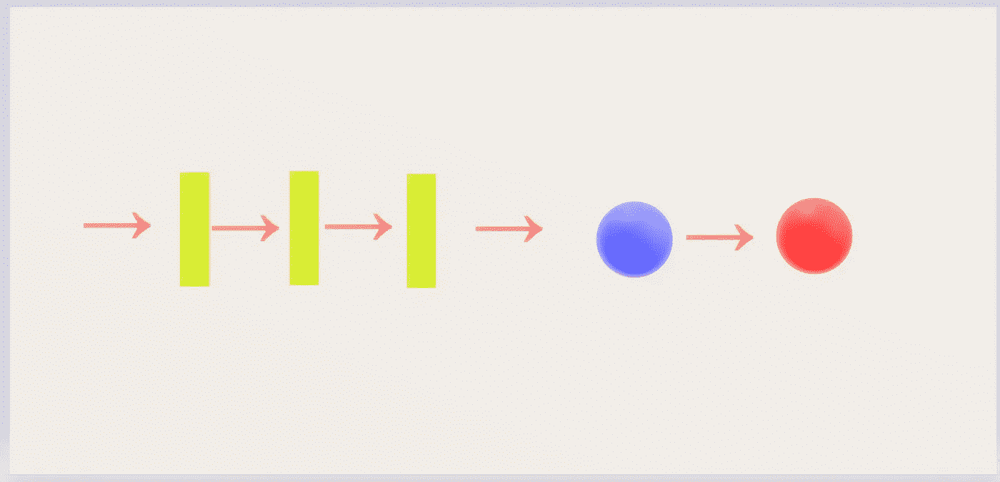

**黄框** →卷积层
**蓝框** →主成分分析层
**红框** →独立成分分析层

现在，从上面的图中，我们已经知道我想要尝试什么，只需用几个卷积层从图像中提取更高层次的特征，然后执行 PCA 以降低维度，并使用 ICA 以统计方式使这些主成分相互独立。

我之所以在 ICA 之前使用 PCA，是因为从我过去的实验来看，使用 ICA 作为降维手段并没有很好地收敛。另外请注意，我们可以选择多种独立分量分析方法，例如梯度上升法。我正要用 FastICA。

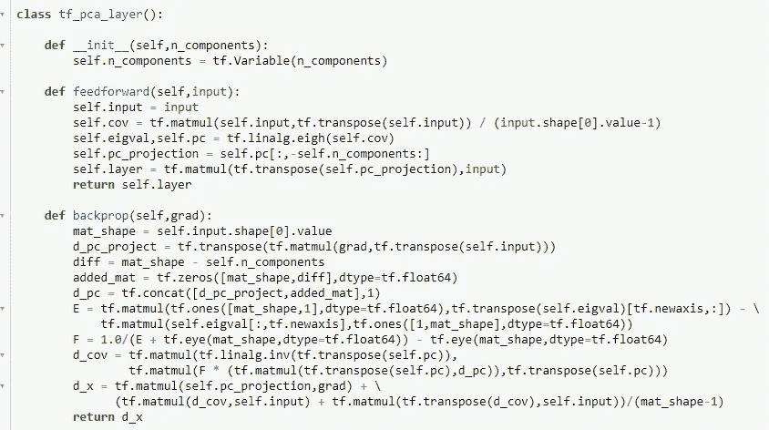

在继续之前，让我们首先实现 PCA 层，如上所述，这里还要注意的另一件事是，我将使用 Adam 来优化快速 ICA 的权重，而不是直接分配。

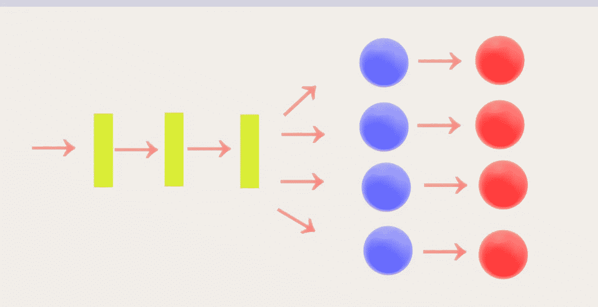

最后，我不想在 ICA 上进行优化，而是想分成四个不同的流。

**可用于快速 ICA 的函数形状**

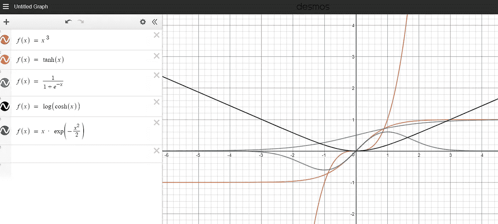

Image from this [website](https://www.desmos.com/calculator)

我不会进入细节，但对于快速 ICA 有几个激活功能(不是正确的名称，但我会这样称呼它。)，我们可以选择使用。我想把它们形象化。

**ICA 作为损失函数**

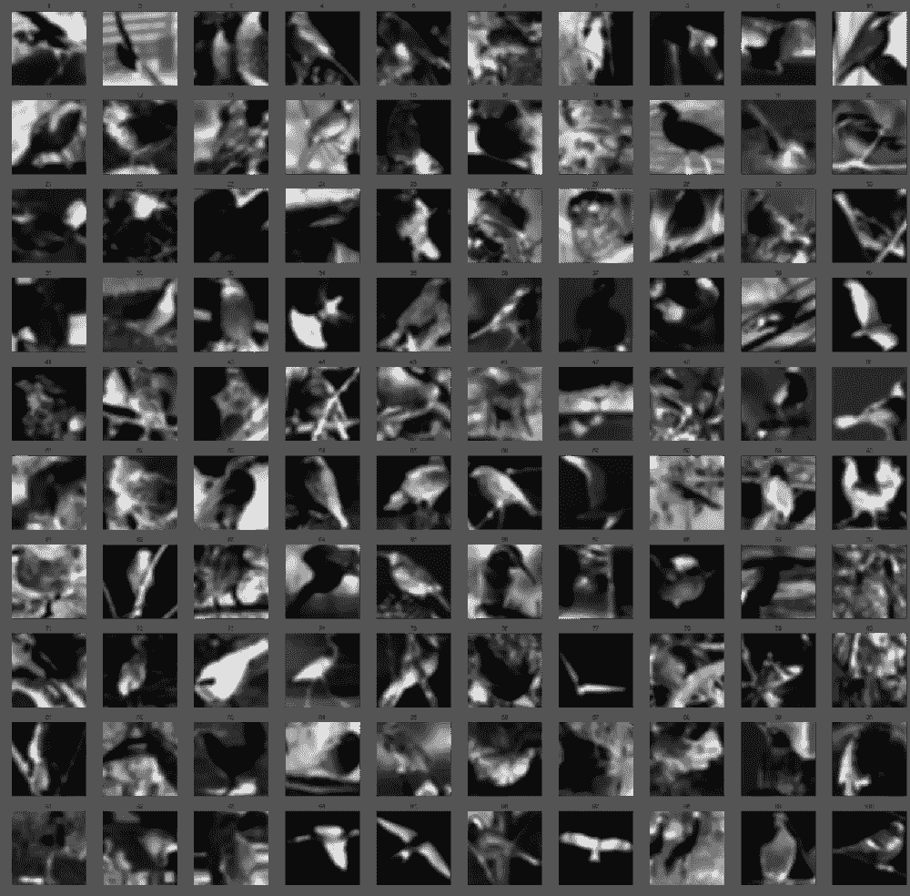

**左上** →原图像
**右上** →第一层后图像
**左下** →第二层后图像
**右下** →第三层后图像

因此，随着图像在层中向上移动，图像中的一些部分变暗，而其他部分变得更白。现在让我们看看 40 张组合的原则图片。

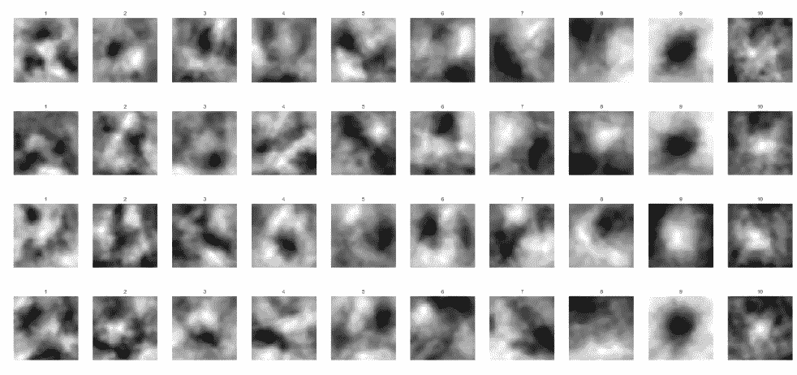

一些黑色的数字看起来像鸟，但不是那么脆，当我们看到 40 个独立的组件。

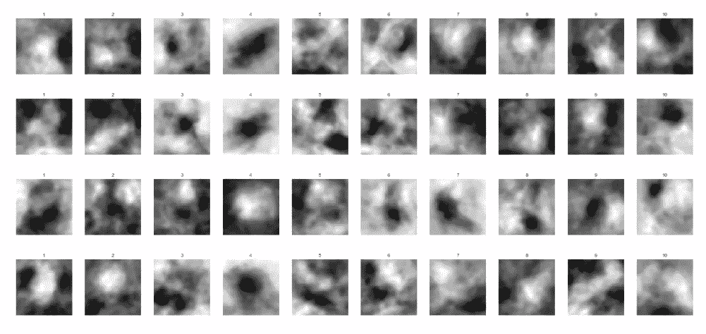

我们可以看到，一些部分看起来更像鸟，但没有那么脆，我想还有很长的路要走。收敛过程如下图所示。

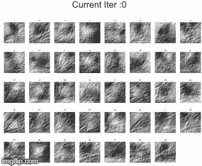

**本岗位代码**

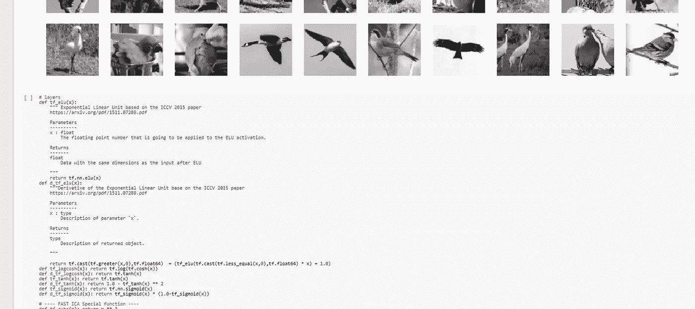

*对于谷歌 Colab，你需要一个谷歌帐户来查看代码，而且你不能在谷歌 Colab 中运行只读脚本，所以在你的操场上做一个副本。最后，我永远不会请求允许访问你在 Google Drive 上的文件，仅供参考。编码快乐！*

要访问 sklearn High [级别的代码，请单击此处。](https://colab.research.google.com/drive/1yRd1U64bw_Oqi5VRmpiVI_9Ayp1PtljQ)
点击此处获取 Tensorflow [的代码。](https://colab.research.google.com/drive/1NgUkRFjfgTHBPMHTzJ0ssQFPWS5reBC-)

**最后的话**

如果发现任何错误，请发电子邮件到 jae.duk.seo@gmail.com 给我，如果你想看我所有写作的列表，请在这里查看我的网站。

同时，在我的 twitter 上关注我[这里](https://twitter.com/JaeDukSeo)，访问[我的网站](https://jaedukseo.me/)，或者我的 [Youtube 频道](https://www.youtube.com/c/JaeDukSeo)了解更多内容。我还实现了[广残网，请点击这里查看博文](https://medium.com/@SeoJaeDuk/wide-residual-networks-with-interactive-code-5e190f8f25ec) t。

**参考**

1.  PIL？，H. (2018)。如何保存 PIL 的图像？。堆栈溢出。检索于 2018 年 9 月 15 日，来自[https://stack overflow . com/questions/14452824/how-can-I-save-a-image-with-pil](https://stackoverflow.com/questions/14452824/how-can-i-save-an-image-with-pil)
2.  南 PIL(2018 年)。用 PIL 拯救形象。堆栈溢出。检索于 2018 年 9 月 15 日，来自[https://stack overflow . com/questions/1965 10 55/saving-image-with-pil](https://stackoverflow.com/questions/19651055/saving-image-with-pil)
3.  慢，S. (2018)。使用 Matplotlib 保存图形非常慢。树莓 Pi 栈交换。检索于 2018 年 9 月 16 日，来自[https://raspberrypi . stack exchange . com/questions/72542/saving-graphs-using-matplotlib-is-very-slow](https://raspberrypi.stackexchange.com/questions/72542/saving-graphs-using-matplotlib-is-very-slow)
4.  用于视觉识别的 CS231n 卷积神经网络。(2018).cs 231n . github . io . 2018 年 9 月 16 日检索，来自[http://cs231n.github.io/classification/](http://cs231n.github.io/classification/)