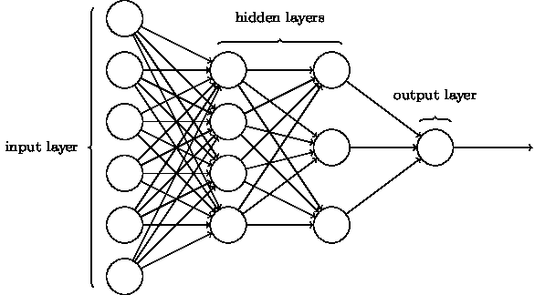

# 深度学习#1:设置 AWS 和图像识别

> 原文：<https://towardsdatascience.com/deep-learning-1-1a7e7d9e3c07?source=collection_archive---------0----------------------->

这篇文章是深度学习系列文章的一部分。检出部分 2 [*此处*](https://medium.com/@r.ruizendaal/deep-learning-2-f81ebe632d5c) *和部分 3* [*此处*](https://medium.com/@r.ruizendaal/deep-learning-3-more-on-cnns-handling-overfitting-2bd5d99abe5d) *。*


This week: classifying images of cats and dogs

欢迎来到这个实用深度学习系列的第一篇文章。在这个条目中，我将设置 Amazon Web Services (AWS)实例，并使用一个预先训练好的模型对猫和狗的图像进行分类。

在这个完整的系列中，我将在博客中记录我在快速人工智能深度学习课程的第一部分中的过程。这门课程最初是在旧金山大学的数据学院开设的，现在作为 MOOC 开放。最近作者给出了课程的第二部分，将在几个月后在网上提供。学习这门课程的主要原因是我对深度学习的极大兴趣。我发现了许多关于机器学习的在线资源，但关于深度学习的实用课程似乎很少。深度学习似乎是一个排他性的群体，只是更难进入而已。开始深度学习首先需要的是一个 GPU。在本课程中，我们使用 AWS 中的 p2 实例。让我们开始吧。

这门课的第一周主要是设置。让你的深度学习设置正确可能需要一段时间，重要的是让一切正常工作。这包括设置 AWS、创建和配置 GPU 实例、设置 ssh-ing 到服务器的过程以及管理您的目录。

我在实习笔记本电脑上遇到了一些权限问题。让我给你一个建议，可以节省很多时间来绕过它:在尝试这样做之前，确保你在你的笔记本电脑上有完全的管理员权限。一些可爱的工程师提出为我设置 GPU 实例，但他们没有时间很快完成。所以我决定亲自动手。

设置 AWS 实例的脚本是用 bash 编写的。如果你在一台 Windows 机器上工作，你将需要一个能处理这个的程序。我用的是 Cygwin。我想分享一些我在安装过程中遇到的问题(及其解决方案)。如果你没有跟随快速人工智能课程，只是跟着阅读，你可以跳过这一步。我在安装过程中遇到的一些问题是:

*   bash 脚本抛出一个错误

我读过一些对此可能的解释，但没有一个明确的解决方案对我有效。Github 上的课程设置脚本现在分为两个脚本:setup_p2.sh 和 setup_instance.sh。如果您无法使用这两个脚本，您可以使用[这个](https://github.com/ericschwarzkopf/courses/blob/dc06ce745a30850e7937858fb26a67df2aff329d/setup/setup_p2.sh)脚本来设置您的 p2 实例。如果脚本不运行，请确保也尝试原始版本。

我在 aws-alias.sh 脚本中遇到了类似的问题。在第 7 行末尾添加一个'修复了这个问题。下面是第 7 行的前后一段:

```
alias aws-state='aws ec2 describe-instances --instance-ids $instanceId --query "Reservations[0].Instances[0].State.Name"

alias aws-state='aws ec2 describe-instances --instance-ids $instanceId --query "Reservations[0].Instances[0].State.Name"'
```

[这里](https://gist.github.com/LeCoupa/122b12050f5fb267e75f)是给不熟悉 Bash 的大家看的 Bash 小抄。我强烈推荐这样做，因为您将需要 Bash 来与您的实例进行交互。

*   巨蟒装置。视频中提到要先安装 Anaconda 再安装 Cygwin。这可能有点令人困惑，因为您需要使用“Cygwin python”在那里运行 pip 命令，而不是本地 Anaconda 发行版。

此外，[这个](https://github.com/TomLous/practical-deep-learning)存储库有一个很好的让实例运行的分步指南。

## 深度学习入门

经过一些问题，我让我的 GPU 实例运行。是时候开始深度学习了！一个简短的声明:在这些博客中，我不会重复课堂笔记中列出的内容，没有必要。我将强调一些我发现非常有趣的事情，以及我在课程中遇到的问题和想法。

让我们从你可能想到的第一个问题开始:**什么是深度学习，为什么它现在会受到如此大肆宣传？**

深度学习只是一个具有多个隐藏层的人工神经网络，这使它们变得“深”。一般的神经网络只有一个，也许两个隐藏层。深度神经网络有更多的隐藏层。与普通神经网络中的“简单”层相比，它们还具有不同类型的层。



(Shallow) Neural Network

目前，深度学习在众所周知的数据集上一直表现出色。因此，深度学习已经经历了很多炒作。深度学习的流行有三个原因:

*   无限灵活的功能
*   通用参数拟合
*   快速且可扩展

神经网络是模仿人脑的。根据通用逼近定理，它理论上可以求解任何函数。通过反向传播来训练神经网络，这允许我们将模型的参数拟合到所有这些不同的函数。最后一个原因是最近在深度学习方面取得成就的主要原因。由于游戏行业的进步和强大 GPU 的发展，现在有可能以快速和可扩展的方式训练深度神经网络。

在第一课中，我们的目标是使用一个预先训练好的模型，即 Vgg16 来对猫和狗的图像进行分类。Vgg16 是 2014 年赢得 Imagenet 挑战赛的车型的轻量版。这是一年一度的挑战，也可能是计算机视觉领域最大的挑战。我们可以将这个预先训练好的模型应用到我们的猫和狗图像数据集上。我们的数据集已经由本课程的作者编辑过，以确保其格式适合我们的模型。原始数据集可以在 [Kaggle](https://www.kaggle.com/c/dogs-vs-cats) 上找到。当这项比赛最初在 2013 年举办时，最先进的技术是 80%的准确性。我们的简单模型已经达到了 97%的准确率。令人震惊吧。这是一些图片及其预测标签的外观:


Predicted labels for dogs and cats

目标标签是使用一种称为“一键编码”的过程设置的，这种过程通常用于分类变量。[1.0.]指一只猫和[0。1.]指的是狗。我们创建了一个包含两个值的数组，而不是一个名为“target”的变量包含两个级别 0 和 1。你可以把这些变量看成‘猫’和‘狗’。如果变量为真，则标记为 1，否则标记为 0。在多分类问题中，这可能意味着您的输出向量如下所示:[0 0 0 0 0 0 0 0 1 0 0 0]。在这种情况下，Vgg16 模型输出图像属于类别“猫”的概率和图像属于类别“狗”的概率。下一个挑战是调整这个模型，以便我们可以将它应用到另一个数据集。

## **狗和猫的对决**

本质上，这是与前一个相同的数据集，但是课程作者没有对其进行预处理。Kaggle 命令行界面(CLI)提供了一种快速下载数据集的方法。它可以通过 pip 安装。美元符号通常用于表示命令正在终端中运行。

```
$ pip install kaggle-cli
```

训练集包含 25000 张狗和猫的标记图像，而测试集包含 12500 张未标记图像。为了微调参数，我们还通过选取训练集的一小部分来创建验证集。建立完整数据集的“样本”也很有用，您可以使用它来快速检查您的模型在构建过程中是否正常工作。

为了运行我们的模型，我们使用 Keras 库。这个库位于流行的深度学习库 Theano 和 TensorFlow 之上。Keras 基本上使你的网络编码更加直观。这意味着您可以更多地关注网络的结构，更少地担心 TensorFlow API。为了知道哪张图片属于哪个类，Keras 查看它存储的目录。因此，确保将图像移动到正确的目录是很重要的。完成这项工作所需的 bash 命令可以直接从 Jupyter 笔记本上运行，我们在那里编写所有代码。[此](https://www.cyberciti.biz/faq/mv-command-howto-move-folder-in-linux-terminal/)链接包含这些命令的附加信息。

在我的 Amazon p2 实例上，一个 epoch(完整遍历数据集)需要 10 分钟。在这种情况下，该数据集是由 23.000 幅图像组成的训练集。其他 2000 幅图像在验证集中。我决定在这里使用 3 个纪元。验证集的准确率在 98%左右。训练完模型后，我们可以看看一些正确分类的图像。在这种情况下，我们使用图像是一只猫的概率。1.0 表示图像是猫的完全置信度，0.0 表示图像是狗的完全置信度。


Correctly classified images

现在让我们来看看一些被错误分类的图片。正如我们所看到的，大部分都是从很远的地方拍摄的，以多种动物为特色。最初的 Vgg 模型用于图像，其中目标类的一个东西在图片中清晰可见。只有我一个人觉得第四张图有点恐怖吗？


Incorrectly classified images

最后，这些是模型最不确定的图像。这意味着概率最接近 0.5(其中 1 是猫，0 是狗)。第四张照片是一只猫，只有脸是可见的。第一个和第三个图片是矩形的，而不是像原始模型被训练的图片那样是方形的。


Images where the model is most uncertain

这就是这周的内容。就我个人而言，我迫不及待地想开始学习第 2 课，了解更多关于模型的内部知识。希望我们也能从零开始用 Keras 建立一个模型！

另外，感谢所有更新 Github 脚本的人。帮了大忙！再次感谢 Fast AI 论坛上的所有人，你们太棒了。

如果你喜欢这篇文章，一定要推荐给别人看。你也可以按照这个简介来跟上我在快速人工智能课程中的进程。那里见！


我目前是一名微型公司的数据科学家。我们正在努力寻找数据工程师和软件工程师。我们也在为自己和我们的合作伙伴招募数据科学家，这些合作伙伴包括荷兰、以色列的一些最大的组织和一些大型全球公司！

通过 LinkedIn 联系我，加入我们在阿姆斯特丹或特拉维夫的团队，或者让我帮助您加入我们遍布全球的合作伙伴组织！