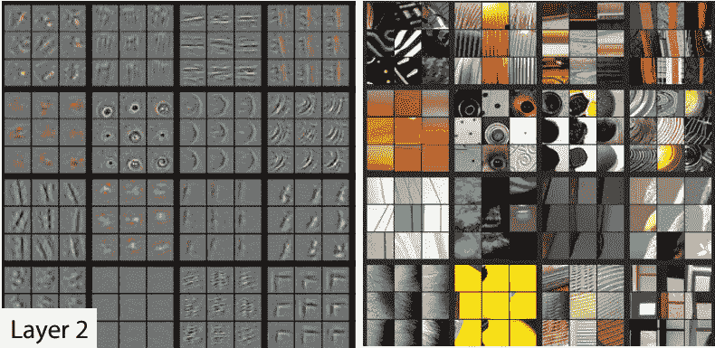

# 深度学习#2:卷积神经网络

> 原文：<https://towardsdatascience.com/deep-learning-2-f81ebe632d5c?source=collection_archive---------0----------------------->

## CNN 怎么学，学什么？

这篇文章是深度学习系列文章的一部分。检出部分 1 [*此处*](https://medium.com/towards-data-science/deep-learning-1-1a7e7d9e3c07) *和部分 3* [*此处*](https://medium.com/@r.ruizendaal/deep-learning-3-more-on-cnns-handling-overfitting-2bd5d99abe5d) *。*

本周我们将探索卷积神经网络(CNN)的内部工作原理。你可能想知道这些网络内部发生了什么？他们是如何学习的？

我所学课程背后的教学理念是基于自上而下的方法。基本上，我们马上就可以玩完整的模型，随着我们的进行，我们对它的内部运作了解得越来越多。因此，这些博客文章将逐渐深入神经网络的内部工作。这只是第 2 周，所以我们开始朝着这个目标前进。

上周，我在猫和狗的图像数据集上训练了 Vgg16 模型。我想首先说明为什么使用预先训练的模型是一个好方法。为了做到这一点，思考这些模型正在学习什么是很重要的。实质上，CNN 正在学习过滤器，并将它们应用于图像。这些滤镜与你应用于 Instagram 自拍的滤镜不同，但概念并没有太大的不同。CNN 拿起一个小方块，开始在图像上应用，这个方块通常被称为“窗口”。然后，网络寻找该过滤器匹配图像内容的图像部分。在第一层，网络可能会学习一些简单的东西，比如对角线。在每一层中，网络能够结合这些发现，并不断学习更复杂的概念。这听起来仍然很模糊，所以让我们看一些例子。[泽勒和弗格斯(2013)](https://arxiv.org/abs/1311.2901) 在视觉化 CNN 所学方面做得很好。这是他们在论文中使用的 CNN。赢得 Imagenet 竞赛的 Vgg16 型号就是基于这种型号。

CNN by Zeiler & Fergus (2013)

这张图片现在可能看起来很混乱，不要惊慌！先说一些我们都能从这张图中看到的东西。首先，输入图像是 224x224 像素的正方形。我之前说的滤镜是 7x7 像素。该模型有一个输入层、7 个隐藏层和一个输出层。输出层中的 c 是指模型将预测的类的数量。现在让我们来看看最有趣的东西:模型在不同的层中学到了什么！

Layer 2 of the CNN. The left image represents what the CNN has learned and the right image has parts of actual images.

在 CNN 的第二层，这个模型已经获得了比对角线更有趣的形状。在第六个方块(水平计数)中，您可以看到模型正在拾取圆形。还有，最后一个方块在看角落。

Layer 3 of the CNN

在第 3 层中，我们可以看到模型开始学习更具体的东西。第一个方块显示模型现在能够识别地理模式。第六个方块是识别汽车轮胎。而第十一个方块是认人。

Layers 4 and 5 of the CNN

最后，第 4 层和第 5 层延续了这一趋势。第五层是挑选对我们的猫狗问题非常有用的东西。它还识别独轮车和鸟类/爬行动物的眼睛。请注意，这些图像只显示了每一层所学知识的很小一部分。

希望这能告诉你为什么使用预先训练的模型是有用的。如果你想了解这个研究领域的更多信息，你可以查阅“迁移学习”。Vgg16 模型已经知道很多关于识别狗和猫的知识了。针对猫狗问题的训练集只有 25000 张图片。新模型可能无法从这些图像中学习所有这些特征。通过一个称为微调的过程，我们可以改变 Vgg16 模型的最后一层，这样它就不会输出 1000 个类别的概率，而只输出 2 个类别(猫和狗)的概率。

如果你有兴趣阅读更多关于深度学习背后的数学知识，[斯坦福的 CNN 网页](http://cs231n.github.io/)提供了一个很好的资源。他们还称浅层神经网络为“数学上的可爱”，这是第一次。

## 微调和线性层

我上周用来分类猫和狗的预先训练好的 Vgg16 模型并不自然地输出这两个类别。它实际上产生了 1000 个类。此外，该模型甚至不输出“猫和狗”类，但它输出特定品种的猫和狗。那么，我们如何有效地改变这个模型，只将图像分类为猫或狗呢？

一种选择是手动将这些品种映射到猫和狗，并计算概率。但是，这种方法忽略了一些关键信息。例如，如果图片中有一根骨头，则该图像可能是一只狗。但是如果我们只看每个品种的概率，这些信息就会丢失。在那里，我们替换了模型末端的线性(密集)层，并用一个只输出 2 个类的层来替换它。Vgg16 模型实际上在末端有 3 个线性层。我们可以微调所有这些层，并通过反向传播来训练它们。反向传播通常被视为某种抽象的魔法，但它只是使用链式法则计算梯度。你永远不必担心数学的细节。TensorFlow、Theano 和其他深度学习库会帮你做到这一点。

如果你正在浏览快速人工智能课程第二课的笔记本，请注意内存问题。我建议您首先仅使用示例图像运行笔记本。如果您使用的是 p2 实例，如果您一直保存和加载 numpy 数组，您可能会耗尽内存。

## 激活功能

我们刚刚讨论了网络末端的线性层。然而，神经网络中的所有层都不是线性的。在计算了神经网络中每个神经元的值之后，我们将这些值通过一个激活函数。人工神经网络基本上由矩阵乘法组成。如果我们只使用线性计算，我们可以把它们堆叠起来。这不会是一个非常深的网络…因此，我们经常在网络的每一层使用非线性激活函数。通过将线性和非线性函数层层叠加，理论上我们可以模拟任何东西。这是三种最流行的非线性激活函数:

*   Sigmoid *(解析一个介于 0 和 1 之间的值)*
*   TanH *(解析一个介于-1 和 1 之间的值)*
*   ReLu *(如果值为负，则变为 0，否则保持不变)*

Three most used activation functions: Sigmoid, Tanh & Rectified Linear Unit (ReLu)

目前，ReLu 是最常用的非线性激活函数。这样做的主要原因是它减少了消失梯度和稀疏性的可能性。我们将在后面更详细地讨论这些原因。模型的最后一层一般使用不同的激活函数，因为我们希望这一层有一定的输出。softmax 函数在做分类的时候很受欢迎。

在微调 Vgg16 模型中的最后层之后，该模型具有 138.357.544 个参数。谢天谢地，我们没有手动计算所有的梯度:)。下周我将深入 CNN 的工作，我们将讨论适配不足和适配过度。

如果你喜欢这篇文章，一定要推荐给别人看。你也可以按照这个简介来跟上我在快速人工智能课程中的进程。那里见！

我目前是一名微型公司的数据科学家。我们正在努力寻找数据工程师和软件工程师。我们也在为自己和我们的合作伙伴招募数据科学家，这些合作伙伴包括荷兰、以色列的一些最大的组织和一些大型全球公司！

请通过 LinkedIn[联系我，加入我们在阿姆斯特丹或特拉维夫的团队，或者让我帮助您加入我们遍布全球的合作伙伴组织！](https://www.linkedin.com/in/rutger-ruizendaal/)