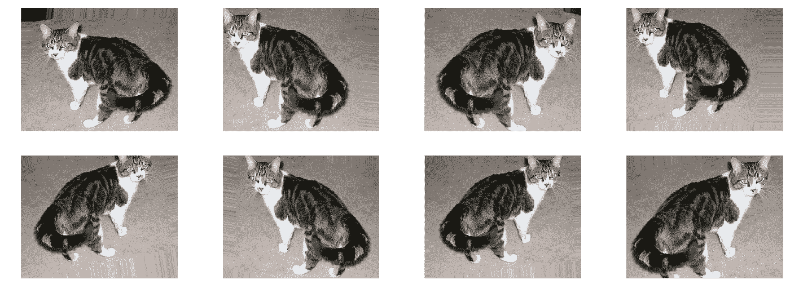
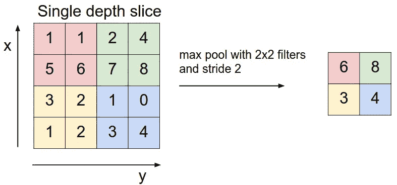
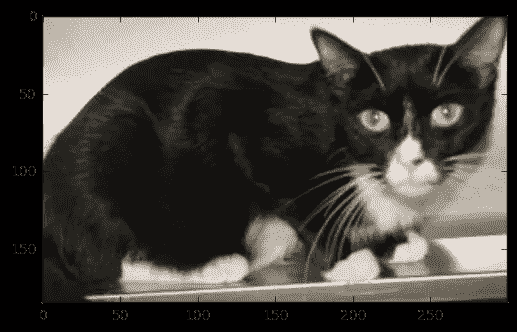
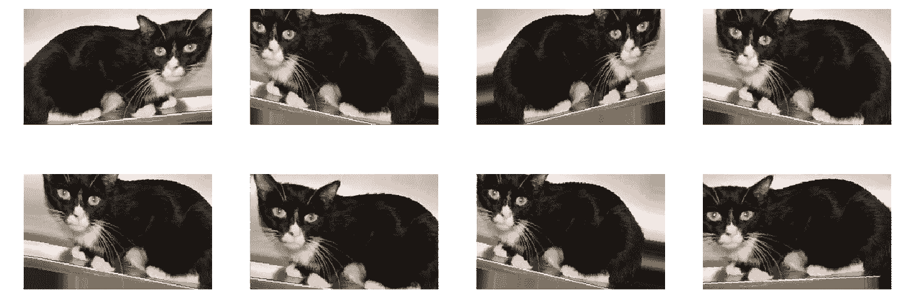

# 深度学习#3:更多关于 CNNs &处理过度拟合

> 原文：<https://towardsdatascience.com/deep-learning-3-more-on-cnns-handling-overfitting-2bd5d99abe5d?source=collection_archive---------0----------------------->

## 什么是卷积，最大池和辍学？

这篇文章是深度学习系列文章的一部分。退房 [*第一部分*](https://medium.com/towards-data-science/deep-learning-1-1a7e7d9e3c07) *和* [*第二部分*](https://medium.com/towards-data-science/deep-learning-2-f81ebe632d5c) *。*



Data augmentation is one of the techniques for reducing overfitting

欢迎来到深度学习系列的第三篇文章！本周我将探索卷积神经网络(CNN)的更多部分，还将讨论如何处理欠拟合和过拟合。

## **卷积**

那么卷积到底是什么呢？你可能记得我以前的博客文章，我们基本上采取了一个小过滤器，并在整个图像上滑动这个过滤器。接下来，图像的像素值与过滤器中的像素值相乘。使用深度学习的好处在于，我们不必考虑这些过滤器应该是什么样子。通过随机梯度下降(SGD ),网络能够学习最优滤波器。过滤器是随机初始化的，并且是位置不变的。这意味着他们可以在图像的任何地方找到一些东西。同时，模型也知道它在图像中的什么地方找到了这个东西。

应用此过滤器时，零填充是一个有用的工具。所有这些都是在图像周围零像素的额外边界上完成的。这使得我们在图像上滑动滤镜时也可以捕捉图像的边缘。你可能想知道过滤器应该有多大。研究表明，较小的过滤器通常表现更好。在这种情况下，我们使用大小为 3x3 的过滤器。

当我们将这些滤镜滑过我们的图像时，我们基本上创建了另一个图像。因此，如果我们的原始图像是 30×30，则具有 12 个滤波器的卷积层的输出将是 30×30×12。现在我们有一个张量，它基本上是一个二维矩阵。现在你也知道 TensorFlow 这个名字的由来了。

在每个卷积层(或多层)之后，我们通常有一个最大池层。这一层只是减少了图像中的像素数量。例如，我们可以取一个正方形的图像，并用正方形上的最高值来替换它。



Max Pooling

由于 Max Poling，我们的过滤器可以探索图像的更大部分。此外，由于像素的损失，我们通常会在使用最大池后增加过滤器的数量。

从理论上讲，每个模型架构都是可行的，应该能够为您的问题提供一个好的解决方案。然而，有些架构比其他架构做得快得多。一个非常糟糕的架构可能需要比你剩余的年数更长的训练…因此，考虑你的模型的架构以及为什么我们使用像 max pooling 这样的东西并改变所使用的过滤器的数量是有用的。为了结束 CNN 的这一部分，[这个](http://yosinski.com/deepvis#toolbox)页面提供了一个很棒的视频，它可视化了 CNN 内部发生的事情。

## 欠拟合与过拟合

你如何知道你的模型是否不合适？如果验证集的准确性高于训练集的准确性，则您的模型不符合要求。此外，如果整个模型表现不佳，这也称为欠拟合。例如，使用线性模型进行图像识别通常会导致模型欠拟合。或者，当你的深层神经网络出现不适应时，这可能是由辍学引起的。在训练过程中，Dropout 随机将激活设置为零，以避免过度拟合。在对验证/测试集进行预测的过程中，这不会发生。如果是这种情况，您可以删除辍学。如果模型现在过度拟合，你可以开始增加小块的辍学。

> 一般规则是:从过度拟合模型开始，然后采取措施防止过度拟合。

当您的模型太适合训练集时，就会发生过度拟合。然后，模型就很难归纳出不在训练集中的新示例。例如，您的模型识别训练集中的特定图像，而不是一般模式。您的训练准确度将高于验证/测试集的准确度。那么我们能做些什么来减少过度拟合呢？

*减少过拟合的步骤:*

1.  添加更多数据
2.  使用数据扩充
3.  使用通用的架构
4.  添加正规化(主要是辍学，L1/L2 正规化也是可能的)
5.  降低架构复杂性。

第一步当然是收集更多的数据。但是，在大多数情况下，您将无法。让我们假设你已经收集了所有的数据。下一步是数据扩充:总是推荐使用的东西。

数据扩充包括像随机旋转图像、放大、添加滤色器等。数据扩充只发生在训练集，而不发生在验证/测试集。检查您是否使用了过多的数据扩充会很有用。例如，如果你放大得太多以至于猫的特征不再可见，那么模型不会因为这些图像的训练而变得更好。让我们探索一些数据增强！

对于 Fast AI 课程的追随者:请注意，笔记本使用“width_zoom_range”作为数据增强参数之一。但是，该选项在 Keras 中不再可用。



Original image

现在让我们看看执行数据增强后的图像。所有的“猫”对我来说仍然清晰可辨。



Augmented cats

第三步是使用一个通用的架构。然而，更重要的是第四步:添加正则化。三个最受欢迎的选项是:辍学，L1 正则化和 L2 正则化。在深度学习中，你通常会看到辍学，这是我之前讨论过的。Dropout 删除训练中激活的随机样本(使其为零)。在 Vgg 模型中，这仅适用于模型末端完全连接的层。然而，它也可以应用于卷积层。请注意，辍学会导致信息丢失。如果你在第一层丢失了一些东西，那么整个网络都会丢失。因此，好的做法是从第一层的低压差开始，然后逐渐增加。第五个也是最后一个选择是降低网络复杂性。实际上，在大多数情况下，各种形式的正则化应该足以处理过度拟合。


Visualization of dropout

## **批量正常化**

最后，我们来讨论一下批量规范化。这是你应该经常做的事情！批处理规范化是一个相对较新的概念，因此还没有在 Vgg 模型中实现。

如果你对机器学习感兴趣，标准化你的模型的输入是你一定听说过的事情。批处理规范化更进了一步。批量标准化在每个卷积层后添加一个“标准化层”。这允许模型在训练中收敛得更快，因此也允许您使用更高的学习速率。

简单地标准化每个激活层中的权重是行不通的。随机梯度下降非常顽固。如果想使其中一个权重很高，它会在下一次简单地这样做。通过批量标准化，模型了解到它可以调整所有权重，而不是每次只调整一个。

## **MNIST 数字识别**

MNIST 手写数字数据集是机器学习中最著名的数据集之一。该数据集也是一个很好的方式来实验我们现在所知道的关于 CNN 的一切。Kaggle 也托管 MNIST 数据集。我快速编写的这段代码是在这个数据集上获得 96.8%准确率所必需的。

```
import pandas as pd
from sklearn.ensemble import RandomForestClassifiertrain = pd.read_csv('train_digits.csv')
test = pd.read_csv('test_digits.csv')X = train.drop('label', axis=1)
y = train['label']rfc = RandomForestClassifier(n_estimators=300)
pred = rfc.fit(X, y).predict(test)
```