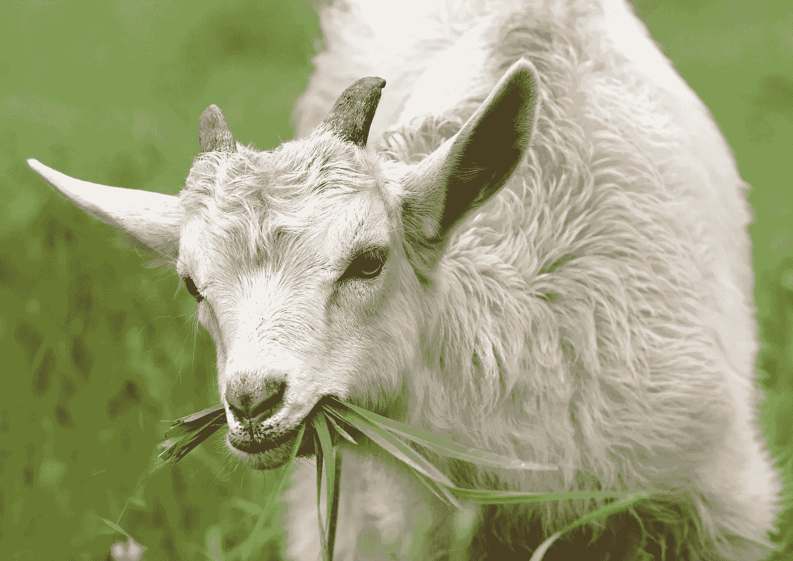
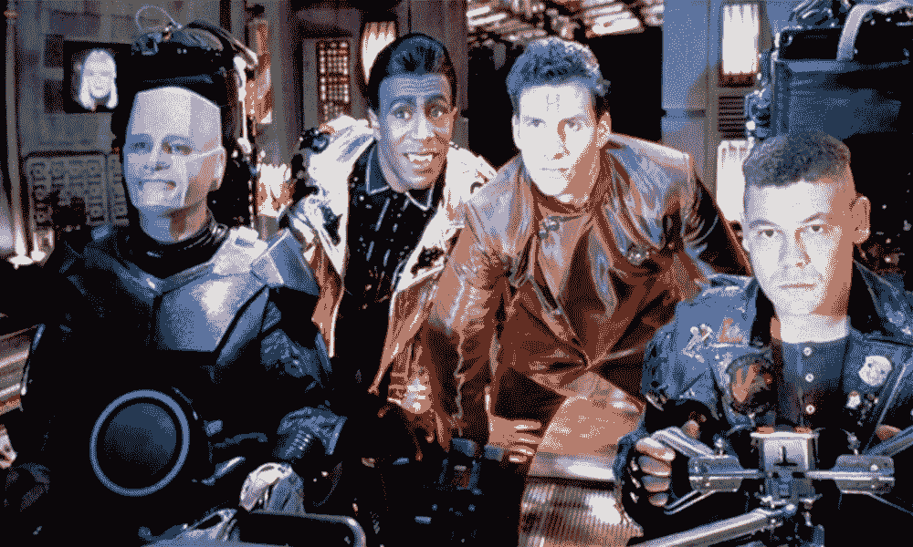
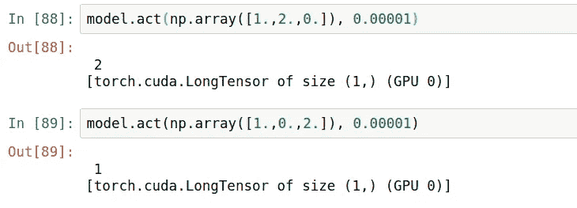

# 深度学习是 Monty Hall 策略(或者，用 PyTorch 温和地介绍 Deep-Q 学习和 OpenAI 健身房)

> 原文：<https://towardsdatascience.com/deep-learning-a-monty-hall-strategy-or-a-gentle-introduction-to-deep-q-learning-and-openai-gym-d66918ac5b26?source=collection_archive---------4----------------------->

你永远不知道一系列事件会如何影响你。

对我来说，暴饮暴食布鲁克林 99 旧集，结合 Tensorflow 最近宣布他们已经正式纳入爱德华概率编程库，让我在一段时间内第一次思考贝叶斯概率。

在这一集里，霍尔特上尉和他的丈夫在争论蒙蒂·霍尔的问题。


One of TV’s best characters, Captain Holt in Fox’s (now NBC’s!) Brooklyn 99\. A rare show of emotion for AI here.

我不熟悉旧游戏，但问题的表述是这样的:

有三扇门，一扇门后是一辆汽车，另外两扇门后是山羊。选一个。一旦你选择了，gameshow 主持人 Monty 将会打开你没有选择的两扇门中的一扇门——一扇绝对没有汽车在后面的门。你应该坚持你最初的猜测，还是换到两扇门中的另一扇门？



This article assumes you want to win the car, not the Greatest Of All Time

很明显，每扇门都有 1/3 的胜算，这一点在蒙蒂打开一扇门后并没有改变。贝叶斯*先验*为【1/3，1/3，1/3】。然而，一旦失败的大门被打开，就会有新的信息出现，概率应该被重新检查。事实上，汽车在未选择的门后面的概率现在“集中”到 2/3，吸收了蒙蒂打开的哑门的概率。即*后验*为【1/3，0，2/3】。因此，你不太可能总是赢，但是通过切换到你最初没有选择的未打开的门，你的机会增加了一倍。

> 这是这个博弈的优势策略。

如果你想直接跳到本文附带的相对简单的 Jupyter 笔记本，这里是。

我过去与人工智能有关的大部分工作都是回归一点生成性的东西，我已经远离了标题制作技术:*人工智能自学玩末日游戏*，*人工智能现在比人类更擅长围棋，人工智能自动驾驶汽车自组织成汽车人和霸天虎*等等。因为这个，我也没有机会玩[开 AI 健身房](https://github.com/openai/gym)。事实证明，两者都很容易使用，我认为它们应该在每个人的深度学习工具箱中占有一席之地。

像往常一样，我会省去大部分的数学。深度 Q 学习涉及到一些内容，尽管这并不复杂，但我可以从我的论文工作中告诉你，随机的实际实现是第一位的，数学是一个很好的*事后*完整性证明，使你能够写一篇严肃的论文。直觉很重要。

在这篇文章中，我实际上并不打算讨论可训练分布和 Tensorflow 的 Edward，而是展示如何构建一个简单的、可扩展的代理来解决一个博弈论类型的问题，该问题可以与当今前沿的人工智能环境进行交互。

# 开放 AI 健身房

让我们先解决这个问题。健身房没有任何魔力，只是一套良好的标准化环境，在其中测试自主 AI 代理，模拟他们的行为对环境的影响。只需通过`pip install gym`安装，在 Jupyter 笔记本内部就能轻松使用。

健身房附带的一个非常简单的环境叫做 CartPole，它看起来像这样:


杆子通过枢轴连接到轨道上的手推车上，手推车的目标是保持杆子直立——想象一下试图在手掌上平衡一支笔。

环境模拟力和重力，环境的*动作空间*是推车可以被向左或向右推(轨道是无摩擦的，所以任何推动都会增加推车的速度，然后它会继续以那个速度前进)。当杆子越过一个无法返回的角度时，游戏结束。

动作空间定义了人工智能(我假设它是一个神经网络)输出的维度；每个时刻都有两种可能的行动。因此，您可能有一个输出神经元，其中输出> 0 被解释为向右推，而≤ 0 被解释为向左推。更有可能的是，你可能有两个神经元对应左右，取其中的 *argmax* 。

相反，环境的观察空间形成了对人工智能的输入。任何试图求解 CartPole 的人工智能都有四个输入:代表速度和角度的浮点数。

通常当你听到 Open AI Gym 被提及时，人们会谈论 Atari 游戏:动作空间将是游戏手柄上的按钮，观察空间将是小行星游戏中屏幕上的像素。在这里，我正在解决一个简单的博弈论问题，但以一种与健身房兼容(即子类化)的标准化方式。

在典型的 PyTorch 训练循环中使用健身房看起来像这样:

```
import gym
env = gym.make("CartPole-v0")
model = MyAI()
optimizer = torch.optim.Adam(model.parameters())
env.reset()for frame in range(0, 6000): # frames of the game to play out
  action = model.act(state, epsilon)
  next_state, reward, done, _ = env.step(action)
  replay_buffer.append(state, action, reward, next_state, done)
  state = next_state
  env.render()
  if done:
    env.reset()
  if len(replay_buffer) > batch_size: # won or died
    loss = calc_loss_over_episode(replay_buffer)
    optimizer.zero_grad()
    loss.backward()
    optimizer.step()
```

在进入深度 Q 学习之前，这里有几件事情要解开:

*   *MyAI* 是一个神经网络模型的占位符，按照下面的标准 PyTorch 方式构建，但是增加了一个 *act* 方法。
*   可以预见，重置健身房环境会将其设置回初始状态。
*   ε是一个随时间衰减的数，就像模拟退火一样(更多内容见下文)。
*   环境中的每一步都返回一个新的状态、一个奖励(在赢得游戏之前可能是零)、一个表示我们是否完成的标志(赢了还是输了，在这种情况下重置环境)，以及一些可选的调试信息。
*   env.render() 只做图形。Gym 提供了一些有用的图形原语，如果你想自己制作的话。
*   损失是一集或一批的平均值，其中可能包含一个或多个完整的游戏。在这段时间内发生的所有动作都存储在重播缓冲区中，使其能够在一集结束时回放，这样我们就可以在我们希望更接近目标时计算损失。
*   *calc_loss_over_episode* 会在下面的深 Q 位覆盖！

# 环境

为开放人工智能创建一个健身房很容易。你只需要子类化 gym 并实现一些方法。这里有一个模板:

```
from gym import spaces
from gym.envs.classic_control import rendering
out = 3
in = 3class MyEnv(gym.Env):
  def __init__(self):
    self.action_space = spaces.Discrete(out)
    self.observation_space = spaces.Discrete(in)
    self.initial_state = whatever_you_like
    self.state = self.initial_state
    self.viewer = rendering.Viewer(640, 480) def step(self, action):
    # do something to calculate next state, reward, and done
    return self.state, reward, self.done, {} def reset(self):
    self.state = initial_state
    self.done = False
    return self.state def render(self, mode='human'):
    # This gets you a window and primitives e.g.
    # cart = rendering.FilledPolygon([(l,b), (l,t), (r,t), (r,b)])
    return self.viewer.render()
```

行动空间需要离散，因为每个行动将是 0 或 1(采取，不采取)。观察空间可能会更大。这取决于你如何表述这个问题，我是这样表述蒙蒂·霍尔的:


信不信由你，用一种适合人工智能的方式来阐述这个问题是这篇文章中最困难的部分。

首先，有一个隐藏状态，在游戏重置时初始化(每两次移动后)。隐藏状态只是说车在哪个门后面；另外两扇门关着山羊。对 AI 可见的观察状态从[0，0，0]开始。接下来，人工智能选择一扇门，这个动作会得到 0.3 的持续奖励。(这个数字是我随意选的；奖励可以是任何正数或负数，AI 的任务是最大化它)。

当蒙蒂打开一扇门时，状态发生了变化；这通过观察到的状态的变化指示给 AI，用 2 标记新打开的(和包含山羊的)门。接下来，人工智能采取第二个行动:它可以选择打开的门(失败！)，坚持它原来的猜测，或者扭曲。游戏结束，如果人工智能最终选择了正确的门，它将得到+1 奖励。如果没有，它得到 0 奖励。正如我们所知，大多数情况下，扭转会更好:将原来的猜测改为另一扇未打开的门。

所以，人工智能看到的是:3 扇门(输入)，每扇门都有一些值。人工智能在每一步可以采取的行动:打开三扇门中的一扇门。

也许，有更简洁的方法来构建这个问题，但我选择的方法似乎很简单，直观地映射到实际的游戏中——这是一个简单的问题，我后来发现用少量的神经元训练真的很快，所以，*那就行了，猪*。

在许多强化学习演示中，观察空间是一个 2D *盒子*，代表雅达利游戏的电视输出。

# 模型

这里需要的是 PyTorch 神经网络模型，它将环境的当前状态(来自观察空间)作为输入，并预测来自动作空间的动作作为输出。这只是通过网络向前传递，但是！存在局部最小值的可能性。我[在 Q-learning 空间读到了一个很好的解释](https://oneraynyday.github.io/ml/2018/05/03/Reinforcement-Learning-Bandit/),代理人/网络可能第一次服用海洛因，并一遍又一遍地重复奖励，但最终永远无法解决这个游戏。



Like the crew of Red Dwarf never escaping the Despair Squid

所以，你不希望人工智能学习或收敛得太快。不是每次都预测它的最佳行动，最大化它的回报(这是比较科学术语中的*贪婪*算法)，而是希望人工智能最初探索行动空间。因此，随着某种概率*ε*的降低，AI 将从动作空间中选择一个随机动作，而不是它的最佳预测。

这就是 *act* 方法所做的一切，这就是 *epsilon greedy* 学习。其余时间，它只需通过调用 *forward* (即通过网络运行当前状态来预测最佳的下一个动作)来挑选网络的最佳预测动作。

下面是做这项工作的简单 PyTorch 网络:

```
# env is the AI gym defined and instantiated aboveclass DQN(nn.Module):
  def __init__(self):
    super(DQN, self).__init__()
    self.layers = nn.Sequential(
      nn.Linear(env.observation_space.n, 20),
      nn.ReLU(),
      nn.Linear(20, 20),
      nn.ReLU(),
      nn.Linear(20, env.action_space.n)
    )

    def forward(self, x):
        return self.layers(x)

    def act(self, state, epsilon):
      if random.random() > epsilon:
        state = Variable(torch.FloatTensor(state).unsqueeze(0)) 
        q_value = self.forward(state)
        action  = q_value.max(1)[1]
      else:
        action = random.randrange(env.action_space.n)
      return action
```

如您所见，它有 3 个输入(每个输入可以是 0、1 或 2，代表当前状态),扇出 20 个具有 ReLU 非线性的神经元的输入层，20 个也具有 ReLU 的神经元的隐藏层，减少到 3 个神经元的输出层，我们将取其最大值来预测下一个动作。

20 的隐藏大小是任意的。有一些简单的样板文件:

*   我们的状态只是一个像[0，1，2]这样的向量。PyTorch 需要一个张量*N*x*num _ features*，其中 *N* 是批量大小。实际上，Unsqueeze 将[0，1，2]转换为[[0，1，2]]，也就是说，批量大小为 1；给定当前状态，一次预测一个动作。概念上很简单，但可能是你想为生产优化的东西，否则 GPU 的能力被浪费了。
*   q_value 是网络前向传递的输出，它给出了给定状态下我们可以采取的三种行动中的每一种行动的预期回报。我们沿着神经元的轴(不是 0，批处理轴)找到最大值，max()函数给出一个元组，其中[0]是值，[1]是索引。因此，如果向前传递收益 Y=[-1.34，0.62，0.32] — Y.max(1)将是[0.62，1]，Y.max(1)[1]意味着净建议我们采取行动 1。Y.max(1)[0]表明，如果我们采取这一行动，Q 值将是 0.62。

# q 学习

这就是问题的核心。Q-Learning 实际上只是问了一个问题，“如何在给定的时间步计算损失？”从游戏结束时的奖励往回看，看看我们在每一步的行动是如何促成最终奖励的。

如果你回想几年前谷歌花了很多钱收购 DeepMind 的时候，头条新闻表明这是因为 DeepMind 有一些解决 Atari 游戏的革命性方法，这导致了 AlphaGo 和最近的电话呼叫 Duplex。就我现在所知，我不认为那是原因。或许，他们有一个像样的基础设施，通过它他们可以将老式算法应用到一个奇特的问题领域，但更重要的是，他们有一个大 G 想要挖走的伟大团队。

我以前在我的文章中强调过这一点，但人工智能真的只是通过人们尝试东西来进步，不一定是大公司，只是有人拿着 GTX 1080 问为什么总是通过 X 来完成，而 Y 在实践中更好。

于是我们来到了上面神秘提到的函数 *calc_loss_over_episode()* 。代码看起来就像这样:

```
# gamma is a learning-rate hyperparameter, try 0.9def calc_loss_over_episode(batch_size):
  state, action, reward, next_state, done = replay_buffer.sample(batch_size) state = Variable(torch.FloatTensor(state))
  next_state = Variable(torch.FloatTensor(next_state))
  action = Variable(torch.LongTensor(action))
  reward = Variable(torch.FloatTensor(reward))
  done = Variable(torch.FloatTensor(done)) q_values = model(state)
  next_q_values = model(next_state) q_value = q_values.gather(1, action.unsqueeze(1)).squeeze(1)
  next_q_value     = next_q_values.max(1)[0] if done:
    expected_q_value = reward
  else:
    expected_q_value = reward + gamma * next_q_value loss = (q_value - Variable(expected_q_value)).pow(2).mean()

  optimizer.zero_grad()
  loss.backward()
  optimizer.step()
  return loss
```

这个的高层次是:

*   在批次的随机样本中的每个时间步长(通过不总是以相同的顺序移动批次来改进训练)。
*   在给定的当前状态下预测 Q 值(如果网络在给定的当前状态下采取了 3 个可用的 Monty Hall 行动中的每一个，则预期的回报)。理解这一点的关键是，网络的估计 Q 值将开始完全随机，但最终开始收敛到真实的答案。
*   在我们采取了上一步预测的行动后，预测实际下一个状态的 Q 值(同样，它们完全是随机开始的)。
*   在将 Q 值添加到预期奖励之前，对其进行一点折扣(乘以 gamma)。这是因为在随机环境中，我们无法对一个行动的结果有 100%的把握；因此，gamma 对未来的奖励比眼前的奖励打了一点折扣。
*   找出均方误差(从实际中减去理想/预期回报，对差值求平方并取平均值)，然后反推并优化网络参数以最小化损失(使用 SGD、Adam 等)。

对于 Monty Hall 问题，假设一批按顺序处理。 *Q(状态，动作)*产生我们下一个建议的动作。这是一个由输出神经元激活组成的向量。 *Q(【所有门都关闭】，2)* 是在所有输入都为 0 的网络中单次正向传递后输出神经元 2 的激活。它从未经训练的神经网络的随机垃圾开始。

网络为这一步获得健身房环境 0.3 奖励，蒙蒂打开一扇门。神经网络又迈出了一步。 *Q([AI 选择了门 2 & Monty 打开了门 1】，动作)*由另一个通过具有输入[0，2，1]的网络的向前传递来计算(根据我上面的图)。我们的网还是垃圾；假设这次输出神经元的 *argmax* 为 1(“开门#1”)，值为 0.64。愚蠢的网络试图打开蒙蒂已经打开的门！

健身房环境现在返回奖励 0，并发出游戏已经终止的信号(称之为时间 T)。我们的损失函数现在表示“我的预期 Q 值是 0.64[嗯，它是一个向量，所以其他两个动作也包括在内]，我得到的回报是 0。我们可以反推该损失，这将帮助我们更好地猜测时间 T-1 时的 Q 值(给定一个状态)。这将有助于更好地猜测 Q 值和在时间 T-2 要采取的行动。(除了在学习步骤中，时间向前流动，因此在步骤 T-2 计算损失将预测 T-1 和时间 T 的行动/状态/回报)。

一次学习迭代只跨越两个时间段，这是我们从一个批次中随机抽取的。在某个时候，我们将对一个终端案例(时间 T)进行采样，这将使我们更好地了解网络在前一步(T-1)的行为是如何对最终奖励做出贡献的。然后在某个时候，我们将对倒数第二步(T-1)的移动进行采样，我们现在对它如何影响最终回报有了更好的了解，我们可以用它来更好地了解在那之前(T-2)的移动，以此类推，倒回到开始。

如果这对你来说看起来像是欺骗，只是一点点，那么我同意:这只是利用大数据来弥补理解和直觉的完全缺乏。然而，它确实让你得到了一个趋向于零的漂亮图形，这是机器学习研究人员的未声明的目标:


(L) Loss per batch, (R) Mean loss per frame (many batches)

对于每一批(在上面的图表中，我使用了 32 个)移动(可能包括 16 个已完成的游戏)，你可以看到损失趋向于零，但没有达到零——因为 Monty Hall 参与者仍有至少 1/3 的机会会输。有时候人工智能有一轮非常不幸的比赛。

与此同时，回到现实世界，在蒙蒂打开一扇门后，人工智能确实学会了改变它的猜测:



After the middle door is opened, with an initial guess of the first door, the AI’s next action is to open the 3rd door. Separately, after the 3rd door is opened and the AI’s initial guess was the first door, it switches to the middle door. 0.00001 is a small value for epsilon, meaning “make your best guess, not a random one”

我完整的 Jupyter 笔记本就是这里的。

# 后续步骤

正如人工智能中的许多东西一样，Deep-Q 学习已经有些过时了，但如果你能稍微落后于潮流，这是一个很好的强化学习材料的[仓库](https://github.com/higgsfield/RL-Adventure)。

只是不要忘记，所有这一切都是因为我们有在数千场比赛中训练我们的人工智能的自由；这个网络只用 20 个神经元就“解决”了蒙蒂·霍尔，这比完全无脑的[蛔虫](https://en.wikipedia.org/wiki/List_of_animals_by_number_of_neurons)少了一个数量级。

这不是人类大脑的工作方式，所以即使是一个坚定的贝叶斯应该原谅队长霍尔特没有“解决”蒙蒂的游戏。当训练样本非常少时，人工智能应该如何学习；它应该如何对第一次遇到的问题进行元推理，就像蒙蒂霍尔游戏的第一次参赛者会做的那样？(除了 gameshow 的参赛者似乎通常没有多余的 20 个神经元这一事实)。

没有人知道这些问题的答案——让我们继续努力，找出答案！