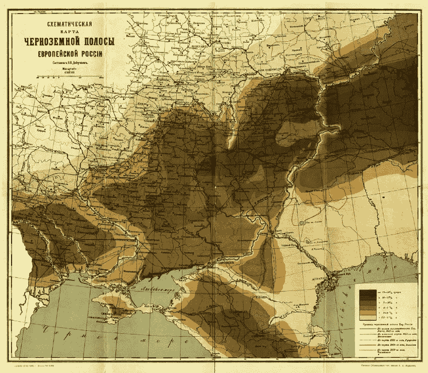
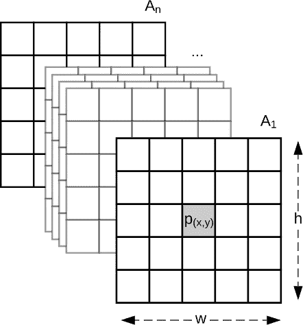
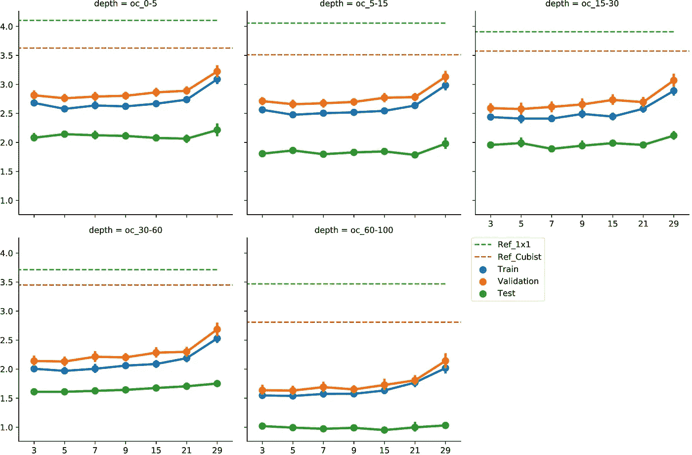
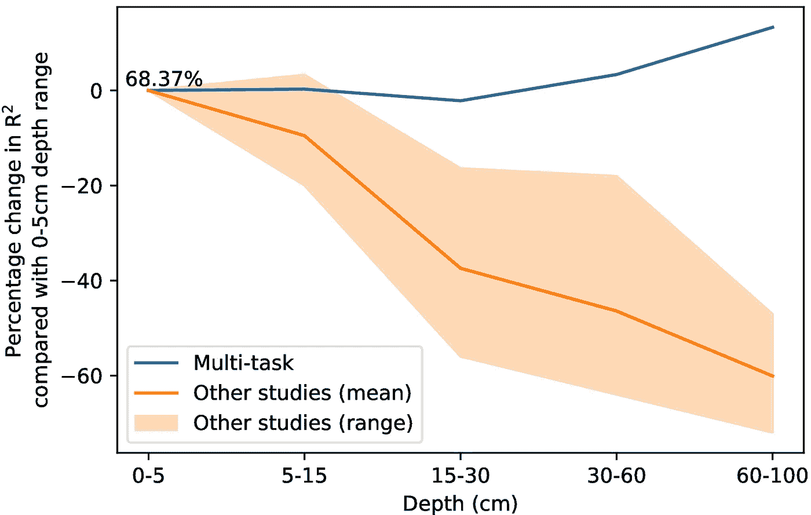
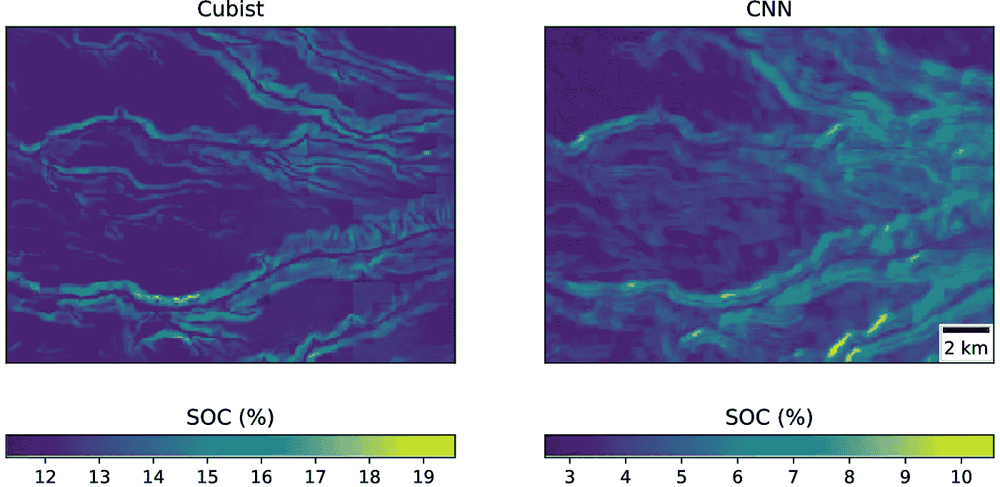

# 深度学习和土壤科学—第二部分

> 原文：<https://towardsdatascience.com/deep-learning-and-soil-science-part-2-129e0cb4be94?source=collection_archive---------10----------------------->

## 利用上下文空间信息的数字土壤制图

这是我致力于深度学习在土壤科学中的应用的系列文章的第二篇。这是一个正在进行的系列，到目前为止还包括:

 [## 深度学习和土壤科学—第 1 部分

### 预测土壤性质的土壤光谱学。根据光谱图预测多种土壤特性的多任务卷积神经网络。

towardsdatascience.com](/deep-learning-and-soil-science-part-1-8c0669b18097)  [## 深度学习和土壤科学—第 3 部分

### 土壤光谱学与迁移学习。将大陆土壤光谱模式“本地化”到国家范围。

towardsdatascience.com](/deep-learning-and-soil-science-part-3-c793407e4997) 

其他与地球科学相关的文章:

 [## GeoVec:用于地球科学的单词嵌入

### 词语嵌入的类比、分类、关联和空间插值。

towardsdatascience.com](/geovec-word-embeddings-for-geosciences-ac1e1e854e19) 

在本系列的第一部分，我给出了土壤科学家如何收集信息的一些背景，这通常涉及一些实地工作和实验室分析。这是一个昂贵而耗时的过程，这也是我们试图建立模型来预测土壤特性的原因之一。

在本文中，我将重点放在生成地图的空间模型上。首先，我给出了一些关于传统的和“机器学习”方法制作土壤图的背景。然后，我深入探讨了为什么上下文信息很重要，以及我们如何使用卷积神经网络(CNN)来利用这些信息。

# 语境

## 土壤理论史

19 世纪晚期，负责绘制俄罗斯帝国土壤图的地质学家和地理学家 v·v·道库恰耶夫提出了土壤形成(以及变化)取决于多种因素的观点，包括其母质、气候、地形、植被和时间。这个一般概念是现代土壤学(土壤研究)的基础。

## 传统土壤制图

人类绘制土壤地图已经有很长时间了。为了税收等目的，决定在哪里种什么。要了解土壤和自然界，观察是整个过程的关键部分。在野外，挖好坑后，我们描述土壤剖面和它的地层，试图了解它的历史。但这只是故事的一部分。由于这个坑被淹没在景观中，土壤学家在得出任何结论(或绘制地图)之前都要观察周围环境。

描述观察完了，就该画图了！你将所有点(坑)放在一张白纸上，并根据以下两个因素在它们周围画多边形:1)它们的相似性(不相似性)和 2)关于形成因素的信息。过了一段时间(在本例中可能是很多年)，您会得到如下结果:

Humus content in Russian soils. Dokuchaev (1883).

## 数字土壤制图

自从道库恰耶夫的工作以来，情况发生了变化。理论上不多，但我们如何观察自然，如何处理数据。现在，技术出现在大部分过程中，从 GPS 获得坑的准确位置，到描述土壤形成因素的卫星图像。

在传统的土壤制图中，通过观察形成因素之间的相互作用得出的结论是在土壤科学家的头脑中得出的。在数字土壤制图(DSM)中，整个过程现在由建模和机器学习来辅助。土壤学家可以了解到山谷中的土壤不同于山坡上的土壤。我们当然可以训练一个模型做同样的事情，对吗？

DSM 是土壤科学的一个动态子领域，所以很难概括社区正在做的一切。我们使用从线性回归到随机森林的模型。我们有许多来源来获得预测因子(形成因素)，包括卫星图像和衍生产品。要获得更多关于 DSM 的信息，我建议你参考 McBratney *等人* (2003)。

# 卷积神经网络和 DSM

正如我在前面提到的，需求侧管理的理论背景是基于土壤属性和土壤形成因素之间的关系。在实践中，单个土壤观测值通常被描述为坐标为`(x,y)`的点`p`，相应的土壤形成因子由同一位置的多个协变量栅格`(a1,a2,…,an)`的像素值的向量表示，其中`n`是协变量栅格的总数。

这种点表示无疑是有用的，但它相当于土壤科学家只查看土壤剖面，而不考虑周围的景观。为了完成这幅图，我们可以将模型暴露在每次观察的空间环境中…相当于走出土坑，四处张望。

在 CNN 的帮助下，我们可以扩展传统的 DSM 方法，包括关于`(x,y)`附近的信息，并充分利用土壤观测的空间背景。我们可以用形状为`(w,h,n)`的 3D 数组替换协变量向量，其中`w`和`h`是以点`p`为中心的窗口的宽度和高度，以像素为单位。

Representation of the vicinity around a soil observation `p`, for `n` number of covariate rasters. `w` and `h` are the width and height in pixels, respectively. Each raster `A` is a proxy for a forming factor.

因为我是多任务学习的爱好者，所以我们使用具有 3D 阵列的 CNN 作为输入，并基于数字高程模型、坡度、地形湿度指数、长期年平均温度和年总降雨量，生成了 5 个深度范围的土壤属性(土壤有机碳)预测。网络看起来像这样:

Multi-task network architecture

网络负责人(“共享层”)提取数据的**通用表示，然后将该数据导向 5 个不同的分支，每个分支对应一个目标深度。分支应该能够学习特定于每个深度的**信号。****

# 结果

## 数据扩充

数据扩充是机器学习中常见的预处理。当我们谈论地图时，我们通常有兴趣点的俯视图，因此增加数据的最简单方法是旋转。这里我们将图像旋转了 90 度、180 度和 270 度。这样做有两个好处:

*   最明显的优势是，我们有效地将观察次数增加了四倍。
*   第二个优点是，我们通过引入旋转不变性来帮助模型进行更鲁棒的概括。

Effect of using data augmentation as a pre-treatment.

正如预期的那样，数据扩充在减少模型误差和可变性方面是有效的(图 4)。我们观察到平均误差在 0-5、5-15、15-30、30-60 和 60-100 厘米深度范围内分别降低了 10.56、10.56、11.25、14.51 和 24.77%。

## 邻域大小

Effect of vicinity size on prediction error (RMSE, y-axis), by depth range. Ref_1x1 corresponds to a fully connected neural network without any surrounding pixels. Ref_Cubist corresponds to the Cubist models used in a previous study (Padarian *et al*., 2017).

邻域窗口(邻域)的大小对预测误差有显著影响(图 5)。大于 9 像素的尺寸显示误差增加。在本例中，对于 100 米网格大小的国家级 SOC 制图，150 至 450 米半径的信息是有用的。该范围类似于 Paterson *等人*在一篇综述中报告的耕地的空间相关性范围。(2018)，其中，基于 41 个[变异函数](https://en.wikipedia.org/wiki/Variogram)，作者估计平均空间相关范围约为 400 m。由于我们使用了相对粗糙的像素分辨率(100m)，因此很难判断提高 SOC 预测所需的最小上下文量。我们相信使用更高的分辨率(<10 米)可以产生更多关于这个问题的见解。

将 CNN 的结果与更传统的方法(Cubist)进行比较，对于 0-5、5-15、15-30、30-60 和 60-100 厘米的深度范围，CNN 分别显著降低了 23.0、23.8、26.9、35.8 和 39.8%的误差。

## 多层土壤预测

在 DSM 中，有两种主要方法来处理土壤性质的垂直变化。您可以逐层进行预测(深度是隐式的)，或者在模型中包含深度(深度是显式的)。这两种方法都表明，随着预测深度的增加，模型解释的方差会减小。这是意料之中的，因为用作协变量的信息通常代表地表条件。

在这项研究中，我们可以再次看到使用多任务 CNN 的协同效应(我在第一篇文章中谈到过)。如下图所示，在这种情况下，模型解释的差异实际上随着深度而增加。不应该在模型和数据集之间比较 R 的绝对值，但是绝对有可能比较趋势。

Percentage change in model R² in function of depth.

我想这是我喜欢多任务 CNN 的主要原因。但是请注意，它并不总是有效的…在以后的帖子中，我会给你看一些例子。

## 地图呢？

如果你已经到了这一步，你绝对值得拥有一张地图！毕竟，这就是介绍的内容，对吗？这项研究是利用智利的土壤信息进行的。在下图中，你可以看到一个小测试区域的预测示例(最终我会分享一个完整地图的链接)。

Detailed view of (left panel) map generated by a Cubist model (Padarian et al., 2017) and (right panel) model generated by the multi-task CNN.

视觉上，与传统模型(立体派)相比，CNN 生成的地图显示出一些差异。使用 Cubist 模型生成的地图显示了与地形相关的更多细节，但由于树规则生成的明显限制，也会出现一些假象，并且可能会出现协变量栅格的一些假象。另一方面，使用 CNN 生成的地图显示了平滑效果，这是使用相邻像素的预期行为结果。

很难从视觉上评价一幅地图，因为我们不可避免地基于审美来判断它。现实有多平滑或尖锐？这是我所在领域正在进行的讨论。传统的土壤多边形并不是描述土壤的最佳方式，因为土壤是一个连续体，但我们不难发现两种土壤之间存在明显变化的情况，因此非常平滑的栅格可能是错误的…最有可能的解决方案是介于两者之间。

## (编辑)解释模型

在不同的场景中测试了这种方法之后，很明显，我们需要一种方法来解释 CNN 模型，至少证实它们捕捉到了 SOC 和预测者之间的合理关系。在下面链接的文章中，你可以读到我是如何利用 SHAP 价值观做到这一点的。

 [## 用 SHAP 解释 CNN 生成的土壤地图

### 使用 SHAP 来证实数字土壤制图 CNN 捕捉到了合理的关系。

towardsdatascience.com](/explaining-a-cnn-generated-soil-map-with-shap-f1ec08a041eb) 

# 最后的话

数字土壤制图是一个非常有趣和动态的学科，很高兴看到像卷积神经网络这样的方法在这里适用。直观地说，一种能够利用背景空间信息的方法完全符合土壤科学的理论框架。

此外，我们再次看到了多任务网络的协同效应，通过在更深的层中调整预测。如果模型已经做出了预测顶层的努力，那么它肯定应该使用它来指导更深层的预测！这正是土壤科学家在描述剖面图时所做的事情！

我已经承诺了一个关于迁移学习的帖子，希望这将是下一个帖子。我有一个半生不熟的草稿，但是我的博士学位让我很忙…所以请耐心点！

# 引用

关于这项工作的更多细节可以在相应的论文中找到。

帕达里安，j .，米纳斯尼，b .，和麦克布拉特尼，A. B .，2019。使用深度学习进行数字土壤制图，土壤，5，79–89，[https://doi.org/10.5194/soil-5-79-2019](https://doi.org/10.5194/soil-5-79-2019)。

**注 04/09/2018:** 该文件尚未被接受，并在 2018 年 10 月 15 日之前接受公众审查和讨论。欢迎您参与这一过程。

**注 27/02/2019:** 论文已被接受并发表。

# 参考

道库恰耶夫，弗吉尼亚州，1883 年。黑钙土带土壤上层腐殖质含量示意图:对“俄罗斯黑钙土”一书的补充。

2003 年获学士学位的麦克布拉特尼、获硕士学位的桑托斯和获学士学位的米纳斯尼。论数字土壤制图。《地球学报》,第 117 卷第 1-2 期，第 3-52 页。

Padarian，b . minas ny 和 and McBratney:智利和智利土壤网格:对 GlobalSoilMap 的贡献，Geoderma Regional，9，17–28，2017。

Paterson，s .、McBratney，A. B .、Minasny，b .和 Pringle，M. J .:农业和环境应用的土壤特性变异图，载于:土壤计量学，第 623-667 页，Springer，2018 年。

# 承认

我要感谢我的编辑 Clara da Costa-Reidel 的更正。有一个有科学背景的人来校对你的作品真是太好了！