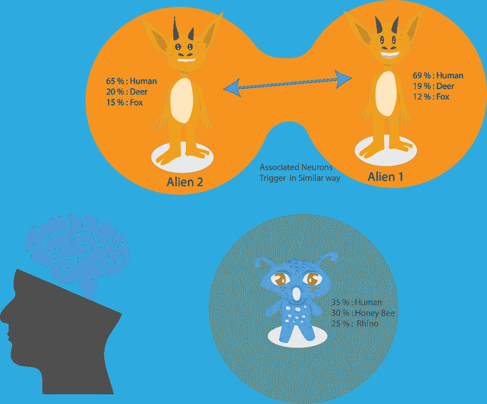

# 理解人类推理的深度学习方法

> 原文：<https://towardsdatascience.com/deep-learning-approaches-to-understand-human-reasoning-46f1805d454d?source=collection_archive---------8----------------------->

对于一个正在使用深度学习来发现患者是否患有多发性硬化症的医生来说，从模型中获得是或否的答案一点也不好。对于自动驾驶汽车这样的安全关键应用，预测碰撞是不够的。迫切需要让机器学习模型对其断言进行推理，并向人类表达出来。由 Devi Parikh、Druv Batra[**【17】**](https://arxiv.org/pdf/1505.00468.pdf)**所做的视觉问题回答工作以及由费-李非团队所做的关于理解视觉关系的工作[**【16】**](http://vision.stanford.edu/pdf/johnson2017cvpr.pdf)是实现这一点的少数线索。但是在学习推理结构方面还有很长的路要走。所以在这篇博客中，我们将讨论，如何将推理整合到 CNN 和知识图中。**

**长期以来，推理被理解为一堆演绎和归纳。抽象符号逻辑的研究使得这些概念规范化，正如约翰·维恩在 1881 年所描述的。就像我们做的那些智商测试。A 暗示 B，B 暗示 C，所以 A 暗示 C，等等。把它想象成一堆逻辑方程。**

**但后来，这种固定的归纳/演绎推理的思想在 1975 年被扎德[**【2】**](http://citeseerx.ist.psu.edu/viewdoc/download?doi=10.1.1.335.1122&rep=rep1&type=pdf)所拆解，他在那里描述了近似推理的概念。它还引入了与数字变量(年龄=21、15、19、57、42、72)相对的术语，称为语言变量(年龄=年轻、非常年轻、非常年轻、非常年轻、年老、非常年老、非常年老)，这形成了通过单词[**【3】**](https://pdfs.semanticscholar.org/f26c/be40db22c9b99fe95d368c3aff94beaef488.pdf)建立模糊逻辑的基础。这是一种标准化，考虑到推理中的模糊性或歧义性。**

**例如，在我们的日常语言中，我们不会说“*我在和一个身高 173 cm 的 21 岁男性说话*，我会说“*我在和一个高个子年轻小伙子说话*”*。因此，模糊逻辑在构建推理模型时考虑到了论证的模糊性。***

***尽管包含了模糊性，但它不能抓住人类推理的本质。其中一个解释可能是，除了像“ *A 不是 B，B 是 C，意味着 A 不是 C* ”这样的简单推理之外，在人类理性的情况下，还有一个压倒性的隐含推理元素。在一瞬间，人类可以推断出事情，而不需要经过一系列的步骤。有时候这也是本能。如果你有一只宠物狗，那么你知道当你从它嘴里抢走玩具时它会做什么。***

***随着时间的推移，人类表现出抽象和改进推理的显式形式(一次性的、可区分的记忆)的非凡能力。这意味着它不是以纯粹的统计形式炮制出来的。基于统计学习[**【4】**](https://pdfs.semanticscholar.org/431b/ed4efc485e17f7c7854c2c6ac1b9fdaf6966.pdf)**的语言模型是内隐学习的一个例子，在这里我们不使用任何规则、命题、模糊逻辑。相反，我们允许时间模型学习长程相关性[**【5】**](https://arxiv.org/abs/1406.1078)[**【6】**](https://arxiv.org/pdf/1409.3215.pdf)。你可以把它想象成手机的自动完成功能。*****

*****您可以训练推理结构来预测最符合逻辑的短语，或者让统计方法来预测概率上合适的完成短语。*****

*****这些类型的模型不能用于单词或图像的罕见出现，因为它们由于罕见而忘记了这些信息。它也不能概括一个概念。例如，如果我们看到一种类型的奶牛，我们能够将我们的学习推广到所有其他类型的奶牛。如果我们听过一次话语，我们就能识别出它在不同口音、方言和韵律中的变体。*****

*****一次性学习[**【7】**](https://authors.library.caltech.edu/5407/1/LIFieeetpam06.pdf)为学习一个罕见的事件铺平了道路，这是基于我们利用过去知识的能力，不管它多么不相关。如果一个人从出生起就只见过正方形和三角形，就像臭名昭著的猫实验[**【8】**](https://link.springer.com/article/10.1007/BF00239014)**)，然后第一次接触到一只鹿，一个人就不会仅仅把它记为一个图像，还会下意识地存储其相似度 w.r.t 正方形和三角形。对于一次性学习，记忆库变得必不可少。内存必须与核心模型交互，以使它更有效地学习和更快地推理。*******

**************

*******One Shot Learning*******

*******我知道你可能会纠结于这个学期。这里有一个简单的例子，我们用 Imagenet 进行一次性学习。现在把 1000 类图像网络想象成一场真人秀的评委，比如猴子、人类、汽车等等。每个人都根据是猴子还是人类的可能性来打分。*******

*******让我们假设有一个**第 1001 个**类的模型没有被训练。如果我从这堂课上拿两个项目，那么它们都不会给出一个有把握的分数，但是如果我们看看这两个项目的 1000 向量分数，它们可能有相似性。例如加拉帕戈斯蜥蜴，可能比任何其他类别的法官得到更多鳄鱼和蜥蜴的投票。评委们肯定会给加拉帕戈斯蜥蜴的图像打相似的分数，尽管它不在类别列表中，而且在训练数据中甚至没有一张图像。这种基于特征相似性的聚类是一次性学习的最简单形式。*******

*****桑托罗[**【9】**](http://proceedings.mlr.press/v48/santoro16.pdf)最近关于记忆增强神经网络的工作考虑通过可微分的记忆操作来自动化与记忆的交互，这是受神经图灵机[**【10】**](https://arxiv.org/pdf/1410.5401.pdf)的启发。*****

*****因此，网络学习决定它认为有用的特征向量，与它从未见过的类一起存储在可区分的存储块中。这种表现形式一直在演变。它赋予了神经网络学习“如何快速学习”的能力，这就是为什么他们称之为元学习。所以它开始表现得更像人类。我们把过去和现在联系起来的能力是惊人的。例如“如果我没有见过这种奇怪的外星生物，我仍然可以说它看起来更像狒狒或长着牛角的大猩猩。*****

*****从这次讨论中得到的关键信息是*****

> *****1.基于模糊逻辑的纯显式推理未能抓住人类推理的本质。*****
> 
> *****2.像传统的一次性学习这样的隐式模型本身无法从罕见事件中归纳或学习。它需要增加记忆。*****

*****这种增强记忆的结构可以是由 cho，sutskever[**【5】**](https://arxiv.org/abs/1406.1078)[**【6】**](https://arxiv.org/pdf/1409.3215.pdf)**提出的 LSTM 的形式，或者它可以是像 santoro 最近的工作那样的动态查找表。[**【9】**](http://proceedings.mlr.press/v48/santoro16.pdf)。这种动态查找可以基于本吉奥实验室的 Sungjin 提出的外部知识图[**【11】**](https://arxiv.org/pdf/1608.00318.pdf)进一步丰富。这就是所谓的神经知识语言模型。*******

*****假设你想学习如何完成一个不完整的句子。现在，我可以通过简单的序列到序列模型来实现这一点。但是这样不好，因为命名实体很少出现。它以前很少听到“Crazymuse”。但是，如果我们学会从知识图中获取命名实体，通过识别主题或关系，并识别是从 LSTM 还是从知识图中获取，那么我们就可以用甚至很少的命名实体来完成句子。这是一种将丰富的知识图和神经网络结合起来的非常棒的方式。感谢 Reddit ML 组和“你在读什么”主题，我读了一组精选的论文。*****

*****现在，我们刚刚学到的知识打开了推理和推断的可能性，因为知识表示(主语、谓语、宾语)允许我们执行更复杂的推理任务，类似于显式模糊逻辑和隐式统计学习。*****

*****这种从知识图中学习检索的能力连同注意力机制****[**【13】**](https://www.ncbi.nlm.nih.gov/pubmed/28051934)可以导向可解释的模型。*********

*****诸如 SQUAD[**【14】**](https://nlp.stanford.edu/pubs/rajpurkar2016squad.pdf)[**【15】**](http://aclweb.org/anthology/P18-2124)之类的问答数据集的可用性有助于在可推断语言模型方面取得重大进展。近期作品在视觉问答[**【16】**](http://openaccess.thecvf.com/content_cvpr_2018/papers/Krishna_Referring_Relationships_CVPR_2018_paper.pdf)[**【17】**](https://arxiv.org/pdf/1505.00468.pdf)[**【18】**](https://arxiv.org/pdf/1511.06973.pdf)使用视觉基因组[**【19】**](https://arxiv.org/abs/1602.07332)、CLEVR[**【20】**](http://vision.stanford.edu/pdf/johnson2017cvpr.pdf)和 VRD[**【21】**](https://arxiv.org/abs/1608.00187)等数据集以*****

**********

*****Evolution of Architectures to learn Reasoning*****

*****但是，尽管基于场景理解的背景问答有所进步，但还是有一些限制*****

> *****1.将 LSTMs 用于基于记忆的模型并学习视觉关系方面的注意力转移[**【16】**](http://openaccess.thecvf.com/content_cvpr_2018/papers/Krishna_Referring_Relationships_CVPR_2018_paper.pdf)无疑提高了对上下文的理解和概括能力。但是在学习和提高推理的标准形式方面还有很多工作要做。*****
> 
> *****2.使用卷积神经网络的结构化流水线的窒息使得该模型对于人类解释是不透明的。它可能适用于基本分类和领域特定的生成任务，但不是为推理而设计的。相反，如果我们能够像 Tom Mitchell**在“永不停止的学习”中提出的那样，直接学习知识图和本体中更丰富的多模态实体表示就好了。然后，我们可以学习跨领域的推理结构，并迫使模型更好地阐明其对实体关系的理解。*******

*******我梦想有一天，机器将学会推理。有一天，我们可以问机器，为什么你认为这个人有多发性硬化症。然后，它可以找到词语来阐明它的推理。我知道纳夫塔利在信息瓶颈原理方面的工作，以及林可唯的[**【24】**](http://talukdar.net/papers/NELL_aaai15.pdf)在永无止境的学习方面的工作。但是缺少的是主动学习模糊逻辑提供的基本推理结构的抽象。你可以通过奖励来学习最优策略，或者基于一次性学习原则的某种验证，或者一些基于半监督图的方法来驱动它。但是不管驱动因素是什么，模型都需要学习提高推理能力。模型需要学习将这个推理引擎与来自声音或图像的丰富特征表示关联起来，这甚至可能催化“改进表示、改进推理、改进表示、改进推理”的循环，就像策略迭代一样。最重要的是，模型应该能够清晰地向人类表达抽象概念，并说，“嘿，人类，我认为猫很可爱，因为它们的眼睛像婴儿的眼睛，充满活力，不像你单调的日常生活”*******

*****在那之前，让我们继续训练模型，继续梦想模型建立并运行的那一天。因为梦想变成现实的速度超乎你的想象！*****

# *****关于我*****

******Jaley 是 youtuber 和创作者在**[***Edyoda***](http://www.edyoda.com)*(www . Edyoda . com)。他过去是哈曼公司的高级数据科学家，对人类推理的结构非常好奇。*******

*******对* ***独立研究刊物*** *鼓掌表示支持。*******

## *********我的微课相关知识图*********

*********课程链接:*** [*知识图谱与深度学习*](https://www.edyoda.com/resources/watch/DB4ABFB092AD1655A682A6C5/)******

# ******参考******

******[约翰·维恩[1]。符号逻辑。1881.](https://archive.org/details/symboliclogic00venniala/page/n5)******

******[【洛杉矶】扎德。语言变量的概念及其在近似推理中的应用——信息科学，8(3):199–249，1975。](http://citeseerx.ist.psu.edu/viewdoc/download?doi=10.1.1.335.1122&rep=rep1&type=pdf)******

******[洛特菲·扎德。模糊逻辑=用文字计算。IEEE 模糊系统汇刊，4(2):103–111，1996。](https://pdfs.semanticscholar.org/f26c/be40db22c9b99fe95d368c3aff94beaef488.pdf)******

******[4] [尤金·查尔尼亚克。统计语言学习。麻省理工学院出版社，1996 年。](https://pdfs.semanticscholar.org/431b/ed4efc485e17f7c7854c2c6ac1b9fdaf6966.pdf)******

******[5] [赵京贤、巴特·范·梅林波尔、卡格拉尔·古尔切雷、迪米特里·巴丹瑙、费特希·布加雷斯、奥尔赫·施文克和约舒阿·本吉奥。使用 rnn 编码器-解码器学习用于统计机器翻译的短语表示。arXiv 预印本 arXiv:1406.1078，2014。](https://arxiv.org/abs/1406.1078)******

******伊利亚·苏茨基弗、奥里奥尔·维尼亚尔斯和阔克·V·勒。用神经网络进行序列间学习。《神经信息处理系统进展》,第 3104–3112 页，2014 年。******

******李菲菲、罗布·弗格斯和皮埃特罗·佩罗娜。对象类别的一次性学习。IEEE 模式分析和机器智能汇刊，28(4):594–611，2006。******

******大卫·罗斯和科林·布莱克莫尔。猫视觉皮层的方位选择性分析。实验性大脑研究，20(1):1–17，1974。******

******[9]亚当·桑托罗、谢尔盖·巴图诺夫、马修·伯特温尼克、金奎大·威斯特拉和蒂莫西·莉莉卡普。记忆增强神经网络的元学习。在机器学习国际会议上，第 1842-1850 页，2016 年。******

******亚历克斯·格雷夫斯、格雷格·韦恩和伊沃·达尼埃尔卡。神经图灵机。arXiv 预印本 arXiv:1410.5401，2014。******

******[11] [Sungjin Ahn、Heeyoul Choi、Tanel Pä rnamaa 和 Yoshua Bengio。一种神经知识语言模型。arXiv 预印本 arXiv:1608.00318，2016。](https://arxiv.org/pdf/1608.00318.pdf)【12】[凯文·徐、吉米·巴、瑞安·基罗斯、赵京贤、亚伦·库维尔、鲁斯兰·萨拉库迪诺夫、里奇·泽梅尔、约舒阿·本吉奥。展示、参与和讲述:具有视觉注意力的神经图像字幕生成。在机器学习国际会议上，第 2048–2057 页，2015 年。](https://arxiv.org/abs/1502.03044)******

******[13] [罗伯特·戴西蒙和约翰·邓肯。选择性视觉注意的神经机制。神经科学年度评论，18(1):193–222，1995。](https://www.ncbi.nlm.nih.gov/pubmed/28051934)******

******[14] [普拉纳夫·拉杰普尔卡、、康斯坦丁·洛皮列夫和珀西·梁。小队:机器理解文本的 10 万+题。arXiv 预印本 arXiv:1606.05250，2016。](https://nlp.stanford.edu/pubs/rajpurkar2016squad.pdf)******

******[15] [Pranav Rajpurkar，Robin Jia 和 Percy Liang。知道你不知道的:无法回答的问题。arXiv 预印本 arXiv:1806.03822，2018。](http://aclweb.org/anthology/P18-2124)******

******兰杰·克里希纳、伊内斯·横山雅美、迈克尔·伯恩斯坦和李菲菲。推荐关系。IEEE 计算机视觉和模式识别会议论文集，第 6867-6876 页，2018 年。******

******[17]斯坦尼斯劳·安托尔、艾西瓦娅·阿格拉瓦尔、贾森·卢、、德鲁夫·巴特拉、C·劳伦斯·兹尼克和德维·帕里克。Vqa:视觉问答。IEEE 计算机视觉国际会议论文集，第 2425–2433 页，2015 年。******

******[18] [吴起、王鹏、沈春华、安东尼·迪克和安东·范·登·亨格尔。Askme anything:基于外部资源知识的自由形式的可视化问题回答。IEEE 计算机视觉和模式识别会议论文集，第 4622–4630 页，2016 年。](https://arxiv.org/pdf/1511.06973.pdf)******

******[19] [Ranjay Krishna，Zhu，Oliver Groth，，Kenji Hata，Joshua Kravitz，，Yannis Kalantidis，Li-李嘉，David A，等.视觉基因组:使用众包密集图像注释连接语言和视觉.国际计算机视觉杂志，123(1):32–73，2017。](https://arxiv.org/abs/1602.07332)******

******[20]贾斯廷·约翰逊、巴拉思·哈里哈兰、劳伦斯·范德马腾、李菲菲、劳伦斯·兹尼克和罗斯·吉希克。Clevr:组合语言和初级视觉推理的诊断数据集。计算机视觉与模式识别(CVPR)，2017 年 IEEE 会议，第 1988–1997 页。IEEE，2017。******

******[21] [吴策·卢、兰杰·克里希纳、迈克尔·伯恩斯坦和李菲菲。基于语言先验的视觉关系检测。在 2016 年欧洲计算机视觉会议上](https://arxiv.org/abs/1608.00187)******

******【22】纪、、何、徐、、。基于动态映射矩阵的知识图嵌入。《计算语言学协会第 53 届年会暨第 7 届自然语言处理国际联合会议论文集》(第 1 卷:长论文)，第 1 卷，第 687–696 页，2015 年。******

******[23] [安托万·博德斯、尼古拉斯·乌苏尼尔、阿尔韦托·加西亚·杜兰、杰森·韦斯顿和奥克萨纳·亚赫年科。翻译用于多关系数据建模的嵌入。《神经信息处理系统进展》,第 2787-2795 页，2013 年。](https://www.utc.fr/~bordesan/dokuwiki/_media/en/transe_nips13.pdf)******

******[24] [汤姆·米切尔，威廉·科恩，埃斯特瓦姆·赫鲁什卡，帕萨·塔鲁克达尔，杨博，贾斯汀·贝特里奇，安德鲁·卡尔森，B·达尔维，马特·加德纳，布莱恩·基西尔，等.永无止境的学习.ACM 通讯，61(5):103–115，2018。](http://talukdar.net/papers/NELL_aaai15.pdf)******