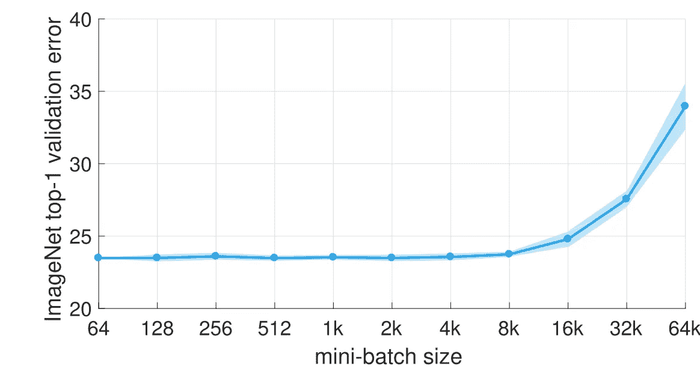

# 大规模深度学习:-精确、大型迷你批量 SGD:

> 原文：<https://towardsdatascience.com/deep-learning-at-scale-accurate-large-mini-batch-sgd-8207d54bfe02?source=collection_archive---------4----------------------->

使用分布式计算(😄大数据)有一段时间，我想知道深度学习算法如何扩展到多个节点。脸书人工智能研究中心(FAIR)最近发表了一篇[论文](https://arxiv.org/abs/1706.02677)，介绍了他们如何在 ImageNet 数据集上成功运行 resnet-50 层模型，使用 256 个 GPU 在一小时内小批量处理 8192 张图像。我相信本文中介绍的许多信息适用于试图在多 GPU 设置上快速构建模型的每个人。在这篇文章中，我总结了论文中的关键观点，当你试图扩展深度学习实现时，这些观点将是有用的。

# 关键见解:

1.  分布式同步 SGD 提供了一种解决方案，可以将 SGD 小批量划分到一堆节点上，这些节点可以是多个 GPU。
2.  大的小批量导致优化困难，并且有解决它的技术。
3.  使用线性比例规则来调整学习率，学习率是小批量和预热方案的函数。

## 为什么规模很重要？

最近的事实证明，当提供大量数据时，深度学习算法工作得更好。随着更多的数据，它显示了计算机视觉，自然语言处理和语音领域的巨大进步。但是，在 256 个节点的规模上运行像 Resnet -50 这样的架构也有其自身的挑战。

## 什么是分布式同步 SGD？

下面是 SGD 公式。

其中 X 是总数据集，X 是来自数据集的样本，l(x，w)是针对标签的每个样本计算的损失(交叉熵损失)。

但在实践中，我们使用迷你批量 SGD，计算每批的损耗和梯度，并相应地修改权重。如下所述。

其中β代表最小批量，它是 X 的子集。

在分布式同步 SGD 的情况下，每个 GPU 在小批量数据的子集上运行相同的图形，一旦 GPU 完成处理，权重被传输到参数服务器，参数服务器聚集来自多个 GPU 的所有梯度并发送回它们。

需要应用一些技巧，如线性缩放、预热策略，以使模型达到与在单个 GPU 上以较小批量训练的模型相当的结果。

Source : [Accurate, Large Minibatch SGD: Training ImageNet in 1 Hour](https://arxiv.org/abs/1706.02677)

## 为什么技巧很重要？

使用 1000 数量级的大批量的一个主要挑战是，当以正常学习速率训练时，梯度倾向于振荡。因此，实验表明，当批量增加时，很难进行训练。

提出了三种重要的解决方案来缓解上述问题。

1.  线性标度法则
2.  热身策略
3.  大型迷你批次的批次标准化

## 什么是线性比例法则？

使用大批量的能力对于跨多个工作节点并行处理图像是非常有用的。所有的线性比例规则说的是将学习率提高“k”倍。其中“k”是批量增加的次数。虽然这个规则很简单，但它却是一个强有力的规则。

Source : [Accurate, Large Minibatch SGD: Training ImageNet in 1 Hour](https://arxiv.org/abs/1706.02677)

带有(a)的图像显示了仅应用线性比例规则时模型的表现。查看结果，很明显，批量大小为 8k 的模型表现得几乎与用正常批量训练的模型一样好。预热策略有助于模型表现得与用较小批量训练的模型一样好。

## 什么是热身策略？

讨论了两种标记策略。一种是持续预热和逐渐预热。

**恒定预热:**在恒定预热中，你用很小的学习率对模型进行几个时期(文中 5 个时期)的训练，然后将学习率提高到“k 倍学习率”。然而，当学习速率改变时，这种方法导致训练误差的尖峰。在上面的(b)图中可以看到观察结果。与简单的线性标度规则相比，模型的训练误差也更高。

**渐进热身:**顾名思义，你从一个小的学习速率开始，然后在每个历元以一个常数逐渐增加，直到达到“k 倍学习速率”。这种方法有助于模型在大批量(本例中为 8k)时表现更好，这与用较小批量训练的模型的训练误差相当。

## 使用大批量时，批量规范化有什么特殊之处？

批次归一化计算小批次中样本的统计数据。当我们计算跨多个节点的样本损失时，一个样本的损失独立于另一个样本是很重要的。但是，当您使用批量标准化时，一个样本的损失函数不再独立于其他损失函数。计算的小批量统计数据是损失的关键组成部分。如果每个工人的小批量样本大小发生变化，它会影响正在优化的基本损失函数。

因此，建议在所有工人节点上保持最小批量大小相同，在本文中，每个工人有 32 个样本，工人数量为 256。应该在节点(大小为 32)级别而不是批处理级别(大小为 8k)计算批处理规范化。

## 分布式 SGD 的微妙之处和缺陷:

1.  缩放交叉熵损失不等同于缩放学习率。
2.  有两种应用动量的流行方法，一种是在使用学习率之前计算(eq 9)，另一种是使用学习率(eq 10)。

Source : [Accurate, Large Minibatch SGD: Training ImageNet in 1 Hour](https://arxiv.org/abs/1706.02677)

Source : [Accurate, Large Minibatch SGD: Training ImageNet in 1 Hour](https://arxiv.org/abs/1706.02677)

观察到在改变学习率之后应用动量校正提供了更多的训练稳定性。

3.执行梯度聚合时，通过 kn 而不是 n 来归一化每个工作节点中的梯度。“n”表示每个工作节点处理的样本数，“k”表示工作节点的总数。

本文还描述了用于网络通信的算法、使用的软件、使用的硬件以及使用各种超参数进行的实验。如果你打算尽快扩大规模，这是一本必读的书。

很快会看到另一篇文章😃