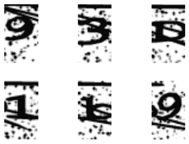
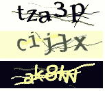

# 深度学习滴滴:破解验证码

> 原文：<https://towardsdatascience.com/deep-learning-drops-breaking-captcha-20c8fc96e6a3?source=collection_archive---------4----------------------->

在浏览了一些网站后，我发现了这样一个验证码:

作为一个人工智能爱好者，我总是想到计算机模仿人类。所以一些自然的问题出现在我的脑海里:“这似乎是一个容易破解的验证码。为什么他们在这个网站使用它？”“我能用我所知道的机器学习破解这个验证码吗？”，“这要花多长时间？”。

一周后，我在 Tensorflow 中创建了一个模型，可以以 96%的准确率解决这种验证码。我只用了一台普通的电脑就做到了，成本很低。我写这篇文章的动机并不是声称简单的验证码是可以解决的(这并不奇怪)，而是*我想强调一下现在做这个*是多么容易。

# 仔细看看

这种验证码的低效始于它缺乏方差。这是另一个例子:

我们总是有一个 6 个字母并排的灰度图像，背景中有一些随机噪声。模式是如此固定，以至于我们可以很容易地将图像分解成 6 个不同的较小图像序列:

每个图像显示一个字符。但是等一下，字符识别是我们在深度学习中学到的最基础的东西！如果我们将这些小图片中的每一个都视为与来自 [MNIST 数据集](http://yann.lecun.com/exdb/mnist/)的图片相似的图片，我们就将验证码问题转化为模式识别问题。作为输入，我们有一个 50x28 的图像，作为输出，我们有像“A”、“g”、“5”等标签。

现在的问题是如何建立数据集。在过去，我必须花一些时间来标记一堆图像，以产生一个合理大小的数据集，或者在最好的情况下，我可以召集一个朋友任务组来帮助我。但每个人都有更重要的事情要做(我也是)。所以我决定稍微作弊一下。我使用了一些承诺低价破解验证码的付费网站。花了一些钱后，我得到了大约 6 万个验证码。

剩下的就是机器学习程序了。我将数据分为训练、验证和测试，并训练了一个卷积神经网络。我写了一个超参数调整的脚本，并让它在一个周末在一台计算机上运行(仅 CPU)。

其中一个结果是，我并不需要我认为的那么多数据:

当我使用一组 50k 验证码时，获得了最好的结果，但是如果，例如，我们将其与 5k 图像的样本进行比较，改进并不巨大。

就是这样。验证码解决了。如果我想，我可以破解那个网站 96.68%的验证码。

# 最后

当然，我不会透露这些验证码来自哪个网站。但是你不需要走很远就能碰到类似的情况。互联网上有很多例子:

不用说，像这样的验证码是完全没有效率的。这样做既不需要强大的计算机能力，也不需要惊人的黑客技能。在只有 3k 个例子的数据集上，我得到了非常好的结果，为了得到这么多的验证码，我只需要花 3 美元！

现在有了机器学习工具，破解这样的验证码只需要 3 美元和一台普通电脑。网站创建者认为机器人能做的和机器人真正能做的似乎不匹配。

因此，如果这里有一个教训是，如果你担心你的网站上的机器人，你不应该使用这种验证码。[谷歌的 reCAPTCHA](https://www.google.com/recaptcha/intro/) 是一个更好的选择。

看到这些结果，我认为任何关于创建新验证码的讨论都应该从卷积神经网络的能力和局限性开始*。*