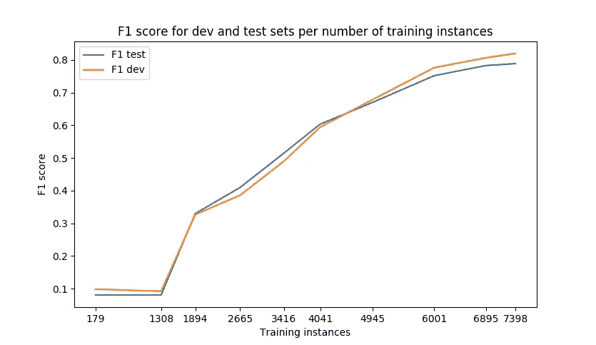

# 命名实体识别的深度学习#1:公共数据集和标注方法

> 原文：<https://towardsdatascience.com/deep-learning-for-ner-1-public-datasets-and-annotation-methods-8b1ad5e98caf?source=collection_archive---------1----------------------->

## 欢迎来到我的“命名实体识别的深度学习”系列的第一篇文章——让我们从访问高质量数据集开始！🚀

Need for data: Deep Learning for NER requires thousands of training points to achieve reasonable accuracy.

在撰写关于使用深度学习进行命名实体识别(NER)的硕士论文时，我将在一系列帖子中分享我的学习成果。主题包括如何以及在哪里找到有用的数据集(本帖！)，最先进的实现以及今年晚些时候一系列深度学习模型的利弊。

# **公共数据集**

与任何深度学习模型一样，你需要*大量*数据。高质量的数据集是任何深度学习项目的基础。幸运的是，有几个带注释的、公开的、大部分免费的数据集。

## CoNLL 2003

这个[数据集](https://www.clips.uantwerpen.be/conll2003/ner/)包括 1393 篇英语和 909 篇德语新闻文章。英语语料库是免费的，但不幸的是，德语语料库要 75 美元。这是本帖中唯一有价值的语料库。为了建立英语语料库，你需要 RCV1 [路透社语料库](https://trec.nist.gov/data/reuters/reuters.html)。您将在提交组织和个人协议几天后免费获得访问权限。

实体标注有 **LOC** (位置) **ORG** (组织) **PER** (人员)和 **MISC** (其他)。这是一个例句，每行由[单词][词性标签][组块标签] [NER 标签]组成:

> *联合国* NNP I-NP I-ORG
> *官方* NN I-NP O
> *埃克乌斯* NNP I-NP I-PER
> *首脑* VBZ I-VP O
> *为 I-PP O
> *巴格达* NNP I-NP I-LOC
> *。*。哦哦*

这里有一个[POS 标签代表什么的综合列表](https://www.ling.upenn.edu/courses/Fall_2003/ling001/penn_treebank_pos.html)。这是官方的 2003 年 CoNLL 介绍文件和 GitHub wiki 的 SOTA 排名。

## onto notes 5.0/2012 年

OntoNotes 版由 1，745，000，000，000，000，000，000，000，000，000，000，000，000，000，000，000，000，000，000，000，000，000，000，000，000，000，000，000，000，000，0000 个阿拉伯文本数据组成，这些数据来自一系列来源:电话交谈，新闻专线，广播新闻，广播，广播，广播对话和网络博客。实体标注有**人**、**组织**、**地点**等类别(此处 18 个类别[的完整列表，第 21 页)。通过你的大学/系获得访问权是最容易的——当你在这里](https://catalog.ldc.upenn.edu/docs/LDC2013T19/OntoNotes-Release-5.0.pdf)注册[时检查。](https://catalog.ldc.upenn.edu/signup)

## i2b2 挑战

整合生物学和床边信息学(i2b2)中心发布了大量 NER 的[临床数据集](https://www.i2b2.org/NLP/DataSets/Download.php)。特别是 2009 年(提取药物)，2012 年(提取问题，治疗等。)和 2014 年(提取疾病、危险因素、用药等。)挑战是非常相关的，包括[记录良好的最先进的实施](https://www.i2b2.org/NLP/DataSets/Main.php)。获得访问权是免费的——它需要签署一份[协议](https://www.i2b2.org/NLP/DataSets/AgreementAR.php)，声明你基本上是以体谅的态度对待数据的。i2b2 回复很快！

## 更多数据

我没有详细查看其他数据集，但它们可能对您的应用程序仍然有用: [NLPBA 2004](http://www.nactem.ac.uk/tsujii/GENIA/ERtask/report.html) 标记有蛋白质/DNA/RNA/细胞系/细胞类型(2,404 MEDLINE 摘要)和 [Enron 电子邮件](http://www.cs.cmu.edu/~enron/)标记有姓名/日期/时间(大约 500 K 条消息)。

# 注释方法

了解不同的注释模式需要一些时间。有许多框架，从标记方法(类似 HTML)到键值对。

## 标记(例如 OntoNotes 5.0)

这种注释方法使用带有尖括号的标记标签来定义命名实体，例如组织:

> 迪士尼是一个全球品牌。

## IOB(如 CoNLL 2003)

IOB(或 BIO)代表 **B** 内， **I** 内， **O** 外。用 O 标记的单词在命名实体之外，而 *I-XXX* 标记用于类型为 *XXX* 的命名实体内的单词。每当两个类型为 *XXX* 的实体彼此紧邻时，第二个实体的第一个单词将被标记为 *B-XXX* 以突出显示它开始另一个实体。下面是一个例句，每行由[单词][词性标签] [NER 标签]组成:

> *我们*PRP B-NP
> 看见了 VBD O
> 那个 DT B-NP
> 黄 JJ I-NP
> 狗 NN I-NP

## 北京生物工程学院

一种更复杂的注释方法区分命名实体和单个实体的结尾。这种方法被称为内侧、**B、**n、 **O、**n、 **E、**d、 **S、**S。上述数据集都没有使用现成的 BIOES，但它显示出比 BIO 有相当大的性能改进(例如 *Chiu 和 Nichols，2016* )。

## 更多方法和细节

这里有一篇[很棒的博文](https://lingpipe-blog.com/2009/10/14/coding-chunkers-as-taggers-io-bio-bmewo-and-bmewo/)关于进一步的注释方法及其复杂性。

第一篇帖子到此结束。理解可用的数据以及如何对其进行注释，为您以后构建可靠的统计模型提供了良好的基础。让我知道你是否找到了其他有用的数据来源！👋