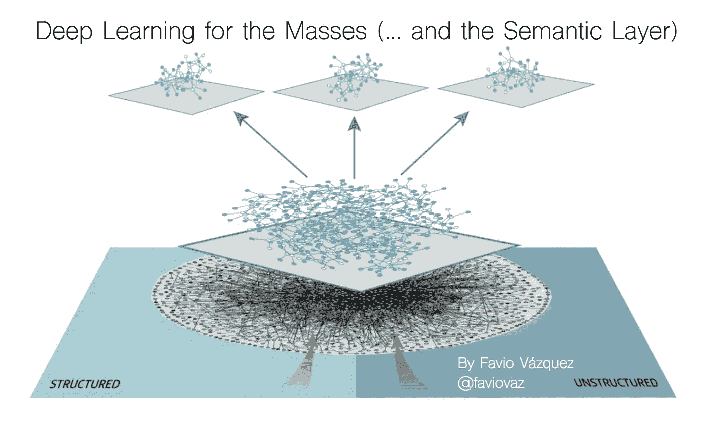
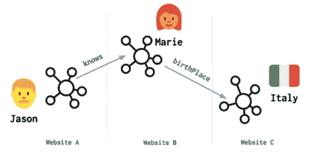
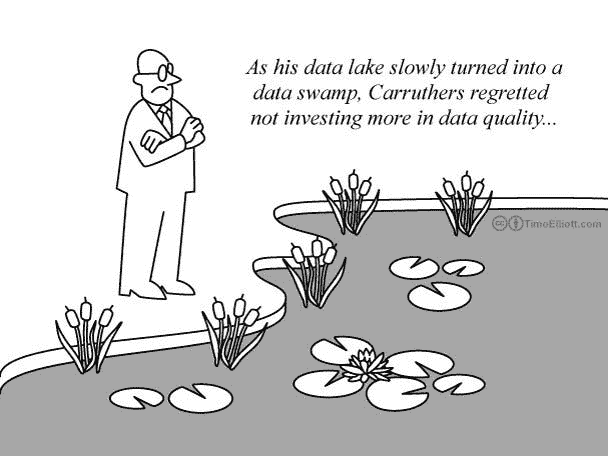
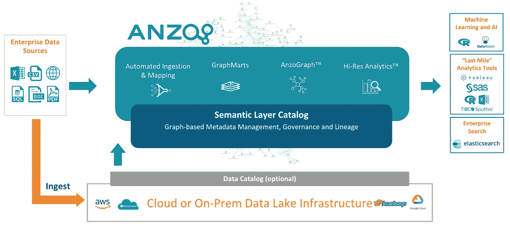
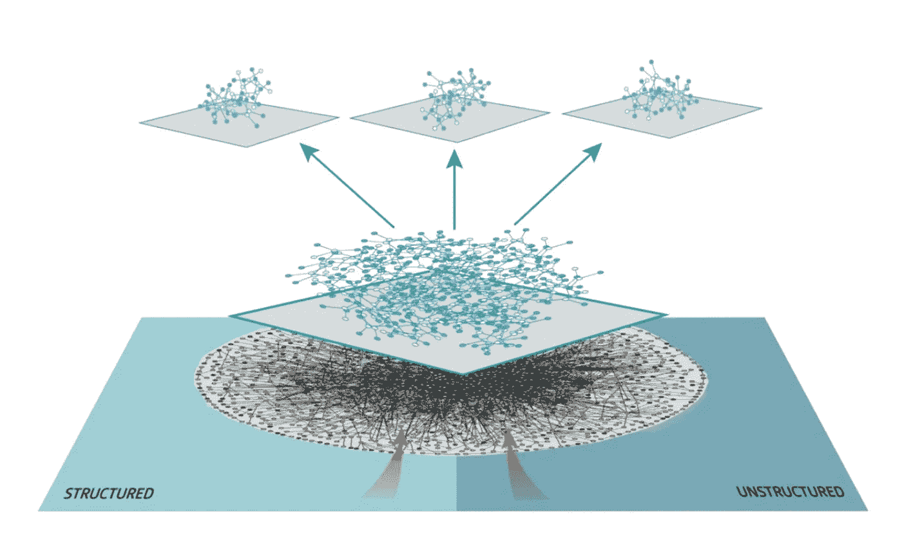
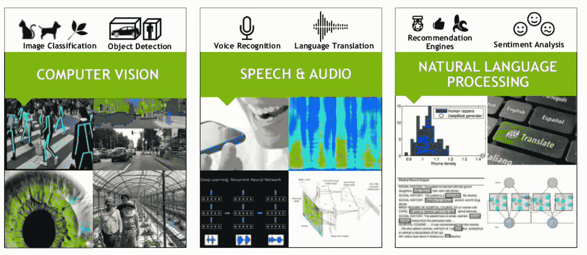
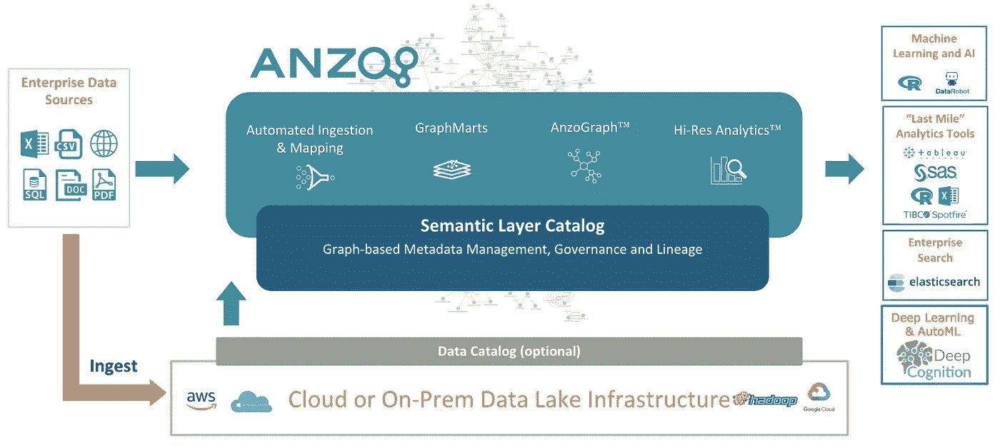

# 面向大众的深度学习(…和语义层)

> 原文：<https://towardsdatascience.com/deep-learning-for-the-masses-and-the-semantic-layer-f1db5e3ab94b?source=collection_archive---------7----------------------->

## 深度学习现在无处不在，在你的手表里，在你的电视机里，在你的手机里，在某种程度上，在你阅读这篇文章的平台上。在这里我将谈论如何以一种非常简单的方式开始使用深度学习来改变你的业务。但是首先，你需要了解语义层。

深度学习简介

本文的范围不是介绍深度学习，我已经在其他文章中介绍过了，您可以在这里找到:

 [## 深度学习的“怪异”介绍

### 有关于深度学习的惊人介绍、课程和博文。但这是一种不同的介绍…

towardsdatascience.com](/a-weird-introduction-to-deep-learning-7828803693b0)  [## 我的深度学习之旅

### 在这篇文章中，我将分享我如何研究深度学习并使用它来解决数据科学问题。这是一个…

towardsdatascience.com](/my-journey-into-deep-learning-c66e6ef2a317)  [## 关于深度学习的对话

### 有人无意中听到两个人谈论深度学习，让我知道每一个小细节。其中一个完全…

towardsdatascience.com](/a-conversation-about-deep-learning-9a915983107) 

但是如果你想从这里体验一下，我可以告诉你:

> …深度学习是使用不同种类的神经网络(深度神经网络)和优化网络的超参数来获得(学习)我们数据的最佳表示的表示学习。

如果你想知道这是从哪里来的，请阅读上面的文章。

# 深度学习没那么难

This is harder

目前，组织的深度学习并不难。我并不是说深度学习整体上很容易，该领域的研究需要大量的数学、微积分、统计学、机器学习、计算等知识。你可以从我不久前创建的时间线中看到深度学习的来源:

从那里我可以说反向传播的思想，网络参数的更好初始化，更好的激活函数，辍学的概念，以及一些类型的网络，如卷积神经网络，残差网络，区域基 CNN，递归神经网络和生成对抗网络，是我们在深度学习领域取得的最重要的进展之一。

但是你现在如何使用深度学习呢？

hehe

# 数据第一

Oh, you’d want to be them. Right?. Or maybe not, IDK.

你想知道秘密吗？大型科技公司使用的秘方？不仅仅是深度学习(可能根本不是深度学习)

这里不做完整的演讲，一切从数据说起。正如您可以想象的那样，数据现在是公司的重要资产(可能是最重要的资产)。所以在你可以应用机器学习或深度学习之前，你需要拥有它，知道你拥有什么，理解它，治理它，清理它，分析它，标准化它(也许更多)，然后你才能想到使用它。

摘自 [Brian Godsey](https://medium.com/u/2863c99d899d?source=post_page-----f1db5e3ab94b--------------------------------) 的惊艳[文章](/is-data-science-really-a-science-9c2249ee2ce4):

> *无论哪种形式，数据现在无处不在，而不仅仅是分析师用来得出结论的工具，它已经成为自己的目的。公司现在似乎将收集数据作为一种目的，而不是一种手段，尽管他们中的许多人声称计划在未来使用这些数据。独立于信息时代的其他定义特征，数据获得了自己的角色、自己的组织和自己的价值。*

因此，您可以看到，它不仅将最新的算法应用于您的数据，还能够以良好的格式保存数据，理解数据，然后使用数据。

# 语义层

These layers mean something. Ok but this is not the semantic layer. Keep reading.

从我这里听到这种事情很不寻常，但是我已经做了很多调查，并且与几家公司合作，他们似乎都有同样的问题。他们的数据。

数据可用性、数据质量、数据接收、数据集成等是常见问题，不仅会影响数据科学实践，还会影响整个组织。

有多种方法可以清理您的数据并为机器学习做准备，并且有很好的工具和方法，您可以在这里阅读更多信息:

 [## 宣布 Optimus v2 —简化敏捷数据科学工作流程

### 作为一名数据科学家，您是否正在寻找一个库来提升您的工作效率？看看这个。

towardsdatascience.com](/announcing-optimus-v2-agile-data-science-workflows-made-easy-c127a12d9e13) 

但这意味着你有一个吸收和整合数据的过程。现在有很多很好的工具可以用于 AutoML，我之前已经谈到过:

 [## Auto-Keras，或者说如何用 4 行代码创建深度学习模型

### 自动化机器学习是这个城市的新生事物，它会一直存在下去。它帮助我们创造越来越好的产品…

www.kdnuggets.com](https://www.kdnuggets.com/2018/08/auto-keras-create-deep-learning-model-4-lines-code.html) 

以及其他商业工具，如 DataRobot:

 [## 用于预测建模的自动机器学习| DataRobot

### DataRobot 的自动化机器学习平台使构建和部署准确的预测模型变得快速而简单…

www.datarobot.com](https://www.datarobot.com/) 

## **但是自动摄取和集成呢？**

这是语义层令人惊奇的好处之一。但是语义层到底是什么呢？

语义这个词本身就意味着意义或理解。因此，语义层与数据有关，涉及数据的含义而不是数据的结构。

理解这是一个非常重要的过程，我之前已经讲过了:

 [## 用数据科学创造智能

### 在这篇文章中，我将展示数据科学如何让我们通过人工智能创造智能。

towardsdatascience.com](/creating-intelligence-with-data-science-2fb9f697fc79) 

这里我提到(来自 [Lex Fridman](https://medium.com/u/119b8eb57f8e?source=post_page-----f1db5e3ab94b--------------------------------) )的是:

> *理解是将* ***复杂的*** *信息转化为* ***简单的*** *，有用的* *信息的能力。*

当我们理解时，我们正在解码组成这个复杂事物的各个部分，并把我们一开始得到的原始数据转化成有用的、简单易懂的东西。我们通过**建模**来做到这一点。你可以想象我们需要这样的模型来理解数据的意义。

## 关联数据和知识图

我们需要做的第一件事是链接数据。链接数据的目标是以一种易于使用和与其他链接数据组合的方式发布结构化数据。

链接数据是 Web 上数据发布和互操作性的新的事实上的标准，并且也正在进入企业。像谷歌、脸书、亚马逊和微软这样的大公司已经采纳了它背后的一些原则。

链接数据的过程是知识图的开始。知识图是一种高级的方法，可以映射某个特定主题的所有知识，填补数据之间的空白，或者数据库内部的虫洞。

> 知识图由数据和信息的集成集合组成，其中还包含不同数据之间的大量链接。

这里的关键是，在这个新模型下，我们不是在寻找可能的答案，而是在寻找答案。我们想要事实——这些事实从何而来并不重要。

这里的数据可以代表概念、物体、事物、人，实际上是你脑海中的任何东西。图表填充了概念之间的关系和联系。

以下是谷歌 6 年前(是的，6 年前)对知识图谱的精彩介绍:

## 知识图谱对你和你的公司意味着什么？

按照传统的方式，数据仓库中的数据模型虽然是一项了不起的成就，但却无法吸收向我们袭来的海量数据。创建关系数据模型的过程就是跟不上。此外，用于支持数据发现的数据提取量也太小。

因此，基于 Hadoop 或云存储的数据湖已经激增为数据沼泽，而没有所需的管理和治理能力。

[https://timoelliott.com/blog/2014/12/from-data-lakes-to-data-swamps.html](https://timoelliott.com/blog/2014/12/from-data-lakes-to-data-swamps.html)

您是否问过您的数据工程师和科学家，他们是否了解您组织拥有的所有数据？动手吧。

分析你所有的数据也非常困难。并了解其背后的关系。

因为是图，知识图更直观。人们不会用表格来思考，但他们会立刻理解图表。当你在白板上画出一个知识图表的结构时，它对大多数人的意义是显而易见的。

知识图表还允许您为图表中的关系创建结构。你可以讲一个图，父母有孩子，父母可以是孩子，孩子可以是兄弟姐妹，这些都是人。提供这样的描述性信息允许从图中推断出新的信息，例如如果两个人有相同的父母，他们一定是兄弟姐妹。

## 为您的组织扩展语义层

当我在寻找可以帮助我和你实现端到端平台以在企业级交付真正的语义层时，我发现了一个很棒的平台:由一家名为[Cambridge Semantics](https://www.cambridgesemantics.com/)的公司创建的 Anzo。

I’m going to edit this. Keep reading!!

你可以用 Anzo 建立一个叫做“企业知识图”的东西。

图中的节点和边灵活地捕捉了每个数据源的高分辨率孪生数据—结构化的或非结构化的。该图表可以帮助用户快速、交互式地回答任何问题，允许用户与数据进行对话以揭示见解。

除了使每天的大数据分析问题变得简单之外，graph 还开启了 graph 特别适合的新的可能性。基于开放标准的图表是一个持续改进的平台。在图表中，使用业务规则、文本分析甚至**机器学习(这将很快变得重要)来快速链接和协调来源。**

我也喜欢数据结构的想法。然后我意识到其他人也在用同样的概念。这让我想起了时空结构。我继续定义了数据结构(不知道作者是什么意思，也没有阅读其他定义)。

物理学中时空结构的概念是为了解释空间和时间的连续性而创建的，它由四个维度(或者 11 个或者 26 个，取决于你的理论)组成。在这个结构中，重力是扭曲时空结构的一种表现。

From [Ethan Siegel](https://medium.com/u/72d6583b95ba?source=post_page-----f1db5e3ab94b--------------------------------): You can talk about space as a fabric, but if you do, be aware that what you’re doing is implicitly reducing your perspective down to a two-dimensional analogy. Space in our Universe is three dimensional, and when you combine it with time, you get a four dimensional quantity.

那么什么是数据结构呢？如果我们想到物理学中的定义，我们可以说对于一个组织来说:

> 数据结构是支持公司所有数据的平台。它是如何被管理、描述、组合和普遍访问的。该平台由企业知识图构成，以创建统一的数据环境。

有了 Anzo，这是可能的。这就是使用 Anzo 的数据结构的样子(看起来有点像时空结构，太棒了！):

数据结构之上的是数据层。这些数据层可以添加数据清理、转换、链接和访问控制等内容，以迭代的方式动态增强内存中的图形。

这种堆叠方式的数据层非常灵活，这意味着您可以轻松地打开或关闭层，并根据需要移除、复制和创建层。

> 有了 Anzo，你可以自动生成查询(是的，这是一个东西),并使用它们来处理复杂的图形，使提取特征变得容易，并最终完全自动化！

通过 Anzo 的几个组件，用户可以真正地与他们的数据进行对话——快速而轻松地根据问题的答案以新的方向进行分析，而无需专业的查询知识，他们甚至可以遍历最复杂的多维数据，以构建探索性的图表、过滤器、表格甚至网络视图。

通过 Spark、Featuretools 和 Optimus 等开源技术的连接，您可以充分准备您的数据，并最终为机器和深度学习做好准备。

我将在未来写更多关于这方面的内容，但现在，让我们认为我们已经有了我们的数据结构和一切，我们想做机器和深度学习。

# 适合你的深度学习

好的，深度学习。你想用它。它的主要应用是什么？

在这里你可以看到其中的一些:

[https://www.slideshare.net/NVIDIA/deep-learning-workflows-training-and-inference](https://www.slideshare.net/NVIDIA/deep-learning-workflows-training-and-inference)

在深度学习成为人工智能世界之王的几年里，它取得了巨大的成就，Franç ois Chollet 列出了深度学习的以下突破:

*   接近人类水平的图像分类。
*   接近人类水平的语音识别。
*   接近人类水平的手写转录。
*   改进的机器翻译。
*   改进的文本到语音转换。
*   Google Now 或亚马逊 Alexa 等数字助手。
*   接近人类水平的自动驾驶。
*   谷歌、百度和必应使用的改进的广告定位。
*   改进的网络搜索结果。
*   回答自然语言问题。

所以你可以用它做很多事情。现在，你怎么做呢？

可悲的是，人工智能专业知识(严重)短缺，这给准备采用人工智能的组织造成了重大障碍。通常我们做深度学习编程，学习新的 API，有些比其他的更难，有些真的很容易，比如 Keras。

现在，你可以使用一种更具表现力的方式来创建深度学习模型。那就是利用深度认知。我以前讲过:

 [## 深度认知让深度学习变得简单

### 在过去的一个月里，我有幸见到了 DeepCognition.ai 的创始人

becominghuman.ai](https://becominghuman.ai/deep-learning-made-easy-with-deep-cognition-403fbe445351) 

他们的平台 **Deep Learning Studio** 有云解决方案、桌面解决方案([**【http://deepcognition.ai/desktop/】**](http://deepcognition.ai/desktop/))可供选择，软件将在您的机器或企业解决方案(私有云或内部解决方案)上运行。

您可以使用预先训练的模型以及内置的辅助功能来简化和加速模型开发过程。您还可以导入模型代码，并使用可视化界面编辑模型。

当您迭代和调整超参数以提高性能时，平台会自动保存每个模型版本。您可以比较不同版本的性能，以找到您的最佳设计。

这个系统建立的前提是让人工智能对每个人来说都很容易，当创建这个复杂的模型时，你不必成为专家，但我的建议是，你对自己正在做的事情有一个想法，阅读一些 TensorFlow 或 Keras 文档，观看一些视频并获得信息是很好的。如果你是这方面的专家，那太好了！这将使你的生活更容易，你仍然可以在构建模型时应用你的专业知识。

你实际上可以下载产生预测的代码，正如你将看到的，它是用 Keras 编写的。然后，您可以上传代码，并使用系统提供的笔记本进行测试，或者在您的笔记本电脑或其他平台上使用它。

# 语义层和深度学习

因此，通过语义层与 Anzo 等平台和 Deep Learning Studio 等深度学习系统的连接，您可以加速数据和人工智能在您公司的使用。我认为这是一条几乎适用于所有组织的道路:

I went ahead and modified the original picture. I think this is with a touch of Python, Spark and stuff like that can be the future of data science and data technologies.

我认为这与敏捷商业科学问题框架(ABSPF)这样的方法一起，从端到端的角度来看，确实可以为组织带来价值。有关 ABSPF 的更多信息:

 [## 创建 ROI 驱动的数据科学实践的敏捷框架

### 数据科学是一个令人惊叹的研究领域，学术界和工业界都在积极发展…

www .商业科学. io](https://www.business-science.io/business/2018/08/21/agile-business-science-problem-framework.html) 

我认为我们可以让世界变得更好，改善我们的生活，改善我们工作、思考和解决问题的方式，如果我们现在就调动我们所有的资源，让这些知识领域为更大的利益而共同努力，我们就可以对世界和我们的生活产生巨大的积极影响。

这是我想和你开始的一个更长对话的开始。我希望它能帮助你在这个神奇的领域开始，或者只是发现一些新的东西。

如果这篇文章对你有帮助，请分享给你的朋友！

如果您有任何问题，请在 Twitter 上关注我:

 [## 法维奥·巴斯克斯(@法维奥·巴斯克斯)|推特

### Favio Vázquez 的最新推文(@FavioVaz)。数据科学家。物理学家和计算工程师。我有一个…

twitter.com](https://twitter.com/faviovaz) 

和 LinkedIn:

 [## favio vázquez——science ia y Datos | LinkedIn 创始人

### 查看 Favio Vázquez 在世界上最大的职业社区 LinkedIn 上的个人资料。Favio 有 16 个工作列在他们的…

www.linkedin.com](https://www.linkedin.com/in/faviovazquez/) 

那里见:)