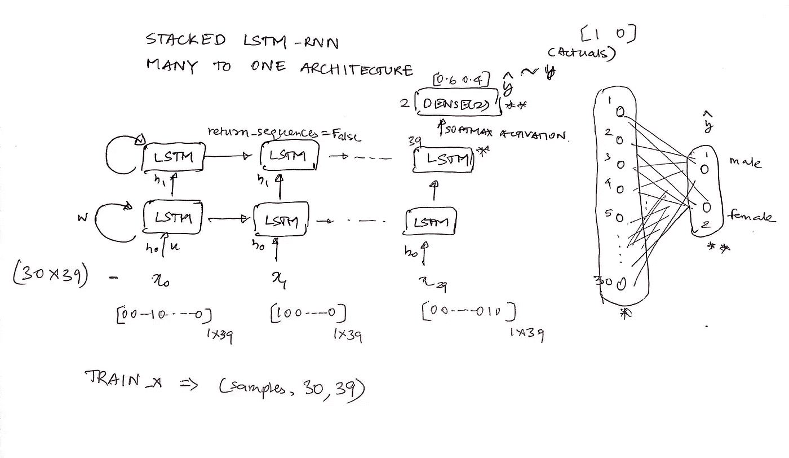
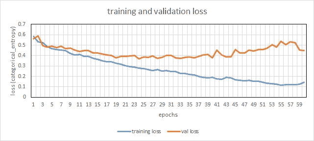
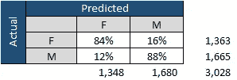

# 从名字-LSTM 递归神经网络深度学习性别

> 原文：<https://towardsdatascience.com/deep-learning-gender-from-name-lstm-recurrent-neural-networks-448d64553044?source=collection_archive---------2----------------------->

 [## prdeepakbabu/Python

### Python - All *。py 脚本

github.com](https://github.com/prdeepakbabu/Python/tree/master/Deep%20learning%20gender) 

深度学习神经网络已经在与视觉、语音和文本相关的问题上显示出有希望的结果，并取得了不同程度的成功。我在这里试着看一个文本问题，我们试着从人名中预测性别。rnn 非常适合这种情况，因为它涉及到从序列(在这种情况下是字符序列)中学习。由于梯度消失，传统的 rnn 存在学习问题。最近的进展表明，RNN 的两种变体可以帮助解决这个问题

(i) LSTM 或长短期记忆-使用记忆/遗忘门来保留或传递顺序学习的模式，用于预测目标变量。我们将在我们的模型中使用它。(推荐 [colah 的博客](http://colah.github.io/posts/2015-08-Understanding-LSTMs/)以深入了解 LSTM 背后的理论)

㈡GRU 或门控循环单元

为了正式陈述这个问题，我们感兴趣的是预测给定的名字是男是女。在过去，已经有尝试基于在 NLTK 中看到的关于姓名的简单规则来预测性别，例如，依赖于姓名中的最后一个字符来分类性别，这由于高度概括而遭受低准确性。

我们将使用组成名字的字符序列作为 X 变量，Y 变量作为 m/f 来表示性别。我们使用一个堆叠的 LSTM 模型和一个带有 softmax 激活的最终密集层(多对一设置)。分类交叉熵损失与 adam 优化器一起使用。添加 20%的丢弃层用于正则化，以避免过拟合。示意图显示了模型设置。

LSTM RNN Architecture.

**关于数据集**

[我们使用在](https://gist.github.com/mbejda/9b93c7545c9dd93060bd) [mbejda github](https://gist.github.com/mbejda/9b93c7545c9dd93060bd) 账户中可用的印度名字数据集，该账户具有从公共记录中收集的男性和女性印度名字数据库的集合。基本的预处理是删除重复的特殊字符。男/女班的最终分配比例为 55%:45%。值得注意的是，我们在这里使用全名。一些名字有两个以上的单词，这取决于姓氏、家族名字等。

**使用 keras 实施**

完整的数据集、代码和 python 笔记本可在我的 [github repo](https://github.com/prdeepakbabu/Python/tree/master/Deep%20learning%20gender) 中获得。完整的实现是使用 keras 和 tensorflow 后端完成的。输入表示&参数在下面突出显示

(i) *词汇*:我们有一组 39 个字符，包括 a-z、0-9、空格、点号和一个特殊的结束标记。
(二)*最大序列长度*:选择为 30 ie。超过 30 个字符的字符将被截断。如果名称少于 30 个字符，则填充“END”标记。
(iii) *one hot encoding* :对每个字符进行 one-hot 编码，表示为[1 X 39]维数组。
(iv) *批量*:一批 1000 个样本
(v) *时期* : 50 个时期或 50 次我们迭代整个数据集(见一次)
(vi) *Y 标签*:表示为[1 X 2]的数组，第一列表示男性，第二列表示女性。例:[1 0]代表男性。

Loss & Accuracy charts as a function of epochs. As seen from loss charts, after 40 epochs the validation loss saturates while training loss keep reducing indicating over-fitting problems.

这个模型在我的中等高端笔记本电脑(基于 CPU)上运行了大约 2 个小时。在验证数据集上，最终的**分类准确率为 86%** 。更多关于精确度、召回率和混淆矩阵的统计数据如下所示。

模型显示识别男性(88%)比识别女性(84%)的精确度更高。在总共 3，028 个验证样本中，411 个样本被错误地预测，导致 86.43%的准确度和 13.5%的误差

**解读模型(模型学到了什么？)**

查看在验证集上做出的预测，模型似乎已经在序列中学习了以下模式。例如，出现的“先生”暗示可能是男性名字，而出现的“smt”和“mrs”则表示女性名字。深度学习的魅力在于端到端的学习能力，而不需要传统学习中所需的显式特征工程步骤。此外，女性的名字往往以元音 a，I，o 结尾，这似乎是模特们选择的。有更复杂的模式被模型拾取，不容易通过检查看到。

**下一步**

提高模型精度的一些想法是

(I)使用预先训练的字符嵌入，而不是一键编码(像[这个](https://github.com/minimaxir/char-embeddings/blob/master/glove.840B.300d-char.txt))。记住这句话同样适用于角色

> 从一个人交的朋友，你就可以知道这个人说的话

(二)更好的抽样
a .限于名和姓。
b .按 1:1 的比例对男性班级和女性班级进行子抽样。从词汇表中删除所有非字符。
(三)超参数整定
a .序列的最大长度
b .堆叠层数。LSTM·盖茨

我很乐意听到你对这篇文章的评论/问题/建议，如果你觉得有趣，请分享。