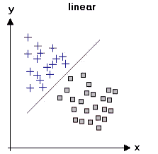
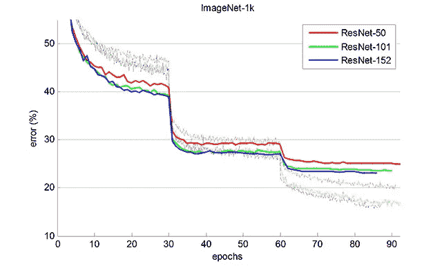

# 实践中的深度学习

> 原文：<https://towardsdatascience.com/deep-learning-in-practice-8836be560dc1?source=collection_archive---------18----------------------->

## 当你的结果看起来太好或太差时该怎么办

从业者知道深度学习方法非常强大和灵活，但在真实世界的数据集上“在野外”应用它们，与在 CIFAR-10/100 或 ImageNet 等知名数据集上重新运行最新的 SOTA(最先进的)模型是非常不同的。数据缺失、数值错误、打字错误、标签错误等。，使事情变得更加复杂，因此有时我们不确定是否可以相信我们的结果。让我们来看看一些实用的技巧，当你得到的结果看起来*“好得不像真的”*或*“坏得没用”*时，该检查些什么。

# **好得令人难以置信的结果**

结果会“好得难以置信”吗？例如，你可能正在使用*迁移学习*:你没有时间从头开始构建和训练一个复杂的架构，所以你得到一个预训练的模型(比方说，在 ImageNet 上训练的 ResNet101)并将其输入你的数据集。您希望在不花费长时间学习的情况下获得良好的准确性，但是您并不期望获得优异的结果，除非您的数据集与最初训练模型的数据集极其相似。

或者，在训练一个复杂且耗时的架构之前，您可能想先尝试一个简单的模型。更简单的神经网络将作为基线，以测量使用 bigger/badder 模型获得的优势。你不会期望一个简单的模型得到 SOTA 结果。

最后，您可能正在处理一个简单的模型，因为它的用例(例如，一个移动应用程序，或一个内部部署的应用程序)阻止您走得太远，尤其是如果您计划执行在线培训的话。

那么，如果你第一次测试就获得了 99.3%的准确率，你会怎么想？你不应该马上断定这个问题很简单，你不需要一个很深的关系网来解决它。相反，这里有一些实用的提示，可以帮助你评估你是否幸运，问题是否简单，或者你犯了一些明显的错误。其中一些技巧只对分类器有意义，而另一些则可以应用于各种深度学习模型。

在下文中，我们将假设您已经遵循了最佳实践以避免过度拟合，即，您使用了 *k* 折叠交叉验证(CV)或训练/验证/测试集分割来估计您的模型的泛化误差，并且您发现了一个可疑的低值。

## 检查数据泄漏

首先，检查所有数据转换(或估计量，在 Tensorflow 行话中)是否适合训练集，并应用于测试集， *k* 的每个折叠的*——折叠 CV。例如，如果放弃“无用”的特征是你的模型的一部分，你**不能**在完整的训练集中选择“有用”的特征，然后每次折叠都使用相同的特征。相反，您必须为每个折叠重复特征选择操作，这意味着在每个折叠中您可能使用不同的特征来进行预测。如果使用训练/验证/测试集分割而不是*k*fold CV，等效的方法是仅使用验证集来选择有用的特征，而不需要查看测试集。
如果您使用 Python 编码，确保对每个折叠重复相同的精确操作的一个简单方法是使用“Pipeline”类(在“scikit-learn”中)或“Estimator”类(在 Tensorflow 中)，并确保对数据的所有操作都在 pipeline/estimator 内部执行。*

## 您使用的度量标准正确吗？

如果构建分类器，请验证您使用了正确的分类度量。例如，如果群体中的各种类别达到合理的平衡，准确性作为分类度量*只有*才有意义。但是在一个医学数据集上，人群中疾病的发病率是 0.1%，你可以在一个代表性的数据集上获得 99.9%的准确性，只需将每个点分类到多数类。在这种情况下，99.9%的准确性没有什么好惊讶的，因为准确性不是这里使用的正确度量。

## 问题真的简单吗？

同样，在分类的情况下，检查问题是否过于简单。例如，您可以拥有完全可分离的数据。换句话说，在输入空间中存在一个流形(或多个流形的交集),它完美地分离了各种类别(无噪声)。在两类线性可分问题的情况下，输入空间中有一个超平面完美地将两类分开。这很容易诊断，因为超平面的所有低维投影都是超平面。因此，例如在所有特征对的 2D 散点图中，两个类别可以由一条线完美地分开:

当然，由于深度学习经常应用于具有数千或数万数量级的 *K* (特征的数量)(例如，图像像素)的问题，因此甚至可能无法可视化所有 *(K+1)K/2* 散点图的一小部分。这不是一个问题，因为线性可分数据将被更简单的机器学习工具完美地(或接近完美地)分类，例如线性判别分析、线性支持向量机(SVM)或正则化逻辑回归(非正则化逻辑回归拟合 MLE 对于线性可分问题是不稳定的)。因此，如果可视化是不可能的，拟合这些模型将给出相同的信息，尽管以一种不太直接的方式。

非线性完全可分离的数据在没有可视化的情况下更难检测:

然而，机器学习工具，如内核支持向量机(或更好的，无标签 VAE)，或先进的可视化方法，如 t-SNE，可能有助于识别这种情况。
绘制决策区域，例如使用“scikit-learn”的“mlxtend”助手包中的“plot_decision_regions”函数，是快速识别非线性完全可分数据的另一种方法。然而，在你有大量特征的深度学习问题中，这样的可视化可能是不可能或不切实际的。

在这两种情况下(线性和非线性可分离数据),关键是类之间有一个“硬”分离边界(即没有噪声),因此有可能获得完美的分类。可以说，很少有现实世界的问题属于这些类别:在大多数情况下，对于从群体中提取的所有训练集，没有一个“硬”边界可以完美地将这两个类别分开。尽管如此，做这个检查还是值得的。

## 在随机标签上训练

一个经常具有启发性的测试是在混洗(置换)标签上重新安装 DNN。在这种情况下，特征和类别标签之间没有关系，因此神经网络只有一种方法来获得良好的训练集误差:记住整个训练集。这通常会表现在更长的训练时间。此外，它没有办法获得良好的测试集误差。如果您在测试集上仍然获得了出色的性能，那么要么是您的代码有严重的问题(考虑增加您的单元测试的覆盖率，以找到问题所在)，要么是您使用的框架有问题。在后一种情况下，您应该考虑在此时打开一个 GitHub 问题。

## 在小数据集上训练

走向极端的反面:在单个(或非常少的)数据点上训练。在这种情况下，你应该很快在训练集上获得 100%的准确率(极短的训练时间)，当然在测试集上获得极低的准确率。同样，如果您不这样做，这表明您的代码或您正在使用的框架中存在一些严重的问题。

## 上次检查:获取新数据

最后，您可以尝试获得一些新的测试点，代表 DNN 的真实用例，这是您之前从未见过的(更不用说在培训中使用了)。如果你仍然得到优秀的准确性，那么恭喜你，你的模型太棒了！

[Source](https://github.com/KaimingHe/deep-residual-networks)

# “坏得没用”的结果

> “人们担心计算机会变得太聪明并接管世界，但真正的问题是它们太笨了，它们已经接管了世界。”
> ― **佩德罗·多明戈斯**

我们已经看到了当我们在第一次尝试中获得优秀的结果时应该做什么，特别是如何验证我们没有被愚蠢的错误愚弄，例如将测试集泄露给训练集。在这一部分中，我们将看到如何处理神经网络预测不够准确这一更常见的问题。**注意**:已经有很多次的经验表明，足够深度的神经网络可以记住巨大数据集上的随机标签(例如参见[理解深度学习需要重新思考泛化](https://arxiv.org/abs/1611.03530))。因此，原则上，有了足够大的 NN，我们应该总是能够将**训练误差**减少到极小的值，也就是说，减少*过度适应*训练集，不管学习任务是多么的无意义。对于**泛化错误**，情况完全不同。一般来说，不能保证对于每个学习问题，都存在一个可学习的神经网络模型，它可以产生尽可能低的泛化误差。然而，有一些技巧可以帮助你设定现实的目标，并最大化你达到目标的机会。

## 1.确认你的目标是现实的

在一个问题(数据集+学习任务)上找到一个能达到我们需要的精确度的有信誉的参考，这个问题与我们正在研究的问题足够相似，这将是非常好的。这并不总是可能的，但是保持各种任务的最新技术状态，例如物体检测或命名实体识别，有助于正确设置我们的期望。主题专业知识也可以指导我们选择现实的精度目标。

## 2.确保你的训练程序中没有错误

当然，如果我们的神经网络训练不正确，我们就不能指望它能很好地推广新数据。以下检查有助于我们验证培训流程:

*   编写**单元测试，**可能使用 Chase Robert 的[机器学习库进行单元测试](https://medium.com/@keeper6928/how-to-unit-test-machine-learning-code-57cf6fd81765)
*   **数据集检查**:查看训练集和测试集的一些随机输入/标签样本，并检查标签是否正确；检查输入图像的宽度和大小；打乱训练/测试集中的样本，看看它是否会影响结果；等等。
*   **过度拟合测试** : 1)将训练集减少到几个样本(两到三个)。训练误差现在应该很快达到 0(NN 立即过拟合如此小的训练集)，但是测试集应该增长很多(数据如此之少，NN 不能概括)。2)关闭所有正则化，验证 NN 能够过拟合全部训练集。这并不总是可能的，因为一些架构本质上是不稳定的，如果没有某种形式的调整，训练是不可能的。然而，当测试工作时，它表明 NN 相对于我们的训练集具有过剩的能力，因此，给定适当的正则化，它应该获得低测试误差，只要训练集是测试集的代表，并且特征足以预测标签(如果标签是随机的，再多的训练也不会使 NN 学习:参见下一个要点)。
*   **随机化测试**:随机洗牌训练标签。现在，训练误差应该减少(尽管慢得多)，但是测试集误差不应该低于随机分类误差(即，如果我们将每个类别分配给多数类，则所犯的误差等于 *1-f_m* ，其中 *f_m* 是多数类的频率)。
*   标准化您的预处理和包版本。使用 Docker 容器来构建您的模型是确保您的模型无论在哪里部署都以相同的方式运行的最佳方式，而不必担心库安装、环境配置、破坏旧功能的库更新等等。
*   保存详细的数值实验日志

## 3.尽可能以超收敛为目标

在某些情况下，大学习率与 Leslie N. Smith 的循环学习率方法的结合起到了正则化的作用，使收敛速度加快了一个数量级，并减少了大量正则化的需要。参见[超收敛:使用大学习率快速训练神经网络](https://arxiv.org/abs/1708.07120)。

## 4.针对你的问题使用正确的规范化形式

正则化倾向于增加训练时间和训练误差，但同时倾向于减少测试误差。然而，过于一般化实际上会增加这两种错误(欠拟合)。出于这个原因，如果您成功地在没有正则化(过度拟合测试)的情况下使训练集过度拟合，那么一次引入一种正则化技术通常会更好。原因是正则化本身并不一定意味着你的泛化误差会变小:模型必须有足够大的容量来实现良好的泛化特性。一个深度足以过拟合训练集的神经网络，在没有正则化的情况下，一旦正则化开始起作用，应该能够实现低测试误差。

最著名的调整方法是早期停止和体重下降。其他常用工具有:

*   **小批量培训**:较小的批量通常与较小的概括误差相关，所以这是一种尝试。然而，请注意，一些研究人员[对迷你电池](https://arxiv.org/abs/1705.08741)的有效性提出了质疑。迷你批处理与**批处理规范化**不兼容(见下文)，所以在使用这两种方法时要格外小心。
*   尝试使用 **SGD** 来代替 Adam 等自适应优化器:论文[通过从 Adam 切换到 SGD](https://arxiv.org/abs/1712.07628) 来提高泛化性能表明，对于某些任务，SGD 优化器虽然速度较慢，但能够找到对应于较低测试集误差的最小值。
*   使用**下降**:如果使用 LSTMs，只对 LSTM 层的输入和输出单元使用标准下降。对于循环单元(门),使用循环辍学，这是 Yarin Gal 在他的博士论文中首次提出的。如果您使用 CNN，当应用于具有更多单元的层(即全连接层)时，dropout 会更有效，除非您使用的是 FCN(全卷积网络)，它没有全连接层。然而，对于 CNN 辍学生来说，最近已经失宠了。
*   **批量标准化**:最新的 CNN 架构避免了丢弃，支持批量标准化。这可能是由于明显的丢失和批量正常化不能很好地配合([通过方差转移理解丢失和批量正常化之间的不协调](https://arxiv.org/abs/1801.05134))。因为当你有大量数据集时，批处理规范比丢弃更有效，这可能是丢弃不再受 CNN 架构青睐的原因。如果使用批量归一化，请验证各图层的权重和偏差分布看起来近似标准正态。对于 RNNs 来说，实现批处理规范是复杂的:权重归一化([一种简单的重新参数化，以加速深度神经网络的训练](https://arxiv.org/abs/1602.07868))是一种可行的替代方案。

## 5.超参数/架构搜索

如果上述步骤没有足够减少测试误差，您将不得不测试多个不同的超参数设置(贝叶斯优化在这里可能有所帮助)或多个不同的架构变化(例如使用[高效神经架构搜索](https://arxiv.org/abs/1802.03268))。确保在有序的日志中记录这些漫长而复杂的实验结果。

## 6.魔术袋

最后，[AWS 最近的一篇论文](https://arxiv.org/abs/1812.01187)包含了一个有用的提高测试准确性的技巧包。这篇论文只限于一个任务(图像分类)和一个架构(CNN)，尽管它是目前该任务的最佳架构。总之，这篇论文很有趣，充满了有用的见解。

## 7.摘要

即使最近在深度学习方面取得了所有的进展，建立和训练一个泛化能力很好的神经网络模型仍然是一门艺术，也是一门科学。然而，应用这篇文章中描述的技巧，重用成功的架构并进行仔细的数值实验，将允许您提高模型的泛化能力。

# 结论

我们描述了一些关于如何验证深度学习模型结果的可靠性的有用提示，以及当它们不令人满意时如何改进它们。如果你知道其他的建议，欢迎在评论中提出来！