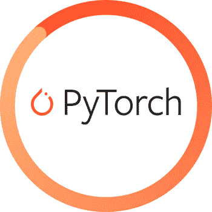
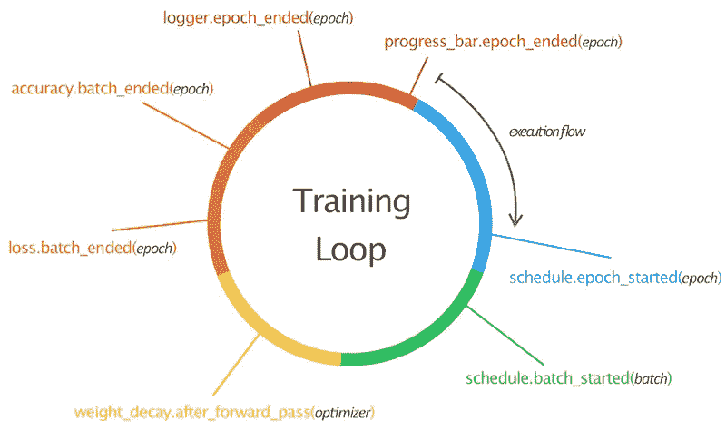
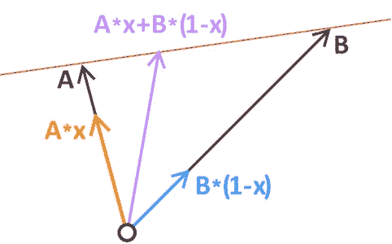
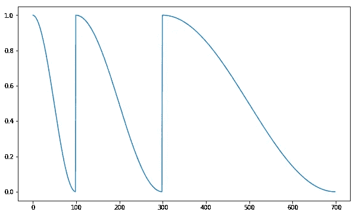
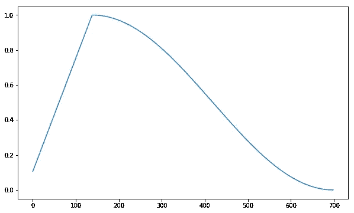

# 深度学习模型训练循环

> 原文：<https://towardsdatascience.com/deep-learning-model-training-loop-e41055a24b73?source=collection_archive---------8----------------------->

## 用 Python、PyTorch 和 TorchVision 实现一个简单的神经网络训练循环。

几个月前，我开始探索 py torch——一个奇妙且易于使用的深度学习框架。在[的上一篇文章](https://medium.com/@iliazaitsev/how-to-implement-a-recommendation-system-with-deep-learning-and-pytorch-2d40476590f9)中，我描述了如何使用 MovieLens 数据集实现一个简单的推荐系统。这一次，我想把重点放在对任何机器学习管道都至关重要的主题上——训练循环。

PyTorch 框架为您提供了构建机器学习模型的所有基本工具。它给你 CUDA 驱动的张量计算，优化器，神经网络层，等等。然而，要训练一个模型，你需要把所有这些东西组装成一个数据处理管道。

最近开发人员发布了 PyTorch 的 [1.0 版本](https://github.com/pytorch/pytorch/tree/v1.0.0)，已经有很多很棒的解决方案帮助你训练模型，而不需要钻研张量和层的基本操作。(在下一节中简要讨论)。然而，我相信每隔一段时间，大多数软件工程师都有一种“从零开始”实现东西的强烈愿望，以更好地理解底层过程，并获得不依赖于特定实现或高级库的技能。

在接下来的部分中，我将展示如何使用`torch`和`torchvision` Python 包实现一个简单但有用的训练循环。

> **TL；DR:** 请跟随[这个链接](https://github.com/devforfu/loop)直接进入资源库，在那里你可以找到这篇文章中讨论的源代码。此外，这里有一个到笔记本的链接，它包含了所有的实现，以及帖子中没有包含的其他信息，以使其简洁。



# 现成的解决方案

正如前面提到的，有一些构建在框架之上的高级包装器，它们极大地简化了模型训练过程。按照复杂性增加的顺序，从最简单到非常复杂:

1.  [Ignite](https://pytorch.org/ignite/)—py torch 的官方高级接口
2.  [torch sample](https://github.com/ncullen93/torchsample)——一个类似 Keras 的包装器，带有回调、增强和方便的实用程序
3.  Skorch —一个 scikit-learn 兼容的神经网络库
4.  [fastai](https://docs.fast.ai) —一个强大的端到端解决方案，以高精度和计算速度训练各种复杂性的深度学习模型

高级库的主要好处是，不用编写定制的实用程序和包装程序来读取和准备数据，人们可以专注于数据探索过程本身——不需要在代码中寻找错误，辛勤工作的维护人员可以改进库，并在您有问题时随时提供帮助。不需要实现定制的数据扩充工具或训练参数调度，一切都已经在这里。

如果您正在开发生产就绪的代码，或者参加数据科学竞赛并需要搜索最佳模型，而不是坐在调试器前试图找出这个内存错误的来源，那么使用维护良好的库无疑是一个选择。如果您正在学习新的主题，并且希望更快地获得一些工作解决方案，而不是花费许多天(或几周)来编写 ResNets 层和编写 SGD 优化器，情况也是如此。

然而，如果你像我一样，那么有一天你会想测试你的知识，用更少的抽象层来构建一些东西。如果是这样，让我们进入下一部分，开始重新发明轮子！

# 核心实现

训练循环的最基本实现并不困难。 **pytorch** 包已经包含了允许实例化数据集访问器和迭代器的便利类。所以本质上，我们需要做一些如下面代码片段所示的事情。

我们可以停止对这一部分的讨论，节省一些时间。然而，通常我们需要的不仅仅是简单的损失计算和更新模型权重。首先，我们希望使用各种性能指标来跟踪进展。第二，初始设置的优化器参数应该在训练过程中被调整以改善收敛性。

一种简单的方法是修改循环代码，使其包含所有这些附加特性。唯一的问题是，随着时间的推移，我们可能会因为添加越来越多的技巧而失去实现的清晰性，引入回归错误，并最终得到杂乱无章的代码。我们如何在代码的简单性和可维护性以及训练过程的效率之间找到一个折衷？

# 附加物

答案是使用[软件设计模式](https://en.wikipedia.org/wiki/Software_design_pattern)。观察者[是面向对象语言中众所周知的设计模式](http://www.gameprogrammingpatterns.com/observer.html)。它允许将一个复杂的系统分解成更容易维护的片段。我们不试图将所有可能的特性封装到一个类或函数中，而是将调用委托给从属模块。每个模块负责对收到的通知做出适当的反应。如果消息是发给其他人的，它也可以忽略通知。

该模式有不同的名称，反映了实现的各种特性:观察器、事件/信号调度器、回调。在我们的例子中，我们使用回调，这种方法在 **Keras** 和(特别是) **fastai** 库中有所体现。 **ignite** 包的作者采用的解决方案有点不同，但本质上，它归结为相同的想法。看看下面这张图。它显示了我们改进的训练循环的图解组织。



每个彩色部分是委托给回调组的一系列方法调用。每个回调都有类似`epoch_started`、`batch_started`等方法，通常只实现其中的几个。例如，考虑损失度量计算回调。它不关心向后传播之前运行的方法，但是一旦收到`batch_ended`通知，它就会计算一个批处理丢失。

下一个片段展示了这个想法的 Python 实现。

仅此而已，并不比原始版本复杂多少，对吗？它仍然干净简洁，但功能更多。现在训练算法的复杂度完全由委托调用决定。

# 回调示例

我们可以实现许多有用的回调(参见 [keras.io](https://keras.io/callbacks/) 和 [docs.fast.ai](https://docs.fast.ai/callbacks.html) 获取灵感)。为了保持文章的简洁，我们将只描述其中的几个，并将其余的几个移到 Jupyter 笔记本中。

## 失败

当谈论机器学习模型训练时，首先想到的是损失函数。我们用它来指导优化过程，并希望看到它在培训过程中如何变化。因此，让我们实现一个回调来跟踪这个指标。

在每一批结束时，我们计算一个运行损失。计算可能看起来有点复杂，但主要目的是平滑损失曲线，否则会很颠簸。公式`a*x + (1 — a)*y` 是新旧值之间的一个[线性插值](https://en.wikipedia.org/wiki/Linear_interpolation)。



Geometric interpretation of linear interpolation between vectors A and B

分母有助于我们计算开始时的偏差。查看[这篇文章](https://sgugger.github.io/how-do-you-find-a-good-learning-rate.html#in-practice)详细描述了平滑损失计算公式。

## 准确(性)

`accuracy`指标可能是机器学习中最著名的指标之一。虽然在很多情况下它不能给你一个好的模型质量评估，但是它非常直观，易于理解和实现。

请注意，回调在每批结束时以及训练时期结束时接收通知。它迭代地计算精度度量，因为否则，我们将需要在整个训练时期将输出和目标保存在存储器中。

由于我们计算的这种迭代性质，我们需要批量计算大量样本。我们使用该值在该时期结束时调整我们的计算。实际上，我们正在使用下图所示的公式。


其中 *b(i)* 是迭代 *i 时的批量大小，a(i) —* 根据批量 *b(i)* ， *N* 计算的准确度—样本总数。如最后一个公式所示，我们的代码计算出一个精确度的样本均值。查看这些有用的参考资料，了解有关迭代指标计算的更多信息:

1.  [指标作为来自 **fastai** 的回调](https://docs.fast.ai/metrics.html#Creating-your-own-metric)
2.  [准确度度量](https://pytorch.org/ignite/_modules/ignite/metrics/accuracy.html#Accuracy)来自**点火**包

## 参数调度程序

现在最有趣的事情来了。现代神经网络训练算法不使用固定的学习速率。最近的论文([一篇](https://arxiv.org/abs/1702.04283)、[两篇](https://arxiv.org/abs/1708.07120)和[三篇](https://arxiv.org/abs/1803.09820))显示了一种调整深度学习模型训练参数的受过教育的方法。其思想是使用循环调度器，在单个或几个训练时期调整模型的优化器参数幅度。此外，这些调度程序不仅会随着处理批次数量的增加而降低学习率，还会在一定数量的步骤内或周期性地增加学习率。

例如，考虑以下函数，它是经过缩放和移位的余弦函数:


Half-period of shifted and scaled cosine function

如果我们重复这个函数几次，使其周期加倍，我们将得到一个余弦退火调度程序，如下图所示。



Cosine annealing with restarts scheduler

将优化器的学习率乘以这个函数值，我们有效地获得了一个[随机梯度，它允许我们从局部极小值中逃脱。下面的片段显示了如何实现余弦退火学习率。](https://arxiv.org/pdf/1608.03983.pdf)

还有一个更令人兴奋的调度器，叫做单周期策略。该时间表的想法是在整个训练过程中使用*单周期*的学习率递增-递减*，如下图所示。*



One-cycle policy scheduler

在训练过程的最开始，模型权重不是最优的，因此我们可以允许自己使用更大的更新步长(即，更高的学习率)，而没有错过最优值的风险。经过几个训练时期后，权重变得越来越好，越来越适合我们的数据集，所以我们放慢了学习速度，更仔细地探索学习表面。

如果我们使用前面显示的类，单周期策略有一个非常简单的实现。我们只需要在余弦衰减之前添加一个线性段，如线`27-30`所示。

最后一步是用回调接口包装调度程序。为了使这篇文章简洁易读，这里没有给出实现的例子。然而，你可以在前面提到的[Jupyter 笔记本](https://github.com/devforfu/pytorch_playground/blob/master/loop.ipynb)中找到完整的功能代码。

## 流记录器

我们想添加的最后一件事是一些日志记录，以查看我们的模型在训练过程中的表现如何。最简单的方法是将统计数据打印到标准输出流中。然而，你可以把它保存成 CSV 文件，甚至[把它作为通知发送到你的手机](https://forums.fast.ai/t/training-metrics-as-notifications-on-mobile-using-callbacks/17330)。

好了，最后，我们准备开始使用我们的训练循环！

# 你最喜欢的数据集

现在，当试听准备就绪，是时候展示我们的训练循环是如何工作的了。为此，让我们选择无处不在的 MNIST 数据集。你甚至可以在几分钟内在 CPU 上轻松训练它。

数据集对于现代深度学习架构和算法来说非常简单。因此，我们可以使用相对较浅的架构，有几个卷积和线性层。

> 我们这里不使用迁移学习，但是你在日常工作中绝对应该使用。与从头开始的训练相比，它使你的网络收敛得更快。

接下来，我们使用`torchvision`包来简化数据集加载和迭代。此外，我们还应用了一些增强方法来提高模型的质量。然后，我们建立了一个回调组，它向我们的基本训练循环添加了一些特性。最后，我们做了一些小的准备工作，并调用训练函数来优化模型。

您应该会得到类似如下所示的输出。

```
Epoch:    1 | train_loss=0.8907, train_accuracy=0.6387, valid_loss=0.1027, valid_accuracy=0.9695Epoch:    2 | train_loss=0.4990, train_accuracy=0.8822, valid_loss=0.0828, valid_accuracy=0.9794Epoch:    3 | train_loss=0.3639, train_accuracy=0.9086, valid_loss=0.0723, valid_accuracy=0.9823
```

注意，上面显示的代码包括这里没有显示的`make_phases()` 功能。请参考[笔记本](https://github.com/devforfu/pytorch_playground/blob/master/loop.ipynb)查看其实现。本质上，它用瘦结构包装数据加载器，有助于在模型训练期间跟踪性能指标。

# 结论

深度学习工程师的最终目标是为特定的数据集和任务建立一个健壮而准确的解决方案。实现这一目标的最佳方式是使用世界各地的用户在许多用例中测试过的经过验证的工具和维护良好的框架和库。

然而，如果你想精通数据科学并最终构建你的定制解决方案，你可能“[应该了解 backprop](https://medium.com/@karpathy/yes-you-should-understand-backprop-e2f06eab496b) ”。充分了解您的工具使您能够根据您的特定需求定制它们，添加新功能并更快地学习新工具。

我相信，在使用经过验证的 API 和理解“低级”细节之间保持平衡，可以让你成为一名更好的工程师，可以轻松地将获得的知识转移到新的平台、语言和接口上。

*对 Python 语言感兴趣？离不开机器学习？看过网上的其他东西吗？*

*那么你可能会对我的博客* [*感兴趣，我的博客*](https://iliazaitsev.me/) *在这里我谈论了各种编程话题，并提供了我感兴趣的教科书和指南的链接。*