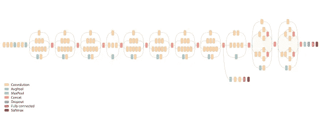
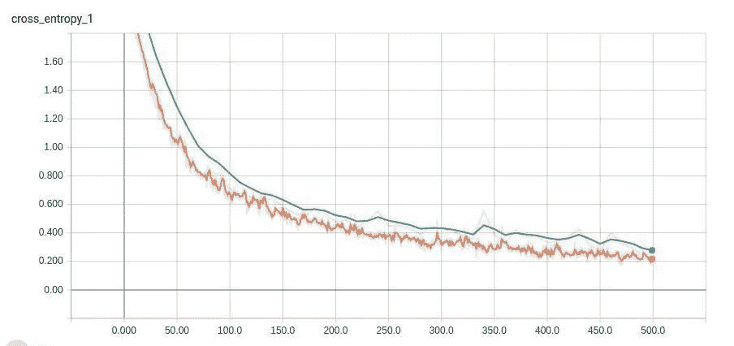
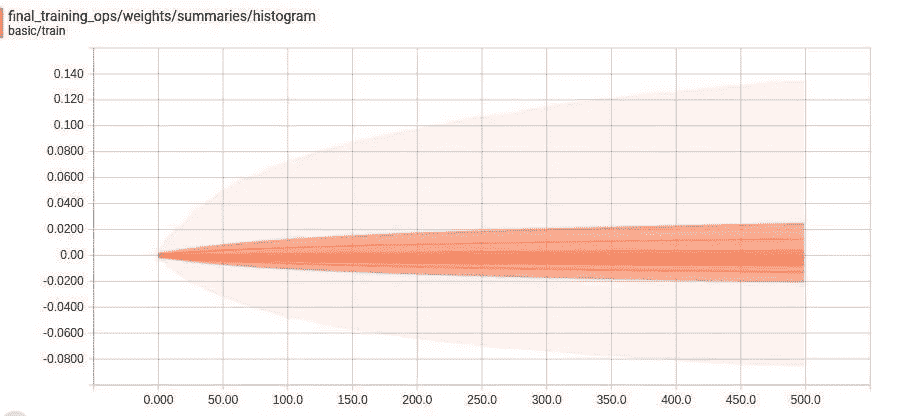
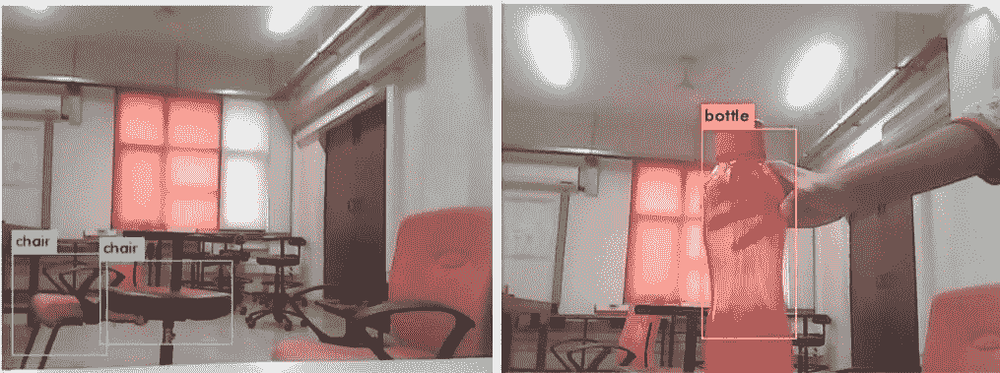
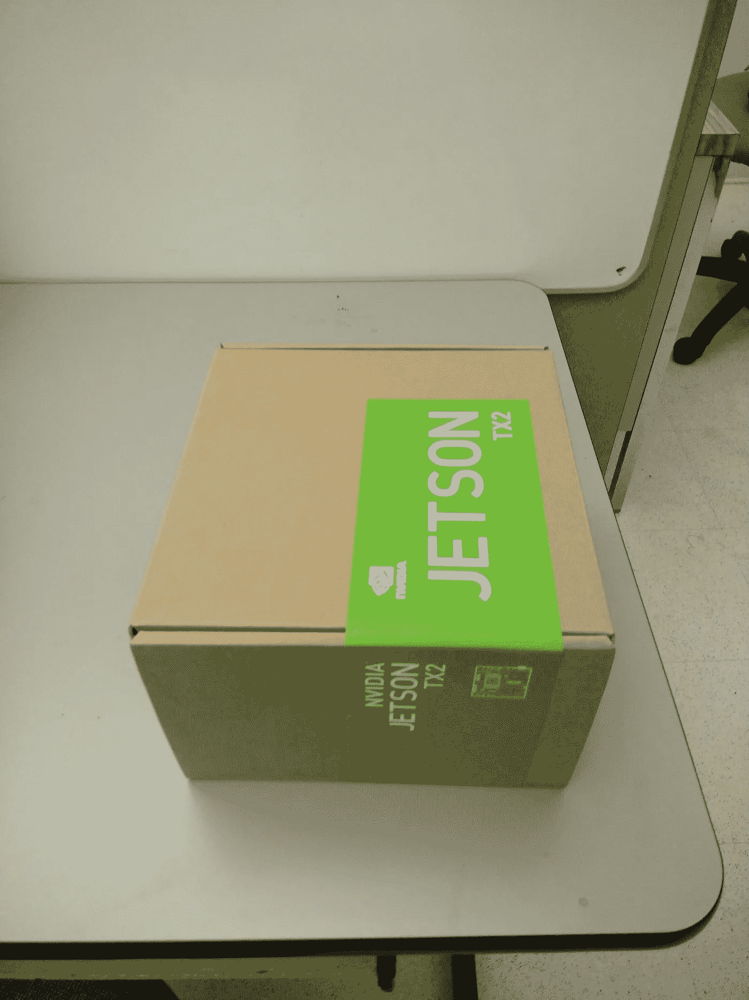

# 基于深度学习的自动驾驶车辆和高级驾驶员辅助系统的对象分类模型

> 原文：<https://towardsdatascience.com/deep-learning-object-classification-models-for-autonomous-vehicles-and-advanced-driver-assist-e4355802e684?source=collection_archive---------11----------------------->

基于 Python 的对象分类模型，使用 tensorflow 在自制数据集上进行训练，并部署在嵌入式计算平台上，用于向驾驶员实时传输数据

Figures: Artistic rendition of an autonomous vehicle’s object detection system versus our algorithm working in real-time

专用对象检测系统需要快速、准确，并且专用于对少数但相关数量的对象进行分类。我们的目标是集成一个系统，该系统利用 Inception 庞大的启发式映射图像预测树，以及一个实时系统，该系统足够精确和健壮，能够在各种处理能力下工作，并给用户足够的信心用单个帧识别和检测对象。由于这种特性可以在大量依赖实时检测的地方使用，它可能不仅限于驾驶辅助或自动驾驶系统，而是超出了本项目的范围。

为了提出一种新颖的数据集，该数据集将具有具有足够权重和多样性的图像树，以便以高准确度和精确度预测被识别的对象，该数据集被用来建立 softmax 层的初始状态，该初始状态先前被现有的 ImageNet 数据集加权。结果是令人信服的识别准确性和预测的信心与实时测试帧的视频。随着自动驾驶汽车的出现，人们也越来越担心行人的安全。这也已经使用实时单帧行人识别器以令人满意的准确度解决了。通过我们的算法，我们打算在这一领域做出重大贡献，因为我们提出了一种集成了物体检测和安全的驾驶员辅助系统，这有助于提高道路安全，并有助于满足车辆中自动和智能驾驶员辅助系统领域不断增长的需求。

Figure : How a basic deep neural network performs weight distribution and classification of images

Figure: Inception v3 architechture that is utilized here for training classifier

在我们的工作中，我们提出了一个算法，可用于创建一个智能驾驶辅助系统。该算法分两个阶段实现，以下部分将描述该算法每个阶段的实现。该项目还延伸到一个描述自主安全和监控系统的子部分，该系统包括一个用于识别车辆类型的车辆分类器，以及一个用于捕获和存储车辆注册号码的车牌识别系统。它还有一个部分专门描述我们的实时对象检测系统，该系统用于识别每个视频帧中常见的路上对象。

**之前的相关工作**

Figure : Accuracy performance of various object classification models

当前关于实时对象检测和跟踪的工作涉及使用传统的特征提取算法，如 SURF 和背景减法，以便识别运动对象。但是我们的算法使用了一个更有效的物体检测系统，名为 YOLO，它比 SURF 有明显的优势。SURF 是一种可变形零件模型(DPM ),因为它采用滑动窗口来执行对象检测。DPM 使用不相交的管道来提取特征、对区域进行分类以及预测高分区域的边界框等。使用 YOLO，这些不同的部分被执行特征提取、边界框预测等任务的单个卷积神经网络代替。，并发。这导致更快和更准确的对象检测系统。车辆检测和识别是一个重要的，但具有挑战性的任务，因为车辆图像是扭曲的，并受到多种因素的影响。几种车辆检测算法主要将任何车辆分类为汽车或其他。他们还采用传统的分类算法，如 SVM，并使用滑动窗口技术进行特征提取。一些研究人员还研究了使用正面车辆图像的车辆标志检测和识别，以获取将揭示车辆制造商的信息。但是这并不总是提供足够的功能来满足用户的需求。

Figure : New dataset of cars created in order to tune the max pooling layer weights of Inception v3 model

另一方面，我们的系统能够将任何车辆分为三类，即 SUV、轿车和小型车。这是通过创建印度道路上 750 幅车辆图像的数据集来实现的，这使得将该系统集成到现有车辆中变得更加简单。此外，我们的系统采用 CNN 进行分类，这使得它成为一个更快和更有效的系统。一些系统还采用雷达来执行目标检测。

然而，雷达也有自己的缺点。当大型车辆过于靠近雷达系统时，雷达接收器可能会饱和。此外，与计算机视觉算法相比，雷达系统速度较慢，因为它们最多需要 2 秒钟才能锁定。因此，我们的系统采用计算机视觉来检测和跟踪车辆。驾驶辅助系统在过去几年中获得了巨大的欢迎，这主要是由于谷歌和特斯拉等公司所做的出色工作。这些公司是电子自动驾驶汽车领域的主要贡献者，这些汽车采用计算机视觉技术进行物体检测、识别和跟踪，并采用激光雷达技术在低能见度条件下工作。

通过我们的算法，我们打算在这个新的和创新的研究领域做出重大贡献。我们的驾驶员辅助系统集成了用于自动驾驶功能的物体检测和用于改善道路安全的安全性。

Figure : Cross-entropy and weights output graphs versus epochs for the trained model

我们即将推出另一个部分，用一个集成了物体探测器的[自动车牌识别系统来扩展这个项目。正如我们在一些交通事故数据中研究的那样，这在紧急情况下可能是至关重要的。](https://ieeexplore.ieee.org/document/8299884/)

Figure : Number plate text recognition capabilities integrated with the program

如需了解更多信息，请随时前往关于自动驾驶汽车的链接[和更多有趣的项目](https://rajshekharmukherjee.wordpress.com/mybase/)以及同一项目的[github 回购。](https://github.com/rajshekharM/vehicle-classifier-and-pedestrian-tracker)

此外，训练目标识别模型并将其转移到 Raspberry-pi 模块，以利用远程目标检测。虽然 R-pi 响应不是实时的(大约 71 秒检测一帧中的对象)，但它可以通过更好的板载计算能力来提高。

Figure : YOLO v3 object detection system trained and deployed on a Raspberry-pi embedded module

该项目的另一个版本计划使用 NVIDIA Jetson tx2 嵌入式 GPU，以便在没有远程高级驾驶辅助系统所需的连接性的情况下具有边缘功能。

Getting to play with this cool thing for the upcoming projects on autonomous driving based on intelligent cameras and object detection !

此外，这是我的 youtube 教程视频，用于安装和启动带有外围设备和摄像头模块的 Nvidia Jetson tx2 套件:

希望你们喜欢并评论，你们的反馈很有价值！