# 深度学习；个人笔记第 1 部分第 2 课，学习率，数据扩充，退火，测试时间扩充

> 原文：<https://towardsdatascience.com/deep-learning-personal-notes-part-1-lesson-2-8946fe970b95?source=collection_archive---------15----------------------->

这个博客系列将会更新，因为我有第二次采取快速人工智能[的教训。这些是我的个人笔记，我努力把事情理解清楚并解释好。没什么新意，只活出了这个](http://www.fast.ai/) [*博客*](https://medium.com/@itsmuriuki/why-i-will-be-writing-about-machine-learning-and-deep-learning-57c68090f201) *。*

## 第一课复习

我们使用了三行代码来构建图像分类器:

`PATH` 下的数据组织包括一个 `train`文件夹和一个`valid`文件夹。每个文件夹下都有分类标签，即`cats`和`dogs`，其中有相应的图像。

训练输出:*`*epoch number*` *`*training loss*`*`*validation loss*`*`*accuracy*`****

```
***0      0.157528   0.228553   0.927593***
```

# ***选择一个好的学习率***

***学习速度决定了我们对解决方案的关注速度。这涉及到寻找一个可能有许多参数的函数的最小值。***

******

***我们从一个随机的点开始，然后找到梯度来决定哪条路是向上或向下的。我们到达最小值的距离与梯度成正比；如果更陡，我们就离得更远。我们在一个点选择一个梯度，然后乘以一个数。(学习率/步)。***

***如果学习率太小，就需要非常长的时间才能触底。如果学习率太大，它可能会远离底部振荡。如果训练一个神经网络，你发现损失或准确性正加速到无穷大，学习率太高。***

***我们使用学习率查找器(`learn.lr_find`)来查找合适的学习率。每次小批量(即我们有效利用 GPU 的并行处理能力时，每次查看多少张图像，通常一次查看`64`或`128`张图像)。我们逐渐成倍地增加学习率，最终学习率会太大，损失会开始变得更严重。***

***我们绘制学习率与损失的关系图来确定最低点。然后，我们回溯一个数量级，并选择该数量级作为我们的学习率，因为这是损失减少的地方`0.01`。***

******

***python 中的数学符号***

******

***学习率是要设置的关键数字。*快速人工智能为您挑选其余的超级参数。为了获得稍微好一点的结果，我们还可以做更多的调整。****

**这种学习率查找技术是基于 Adam optimiser 之上的。动量和 Adam 是改进梯度下降的其他方法。**

**要让模型变得更好，你能做的最重要的事情就是给它更多的数据。由于这些模型有数百万个参数，如果你训练它们一段时间，它们就开始“过度拟合”。**

**过度拟合—模型开始看到训练集中图像的特定细节，而不是学习可以转移到验证集的一般信息。**

**我们可以收集更多的数据或者使用**数据扩充**。**

# **数据扩充**

**这指的是以不影响图像解读的方式随机改变图像。例如水平翻转、缩放和旋转。**

****

**我们可以通过将`aug_tfms` ( *增强变换*)传递给`tfms_from_model`来做到这一点，其中带有一个函数列表，以便按照我们希望的方式将随机变化应用于图像。对于大部分从侧面拍摄的照片(例如，大多数狗和猫的照片，而不是从上到下拍摄的照片，如卫星图像)，我们可以使用预定义的功能列表，如`transforms_side_on`。我们还可以通过添加`max_zoom`参数来指定图像的随机缩放比例。**

**你构建一个数据类 6 次，每次你画的都是同一只猫。我们来看一些数据增强的猫图。**

**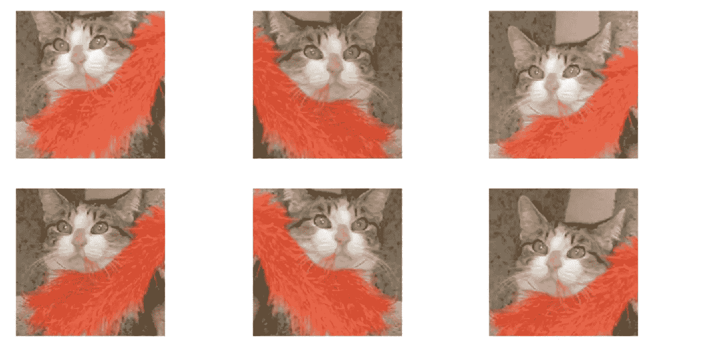**

**场景:**

**您希望对不同类型的图像使用不同类型的数据增强(水平翻转、垂直翻转、放大、缩小、改变对比度和亮度等等)。例如，您想要识别不想水平翻转的字母和数字，因为它们有不同的含义。你不希望猫和狗垂直翻转，因为图像大多是垂直的。对于卫星图像中的冰山，你可能想把它们翻转过来，因为拍摄图像时卫星是哪一边并不重要。**

**`transfrom side_on` —用于从侧面拍摄的图像，轻微改变照片缩放比例，轻微旋转照片，并改变对比度和亮度。**

**它并不完全是在创建新数据，而是允许卷积神经网络学习如何从不同角度识别猫或狗。**

**`tsf` —包含数据扩充。**

**`data`对象包括增强。最初，增强并不做任何事情，因为`precompute=True`**

****

**在上面的图片中，每个不同的层都有这样的激活，寻找任何像花的中间或鸟的眼球(用红色圈出)等。这个卷积神经网络的后面几层具有激活(数字),例如在上面的图片中指定了鸟的眼球的位置和置信度(概率)。**

**我们有预先训练的网络，已经学会识别特征(某些类型的东西，如梯度，边缘圆等)。我们采用倒数第二层，这一层包含了识别这些特定事物的所有必要信息，例如“眼珠子”、“毛绒绒的认真程度”等。我们为每个图像保存激活，称之为预先计算的激活。然后，我们可以创建一个新的分类器，利用这个预先计算的激活。我们可以基于预先计算的激活快速训练简单的线性模型。这就是`precompute=True`的意思。**

**这就是为什么当您第一次训练您的模型时，它需要更长的时间-它是预先计算这些激活。**

**尽管我们每次都尝试展示不同版本的猫，但我们已经预先计算了特定版本猫的激活量，也就是说，我们不会用修改后的版本重新计算激活量。当`precompute=True`数据增强不起作用时。我们必须将它设置为`learn.precompute=False`,数据扩充才能工作。**

****

**坏消息是`accuracy`没有改善，好消息是训练损失(`trn_loss`)，一种衡量该模型误差是否变好的方法，正在减少。验证误差(`val_loss`)没有减少，但是我们没有过度拟合。*过度拟合意味着训练损失远低于验证损失。*换句话说，当你的模型在训练集上比在验证集上表现得更好时，这意味着你的模型没有泛化。**

## ****循环长度参数。这是什么？****

**`cycle_len=1`这使 S **能够以重启(SGDR)** 的方式快速梯度下降。基本的想法是，当你越来越接近损失最小的点时，你可能想要开始降低学习速率(采取较小的步骤)以便精确地到达正确的点。在训练时降低学习率的想法被称为**学习率退火。**这很有帮助，因为随着我们越来越接近最佳重量，我们希望迈出更小的步伐。**

****逐步退火**——你用一定的学习率训练一个模型一段时间，当它停止提高时，手动下拉学习率。选择另一个学习率，手动重复这个过程。**

**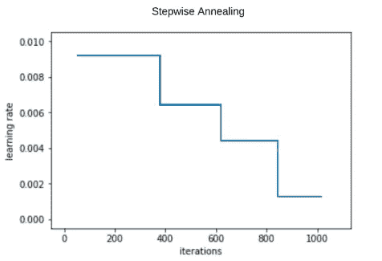**

****余弦退火**——这是一种更好的方法，只需选择某种函数形式——事实证明，真正好的函数形式是余弦曲线的一半，它在开始时以很高的学习速率开始，然后当你更接近时迅速下降。**

**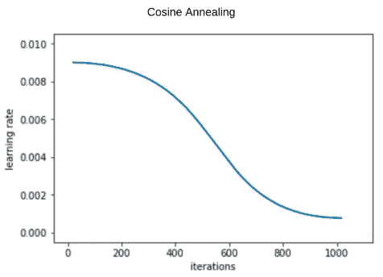**

**在训练期间，梯度下降有可能卡在局部最小值而不是全局最小值。**

**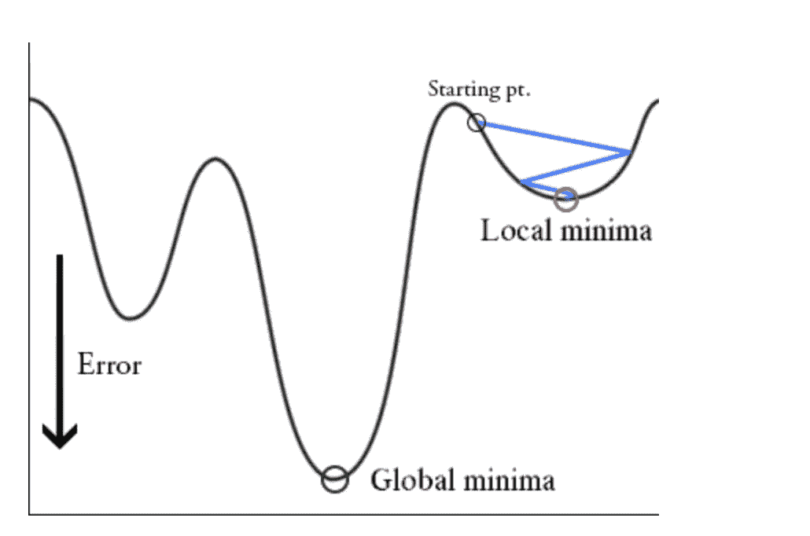**

**在局部最小值处，损失更严重，并且对于稍微不同的数据集，它不会一般化。在全局最小值时，模型将更好地概括。**

## **请注意，退火不一定与重启相同**

**我们不是每次都从零开始，但我们会“跳跃”一点，以确保我们处于最佳状态。**

**然而，我们可能会发现自己处于一个弹性不大的重量空间，即重量的小变化可能会导致损失的大变化。我们希望鼓励我们的模型找到既准确又稳定的权重空间部分。因此，我们不时地增加学习速率(这是“SGDR”中的“重启”)，如果当前区域是“尖峰”，这将迫使模型跳到权重空间的不同部分。这是一张图片，展示了如果我们将学习率重置 3 次(在这篇[文章](https://arxiv.org/pdf/1704.00109.pdf)中，他们称之为“循环 LR 时间表”):**

**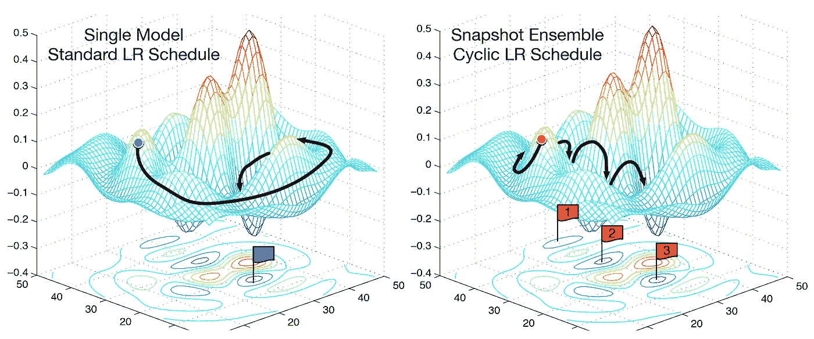**

**通过突然增加学习速率，梯度下降可以跳出局部极小值并找到通向全局极小值的路。这样做被称为带重启的随机梯度下降(SGDR)，这个想法在这篇[论文](https://arxiv.org/pdf/1608.03983.pdf)中被证明是非常有效的。**

**重置学习率之间的周期数由`cycle_len`设置，这种情况发生的次数称为*周期数*，实际上是我们作为第二个参数传递给`fit()`的。这是我们实际学习率的样子:**

****

**The learning rate is restored to its original value after each epoch.**

**学习率在每个时段开始时被重置为您作为参数输入的原始值，然后在该时段内再次降低，如上文余弦退火中所述。**

**每次学习率下降到它的最低点(上图中每 100 次迭代)，我们称之为一个**周期**。**

***使用随机起点可以得到同样的效果吗？在 SGDR 诞生之前，人们习惯于创造“群体”,他们会重新学习一个全新的模型十次，希望其中一个会变得更好。在 SGDR，一旦我们足够接近最佳和稳定的区域，重置实际上不会“重置”，但权重会变得更好。所以 SGDR 会给你更好的结果，而不仅仅是随机尝试几个不同的起点。***

**我们选择最高的学习速率`1e-2 (0.01)`供 SGD 使用。我们改变每一个小批量的学习率。我们重置它的次数由`cycle_len=1`参数定义。`1`意思是每隔一个纪元就重置一次。**

**我们的主要目标是一般化，而不是在狭窄的最优中结束。在这种方法中，我们是否跟踪最小值，对它们进行平均和组合？我们目前没有这样做，但如果你想让它更好地概括，你可以在重置前保存权重并取平均值。但是现在，我们只选择最后一个。(在 1000 次迭代时)**

**您可以添加一个名为`cycle_save_name`的参数以及`cycle_len`，它将在每个学习率周期结束时保存一组权重，然后您可以集成它们。**

**我们的确认损失没有多大改善。因此，可能没有必要单独进一步训练最后一层。**

## ****保存并加载模型****

****

**不时保存你的权重调用`learn.save`并传递文件名`224_lastlayer`**

**预计算的激活和调整大小的图像保存在 tmp 文件的数据文件夹中。删除 tmp 文件夹相当于打开和关闭**

**调用`learn.save`时，模型保存在模型文件夹中**

***如果您想从头开始重新培训一名模特，该怎么办？*通常没有理由删除预先计算的激活，因为预先计算的激活没有任何训练。**

# **微调和差分学习率退火**

**到目前为止，我们所做的一切都没有改变预先训练的过滤器。我们使用了一个预先训练好的模型，它知道如何找到边缘和渐变(第 1 层)、拐角和曲线(第 2 层)，然后是重复的伙伴、文本(第 3 层)，最后是眼球(第 4 层和第 5 层)。我们没有在卷积核中重新训练任何更具体的激活权重。我们所做的只是在顶部添加了一些新层，并学习了如何混合和匹配预先训练的功能。**

**与 ImageNet 图像相比，卫星图像、CT 扫描等图像具有完全不同的特征。所以你需要重新训练很多层。对于狗和猫，图像与模型预先训练的图像相似，但我们仍然会发现稍微调整一些后面的层是有帮助的。**

**既然我们已经训练了一个好的最终层，我们可以尝试微调其他层。要告诉学习者我们想要解冻剩余的层，只需调用`unfreeze()`。这告诉学习者我们想要开始改变卷积滤波器。**

```
**learn.unfreeze()**
```

***冻结层是指未被训练的层，即未被更新的层。***

**`unfreeze()` 解冻所有层。**

**检测边缘和梯度的第一层和检测曲线和拐角的第二层不需要太多的学习，它们不需要太多的改变。而更后面的层需要改变。当训练其他图像识别时，这是普遍适用的。**

**我们所做的是创建一个学习率数组。**

```
**lr=np.array([1e-4,1e-3,1e-2])**
```

**早期的层(如我们所见)有更多的通用特性。因此，我们预计他们对新数据集的微调需求会减少。出于这个原因，我们将对不同的层使用不同的学习速率:最初的几层将在`1e-4`用于基本几何特征和最接近像素的层，中间层在`1e-3`用于中间复杂的卷积层，而`1e-2`如前所述用于我们添加在顶部的层(完全连接的层)。我们称之为 ***差异学习率*，**，尽管据我们所知，在文献中没有这种技术的标准名称。**

**为什么是 3？实际上它们是 3 个 ResNet 块，但是现在，把它想象成一组层。**

***差分学习率与* [*网格搜索*](https://en.wikipedia.org/wiki/Hyperparameter_optimization#Grid_search) *有何不同？*与网格搜索没有相似之处。网格搜索是您试图找到最佳超参数的地方。对于不同的学习率，它尝试了许多学习率，试图找到最好的学习率。对于整个训练，它对每一层使用不同的学习率。**

***如果我的图像比模型训练的大怎么办？有了这个图书馆和我们正在使用的现代建筑，我们可以使用任何我们喜欢的大小。***

***我们可以只解冻特定的层吗？*我们还没有这样做，但是如果你愿意，你可以做`learn.unfreeze_to(n)`来解冻从层`n`开始的层。它几乎从来没有帮助，因为使用不同的学习率，优化器可以学习它所需要的。如果你使用一个非常大的内存密集型模型，如果你用完了 GPU，解冻的层数越少，占用的内存和时间就越少。**

**注意；您不能解冻一个特定的层。**

**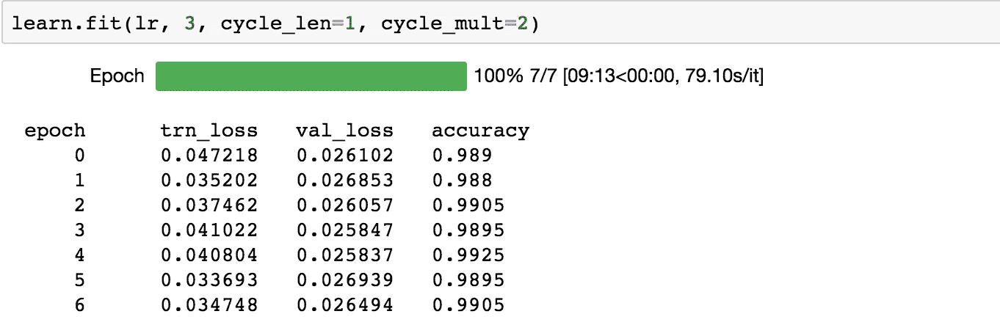**

**前面我们说`3`是历元数，但实际上是**个周期**。在这种情况下，学习是做`1`纪元的`3`周期。(`cycle_len=1`)**

**如果`cycle_len=2`，它将做 3 个循环，其中每个循环是 2 个时期(即 6 个时期)。**

***那它为什么做了 7 个纪元？*这是因为`cycle_mult`使得每个周期的长度加倍。(1 个历元+ 2 个历元+ 4 个历元= 7 个历元)。**

**使用差分学习率，我们有一个 99.05%准确的模型。**

****

**如果循环长度太短，它开始向下寻找一个好点，然后弹出，再向下寻找一个好点，然后弹出，如此循环，这样它就永远找不到一个好点。早些时候，你希望它这样做，因为它试图找到一个更光滑的地方，但后来，你希望它做更多的探索。这就是为什么`cycle_mult=2`似乎是一个好方法。**

**我们正在引入越来越多的超参数，已经告诉过你们并不多。你可以选择一个好的学习速度，但是增加这些额外的调整可以帮助你不费吹灰之力就达到额外的水平。一般来说，好的起点是:**

*   **`n_cycle=3, cycle_len=1, cycle_mult=2`**
*   **`n_cycle=3, cycle_len=2`(无`cycle_mult`)**

**为什么更平滑的表面与更一般化的网络相关联？**

**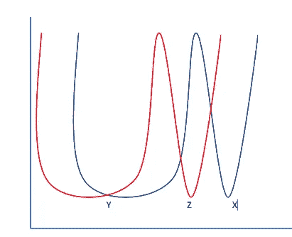**

**x 轴显示了当你改变这个特定的参数时，识别狗和猫的能力有多强。一般化意味着当我们给它一个稍微不同的数据集时，我们希望它能够工作。稍有不同的数据集在该参数和它有多像猫和多像狗之间可能具有稍有不同的关系。相反，它可能看起来像红线。换句话说，如果我们在`X or Z`结束，那么它不会在这个稍微不同的数据集上做得很好。否则，如果我们在`Y,`结束，它仍然会在红色数据集上做得很好。**

## **让我们来看看我们预测错误的图片**

****

**当我们做验证集时，我们对模型的所有输入必须是正方形的。如果不同的图像有不同的尺寸，GPU 不会运行得很快。它需要保持一致，以便 GPU 的每个部分都可以做相同的事情。**

**为了使它成为正方形，我们只需挑出中间的正方形，正如您在下面看到的，可以理解为什么这张图片被错误地分类。**

**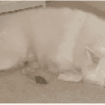**

**The dogs head was not identified**

**我们将使用**测试时间增强(TTA)** 或**推理时间**或**测试时间**它不仅对您的验证集中的图像进行预测，还对它们的许多随机增强版本进行预测(默认情况下，它使用原始图像以及 4 个随机增强版本，假设它们四处移动)。然后，它从这些图像中提取平均预测，并将其用作我们的最终预测。要在验证集上使用 TTA，我们可以使用学习者的`TTA()`方法。**

****

**准确率提高到 99.25%。神经网络得到同一张图片的多个参数，使准确率上升。**

*****注****；TTA 用于验证/测试设置。训练时，我们不做 TTA。***

***为什么不加边框或者填充，让它变成方形？*对神经网络没有太大帮助，因为猫的形象没有变化。**变焦**可以工作。**反射填充**通过在外部添加边框来反射图像，使图像变大，适用于卫星图像。一般来说，使用 TTA 加数据增强，最好的办法是尽量使用大图像。如果你裁剪，你会失去例如狗的脸。**

***非图像数据集的数据扩充？似乎没有人知道。这似乎会有所帮助，但很少有例子。例如，在自然语言处理中，人们试图替换同义词，但总的来说，这个领域还没有得到充分的研究和开发。***

***我们可以使用滑动窗口生成其他图像吗？例如，从一张狗的图片生成 3 个图像部分？对于训练来说，这不会更好，因为我们不会得到更好的变化，因为你有三种标准的方法来查看数据。你想给它尽可能多的方法来查看数据。固定的作物位置加上随机的对比度、亮度、旋转变化可能对 TTA 更好。***

## **分析结果**

## ****混淆矩阵****

**评估分类算法的快速方法是使用[混淆矩阵](https://www.dataschool.io/simple-guide-to-confusion-matrix-terminology/)。它有助于确定你对哪一组分类有困难。**

```
**preds = np.argmax(probs, axis=1)
probs = probs[:,1]**from** **sklearn.metrics** **import** confusion_matrix
cm = confusion_matrix(y, preds)plot_confusion_matrix(cm, data.classes)**
```

**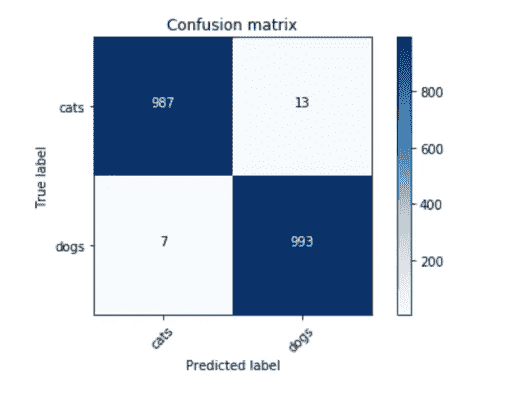**

**我们有 987 只预测正确的猫和 13 只预测错误的猫。993 只狗我们预测对了，7 只我们预测错了。**

# **训练世界级图像分类器的步骤**

1.  **启用数据增强(`side_on`或`top_down`取决于您在做什么)，以及`precompute=True`**
2.  **使用`lr_find()`找到损失仍在明显改善的最高学习率。**
3.  **从预计算的激活中训练最后一层，持续 1-2 个时期。**
4.  **关闭预计算(`precompute=False`)，这允许我们使用`cycle_len=1`对 2-3 个时期进行数据扩充**
5.  **解冻所有层。**
6.  **将前几层的学习速率设置为下一层的 3-10 倍。经验法则:对于预先训练的 ImageNet 类图像为 10 倍，对于卫星或医学成像为 3 倍。**
7.  **再次使用`lr_find()`(注意:如果你调用`lr_find`已经设置了不同的学习率，它会打印出最后一层的学习率。)**
8.  **用`cycle_mult=2`训练全网，直到过拟合。**

## **让我们再做一次**

**这个[挑战](https://www.kaggle.com/c/dog-breed-identification)是确定图像中狗的品种。**

**使用 [kaggle CLI](https://github.com/floydwch/kaggle-cli) 下载数据。*是一个非官方的 kaggle 命令行工具*。在使用云虚拟机实例(如 AWS 或 paperspace)下载数据时非常有用。在使用 CLI 之前，请先单击下载按钮，确保您接受竞赛规则。如果您的帐户与另一个帐户连接登录，您必须忘记您的密码，并选择第三个选项来设置新密码和链接您的两个帐户。**

```
**$ kg download -u <username> -p <password> -c dog-breed-identification -f <name of file>**
```

**其中`dog-breed-identification`是比赛名称，你可以在比赛 URL 的末尾 `/c/` 部分`[https://www.kaggle.com/c/dog-breed-identification](https://www.kaggle.com/c/dog-breed-identification)` 后找到比赛名称。**

**下面是实际的命令；**

```
**$ kg download -u gerald -p mypassword -c dog-breed-identification**
```

**文件下载完成后，我们可以使用以下命令提取文件。**

```
**#To extract .7z files
7z x -so <file_name>.7z | tar xf -#To extract.zip files
unzip <file_name>.zip**
```

**dogbreeds 文件夹的结构**

****

**这与我们之前的数据集不同。不同于`train`文件夹，每种狗都有一个单独的文件夹，它有一个带有正确标签的 CSV 文件。**

**进口货**

```
**from fastai.imports import *
from fastai.torch_imports import *
from fastai.transforms import *
from fastai.conv_learner import *
from fastai.model import *
from fastai.dataset import *
from fastai.sgdr import *
from fastai.plots import *PATH = "data/dogbreeds/"
sz = 224
arch = resnext101_64
bs = 58**
```

**我们将阅读熊猫的 CSV 文件。用于进行结构化数据分析。**

```
**label_csv = f'{PATH}labels.csv'
n = len(list(open(label_csv))) - 1 # header is not counted (-1)
val_idxs = get_cv_idxs(n) # random 20% data for validation setn 
10222val_idxs
array([2882, 4514, 7717, ..., 8922, 6774,   37])len(val_idxs) #20% of 10222
2044**
```

**`n = len(list(open(label_csv)))-1`:打开 CSV 文件，创建一个行列表，然后取长度。`-1`因为第一行是表头。因此`n`是我们拥有的图像/行数。**

**`val_idxs = **get_cv_idxs**(n)`:“获取交叉验证索引”——默认情况下，这将返回随机 20%的行(索引)作为验证集。您也可以发送`val_pct`来获得特定的百分比，例如`val_idxs = get_cv_idxs(n, val_pct=1.0)`获得 100%，但默认为 20%。**

****

**这包括图像名称或 id 和标签。**

**下面是一个熊猫的框架来分组不同品种的狗的数量。**

****

**有 120 排代表 120 个品种。**

## **经历这些步骤；**

```
**tfms = tfms_from_model(arch, sz, aug_tfms=transforms_side_on, max_zoom=1.1)
data = ImageClassifierData.from_csv(PATH, 'train', f'{PATH}labels.csv', test_name='test', # we need to specify where the test set is if you want to submit to Kaggle competitions
                                   val_idxs=val_idxs, suffix='.jpg', tfms=tfms, bs=bs)**
```

**支持数据扩充；**

```
**tfms = tfms_from_model(arch, sz, aug_tfms=transforms_side_on, max_zoom=1.1)**
```

**调用`tfms_from_model`并通过`aug_tfms=transforms_side_on`大概有一面在拍照。**

**`max_zoom` —我们将以 1.1 倍放大图像**

```
**data = ImageClassifierData.from_csv(PATH, 'train', f'{PATH}labels.csv', test_name='test', val_idxs=val_idxs, suffix='.jpg', tfms=tfms, bs=bs)**
```

**`ImageClassifierData.from_csv` —上一次，我们使用了`from_paths`(它表示文件夹的名称是标签的名称)，但是由于标签在 CSV 文件中，我们将改为调用`from_csv`并调用包含标签的`f’{PATH}labels.csv` csv 文件。`PATH`是包含所有数据的文件夹，`train`是包含训练数据的文件夹。`test_name`指定测试集在哪里，如果你稍后提交给 Kaggle 的话。**

**`val_idx` —没有`validation`文件夹，但我们仍想跟踪我们在本地的表现有多好。分离出图像并将其放入验证集中。**

**`suffix=’.jpg’` —文件名末尾有`.jpg`，但 CSV 文件没有。因此，我们将设置`suffix`,让它知道完整的文件名。**

**使用包含文件名的`trn_ds`获取数据对象中的训练数据集。下面是一个文件名`(fnames)`的例子。**

****

```
**img = PIL.Image.open(fn); img**
```

****

**我们需要检查图像的大小。然后我们需要知道如何根据它们是太大还是太小来处理它们。大多数 ImageNet 模型都是通过`224`对`224`或`299`图像对`299`进行训练的。**

**创建字典理解；**

```
**size_d = {k: PIL.Image.open(PATH + k).size for k in data.trn_ds.fnames}**
```

**浏览所有文件并创建一个字典，将文件名映射到文件的大小。**

```
**row_sz, col_sz = list(zip(*size_d.values()))**
```

**获取字典并将其转换为行和列。然后将它们转换成 numpy 数组，如下所示:**

```
**row_sz = np.array(row_sz); col_sz = np.array(col_sz)**
```

**以下是前五种行大小:**

```
**row_sz[:5]
array([500, 500, 500, 500, 500])**
```

**用 matplotlib 绘图。图像和像素数量:**

****

**从直方图来看，大多数图像都在`500` 像素左右。**

**在图上绘制那些小于 1000 像素的像素以放大:**

**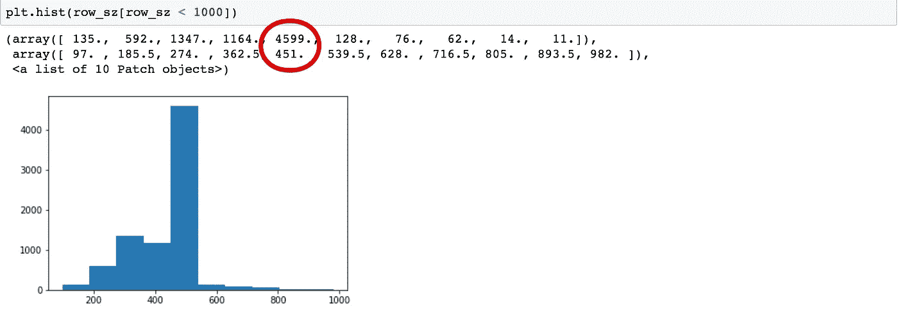**

**`4599`图像位于`451 pixels.`内**

***验证集中应该有多少幅图像？*验证集的大小取决于数据集的大小。不应该总是 20%。如果多次训练同一个模型，并且得到非常不同的验证集结果，那么您的验证集太小了。**

**狗的形象似乎在中心，占据了画面的最大部分。因此，我们不需要裁剪，这对于医学成像来说是不同的，因为有时肿瘤可能在帧的一侧，因此需要缩放。**

# ****初始模型****

****

**下面是常规的两行代码。当我们开始处理新数据集时，我们希望一切都超快。所以我们可以指定大小，从运行速度快的 64 开始。稍后，我们将使用更大的图像和更大的架构，在这一点上，你可能会耗尽 GPU 内存。*如果您看到 CUDA 内存不足错误，您需要做的第一件事是重启内核，然后减小批处理大小。***

## **预计算**

**我们将使用预先计算的分类器。**

**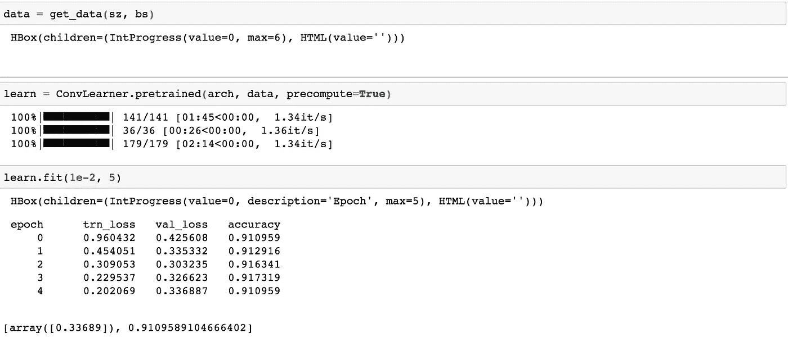**

**对于 120 个类别，我们获得了 91%的准确率。没有数据增加或解冻。**

**让我们关闭预计算，再来几个纪元。**

****

**准确率提高到 92%。**

**一个`epoch`是一次通过数据，一个`cycle`是你说的一个周期中有多少个历元。这是学习率从你要求的下降到零。在这种情况下，从`cycle_len=1`开始，时期和周期是相同的。**

**让我们节约**

```
**learn.save(‘224_pre’)
learn.load(‘224_pre’)**
```

## **增加图像尺寸**

**如果您在较小尺寸的图像上训练了模型，那么您可以调用`learn.set_data`并传入较大尺寸的数据集。这将采取你的模型，但是它已经训练到目前为止，它将让你继续在更大的图像上训练。**

```
**learn.set_data(get_data(299, bs))
learn.freeze()**
```

**开始在小图像上训练几个时期，然后切换到更大的图像，继续训练是避免过度拟合的惊人有效的方法。**

**`set_data`完全不改变模式。它只是给了它新的数据来训练。**

****

**验证损失`(0.239)`远低于培训损失`(0.297)`。这是 ***欠拟合*** 的标志。`Cycle_len=1`可能太短了。学习率在有机会放大之前就被重置了。**

**再加上`cycle_mult=2`(即第一周期为 1 个历元，第二周期为 2 个历元，第三周期为 4 个历元= 7 个历元)**

****

**验证损失和训练损失越来越接近，越来越小，几乎相同。暗示我们在正确的轨道上。**

****测试时间增加(TTA)****

****

**要尝试的其他事情:**

*   **运行两个时期的另一个循环**
*   **解冻；在这种情况下，训练卷积层没有丝毫帮助，因为图像实际上来自 ImageNet。**
*   **删除验证集，重新运行相同的步骤，然后提交。这让我们可以使用 100%的数据。**

***我们如何处理不平衡的数据集？*这个数据集并不是完全平衡的，每个类别(即品种)有 60 到 100 张图片，但还没有不平衡到让你三思的地步。最近的一篇论文称，处理非常不平衡的数据集的最好方法是复制罕见的案例。**

***`*precompute=True*`*`*unfreeze*`*的区别？*****

**我们从一个预先训练好的网络开始，这个网络通过丰富的功能来发现激活。我们在它的末端添加了几层，开始是随机的。随着一切冻结和`precompute=True`，我们正在学习的是我们已经添加的层。使用`precompute=True`，我们实际上预先计算了图像看起来有多像激活，因此数据增强没有做任何事情，因为我们每次都显示完全相同的激活。**

**然后我们设置`precompute=False`，这意味着我们仍然只训练我们添加的最后一层，因为它是冻结的，但数据增强现在正在工作，因为它实际上正在从头开始经历和重新计算所有的激活。最后，我们解除冻结，这意味着“好了，现在您可以开始更改所有这些早期的卷积滤波器”。**

**为什么不一开始就设定`precompute=False`？拥有`precompute=True`的唯一原因是它快了 10 倍甚至更多。如果您正在处理一个相当大的数据集，它可以节省相当多的时间。使用`precompute=True`没有任何准确性理由**

## **能给你带来好结果的最低版本；**

1.  **使用`lr_find()`找到损失仍在明显改善的最高学习率。**
2.  **使用`cycle_len=1`对最后一层进行 2-3 个时期的数据扩充(即 `precompute=False`)训练(默认情况下，一切从一开始就被冻结)**
3.  **解冻所有层。**
4.  **将前几层的学习速率设置为下一层的 3-10 倍。(使用不同的学习率)**
5.  **用`cycle_mult=2`训练全网，直到过拟合。**

***减少批量只影响训练速度吗？*是的，如果你每次显示的图像越少，那么它计算梯度的图像就越少，因此也就越不准确。换句话说，知道朝哪个方向走以及朝那个方向走多远就不那么准确了。所以当你把批量变小的时候，你会让它变得更加不稳定。它会影响您需要使用的最佳学习速率，但在实践中，将批量大小除以 2 比 4 似乎不会改变太多。如果批量大小发生了很大变化，您可以重新运行学习率查找器来检查它是否发生了变化。**

***如果狗跑到角落或者很小，你会怎么做？这将在第 2 部分中讨论，但是有一种技术可以让你大致判断出图像的哪些部分最有可能包含有趣的东西。然后你可以把那部分剪掉。***

## **进一步的改进**

1.  **假设您正在使用的图像的大小小于您得到的图像的平均大小，您可以增加图像的大小。正如我们之前看到的，你可以在训练中增加它。**
2.  **使用更好的架构。有不同的方法来组合卷积滤波器的尺寸以及它们之间的连接方式。不同的架构具有不同的层数、内核大小、过滤器数量等。**

**我们使用 ResNet34，它没有太多的参数，适合小数据集。与 ResNet34 相比，ResNext50 需要两倍的时间和 2-4 倍的内存。**

**我遇到了`RuntimeError: cuda runtime error (2) : out of memory.`尝试重启你的内核，使用较小的批量，我用了`10`**

**使用 ResNext50 达到了 99.65%的准确率。**

**感谢阅读！*跟随*[*@ itsmuriuki*](https://twitter.com/itsmuriuki)*。***

**回归学习！**