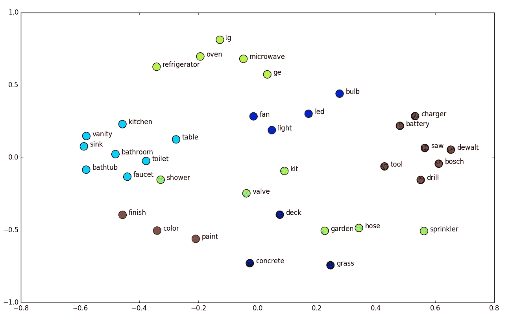
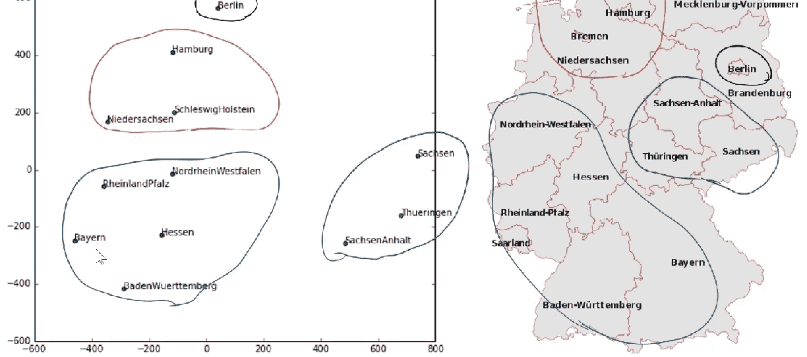

# 对具有实体嵌入的结构化数据使用深度学习

> 原文：<https://towardsdatascience.com/deep-learning-structured-data-8d6a278f3088?source=collection_archive---------0----------------------->

说明深度学习可以处理结构化数据，以及如何处理。


The idea of embeddings comes from learning them on words in NLP (word2vec), image taken from Aylien

在这篇博客中，我们将触及机器学习中两个反复出现的问题:第一个问题围绕着深度学习如何在图像和文本上表现良好，但我们如何在我们的表格数据上使用它？其次，在建立机器学习模型时，你必须经常问自己一个问题:我如何处理这个数据集中的分类变量？令人惊讶的是，我们可以用同一个答案来回答这两个问题:实体嵌入。

最近，深度学习在许多方面都超过了其他机器学习方法:图像识别、音频分类和自然语言处理只是许多例子中的一部分。这些研究领域都使用所谓的“非结构化数据”，即没有预定义结构的数据。一般来说，这些数据也可以被组织成一个序列(像素、用户行为、文本)。深度学习已经成为处理非结构化数据的标准。最近出现了深度学习是否也能在结构化数据上表现最好的问题。结构化数据是以表格格式组织的数据，其中列代表不同的要素，行代表不同的数据样本。这类似于数据在 Excel 表中的表示方式。目前，结构化数据集的黄金标准是梯度增强树模型(Chen & Guestrin，2016)。他们总是在 Kaggle 竞赛中表现最佳，在学术文献中也是如此。最近，深度学习已经表明，它可以在结构化数据上匹配这些增强的树模型的性能。实体嵌入在其中扮演着重要的角色。


Structured vs. unstructured data

# 实体嵌入

当在结构化数据上拟合神经网络时，实体嵌入已经被证明是成功的。例如，Kaggle 竞赛中预测出租车乘坐距离的获胜解决方案使用实体嵌入来处理每次乘坐的分类元数据(de Brébisson 等人，2015 年)。类似地，预测 Rossmann 药店销售额任务的第三名解决方案使用了比第一名和第二名解决方案简单得多的方法。该团队能够通过使用简单的前馈神经网络实现这一成功，该网络具有分类变量的实体嵌入。这包括超过 1000 个类别的变量，如商店 id (Guo & Berkahn，2016)。

如果这是你第一次阅读关于嵌入的文章，我建议你先阅读[这篇](/deep-learning-4-embedding-layers-f9a02d55ac12)文章。简而言之，嵌入指的是用向量来表示类别。让我们在一个短句上展示一下这是如何工作的:

> 深度学习是深刻的

我们可以用一个向量来表示每个单词，所以“deep”这个词就变成了类似于[0.20，0.82，0.45，0.67]的东西。在实践中，人们可以用 1 2 3 1 这样的整数来代替单词，并使用查找表来找到与每个整数相关联的向量。这种做法在自然语言处理中非常常见，也用于由行为序列组成的数据，如在线用户的旅程。实体嵌入指的是在分类变量上使用这个原则，其中分类变量的每个类别都由一个向量表示。让我们快速回顾一下机器学习中处理分类变量的两种常用方法。

*   一键编码:创建二进制子特征，如 word_deep、word_learning、word_is。属于该数据点的类别为 1，其他类别为 0。因此，对于单词“deep ”,特征单词 _deep 将是 1，单词 _learning，单词 _is 等。将为 0。
*   标签编码:像我们在前面的例子中那样分配整数，所以深度变成 1，学习变成 2，等等。这种方法适用于基于树的方法，但不适用于线性模型，因为它暗示了赋值的顺序。

实体嵌入基本上将标签编码方法提升到了一个新的层次，不仅仅是将一个整数分配给一个类别，而是分配给整个向量。这个向量可以是任何大小，并且必须由研究者指定。您可能想知道这些实体嵌入的优点是什么。

1.  实体嵌入解决了一次性编码的缺点。用许多类别对变量进行一次性编码会导致非常稀疏的向量，这在计算上是低效的，并且使得更难达到优化。标签编码也解决了这个问题，但是只能被基于树的模型使用。
2.  嵌入提供了关于不同类别之间距离的信息。使用嵌入的好处在于，分配给每个类别的向量也在神经网络的训练过程中得到训练。因此，在训练过程的最后，我们得到一个代表每个类别的向量。然后，这些经过训练的嵌入可以被可视化，以提供对每个类别的洞察。在 Rossmann 销售预测任务中，德国各州的可视化嵌入显示了与各州地理位置相似的聚类。即使这些地理信息对模型都不可用。
3.  经过训练的嵌入可以被保存并在非深度学习模型中使用。例如，可以每个月训练分类特征的嵌入，并保存嵌入。然后，通过加载分类特征的学习嵌入，这些嵌入可用于训练随机森林或梯度增强树模型。

## 选择嵌入大小

嵌入大小指的是表示每个类别的向量的长度，并且可以为每个分类特征设置。类似于神经网络中超参数的调整过程，没有选择嵌入大小的硬性规则。在出租车距离预测任务中，研究人员对每个特征使用了 10 的嵌入大小。这些特性具有非常不同的维度，从 7(星期几)到 57106(客户端 id)不等。为每个类别选择相同的嵌入大小是一种简单且透明的方法，但可能不是最佳方法。

对于 Rossmann 商店销售预测任务，研究人员选择了一个介于 1 和 M(类别数量)-1 之间的值，最大嵌入大小为 10。例如，星期几(7 个值)的嵌入大小为 6，而商店 id (1115 个值)的嵌入大小为 10。然而，作者没有在 1 和 M-1 之间选择大小的明确规则。

杰瑞米·霍华德重建了罗斯曼竞赛的解决方案，并提出了以下选择嵌入尺寸的解决方案:

```
# c is the amount of categories per featureembedding_size = (c+1) // 2if embedding_size > 50: 
    embedding_size = 50
```

## 可视化嵌入

嵌入的一个优点是，所学习的嵌入可以被可视化以显示哪些类别彼此相似。最流行的方法是 t-SNE，这是一种降维技术，特别适用于可视化高维数据集。让我们用两个可视化嵌入的快速例子来结束这篇文章。以下是家得宝产品的可视化嵌入及其所属的类别。类似的产品如烤箱、冰箱和微波炉彼此非常接近。充电器、电池和电钻等产品也是如此。



Learned embeddings of home depot products.

另一个例子是本文前面提到的 Rossmann 销售预测任务中德国各州的学习状态嵌入。嵌入中各州之间的接近程度类似于它们的地理位置。



Example of the learned state embeddings for Germany

我希望我能够让你对嵌入和深度学习感兴趣。如果你喜欢这篇文章，一定要推荐给别人看。你也可以关注这个简介，跟上我在深度学习方面的进程。那里见！

我目前是一名微型公司的数据科学家。我们正在努力寻找数据工程师和软件工程师。我们也在为自己和我们的合作伙伴招募数据科学家，这些合作伙伴包括荷兰、以色列的一些最大的组织和一些大型全球公司！

通过 LinkedIn 联系我，加入我们在阿姆斯特丹或特拉维夫的团队，或者让我帮助您加入我们遍布全球的合作伙伴组织！

*一定要看看我深度学习系列的其余部分:*

1.  [设置 AWS &图像识别](https://medium.com/towards-data-science/deep-learning-1-1a7e7d9e3c07)
2.  [卷积神经网络](https://medium.com/towards-data-science/deep-learning-2-f81ebe632d5c)
3.  [更多关于 CNN&处理过度拟合](https://medium.com/towards-data-science/deep-learning-3-more-on-cnns-handling-overfitting-2bd5d99abe5d)
4.  [为什么你需要开始使用嵌入层](/deep-learning-4-embedding-layers-f9a02d55ac12)

## 参考

陈，t .，& Guestrin，C. (2016 年 8 月)。Xgboost:一个可扩展的树提升系统。第 22 届 acm sigkdd 知识发现和数据挖掘国际会议论文集*(第 785–794 页)。ACM。*

德布雷比松，西蒙，埃。a .奥沃拉特、p .文森特和 y .本吉奥(2015 年)。人工神经网络在出租车终点预测中的应用。 *arXiv 预印本 arXiv:1508.00021* 。

郭，c .，，伯克哈恩，F. (2016)。分类变量的实体嵌入。 *arXiv 预印本 arXiv:1604.06737* 。