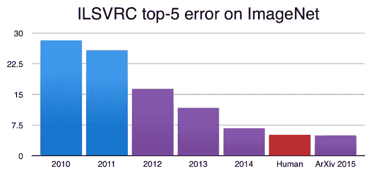

# 深度学习 vs 经典机器学习

> 原文：<https://towardsdatascience.com/deep-learning-vs-classical-machine-learning-9a42c6d48aa?source=collection_archive---------0----------------------->

> 想获得灵感？快来加入我的 [**超级行情快讯**](https://www.superquotes.co/?utm_source=mediumtech&utm_medium=web&utm_campaign=sharing) 。😎

在过去的几年里，深度学习已经成为大多数人工智能类型问题的首选技术，使经典机器学习黯然失色。原因很明显，深度学习已经在包括语音、自然语言、视觉和玩游戏在内的各种任务上反复展示了其优越的性能。然而，尽管深度学习具有如此高的性能，但使用经典机器学习仍然有一些优势，而且在许多特定情况下，使用线性回归或决策树比使用大型深度网络更好。

在这篇文章中，我们将比较和对比深度学习和经典机器学习技术。在此过程中，我们将确定这两种技术的优缺点，以及它们的最佳使用位置和方式。

## 深度学习>经典机器学习

*   **同类最佳性能:**深度网络已经在包括语音、自然语言、视觉和玩游戏在内的许多领域实现了远超经典 ML 方法的准确性。在很多任务中，经典 ML 甚至无法抗衡。例如，下图显示了 ImageNet 数据集上不同方法的影像分类精度；蓝色表示经典的 ML 方法，红色表示深度卷积神经网络(CNN)方法。深度学习在这里把经典 ML 打得落花流水。

*   **有效地利用数据扩展:**深度网络在利用更多数据时比经典的 ML 算法扩展得更好。下图简单而有效地说明了这一点。通常，提高深度网络准确性的最佳建议就是使用更多的数据！对于经典的最大似然算法，这种快速而简单的修复甚至不能很好地工作，并且通常需要更复杂的方法来提高精度。

*   **不需要特征工程:**经典的 ML 算法往往需要复杂的特征工程。通常，首先对数据集进行深入的探索性数据分析。为了更容易处理，可以进行维数缩减。最后，必须仔细选择最佳特征以传递给 ML 算法。当使用深层网络时，没有必要这样做，因为人们可以直接将数据传递到网络，通常可以立即获得良好的性能。这完全消除了整个过程中庞大且具有挑战性的特征工程阶段。
*   **适应性和可移植性:**深度学习技术可以适应不同的领域和应用，远比经典的 ML 算法更容易。首先，迁移学习使得将预先训练的深度网络用于同一领域内的不同应用变得有效。例如，在计算机视觉中，预训练的图像分类网络经常被用作对象检测和分割网络的特征提取前端。使用这些预训练的网络作为前端简化了整个模型的训练，并且通常有助于在更短的时间内实现更高的性能。此外，不同领域中使用的深度学习的相同基本思想和技术通常是非常可移植的。例如，一旦理解了语音识别领域的底层深度学习理论，那么学习如何将深度网络应用于自然语言处理就不会太具挑战性，因为基线知识非常相似。对于经典的 ML，情况完全不同，因为构建高性能的 ML 模型需要特定领域和特定应用的 ML 技术和特征工程。不同领域和应用的经典 ML 的知识库是非常不同的，并且通常需要在每个单独的领域内进行广泛的专门研究。

## 经典机器学习>深度学习

*   **更适用于小数据:**为了实现高性能，深度网络需要非常大的数据集。前面提到的预训练网络是在*120 万张图像*上训练的。对于许多应用程序来说，这样的大型数据集并不容易获得，而且获取起来既昂贵又耗时。对于较小的数据集，经典的 ML 算法通常优于深度网络。
*   **财务和计算成本低廉:**深度网络需要高端 GPU 在合理的时间内用大数据进行训练。这些 GPU 非常昂贵，但没有它们，将深度网络训练到高性能实际上是不可行的。为了有效地使用这样的高端 GPU，还需要快速的 CPU、SSD 存储以及快速和大容量的 RAM。经典的最大似然算法只需要一个像样的 CPU 就可以很好地训练，不需要最好的硬件。因为它们在计算上不那么昂贵，所以人们也可以更快地迭代，并在更短的时间内尝试许多不同的技术。
*   **更容易解释:**由于经典 ML 中直接涉及的特征工程，这些算法相当容易解释和理解。此外，调整超参数和改变模型设计更加简单，因为我们对数据和底层算法有了更透彻的理解。另一方面，深层网络是非常“黑箱”的，因为即使现在研究人员也没有完全理解深层网络的“内部”。由于缺乏理论基础，超参数和网络设计也是一个相当大的挑战。

# 喜欢学习？

在[推特](https://twitter.com/GeorgeSeif94)上关注我，我会在那里发布所有最新最棒的人工智能、技术和科学！也在 [LinkedIn](https://www.linkedin.com/in/georgeseif/) 上和我联系吧！