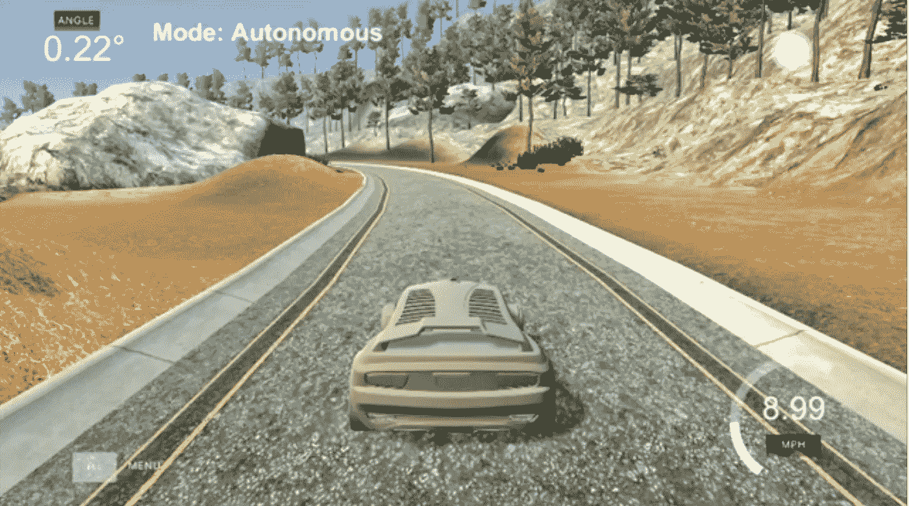
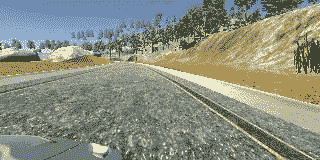
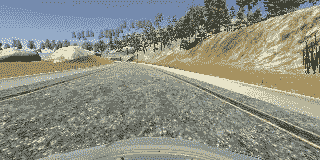
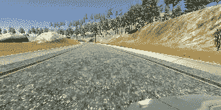
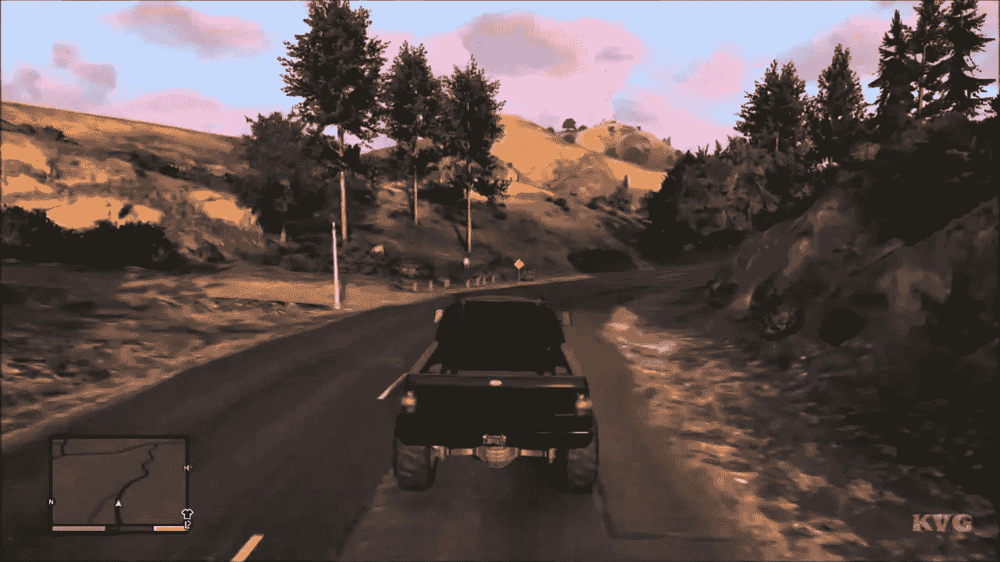
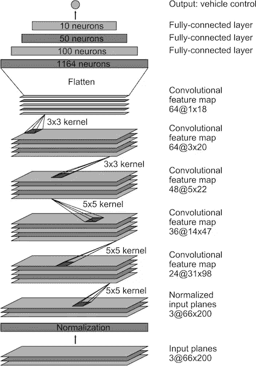

# 深度学习周刊:测试自动驾驶(虚拟)

> 原文：<https://towardsdatascience.com/deep-learning-weekly-piece-testing-autonomous-driving-virtually-4839a8e68890?source=collection_archive---------10----------------------->

本周我将重点讨论深度学习如何用于自动驾驶汽车。在这个领域有很多机器学习应用，但我将聚焦于一项非常酷的技术:虚拟测试。

让我切入正题:下面是我的全自动驾驶汽车在虚拟测试环境中行驶的视频。诚然，虽然它看起来像一个 20 世纪 90 年代的复古(相当无聊)驾驶游戏，但这辆车是由深度卷积神经网络(CNN)控制的，该网络基于由 [Nvidia](https://devblogs.nvidia.com/parallelforall/deep-learning-self-driving-cars/) 制作的深度学习算法的修改。

让我们深入了解一下这里发生了什么。我知道有些读者比其他人更熟悉自动驾驶技术的某些部分，所以我把它分成几个部分，这样你就可以跳到你感兴趣的部分。

# 自动驾驶汽车是如何工作的？

当我们开车时，我们会处理和解释周围成千上万的事情，因此自动驾驶汽车(SDC)软件也必须这样做。为了训练该软件，SDC 必须在路上行驶数千小时和数百万英里，以积累足够的信息来学习如何处理通常的道路情况，以及不寻常的情况(例如当一名坐在电动轮椅上的[妇女在道路中间用扫帚追赶一只鸭子](https://youtu.be/Hsr3Fzi5clw?t=56s))。

为了节省令人难以置信的昂贵培训(这需要数千小时的安全驾驶员加上在公共道路上拥有训练车辆的安全风险)，SDC 的开发者转向*虚拟*环境来训练他们的汽车。

SDC 通过车上的传感器(如摄像头、激光雷达、雷达、超声波、GPS 等)有效地“观察”其环境。)并将其转换为发送到汽车执行器的指令。最重要的命令是:

1.  加速(**油门** ) /减速(**刹车**)
2.  向左/向右转动 X 度(**转向**)

虽然这种“转换”软件的细节和方法对于每个 SDC 开发者来说都是不同的，但它通常由一些**本地化** ( *车在哪里？*)、**方位** ( *汽车面向哪个方向？*)，**检测** ( *车周围有什么？)*、**感知** ( *检测到的东西是交通信号还是行人或者其他车辆？)、* **预测** ( *被检测到的东西接下来会做什么？)、* **运动规划** *(汽车下一步应该移动到哪里？)、*和**车辆命令** ( *向汽车的发动机、制动和转向发送信号)。*这些大多以机器和深度学习为核心。

# 在电子游戏中训练自动驾驶汽车

为真实道路驾驶进行上述转换的相同软件也可以用于虚拟测试环境。为了训练深度学习算法，我将驾驶一辆装有传感器的汽车在模拟器中的赛道上行驶几次(想象一下:任何赛车视频游戏)，并记录传感器(在这种情况下，是摄像头)在模拟器中“看到”的图像。

例如，如果这是我在玩赛车游戏时看到的:

然后，我的虚拟汽车左、前、右的摄像头*看到这个:*

然后，我的代码会将这些图像转换成驾驶命令，这些命令会反馈到汽车的控制装置中(在模拟器中)。简而言之:

*   虚拟传感器在视频游戏中“看到”他们周围的虚拟世界。
*   **在训练期间(*当我驾驶汽车在赛道上行驶* ):** 算法被教导将它看到的图像与我手动(即非自主)驾驶汽车在赛道上行驶的方式(油门和速度)相关联。这是*标记的训练数据*，它教授深度学习算法。
*   例如，代码被教导将上述三个图像与“将方向盘转到 0.22 度，并将速度设置为 8.99 英里/小时”相关联。
*   **在推理过程中(*当汽车在没有我控制的情况下自动驾驶* ):** 代码看到它的环境- >将其输入训练好的算法- >算法输出速度和油门- >汽车更新它的速度和油门- >重复。

有很多模拟器可以用于这个训练(我用的是 Udacity 的开源模拟器)。

请注意，如果你玩的是侠盗猎车手，你的 Playstation/Xbox 会将你手持设备上的控制器转换成游戏中的信号。所以不难想象，它也可以像上面算法的“输出”一样，被不同的控制器控制。

Screenshot of Grand Theft Auto V.

# 那么算法是如何工作的呢？

这是基于一个深度卷积神经网络(CNN:见另一篇每周文章[这里](https://medium.com/@ophir.samson02/deep-learning-weekly-short-piece-neural-networks-made-easy-4f809ed15b46))的，它接收模拟器中摄像头捕捉的图像，并返回转向角度(我暂时将油门控制放在一边)。

我使用的神经网络架构类似于英伟达开创性的“自动驾驶汽车的端到端深度学习”神经网络，在这里[和在这个架构中](https://devblogs.nvidia.com/parallelforall/deep-learning-self-driving-cars/)描述:

我的代码是使用 Tensorflow(与 Keras)和工作方式:

*   裁剪图像，只关注前方的道路(而不是天空)
*   标准化图像
*   应用四个卷积层
*   应用四个完全连接的层
*   在我手动驾驶汽车在赛道上行驶四圈时收集的大约 40，000 张图像上进行训练
*   应用随机优化(Adam 优化器)来减少转向角的均方误差。

它非常高效——它使用 GPU 支持(一个 g2.2xlarge AWS 实例)，仅用两次迭代(称为*纪元* ) 10 秒就训练了网络。对于那些感兴趣的人，[这里是我的代码](https://github.com/ophir11235813/autonomous_drive_deep_neural_net/blob/master/model.py)。