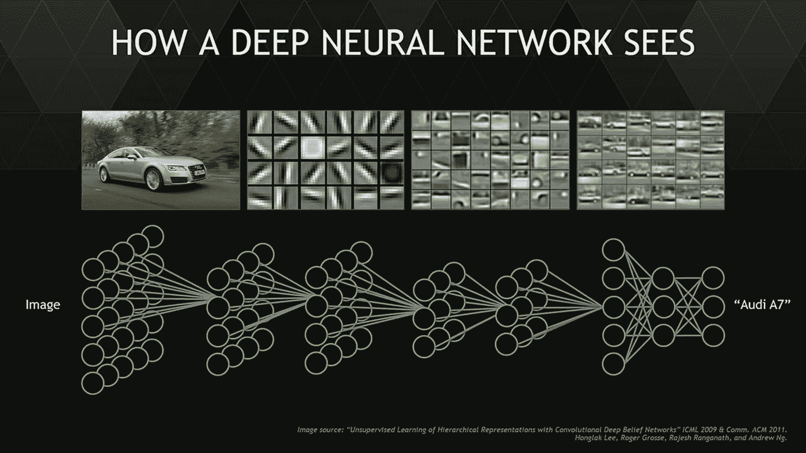

# 深度学习周刊:人工智能、人工智能和人工智能之间的差异

> 原文：<https://towardsdatascience.com/deep-learning-weekly-piece-the-differences-between-ai-ml-and-dl-b6a203b70698?source=collection_archive---------2----------------------->

我想后退一步，把一些我们经常听到的术语放在上下文中，即“人工智能”(AI)、“机器学习”(ML)和“深度学习”(DL)。他们之间有什么区别？

*免责声明:为了保持这个非常高的水平和简短，我不打算对每一个给出全面的解释。重点是对每一个以及它们之间的差异进行温和的介绍。*

Source: Nvidia

**1 .艾伦·图灵- >人工智能(AI)**

艾伦·图灵(Alan Turing)是一名数学家、密码学家，他在二战中破译了英格玛机，他还是逻辑学家、哲学家、剑桥院士(22 岁)和超长距离赛跑运动员。他还为现代计算机和人工智能奠定了基础。

Alan Turing, photo taken before WW2\. Source: turing.org.uk

他的作品在 20 世纪 50 年代渗透到了更广泛的公众知识中。这就产生了“通用人工智能”的概念:计算机能拥有和人类一样的智能特征吗，包括推理、互动和思考？答案是响亮的“不”(至少还没有)。

因此，我们不得不专注于“窄人工智能”——能够完成*特定*任务的技术，比如下棋、推荐你的下一个网飞电视节目，以及识别垃圾邮件。所有这些都展示了人类智慧的*部分*。但是它们是如何工作的呢？*那是机器学习。*

**2 .人工智能- >机器学习(ML)**

在高层次上，ML 通常意味着

1.  *数据:*获取大量(清理过的)数据，带有人为定义的特征(如“年龄”、“身高”、“FICO 评分”、“这是垃圾邮件吗？”等等。)
2.  *训练*:利用数据“调优”各特征的相对重要性
3.  *推断:*根据新数据预测某事

这方面的一个例子是预测垃圾邮件:谷歌邮箱收集了大量关于什么是垃圾邮件和什么不是垃圾邮件的数据(这被称为“标记数据”)。然后，该算法识别垃圾邮件与非垃圾邮件的共同特征。然后，该算法对*未标记数据*(即新邮件)运行，以预测它们是否是垃圾邮件。

When you select spam messages, you are training Gmail’s ML algorithms to better predict future spam messages

ML 需要大量的人工干预，例如手动告诉垃圾邮件过滤器在垃圾邮件与非垃圾邮件中要查找什么(例如，查找“Western Union”/查找指向可疑网站的链接等)。).在图像上也不太准确。

**3 .机器学习- >深度学习**

DL 是 ML 的子集。它基于神经网络，这是一种自 20 世纪 50 年代以来就存在的大脑概念模型，但直到最近才被广泛忽视。这是因为它们的计算成本非常高，而且只是在最近，1)通过 GPU 和 FPGAs，处理变得足够便宜和强大，2)有足够的数据来感受 DL 算法。

DL 是以前帖子的重点，所以我不会重复太多细节，除了在高层次上，“深度”一词来自于 DL 算法是在*深度*神经网络上训练/运行的。这些只是(通常)有三层或更多“隐藏”层的神经网络。例如，每一层可以起到识别奥迪 A7 图片的不同特征的作用。

Abstraction of a DL algorithm (hence trained/run on a deep neural network) to recognize an image of an Audi A7\. Source: ACM 2011, Lee et. al