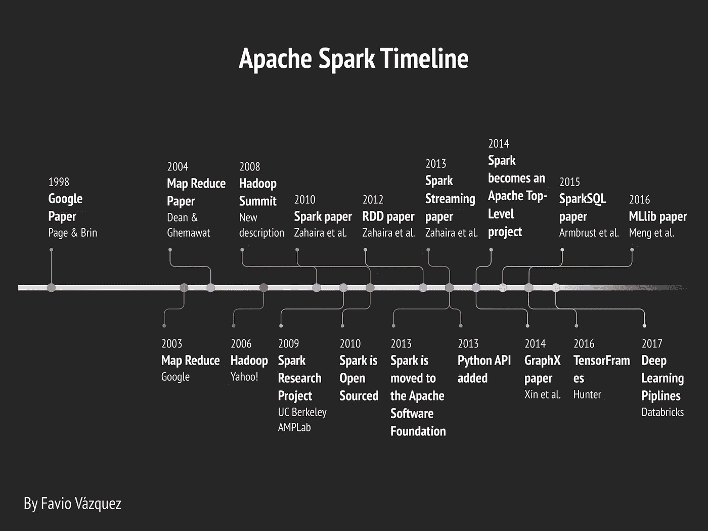
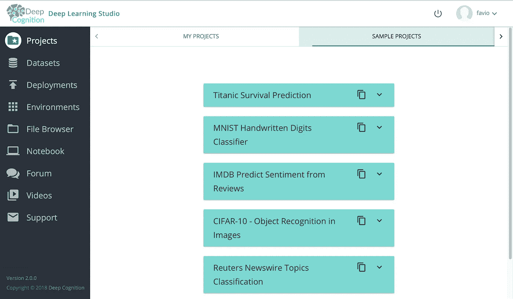
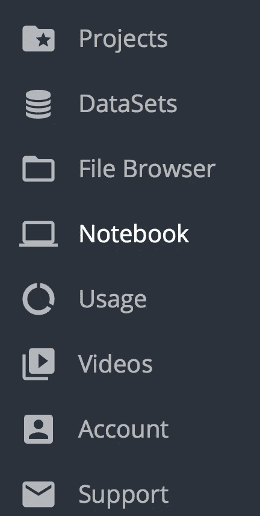
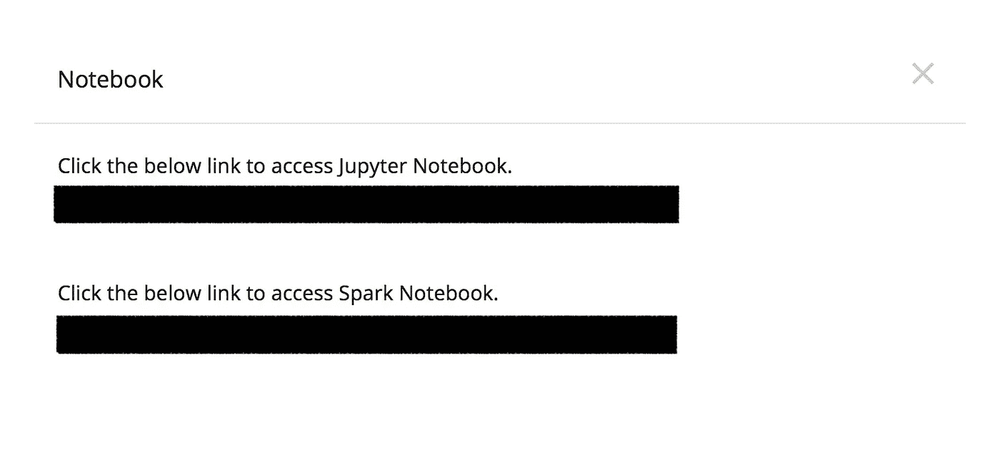

# 使用 Apache Spark 进行深度学习—第 2 部分

> 原文：<https://towardsdatascience.com/deep-learning-with-apache-spark-part-2-2a2938a36d35?source=collection_archive---------1----------------------->

## 第二部分全面讨论了如何使用 Apache Spark 进行分布式深度学习。我将完全专注于 DL pipelines 库以及如何从头开始使用它。你将看到的事情之一是在一个简单的管道上转移学习，如何使用预先训练的模型来处理“少量”数据，以及能够预测事情等等。


By my sister [https://www.instagram.com/heizelvazquez/](https://www.instagram.com/heizelvazquez/)

大家好，欢迎回来学习:)。在本文中，我将继续讨论 Apache Spark 的深度学习。这里可以看到第一部[。](/deep-learning-with-apache-spark-part-1-6d397c16abd)

在这一部分中，我将完全专注于 DL pipelines 库以及如何从头开始使用它。

# Apache Spark 时间表

Apache Spark 的不断改进让我们开始讨论如何利用它进行深度学习。我创建了一个详细的 Apache Spark 开发时间表，看看我们是如何走到这一步的。



很快我会写一篇文章来描述这个时间线，但是如果你觉得有什么遗漏，请告诉我:)

# 深度学习管道


Databricks

深度学习管道(Deep Learning Pipelines)是一个由 Databricks 创建的开源库，它使用 Apache Spark 为 Python 中的可扩展深度学习提供了高级 API。

[](https://github.com/databricks/spark-deep-learning) [## 数据砖块/火花深度学习

### Spark-深度学习 Apache Spark 的深度学习管道

github.com](https://github.com/databricks/spark-deep-learning) 

这是一个令人敬畏的努力，它不会很久，直到被合并到官方的 API，所以值得一看。

与结合 Spark 和 DL 的库相比，这个库的一些优点是:

*   本着 Spark 和 [Spark MLlib](https://spark.apache.org/mllib/) 的精神，它提供了易于使用的 API，可以在很少的几行代码中实现深度学习。
*   它侧重于易用性和集成，而不牺牲性能。
*   它是由 Apache Spark 的创建者(也是主要贡献者)构建的，因此它比其他 API 更有可能被合并为一个官方 API。
*   它是用 Python 编写的，所以它将与所有著名的库集成，现在它使用 TensorFlow 和 Keras 这两个目前主要的库来做 DL。

深度学习管道建立在 Apache Spark 的 [ML 管道](https://spark.apache.org/docs/latest/ml-pipeline.html)之上，用于训练，并使用 Spark 数据帧和 SQL 来部署模型。它包括深度学习常见方面的高级 API，因此可以在几行代码中高效地完成:

*   图像加载
*   在 Spark ML 管道中应用预训练模型作为变压器
*   迁移学习
*   大规模应用深度学习模型
*   分布式超参数调整**(下一部分)**
*   在数据框架和 SQL 中部署模型

我将通过例子详细描述这些特性。这些例子来自 Databricks 的官方笔记本。

# 深度认知的阿帕奇火花

要运行和测试本文中的代码，你需要在[深度认知](http://deepcognition.ai/register/)中创建一个账户。

非常简单，然后您就可以访问它们的所有功能。当您登录时，您应该会看到以下内容:



现在只需点击左边部分，笔记本按钮:



你将会在 Jupyter 笔记本上安装所有的软件包:)。哦！这里有一个说明:火花笔记本(DLS 火花)是一个即将到来的功能，将于下个月的某个时候向公众发布，并告知它仍处于私人测试阶段(仅为本文)。



您可以在这里下载完整的笔记本来查看所有代码:

[https://github.com/FavioVazquez/deep-learning-pyspark](https://github.com/FavioVazquez/deep-learning-pyspark)

## 图像加载

对图像应用深度学习的第一步是加载图像的能力。深度学习管道包括实用功能，可以将数百万张图像加载到数据帧中，并以分布式方式自动解码，从而实现大规模操作。spark 的新版本(2.3.0)也有这个能力，但是我们将使用 sparkdl 库。

我们将使用 TensorFlow 策划的知识共享许可花卉照片档案来测试这一点。要获得花卉照片集，请从笔记本中运行以下命令(我们还将创建一个示例文件夹):

[https://gist.github.com/FavioVazquez/33350294e31213ff761bf2ff51e25c4a](https://gist.github.com/FavioVazquez/33350294e31213ff761bf2ff51e25c4a)

让我们从郁金香和雏菊文件夹中复制一些照片，创建一个小的照片样本。

[https://gist.github.com/FavioVazquez/8ce726807f6074c05a779ee4e5e3a4d0](https://gist.github.com/FavioVazquez/8ce726807f6074c05a779ee4e5e3a4d0)

要在笔记本上查看这些图像，您可以运行以下命令:

[https://gist.github.com/FavioVazquez/efaa901f85b51c77d520595136a2cb52](https://gist.github.com/FavioVazquez/efaa901f85b51c77d520595136a2cb52)

你应该看看这个


现在让我们使用 Spark 将这些图像作为数据帧加载。方法`spark.readImage`可以让你读取普通格式的图像(jpg，png 等)。)从 HDFS 存储器转换成数据帧。每个图像都以 imageSchema 格式存储为一行。递归选项允许您从子文件夹中读取图像，例如阳性和阴性标签样本。sampleRatio 参数允许您在使用完整数据训练模型之前使用较小的图像样本进行实验。

[https://gist.github.com/FavioVazquez/85266329b7ef31411600f33c3b9eee1e](https://gist.github.com/FavioVazquez/85266329b7ef31411600f33c3b9eee1e)

如果我们看一下这个数据帧，我们会看到它创建了一个列，称为“image”。

```
image_df.show()+--------------------+
|               image|
+--------------------+
|[file:/Users/favi...|
|[file:/Users/favi...|
|[file:/Users/favi...|
+--------------------+
```

image 列包含一个字符串列，该列包含一个 image 结构，schema == ImageSchema。

## 迁移学习


Databricks

深度学习管道提供了在图像上执行[转移学习](https://en.wikipedia.org/wiki/Transfer_learning)的实用程序，这是开始使用深度学习的最快(代码和运行时)方式之一。使用深度学习管道，只需几行代码就可以完成。

深度学习管道通过*特征*的概念实现快速迁移学习。下面的例子结合了 InceptionV3 模型和 Spark 中的逻辑回归，使 InceptionV3 适应我们的特定领域。**deepimagefeaturezer 自动剥离预训练神经网络的最后一层，并使用所有先前层的输出作为逻辑回归算法的特征**。由于逻辑回归是一种简单而快速的算法，这种迁移学习训练可以使用比从头开始训练深度学习模型通常所需的图像少得多的图像来快速收敛。

首先，我们需要为迁移学习创建训练和测试数据框架。

[https://gist.github.com/FavioVazquez/84b0201f2ec0cbfc64fa3736bc7a76b5](https://gist.github.com/FavioVazquez/84b0201f2ec0cbfc64fa3736bc7a76b5)

现在我们来训练这个模型

[https://gist.github.com/FavioVazquez/96e13301b6286eb7b52f34faedce4c24](https://gist.github.com/FavioVazquez/96e13301b6286eb7b52f34faedce4c24)

让我们看看这个模型有多好:

[https://gist.github.com/FavioVazquez/27fa7de28011d41b192d723a185a9b87](https://gist.github.com/FavioVazquez/27fa7de28011d41b192d723a185a9b87)

```
Test set accuracy = 0.9753086419753086
```

对于一个例子来说还不算太坏，而且根本没有调整！

我们可以看看我们在哪里犯了错误:

[https://gist.github.com/FavioVazquez/dcd72fe4f0f4204736d46ba57112cb97](https://gist.github.com/FavioVazquez/dcd72fe4f0f4204736d46ba57112cb97)

## 大规模应用深度学习模型

深度学习管道支持使用 Spark 以分布式方式运行预训练的模型，可用于批处理和[流数据处理](https://databricks.com/blog/2016/07/28/structured-streaming-in-apache-spark.html)。

它包含一些最受欢迎的模型，使用户能够开始使用深度学习，而无需训练模型的昂贵步骤。当然，该模型的预测是与 Spark 带来的所有好处并行完成的。

除了使用内置模型，用户还可以在火花预测管道中插入 [Keras 模型](https://keras.io/models/about-keras-models/)和张量流图。这将单节点工具上的任何单节点模型转变为可以在大量数据上以分布式方式应用的模型。

下面的代码使用 InceptionV3 创建了一个火花预测管道，这是一个用于图像分类的最先进的卷积神经网络(CNN)模型，并预测我们刚刚加载的图像中有哪些对象。

[https://gist.github.com/FavioVazquez/b6e4ab8787f4bd4a7186d858a86c3521](https://gist.github.com/FavioVazquez/b6e4ab8787f4bd4a7186d858a86c3521)

让我们来看看预测数据框:

```
predictions_df.select("predicted_labels").show(truncate=False,n=3)+----------------+
|predicted_labels|                                                                                                                                                                                                                                                                                                                                            |                |
+----------------+
|[[n03930313, picket_fence, 0.1424783], **[n11939491, daisy, 0.10951301]**, [n03991062, pot, 0.04505], [n02206856, bee, 0.03734662], [n02280649, cabbage_butterfly, 0.019011213], [n13133613, ear, 0.017185668], [n02219486, ant, 0.014198389], [n02281406, sulphur_butterfly, 0.013113698], [n12620546, hip, 0.012272579], [n03457902, greenhouse, 0.011370744]]            ||**[[n11939491, daisy, 0.9532104]**, [n02219486, ant, 6.175268E-4], [n02206856, bee, 5.1203516E-4], [n02190166, fly, 4.0093894E-4], [n02165456, ladybug, 3.70687E-4], [n02281406, sulphur_butterfly, 3.0587992E-4], [n02112018, Pomeranian, 2.9011074E-4], [n01795545, black_grouse, 2.5667972E-4], [n02177972, weevil, 2.4875381E-4], [n07745940, strawberry, 2.3729511E-4]]||**[[n11939491, daisy, 0.89181453]**, [n02219486, ant, 0.0012404523], [n02206856, bee, 8.13047E-4], [n02190166, fly, 6.03804E-4], [n02165456, ladybug, 6.005444E-4], [n02281406, sulphur_butterfly, 5.32096E-4], [n04599235, wool, 4.6653638E-4], [n02112018, Pomeranian, 4.625338E-4], [n07930864, cup, 4.400617E-4], [n02177972, weevil, 4.2434104E-4]]                    |
+----------------+
only showing top 3 rows
```

请注意，`predicted_labels`列显示“雏菊”是使用此基础模型的所有样本花的高概率类别，**由于某种原因，郁金香更接近于栅栏而不是花(可能是因为照片的背景)**。

然而，从概率值的差异可以看出，神经网络具有辨别两种花类型的信息。因此，我们上面的迁移学习示例能够从基础模型开始正确地学习雏菊和郁金香之间的差异。

让我们看看我们的模型如何辨别花的类型:

[https://gist.github.com/FavioVazquez/271c069453b5917d85aeec0001d54624](https://gist.github.com/FavioVazquez/271c069453b5917d85aeec0001d54624)

## 对于 Keras 用户

为了使用 Spark 以分布式方式应用 Keras 模型，`[KerasImageFileTransformer](https://databricks-prod-cloudfront.cloud.databricks.com/public/4027ec902e239c93eaaa8714f173bcfc/6026450283250196/3874201704285756/7409402632610251/link_here)`在 TensorFlow 支持的 Keras 模型上工作。它

*   通过将用户指定的图像加载和处理功能应用于包含一列图像 URIs 的输入数据帧，在内部创建包含一列图像的数据帧
*   从给定的模型文件路径加载 Keras 模型
*   将模型应用于图像数据帧

要使用 transformer，我们首先需要将 Keras 模型存储为一个文件。对于这款笔记本，我们将只保存 Keras 内置的 InceptionV3 模型，而不是训练模型。

[https://gist.github.com/FavioVazquez/bc7d280cd98a7112cb96f13cded20259](https://gist.github.com/FavioVazquez/bc7d280cd98a7112cb96f13cded20259)

现在我们将创建一个 Keras 转换器，但首先我们将预处理图像来使用它

[https://gist.github.com/FavioVazquez/b1a43d8611e1fd2db9a3c61742156e97](https://gist.github.com/FavioVazquez/b1a43d8611e1fd2db9a3c61742156e97)

我们现在将读取图像并将它们加载到 Spark 数据帧中，然后使用我们的转换器将模型应用到图像中:

[https://gist.github.com/FavioVazquez/531c2852f936e4a2cbbe2f4afbad47d5](https://gist.github.com/FavioVazquez/531c2852f936e4a2cbbe2f4afbad47d5)

如果我们看一下这个带有预测的数据框架，我们会看到很多信息，这只是概念 3 模型中每一类的概率。

## 使用一般张量

深度学习管道还提供了应用具有张量输入(高达 2 维)的模型的方法，这些模型是在流行的深度学习库中编写的:

*   张量流图
*   Keras 模型

在本文中，我们将只关注 Keras 模型。`KerasTransformer`将 TensorFlow 支持的 Keras 模型应用于高达 2 维的张量输入。它从给定的模型文件路径加载一个 Keras 模型，并将该模型应用于一列数组(其中一个数组对应一个张量)，输出一列数组。

[https://gist.github.com/FavioVazquez/bab4fbf9c39aade9b92dbbea95127cec](https://gist.github.com/FavioVazquez/bab4fbf9c39aade9b92dbbea95127cec)

```
final_df.show()+-------------+--------------------+
|  predictions|            features|
+-------------+--------------------+
| [0.86104786]|[-0.76344526, 0.2...|
| [0.21693115]|[0.41084298, 0.93...|
|[0.057743043]|[0.062970825, 0.3...|
| [0.43409333]|[-0.43408343, -1....|
| [0.43690935]|[-0.89413625, 0.8...|
| [0.49984664]|[-0.82052463, -0....|
|  [0.6204273]|[-0.5075533, 0.54...|
|  [0.2285336]|[0.016106872, -0....|
| [0.37478408]|[-1.6756374, 0.84...|
|  [0.2997861]|[-0.34952268, 1.2...|
|  [0.3885377]|[0.1639214, -0.22...|
|  [0.5006814]|[0.91551965, -0.3...|
| [0.20518135]|[-1.2620118, -0.4...|
| [0.18882117]|[-0.14812712, 0.8...|
| [0.49993372]|[1.4617485, -0.33...|
| [0.42390883]|[-0.877813, 0.603...|
|  [0.5232896]|[-0.031451378, -1...|
| [0.45858437]|[0.9310042, -1.77...|
| [0.49794272]|[-0.37061003, -1....|
|  [0.2543479]|[0.41954428, 1.88...|
+-------------+--------------------+
only showing top 20 rows
```

## 在 SQL 中部署模型

将模型生产化的一种方法是将其部署为 Spark SQL 用户定义函数，这允许任何懂 SQL 的人使用它。深度学习管道提供了采用深度学习模型和*注册*Spark SQL 用户定义函数(UDF)的机制。特别是，深度学习管道 0.2.0 增加了对从处理图像数据的 Keras 模型创建 SQL UDFs 的支持。

得到的 UDF 接受一个列(格式化为图像结构“SpImage”)并产生给定 Keras 模型的输出；例如，对于 Inception V3，它在 ImageNet 对象类别上产生实值分数向量。

[https://gist.github.com/FavioVazquez/3a36edf25a289f4ee31cff1bf3857467](https://gist.github.com/FavioVazquez/3a36edf25a289f4ee31cff1bf3857467)

在处理图像的 Keras 工作流中，在将模型应用于图像之前，通常会有预处理步骤。如果我们的工作流需要预处理，我们可以选择为 UDF 注册提供预处理功能。预处理器应该接收一个文件路径并返回一个图像数组；下面是一个简单的例子。

[https://gist.github.com/FavioVazquez/a02094a5848ab1f7e42ce52820a09fbe](https://gist.github.com/FavioVazquez/a02094a5848ab1f7e42ce52820a09fbe)

注册 UDF 后，可以在 SQL 查询中使用它:

[https://gist.github.com/FavioVazquez/af566a98d19952eb0b61938c4752f7dc](https://gist.github.com/FavioVazquez/af566a98d19952eb0b61938c4752f7dc)

这个很厉害。一旦数据科学家构建了所需的模型，深度学习管道就可以轻松地将其作为 SQL 中的函数公开，因此他们组织中的任何人都可以使用它-数据工程师、数据科学家、业务分析师，任何人。

```
sparkdl.registerKerasUDF("awesome_dl_model", "/mymodels/businessmodel.h5")
```

接下来，组织中的任何用户都可以在 SQL 中应用预测:

```
SELECT image, awesome_dl_model(image) label FROM images 
WHERE contains(label, “Product”)
```

在下一部分中，我将讨论使用 Spark 进行分布式超参数调优，并将尝试新的模型和示例:)。

如果您想联系我，请务必在 twitter 上关注我:

[](https://twitter.com/faviovaz) [## 法维奥·巴斯克斯(@法维奥·巴斯克斯)|推特

### Favio Vázquez 的最新推文(@FavioVaz)。数据科学家。物理学家和计算工程师。我有一个…

twitter.com](https://twitter.com/faviovaz) 

和 LinkedIn: