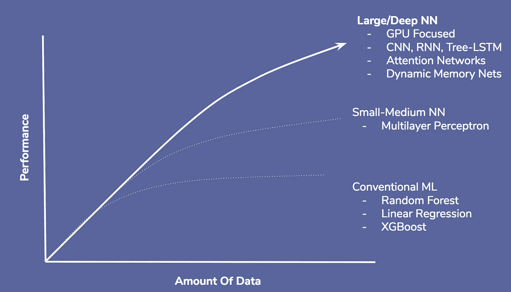

# 关于深度学习的深层误解

> 原文：<https://towardsdatascience.com/deep-misconceptions-about-deep-learning-f26c41faceec?source=collection_archive---------2----------------------->

我开始写这篇文章，是希望对抗一些关于深度学习(DL)的误解，深度学习是一个机器学习领域，同时被称为银弹和研究炒作。真相在中间的某个地方，我希望我能把水搅浑——至少一点点。重要的是，我希望阐明解决 DL 问题的一些过程，并讨论为什么它在自然语言处理(NLP)、图像识别和机器翻译等领域表现如此好，而在其他领域却失败了。

**深度学习不是黑暗艺术**

媒体经常将深度学习描绘成世界末日的神奇配方或所有生活问题的解决方案。事实上，它绝不是。此外，尽管 DL 有其奇怪的行为和无法解释的结果，但它最终是由精英驱动的。通过在开发过程中要求证明和推理，您可以在无限数量的模型排列中构建一个健壮的框架。

[https://xkcd.com/1838/](https://xkcd.com/1838/)

**凡事都有目的(大多数时候)**

我看到新从业者表现出的第一个问题是将几个 LSTM(长短期记忆)层、一个 GRU(门控循环单元)层和几个卷积层粉碎在一起，然后坐下来等待神奇的结果。然后沮丧地看着他们的模型 5%的精确度。正如我将在后面讨论的，DL 需要一个更加合理的方法。

通过采用基于整合数据、网络设计和好奇心的方法，你将能够产生惊人的结果。我每天都花时间阅读关于最新方法的新论文和文章，并不断看到推动新设计的巧妙想法。

在 DL 中，不同的层服务于不同的目的。这是一个简单的想法，但对于这个领域的新手来说，这种想法往往会被遗忘。此外，虽然我在设计过程中做了大量的实验，但我总是沿着一条思路进行测试。增加复杂性应该有一个理由(或者至少是一个假设)。它应该用一个可测量的标准来检查，只有这样我才能在最终的设计中接受它。此外，你应该偏爱简单的模型，而不是复杂的模型，因为它们可以达到相同的结果。我一直在测试更小的网络，或者更少的神经元或者更少的层，并将它们与我的最佳设计进行比较。更小的系统也意味着更快的训练(在某些情况下几个数量级)，这意味着更多的迭代和更好的最终设计。

您可以创建一些工具来测试小型和大型网络上的新论点，这种理解将推动您对网络设计的全面了解。随着你越来越多地使用神经网络，你将会更好地理解是什么驱动它的行为来完成特定的任务。你开始在你的头脑中绘制一张地图，标明什么时候尝试什么，但前提是你有正确的度量标准和过程来理解。

**设计流程**

我认为设计过程就像一个孩子试图建造一座砖砌的塔，一路测试。戳，刺激，失败，但**总是**测试。塔的第二层是不是太不稳了？该不该换基地？考虑拥有有限数量的块是有帮助的。神经网络越小，你训练它的速度就越快，测试它的速度也就越快。仅在需要时增加复杂性。

在 DL 中，这个问题有无限多种可能的解决方案——因此，您处理的网络可以模拟几乎无限的公式集。虽然最终结果可能是离散的，但神经网络生活在一个连续数字的世界中。复杂性往往会迅速增加，而增加的复杂性需要更多的控制。我试着用建立一个新的数据项目的方式来建立我的网络。例如，一个简单的探索性数据分析管道可以是:

接收数据→清理数据→转换数据→呈现数据

所有这些模块都可能涉及许多不同的步骤。如果我在整个过程中没有确保上游过程的质量，整个系统将会失败。所以我一路测试。我测试一切——输入、输出、类、函数。我确保每样东西单独工作，然后一起工作。我知道这不是一个突破性的想法，但它值得指出。一旦我有了一个工作流程，我就会转移到下一个，并在此基础上继续工作。

在深度学习中，我从创建最简单的模型开始。在处理文本分类任务时，我将从最简单的[嵌入-编码-参与-预测](https://explosion.ai/blog/deep-learning-formula-nlp)模型开始。在看到基础模型是如何工作的之后，我将开始在它的基础上进行构建。这可能包括增加隐藏层的大小，加深网络，合并新的网络，改变激活和初始化，用词性标签或其他数字数据增加文本。我可能会让几个神经网络互相反馈，以达到不同的目的，或者改变数据的处理方式，或者将文本矢量化。这样的例子不胜枚举。

对于每一步，我都将它与我的原始模型和我的迭代进行比较。这个过程允许我回顾我的模型的演变，理解它在哪里变得更好(或更差)，并通知设计的未来迭代；总是越来越接近全局最小值。

**成为数据的主人**

在开始试验您的 DL 模型之前，有必要了解给定问题的价值所在。有一个简单的层次结构可以遵循:

数据大于模型设计，模型设计大于参数优化。

如果 A 公司有 B 公司十倍的数据，这个世界上没有一个模型会允许 B 公司胜过 A 公司的模型。同样的想法也适用于数据质量。

如果我花数周时间开发一个基于弱数据质量的模型，它的表现将不如我用几天时间构建的基于高质量数据的模型。在你花数周时间做模型之前，总是问自己是否能得到更多的数据。也许你可以改变你的预处理步骤来提高你已经拥有的数据的质量。这通常会比仅仅通过模型调整获得更快的性能提升。

不仅需要高质量的数据，还需要对数据的深刻理解。你应该花时间开发工具来分析、展示和研究你的输入数据。您应该构建度量和分析工具来理解您的模型的预测。避免将数据仅仅视为输入。所有数据都有隐藏的特征，如果你能提取出来，这些特征具有巨大的预测能力。有时您必须自己完成这项工作，其他时候您可以开发您的 DL 模型，让它自己完成这项工作。把你的数据想象成一种加密算法的输入——但它不是对文本或电子邮件进行加密，而是对世界的运行方式进行编码。每个数据点都是更好理解的线索。

自然语言处理中的文本分类就是一个很好的例子。给你一个几百或者几千字的语料库，每个文本有一个类或者多个类。也许这个类是积极的，消极的，或者中性的，也许你有数百个复杂而错综复杂的类。无论哪种方式，文本都是我们用来确定输出的代码。

当你不再认为你的输入只是文字时，它会变得非常有价值，并为你带来难以置信的结果。这种想法导致了从单词向量到单词级模型、句子级模型、段落级模型的发展。每一个实现都是基于人类理解的工作方式，并在性能增益中表现出来。

**与领域专家共度时光**

这与前一部分紧密相关，甚至可能更重要——花时间与具有领域知识的人交谈。和他们讨论你的结果，和他们讨论数据。让他们参与设计过程。

你会惊讶于讨论你的模型的设计哲学和你的模型的输出经常会带来快速的成功。这些立竿见影的效果往往转化为准确性的大幅提高。当然，这需要时间投资来教育他们对深度学习的直觉和概念理解，但对我来说这总是值得的。如果你没有领域专家，花时间自己学习。避免试图为你不理解的问题建立一个 DL 模型。

消除深度学习就像在没有灯的迷宫中摸索前进的想法。在现实中，你可以通过遵循正确的方法并试图解决正确的问题来处理深度学习。你应该经常问自己为什么。

虽然我将要描述的方法听起来可能与度量驱动设计的想法相反，但我发现它以最好的方式建立了理解；一直问为什么。

**像孩子一样学习**

也许我一直提到孩子是因为我和我的妻子在下个月左右就要有我们的女儿了，但是我发现他们是如何学习的一个很好的例子。孩子从子宫里出来就是小科学家。一切都是实验，任何抚养过孩子的人都记得他们的小探险家发出的无尽的一串“为什么”。数据科学家应该都有这种方法，但在实施深度学习时记住这一点尤其重要——深度学习是一个有着令人眼花缭乱的设计选择的领域，可能会导致最勤奋的数据科学家的思维变得迟钝。

一旦我测试了一个有积极效果的设计变更，我会试着找出它为什么有效。这个方法论让我不断提高自己的理解能力。今天，我可能不是某个特定领域的专家，但如果有足够的时间，我总能朝着成为专家的方向努力。

我一直在问为什么，直到我真正理解了选择一个设计决策的基础。通常一个问题引出另一个问题，三天后你对一系列有价值的概念有了新的深刻的理解。这是我最近去过的一个兔子洞的合法例子(如果这些术语对你没有任何意义，请不要担心):

*   为什么我要用 LSTM 编码我的句子？
*   LSTM 是如何工作的？
*   规范 LSTM 的最好方法是什么？
*   我应该如何解码 LSTM 输出的序列？
*   最大池与平均池或使用另一个 LSTM 作为我的解码器相比如何？
*   GRU 比 LSTM 表现得更好还是更快？为什么？
*   我应该如何初始化我的 LSTM 层？为什么？
*   这个 LSTM 太慢了，我能加速吗？
*   为什么传统的 LSTM 在 GPU 上的运行速度比 Cuda 优化的 LSTM 层慢这么多？
*   我可以使用较低精度的浮点来增加我可以在 GPU 上实现的网络大小吗？

我称之为兔子洞是因为学习路径从一开始就是随机的，不确定的。我只是允许自己探索我的问题。我不担心这是偶然的，而且我对每一个科目的兴趣倍增，我学习答案的速度和效果都很好。这个方法是我一生学习的方式，我发现它总能让我到达正确的地方(最终)。我也带着一套技能到达那里，否则，如果我只专注于预先设计的计划，我不会。这种方法的缺点是耗时，但大多数数据科学家天生就有这种好奇心。一旦我遇到问题，我必须找到答案。

> “找到答案或者尝试而死”——平行宇宙中的 50 美分

结果是我现在对第一个问题有了回应；为什么我应该用 LSTM 来编码我的句子。此外，我有另一组半相关问题的答案，允许我进行新的调整和设计更改，以进一步优化。在测试这些调整时，我可能会得到新的和新奇的结果，所以我开始再次探索。如果你这样做的时间足够长，你可以从学习到实验，到设计，到专业知识。很快你就会发现自己正在尝试以前从未尝试过的全新想法。

这个特别的问题让我将我的神经网络在特定问题上的速度提高了四倍，同时提高了 3%的准确率(对我来说这是很大的一个进步)。在此过程中，我还学习了编码器-解码器的设计以及相当多的机器翻译知识。回答我的问题，而不是像传统方法那样预先设定的问题，可以让我连续几个小时保持专注，而不会耗尽我的意志力。

**问正确的问题**

识别正确的深度学习问题至关重要。DL 在语言任务、图像分类、语音翻译、机器翻译和玩游戏(即国际象棋、围棋、星际争霸)方面非常出色。在传统的机器学习任务中，如信用卡欺诈检测、资产定价和信用评分，它的性能较差。或许在未来，我们将调整我们的模型、优化方法和激活函数，使深度学习更加广泛适用，但目前，它仅限于非常复杂的领域。

DL 之所以表现出色，是因为它可以建模巨大的复杂性。在我确定的所有任务中，数据的不同部分之间有数千甚至数百万的细微差别和相关性。神经网络以一种人类无法做到的方式寻找并利用这些细微差别。此外，虽然传统的机器学习可以应用于这些领域，但它们在复杂性建模方面有很大的局限性。数据科学家通常需要花费数周时间进行特征提取和工程设计，才能让传统模型发挥作用。原因是该网络不具有深度学习网络的相同能力来独自获得特征。

人类设计师经常限制传统的机器学习模型。深度学习消除了很多人类的限制，让人类成为向导而不是老师。现在，在人类开发人员的帮助下，模型可以自由探索并找到解决方案的途径。我的工作是给神经网络提供正确的工具，将一个问题分解成数百万个子问题，然后将它们重新组合成一个解决方案。它的精彩之处在于它既简单又复杂。

**一剂有益健康的偏执狂**

作为最后，也可能是最重要的主题，您如何确保您的模型运行良好？不幸的是，没有单一的解决方案，但有一个适合我的系统。

当设计一个网络时，我怀疑它不能正常工作。我不断地想，是分数在愚弄我，还是有罕见的长尾事件让我的模型看起来很傻。一个可怕的预测会让你的模型在很多人眼里变得不准确。因此，我构建了以多种方式查看相同预测的工具，制作了图形工具以允许更快的迭代和更快的数据消化，并继续开发工具，直到那种不安的感觉消退到舒适的程度。

有时你永远也到不了那里。这就是为什么你不断调整，你不断寻找缺陷。像一个固执的侦探，不断刺激，测试和寻找漏洞。我向你保证，有比你原来的准确性指标可能会建议更多。单独看每节课，分组看，用精准，回忆，f1-score；见鬼，我甚至有一半时间都在编故事。

关键是要认识到你的模型是复杂的，你只能理解其决策过程的一部分。如果你知道走进去，你就更有可能成功走出去。您的度量导致设计变更，您的设计变更导致更好的模型。

有时，你会了解模型的小利基，以及如何控制它们。有时你不得不接受它并不总是有效。重点通常是缓解，而不是消除。任何一个好的深度学习系统，后台都有一个智能质量保证(QA)系统。这个问答系统是防止用户尴尬预测的最后一道防线。

通过使用适当的 QA 过程，您可以获得有目的地设计所需的度量，在过程中学习，并不断改进您自己和您的模型。在一天结束的时候，也许我们所做的只是搅动那个线性代数锅，但是通过一种由目的和理解驱动的方式去做，我们成功的几率会成倍增加。