# 对一个不很深的神经网络的深入研究。第 2 部分:激活函数

> 原文：<https://towardsdatascience.com/deep-study-of-a-not-very-deep-neural-network-part-2-activation-functions-fd9bd8d406fc?source=collection_archive---------4----------------------->

这是该系列的第二部分，这次我们将探讨激活函数。我假设你已经知道，什么是激活函数，以及它在神经网络中扮演什么角色。

在我们的实验中，我们将比较 Keras 中包含的激活功能，具体如下:

*   线性；
*   乙状结肠；
*   硬乙状结肠；
*   TanH
*   软设计；
*   ReLU
*   漏水的 ReLU
*   阈值 ReLU
*   ELU；
*   SELU；
*   软加。

正如在[上一部分](/deep-study-of-a-not-very-deep-neural-network-part-1-whats-in-our-data-7971356037a3)中一样，这里我们将坚持使用 RMSProp 优化器。在本系列的后面部分，我们还将评估各种激活函数如何与不同的优化器一起工作，但现在让我们先来看看激活。至于数据，我们将在数据集标准化数据(因为它与样本标准化数据相比表现同样出色)和样本标准化数据(如果你读过前一部分，你就知道为什么)上训练我们的网络。

下面是对每个激活功能的一个简短且不太科学的描述，只是为了让你对每个有一个直观的了解。

# 线性的

线性激活(也称为恒等式)函数是最简单的激活函数之一。它将输入线性转化为输出。现在，无论是在隐含层还是在最终层，它几乎从未用于训练神经网络。它的值域和定义域等于[-Inf；+Inf]。

Fig.1 Linear activation

# 乙状结肠的

Sigmoid 激活函数翻译范围在[-Inf；+Inf]到(0；1)，看起来像一条 S 形曲线。当开发用于学习目的的简单神经网络时，它通常是第一选择，但是到目前为止，它通常被避免，因为与其他激活函数相比，它的质量较低。

遭受[消失梯度问题](https://en.wikipedia.org/wiki/Vanishing_gradient_problem)，当“在某些情况下，梯度将消失得很小，有效地防止重量改变其值”。

Fig.2 Sigmoid activation

# 硬乙状结肠

该函数是 sigmoid 函数的分段线性近似。在区间[-Inf 上等于 0；-2.5)，然后在[-2.5；+2.5]并在范围(+2.5；+Inf] ( [来源](https://www.tensorflow.org/api_docs/python/tf/keras/backend/hard_sigmoid))。计算硬 Sigmoid 被认为比计算常规 Sigmoid 更快，因为您不必计算指数，并且它在分类任务上提供了合理的结果。但是正因为它是一个近似值，[它不应该用于回归任务](https://www.quora.com/What-is-hard-sigmoid-in-artificial-neural-networks-Why-is-it-faster-than-standard-sigmoid-Are-there-any-disadvantages-over-the-standard-sigmoid)，因为误差会比常规的 sigmoid 高得多。

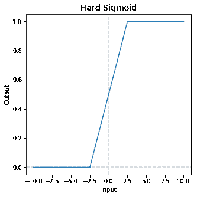

Fig.3 Hard Sigmoid activation

# 双曲正切值

TanH 看起来很像 sigmoid 的 S 形曲线(其实只是一个缩放的 Sigmoid)，但是它的范围是(-1；+1).在更复杂的激活函数出现之前，它已经相当流行了。简而言之，使用 TanH 代替乙状结肠的好处是([来源](https://stats.stackexchange.com/questions/101560/tanh-activation-function-vs-sigmoid-activation-function)):

1.  更强的梯度:如果数据以 0 为中心，导数更高。
2.  避免由于包含范围(-1；0).

然而，与 Sigmoid 类似，TanH 也容易受到消失梯度问题的影响。

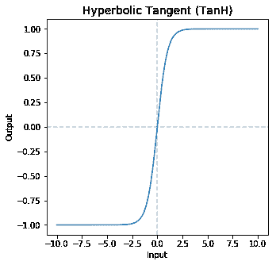

Fig. 4 Hyperbolic Tangent (TanH) activation

# 软设计

作为符号函数的连续近似，其图形看起来非常类似于 TanH。然而，TanH 是指数增长，而 SoftSign 是多项式增长。软签名的范围也是(-1；+1).

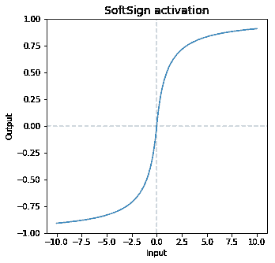

Fig.5 SoftSign activation

# 整流线性单元

一个非常简单而强大的激活函数，如果输入为正，则输出输入，否则输出 0。[声称](https://arxiv.org/pdf/1710.05941.pdf)它是目前训练神经网络最流行的激活函数，并且产生比 Sigmoid 和 TanH 更好的结果。这种类型的激活函数不容易受到消失梯度问题的影响，但是它可能遭受“垂死的 ReLU 问题”。正如[在维基百科](https://en.wikipedia.org/wiki/Rectifier_(neural_networks))中所说:“ReLU 神经元有时会被推入对几乎所有输入都不活跃的状态。在这种状态下，没有梯度回流通过神经元，因此神经元陷入永久不活动状态并“死亡”。“在某些情况下，网络中的大量神经元可能会陷入停滞状态，从而有效降低模型容量。当学习率设置得太高时，通常会出现这个问题。”下面是对这个问题的一个很好的描述:[https://www . quora . com/What ' s-the-dying-ReLU-problem-in-neural-networks](https://www.quora.com/What-is-the-dying-ReLU-problem-in-neural-networks)。

这个激活函数有参数 alpha，它控制 x < 0 and is set to 0.0\. Setting this parameter to any value < 1.0 transforms this activation into Leaky ReLU and setting it to 1.0 makes this function work as Linear activation. What happens, when alpha is > 1.0 的直线的陡度，研究起来会很有趣。

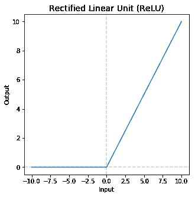

Fig.6 Rectified Linear Unit (ReLU) activation

# 泄漏 ReLU

ReLU 函数的一个变体，允许输入< 0, which helps to [的梯度α的少量“泄漏”,克服了即将消失的 ReLU 问题](https://arxiv.org/abs/1505.00853)。默认情况下，Keras alpha 设定为 0.3

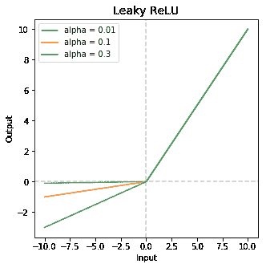

Fig.7 Leaky ReLU activation with various alpha parameters

# 阈值 ReLU

ReLU 激活的另一个变体，其中 x < theta, and equals to x if x > = theta 的输出为 0。在 Keras 中，θ的默认值被设置为 1.0，而在[原始论文](https://arxiv.org/pdf/1402.3337.pdf)中，据说 0.7 的值为他们的特定实验提供了最佳结果。

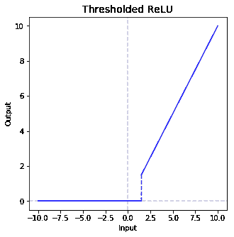

Fig.8 Thresholded ReLU activation

# 指数线性单位(ELU)

较少使用的 ReLU 修改，据说比传统的 ReLU 导致更高的分类结果。对于 x>= 0，它遵循与 ReLU 相同的规则，对于 x < 0，它按指数规律增加。ELU 试图使平均激活接近零，这加快了训练速度。

它只有一个参数 alpha，用于控制负声部的比例，默认设置为 1.0。

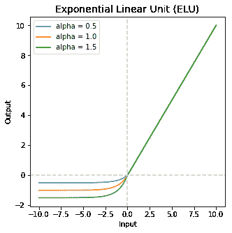

Fig.9 Exponential Linear Unit (ELU) activation

# 比例指数线性单位(SELU)

我们将在实验中评估的最后一个整流器。它用参数λ扩展了 ELU，负责缩放正负部分。如 Klambauer 等人在[的论文中所建议的，该函数中的 Alpha 和 lambda 被硬编码为分别大约等于 1.67 和 1.05。他们还说，这个激活应该与“lecun_normal”初始化器和 AlphaDropout 一起使用，但是为了与本部分中的其他激活相比较，我们将使用默认初始化器和常规 Dropout。我们将在后面的系列文章中检查 SELU 的初始化和退出。](https://arxiv.org/abs/1706.02515)

Fig.10 Scaled Exponential Linear Unit (SELU) activation

# SoftPlus

SoftPlus 函数的图形看起来像平滑的 ReLU。我找不到为什么 SoftPlus 应该优于任何其他激活函数的确切原因，这一点得到了 Glorot、Bordes 和 Bengio 在[深度稀疏整流器神经网络](http://proceedings.mlr.press/v15/glorot11a/glorot11a.pdf)论文中的陈述的支持:“尽管硬阈值为 0，但用整流器激活函数训练的网络可以找到比用其平滑对应物 softplus 获得的质量更好或相同的局部最小值。”

Fig.11 SoftPlus activation

为了方便起见，这里将所有激活功能合并为两个图表:

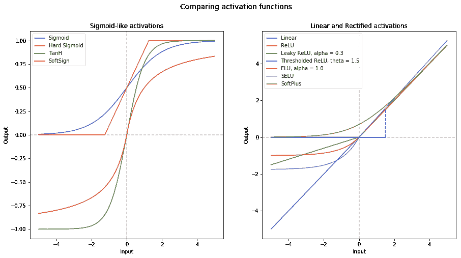

Fig.12 Comparison of various activation functions

# 实验结果

当比较激活函数时，我们将考虑与先前实验中相同的指标。在我们用 RMSProp optimizer 对每个激活函数训练了我们的网络 5 次之后，下面是我们得到的归一化数据集(按达到的最大验证准确度排序):

这里有明显的表现不佳者:线性激活、具有默认 theta 值的阈值 ReLU 和具有非常大的 alpha 的泄漏 ReLU。线性激活在所有四项指标中都未能超过 93%的准确率。阈值 ReLU 在最终时期具有最低的精度值，并且是最低的最大实现精度之一，这意味着存在过拟合。广泛使用的 ReLU 显示了平均结果。这里明显的赢家是 ELU 和 SELU 的激活。

这是样本标准化数据的同一张表:

这里的排名基本上是一样的，只是在表的中间有一些小的变动。然而，一般来说，用标准化数据训练的网络的性能稍差。唯一的例外是阈值 ReLU，其结果有了显著的改善。

现在让我们更仔细地比较一下这两种数据转换方式:

*(抱歉，桌子太宽了。向右滚动以查看其余部分。)*

平均而言，使用标准化数据，您将能够获得稍微好一点的结果。有几个激活，它们(如果你出于某种原因决定使用它们)在标准化数据上表现得更好。然而，这里有一件有趣的事情需要注意:对于大量的激活，使用标准化数据比使用标准化数据更早达到最大准确度值。因此，如果为了您的特定实验，您可以牺牲一些准确性，以便更快地获得最大结果，那么标准化数据是一条可行之路。

现在让我们更仔细地研究用每个激活函数训练网络的细节，这样你可以清楚地看到它们训练行为的不同。(注意，很多图！)

# 线性的

线性激活显示了最坏的结果。从下图可以看出，训练一直很不稳定，尤其是对于标准化的数据。显示每次实验达到最大验证准确度的时刻的垂直线分布在整个 x 轴上。这意味着在某个点之后，优化器无法找到更好的局部最小值，来回跳跃。这可以通过降低学习率来解决(我们将在后面的系列文章中探讨)，但这也是模型的线性问题，无法对过于复杂的依赖关系进行建模。

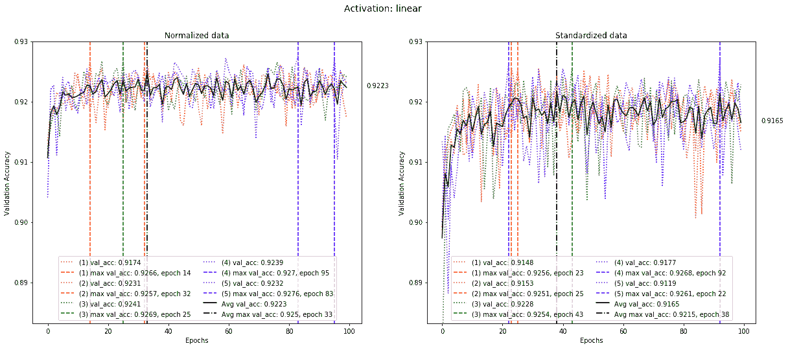

Fig.13 Validation accuracy for models trained with Linear activation

# 乙状结肠的

与线性模型相比，Sigmoid 激活产生了更稳定的模型，并且达到的最大验证准确度值更接近训练结束，但是验证准确度值是平均的。

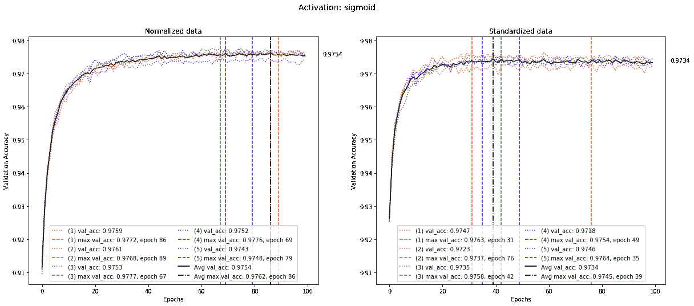

Fig.14 Validation accuracy for models trained with Sigmoid activation

# 硬乙状结肠

与普通的 Sigmoid 非常相似，它具有较低的最终平均值和较低的最大平均值，但达到的最大验证精度与 Sigmoid 完全相同。因此，对于这种特殊的设置，我们可以说，硬乙状结肠表现不如乙状结肠。归一化数据上的最大值更接近训练结束，这告诉我们，如果调整学习率，可能会取得更好的效果。

Fig.15 Validation accuracy for models trained with Hard Sigmoid activation

# 双曲正切值

尽管与 Sigmoid 的最大验证精度大致相同，TanH 的稳定性稍差。大多数局部最小值已经接近训练的中间，优化器无法进一步改善结果。具有这种激活函数的模型也可以从降低学习速率中受益。有趣的是，尽管 TanH 被认为比 Sigmoid 更先进，并且现在使用得更频繁，但后者可能仍然更适用于某些网络设置和任务。

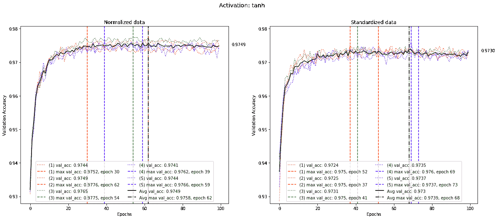

Fig.16 Validation accuracy for models trained with TanH activation

# 软设计

在标准化数据中，所有线都非常接近平均值。但是训练的结果也有些一般。使用标准化数据时，SoftSign 的稳定性要差得多，尽管最终精度稍高。

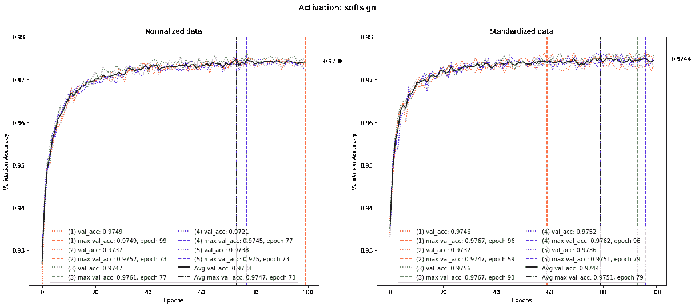

Fig.17 Validation accuracy for models trained with SoftSign activation

# 整流线性单元

这是我们在实验中第一次看到过度拟合。正如我们所看到的，模型在第 10 和第 40 个时期之间达到其峰值性能，然后开始缓慢下降。达到的最大验证准确度与标准化数据的 Sigmoid 相同，但低于标准化数据。因此，无需进一步微调，乙状结肠搏动 ReLU 在这里。

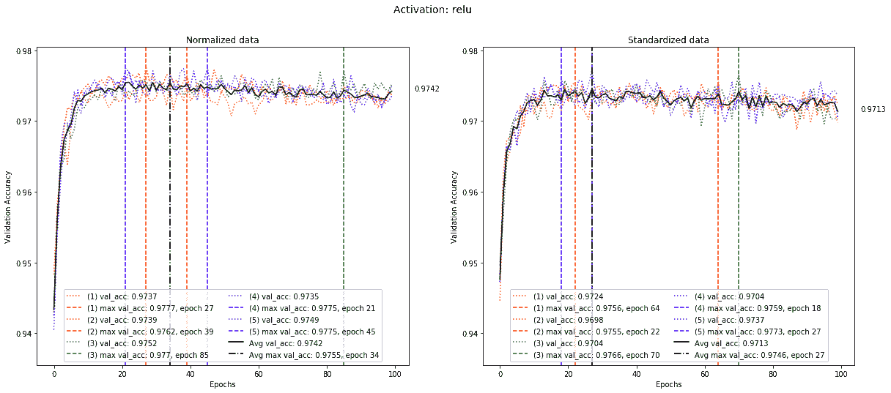

Fig.18 Validation accuracy for models trained with ReLU activation

# 泄漏 ReLU

## Alpha = 0.3(默认)

泄漏 ReLU 的表现比它的传统变种 ReLU 更差。最大验证精度和最后时期的精度都低于 ReLU。这意味着即使过度拟合，ReLU 对于我们的情况也是更可取的。

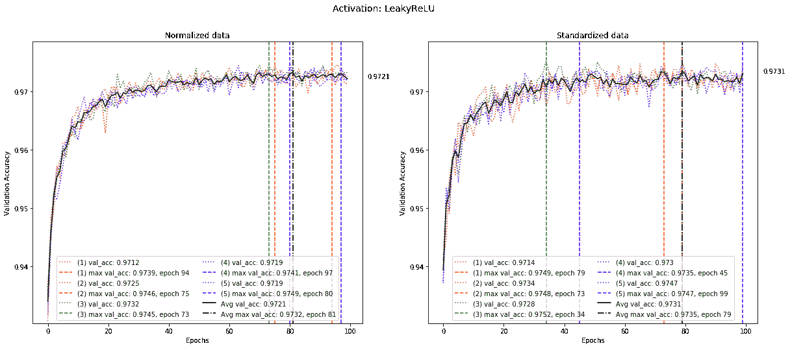

Fig.19 Validation accuracy for models trained with Leaky ReLU activation with alpha = 0.3

## 阿尔法= 0.01

减少“泄漏”参数α有助于模型显著改善标准化和规范化数据的结果。

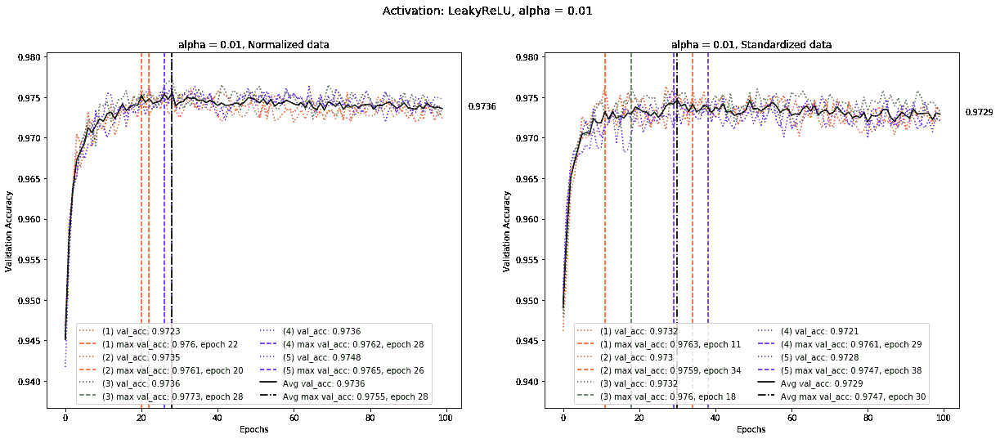

Fig.20 Validation accuracy for models trained with Leaky ReLU activation with alpha = 0.01

## 阿尔法= 1.5

将 alpha 设置为相对较大的值会导致我们实验中最差的性能之一。训练极不稳定，准确率很低。所以不要那么做。

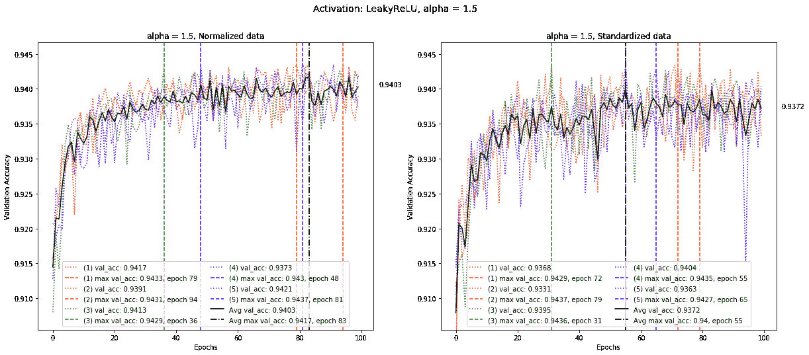

Fig.21 Validation accuracy for models trained with Leaky ReLU activation with alpha = 1.5

# 阈值 ReLU

## θ= 0.7

这是一个非常有趣的案例。用阈值 ReLU 和标准化数据训练的模型很快达到最大值，然后开始下降。所以这是一个明显的过度拟合，也是非常糟糕的整体性能。而在标准化数据上，尽管与其他激活相比仍然表现不佳，但根本没有过度拟合。我们看到，原始论文中提出的θ值对于归一化数据并不适用。这可能是对这两种数据转换方法的模型性能差异的最好证明。

Fig.22 Validation accuracy for models trained with Thresholded ReLU activation with theta = 0.7

## θ= 1.0(默认)

这个θ值导致了更差的性能。这意味着你应该谨慎使用深度学习框架中内置的默认值，并始终检查更改它们是否会带来更好的结果。

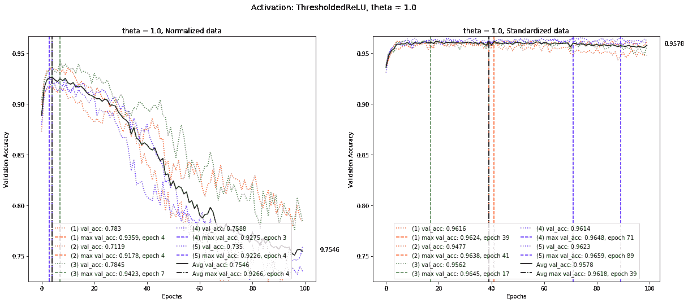

Fig.23 Validation accuracy for models trained with Thresholded ReLU activation with theta = 1.0

## θ=数据平均值

在精度和过拟合方面都有显著提高，但总体性能仍低于平均水平。这个例子演示了根据您输入的数据调整模型参数是非常重要的。

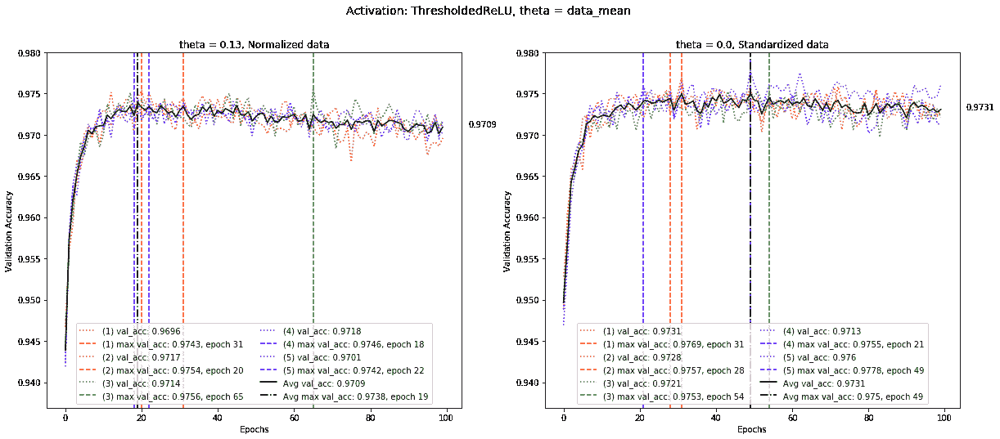

Fig.24 Validation accuracy for models trained with Thresholded ReLU activation with theta = data_mean

# 指数线性单位(ELU)

## Alpha = 1.0(默认)

相当稳定，在最大验证准确度方面是最好的之一。最大值是在训练过程中达到的，因此它可以更快地达到最佳结果，并且通过对学习速率进行一些微调，这些结果可能会得到进一步改善。这种激活在标准化和规范化数据上都表现很高。

Fig.25 Validation accuracy for models trained with ELU activation with alpha = 1.0

## 阿尔法= 0.5

性能也非常好，至少在标准化数据上是这样。

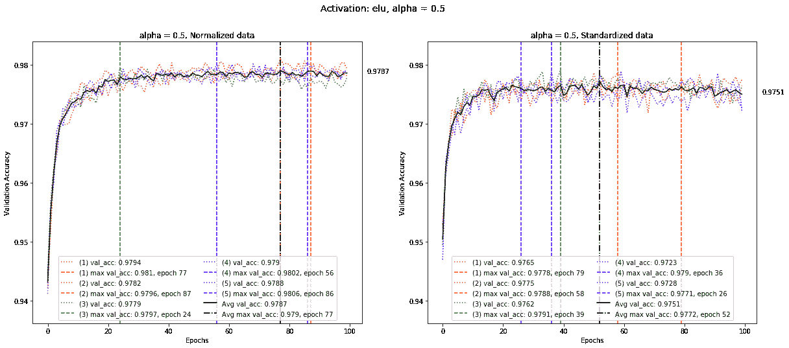

Fig.26 Validation accuracy for models trained with ELU activation with alpha = 0.5

## 阿尔法= 1.5

在标准化数据中，alpha = 1.5 的 ELU 在所有激活函数中处于领先地位。它的表现几乎和 SELU 一样好。标准化数据的最大值非常接近训练结束，因此，如果进一步训练，可能会取得更好的结果。

Fig.27 Validation accuracy for models trained with ELU activation with alpha = 1.5

# 比例指数线性单位(SELU)

第二好的激活功能，相当稳定，表现出更高的性能。标准化数据稍不稳定。稍后，我们将检查是否有可能通过降低学习率和调整辍学来改善结果，以便稳定训练和实现更高的准确性。

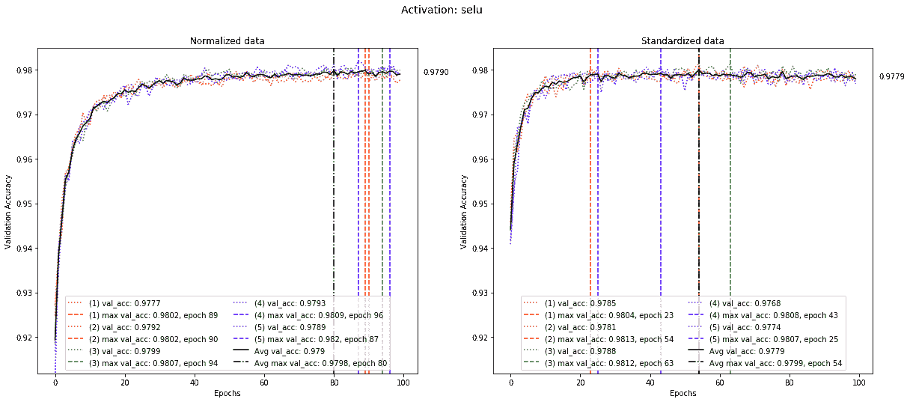

Fig.28 Validation accuracy for models trained with SELU activation

# SoftPlus

就标准化数据的最大验证精度而言，该函数排名第三(仅次于 SELU 和 ELU)，但与领先者有很大差距。根据标准化数据，存在过度拟合和低于平均水平的性能。

如果我们将 SoftPlus 与 ReLU 的结果进行比较，我们可以看到，ReLU 与 SoftPlus 相比“质量更好或相当”的说法并没有在我们的特定设置中得到证实。它支持了一个被广泛接受的观点，即神经网络组件的基准测试是困难的，并且在不同的网络设置中会导致相互矛盾的结果。

Fig.29 Validation accuracy for models trained with SoftPlus activation

# 摘要

SoftPlus 击败 ReLU 的例子与深度学习之父在他们的论文中所说的相反，这意味着我们在这个实验中获得的激活函数的排名和结果只适用于我们正在考虑的神经网络的特定配置，并且通常不会告诉你一个激活函数比另一个更好。但至少对于在图像分类任务上具有 RMSProp 优化器的 3 层全连接网络，我们可以说，通过使用指数线性单元激活或其缩放变化，您将能够获得比其他激活更好的结果。

总而言之，本实验的主要学习点是，对于类似的任务和神经网络设置，您应该:

*   为了达到更高的验证精度，对数据进行标准化，如果需要更快的结果，则进行标准化；
*   使用 ELU 或 SELU 激活；
*   尝试调整激活函数参数，看看它们是否能产生更好的结果；
*   是的，永远不要使用线性激活。

你可以在我的 github 上找到实验和可视化结果[的代码。在](https://github.com/voice32/deep_study)[的下一部分](https://medium.com/@maksutov.rn/deep-study-of-a-not-very-deep-neural-network-part-3a-optimizers-overview-ed1631127fb7)中，我们将扩展我们的实验，并以同样的方式测试其他优化器，看看它们在与相同的激活函数组合时表现如何。

我总是很高兴认识新朋友并分享想法，所以如果你喜欢这篇文章，可以考虑[在 LinkedIn](https://www.linkedin.com/in/rinat-maksutov-79bbb517/) 上加我。

**深度学习一个不是很深的神经网络系列:**

*   [第 1 部分:我们的数据中有什么](https://medium.com/@maksutov.rn/deep-study-of-a-not-very-deep-neural-network-part-1-whats-in-our-data-7971356037a3)
*   [第二部分:激活功能](https://medium.com/@maksutov.rn/deep-study-of-a-not-very-deep-neural-network-part-2-activation-functions-fd9bd8d406fc)
*   [第 3a 部分:优化器概述](https://medium.com/@maksutov.rn/deep-study-of-a-not-very-deep-neural-network-part-3a-optimizers-overview-ed1631127fb7)
*   [第 3b 部分:选择优化器](https://medium.com/@maksutov.rn/deep-study-of-a-not-very-deep-neural-network-part-3b-choosing-an-optimizer-de8965aaf1ff)
*   [第四部分:如何找到合适的学习率](https://medium.com/@maksutov.rn/deep-study-of-a-not-very-deep-neural-network-part-4-how-to-find-the-right-learning-rate-e06d6da26b2e)
*   [第 5 部分:压差和噪声](https://medium.com/@maksutov.rn/deep-study-of-a-not-very-deep-neural-network-part-5-dropout-and-noise-29d980ece933)
*   第 6 部分:权重初始化
*   第 7 部分:正规化
*   第 8 部分:批处理规范化
*   第 9 部分:大小很重要
*   第 10 部分:将它们融合在一起