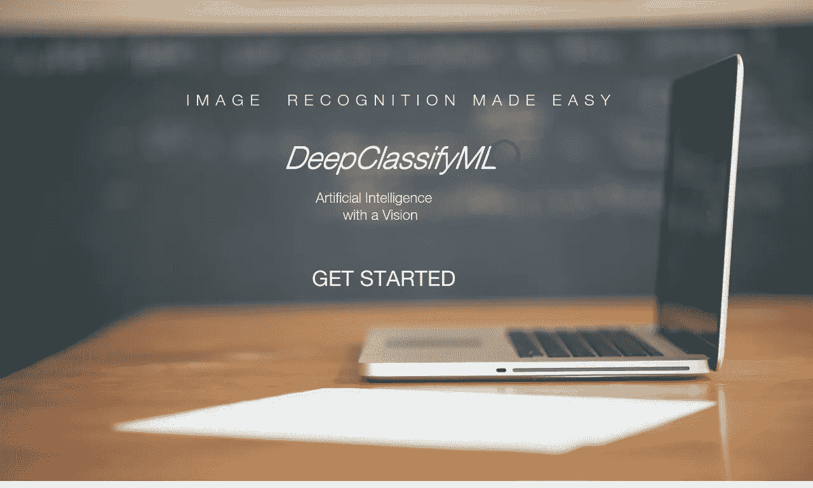
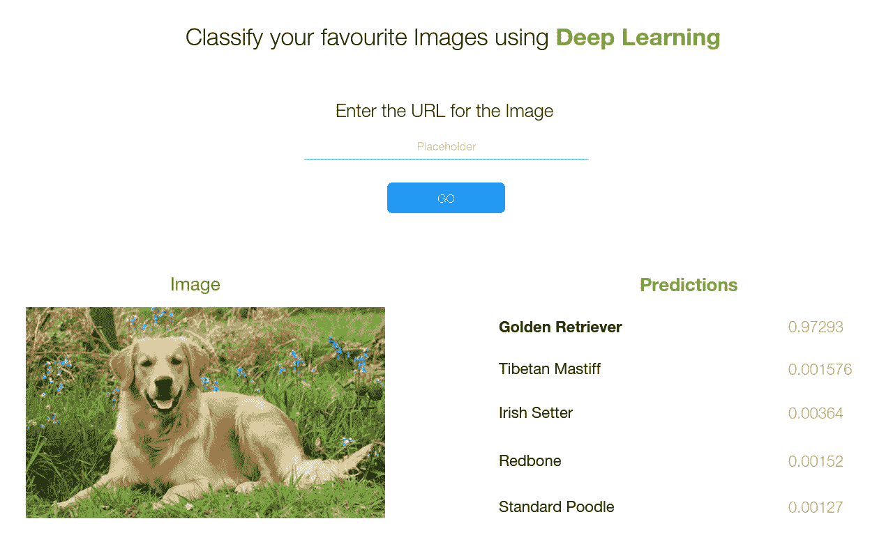
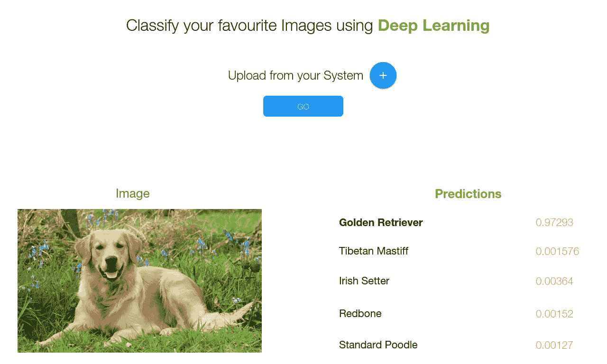
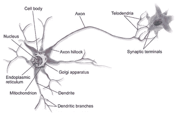

# DeepClassifyML 第 1 周第 2 部分

> 原文：<https://towardsdatascience.com/deepclassifyml-week-1-part-2-3b234ca3fcb4?source=collection_archive---------7----------------------->

*这篇文章是“Hasura 实习”系列的一部分，详细介绍了应用程序的原型阶段。查看* [*第 1 部分*](https://medium.com/@akshaybhatia10/deepclassifyml-week-1-part-1-b1c53e0a7cc) *了解 app 理念和一些计算机视觉基础知识。*

[第一部分](https://medium.com/@akshaybhatia10/deepclassifyml-week-1-part-1-b1c53e0a7cc)被[数据科学精选](https://medium.com/@DataSciencePick)推荐，这真的很酷，因为这是我的第一个博客。我会尽量让这些博客非常入门，因为我的目标是让深度学习和计算机视觉对于 it 经验很少并且想马上开始的人来说非常简单。但首先要做的是。

*Hasura 实习的应用理念是*一个使用 Hasura 后端部署的图像分类 web 应用。它会从用户那里获取一张图片，并使用预训练的 InceptionV3 模型将其分类为前 5 类。接下来是原型阶段。这是使用流行的原型工具 [Proto.io](http://proto.io) 完成的。作为应用程序的指导方针/规则的一部分，应用程序必须不超过 3 个屏幕，并且在复杂性方面应该相当简单。但 DeepClassifyML 会更简单，因为应用程序的核心功能可能仅限于一个屏幕。不知何故，我决定把它分成 3 个屏幕，结果如下:

The basic landing page

现在第一个屏幕只是这个基本的登录页面。没什么好吹嘘的。这个登录页面将用户带到剩下的两个页面—

Using a link to upload the your image.

To upload the Image from your system.

第一页使用一个链接上传一张图片，第二页使用您系统中的一张图片对它们进行分类。老实说(正如你可以从这些快照本身看到的！)，我真的没有为原型阶段做足够的工作，因为这个应用程序非常基础。我打算做的是深度学习部分。让我们从这个开始。

在这篇文章中，我将讨论作为深度学习基础的神经网络。

神经网络就像你大脑内部的连接。那么你的大脑是如何工作的呢？(*神经科学来袭！！*)

主要部分*神经元*，通过一系列被称为*树突*的精细结构收集来自其他神经元的信号。然后，这些神经元通过被称为*轴突的细长支架发出电活动尖峰。**轴突*分裂成上千个分支，如图所示。*突触，*每个分支末端的一种结构，将轴突的这种活动转化为电信号，抑制或兴奋相连神经元的活动。当一个神经元接收到的兴奋性输入与其抑制性输入相比足够大时，它会沿着轴突发出一个电活动尖峰。*学习*是通过改变突触的有效性，从而改变一个神经元对另一个神经元的影响而发生的。

类似地，*人工神经网络*是由互连单元组成，充当神经元。*突触*的功能由一个可修改的权重建模，该权重与每个连接相关联。每个人都查看输入数据，并决定如何对数据进行分类，即转换传入活动的模式。因此，一个简单的神经网络通过接收输入数据、处理该信息并最终以决策的形式产生输出来做出决策。简而言之，这可以通过以下两步完成:

1.  将每个传入活动乘以连接上的权重，并将所有这些加权输入相加。这是*总输入*。
2.  然后，该单元(神经元)使用输入输出函数，将总输入转换为输出活动(决策)。

这取决于神经网络来*学习*什么是最重要的，并调整它如何考虑这些数据。因此，神经网络的行为取决于可修改的权重和输入输出函数(激活函数)。

这些权重和激活函数是什么？

让我们考虑一个典型的情况。一些输入数据(比如一个数字，可能同时有许多输入)进入神经网络。这将乘以一个权重值(可修改)。这些权重开始时是随机值，当神经网络知道哪种输入数据会产生正确的结果时，网络就会根据以前的权重导致的分类错误来调整权重。这些权重指定了输入数据的影响强度。这叫做*训练*神经网络。

较高的权重意味着神经网络认为该输入比其他输入更重要，而较低的权重意味着该输入被认为不太重要。这之后是加权输入数据的总和，以产生单个值。最终的输出值通过一个激活函数，它是神经元动作电位发放的速率。激活功能是在给定神经元输入的情况下，决定其输出应该是什么的功能。它决定实际输出，因此其输出通常被称为“激活”。

接下来我会举一个经典的例子。

假设你想知道哪种学生在学校考试中得分最高。你可能会考虑一些因素，比如一个人学习的小时数，他/她参考的书籍，他们的睡眠时间等等。这些因素将成为神经网络的输入。如果你能计算出每个因素对分数的影响程度，那就太好了。这是神经网络学习识别的内容。它通过更新每个特征的相应权重来学习哪些特征是最好的。权重会发生变化，以便下次对结果进行更准确的分类。

这就是我在这篇文章中的全部内容。下一次，我将深入探讨*训练*和*学习背后的数学和算法。*再加上深度学习非常酷的应用，比如这个:

【https://www.youtube.com/watch?v=Svk0SxyNdr8 

编辑:你可以在 akshaybhatia10@gmail.com 找到我