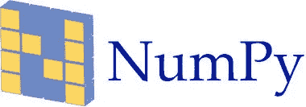

# DeepClassifyML 第 2 周第 1 部分

> 原文：<https://towardsdatascience.com/deepclassifyml-week-2-part-1-1e1bafca79eb?source=collection_archive---------1----------------------->

*这篇文章是“Hasura 实习”系列文章的一部分，涵盖了为其设置开发环境。查看* [*第一部分*](https://medium.com/@akshaybhatia10/deepclassifyml-week-1-part-1-b1c53e0a7cc) *、* [*第二部分*](https://medium.com/towards-data-science/deepclassifyml-week-1-part-2-3b234ca3fcb4) *了解 app 想法和一些计算机视觉和神经网络基础知识。*

前两篇帖子得到了很大的反响，第二部分[](https://medium.com/towards-data-science/deepclassifyml-week-1-part-2-3b234ca3fcb4)**发表在 [*【走向数据科学】*](https://medium.com/towards-data-science) *上。这篇文章将讲述如何为图像分类应用程序设置开发环境。我使用的是 macOS X，但是这些说明适用于 Windows、Mac OS X 和 Linux 平台。这个项目的所有库都可以使用 [*pip*](https://pypi.python.org/pypi/pip) 或 [*brew*](https://brew.sh/) *安装。*这个项目的主要库是 [*Keras*](http://keras.io) (带 [*Tensorflow*](http://tensorflow.org) 后端)和 [*Flask*](https://pypi.python.org/pypi/Flask/0.12.2) 。如果想建立一个完整的机器学习环境，最好的办法就是安装 [*Anaconda*](https://www.continuum.io/downloads) 。它是一个开源平台，为数据科学和机器学习提供了 100 多个最流行的 Python 和 R 包。先从 [*这里*](https://www.continuum.io/downloads) 安装 Anaconda。确保选择适合您的平台(Windows、OSX 或 Linux)的下载选项和正确的 python 版本(2.7 或 3.5)。安装是一个快速简单的过程，应该不到 10 分钟(取决于您的连接)，并占用大约 1 GB 的驱动器空间。Anaconda 附带了一套叫做 Anaconda Navigator 的图形工具。***

*深度学习部分，我推荐名为 [*conda*](http://conda.pydata.org/docs/index.html) 的 Anaconda 命令行环境。Conda 快速、简单，很难隐藏错误消息，并且您可以快速确认您的环境已安装并正常工作。接下来的几个步骤在 [*这里*](https://github.com/leriomaggio/deep-learning-keras-tensorflow) 下设置环境部分有很好的记录，所以我将跳过这一部分。另一个很棒的博文是 [*这里*](https://www.dataweekends.com/blog/2017/03/09/set-up-your-mac-for-deep-learning-with-python-keras-and-tensorflow) 。*

*现在你有了一个工作的 Python 环境，可以开始学习、实践、开发和解决机器学习和深度学习问题。你也可以在这里 阅读 [*Dat Tran*](https://medium.com/@datitran) 关于在 AWS [*上建立深度学习环境的一篇很棒的帖子。*](https://medium.com/towards-data-science/using-docker-to-set-up-a-deep-learning-environment-on-aws-6af37a78c551)*

*深度学习需要数学。因此，在开始构建我们自己的神经网络之前，理解基础知识非常重要。这篇文章旨在提供一个关于线性代数的 vert 简短复习，以及一些使用已经预装在 Anaconda 中的 [NumPy](http://www.numpy.org/) 库的指导，以便在 Python 中有效地处理矩阵。那我们开始吧。(*注:需要基本的 Python 编程*)*

**

*Numpy*

*NumPy 为 Python 中的数学运算提供了快速的替代方法，因此被设计成可以有效地处理数字组，比如矩阵。你一定要花些时间探索它的 [*文档*](https://docs.scipy.org/doc/numpy/reference/) 来了解更多。我们在 NumPy 中处理数字最常见的方式是通过`[ndarray](https://docs.scipy.org/doc/numpy/reference/arrays.html)`对象。它们类似于 Python 列表，但是可以有任意数量的维度。`ndarray`支持非常快速的数学运算(这正是我们想要的)，而使用 python 列表会非常慢，不适合这里。一个`ndarray`的元素是同质的(都是相同的`dtype`)，并且由一个正整数元组索引。因为它可以存储任意数量的维度，所以您可以使用`ndarray`来表示我们之前讨论过的任何数据类型:标量、向量、矩阵或张量。我们可以从嵌套的 Python 列表中初始化 numpy 数组，并使用方括号访问元素:*

```
*import numpy as npa = np.array([[0, 1, 2], [3, 4, 5]])   *# a 2D, 2 x 3, array*
a*
```

*输出:*

```
*array([[0, 1, 2],
       [3, 4, 5]])*
```

*Numpy 还提供了许多创建数组的函数:*

```
*import numpy as npa = np.zeros((2,2))   *# Create an array of all zeros*
print(a)              *# Prints "[[ 0\.  0.]*
                      *#          [0\.  0.]]"*b = np.ones((1,2))    *# Create an array of all ones*
print(b)              *# Prints "[[ 1\.  1.]]"*d = np.eye(2)         *# Create a 2x2 identity matrix*
print(d)              *# Prints "[[ 1\.  0.]*
                      *#          [ 0\.  1.]]"**
```

*你可以在文档中阅读关于数组创建[的其他方法。](http://docs.scipy.org/doc/numpy/user/basics.creation.html#arrays-creation)*

# *标量*

*NumPy 中的标量比 Python 中的要复杂一些。而不是 Python 的基本类型像`int`、`float`等。，NumPy 让我们指定有符号和无符号类型，以及不同的大小。所以除了 Python 的`int`，还有类似`uint8`、`int8`、`uint16`、`int16`等类型。*

*我们可以创建一个 Numpy 标量，如下所示:*

```
*a = np.array(5)*
```

*不过，您仍然可以在`ndarray`、NumPy 标量和普通 Python 标量之间执行数学运算，您将在基于元素的数学课程中看到这一点。*

*您可以通过检查它们的`shape`属性来查看数组的形状。维数是数组的*秩*；数组的*形状*是一个整数元组，给出了数组在每个维度上的大小。*

```
*a.shape*
```

*即使标量在数组内部，你仍然可以像普通标量一样使用它们。所以你可以输入:*

```
*n = a + 3*
```

*并且`n` 现在将等于`8`。注意，`n`的类型是`numpy.int64`，因为它使用 NumPy 类型，而不是 Python 类型。*

# *矩阵*

*我们使用 NumPy 的`array`函数创建矩阵，就像我们创建向量一样。然而，我们不是仅仅传入一个列表，而是提供一个列表的列表，其中每个列表代表一行。因此，要创建一个包含数字 1 到 9 的 3x3 矩阵，我们可以这样做:*

```
*m = np.array([[1,2,3], [4,5,6], [7,8,9]])*
```

*检查它的`shape`属性将返回元组`(3, 3)`以表明它有两个维度，每个长度为 3。*

*我们可以像访问向量一样访问矩阵的元素，但是使用额外的索引值。所以为了在上面的矩阵中找到数字`6`，我们将访问`m[1][2]`。*

# *Numpy 中的元素式操作*

```
*values = [1,2,3,4,5]
values = np.array(values) + 5It now holds [6,7,8,9,10]*
```

*因此，如果您已经有了一个名为`values`的`ndarray`，您可以只做:*

```
*values += 5*
```

*NumPy 实际上有加法、乘法等功能。但是它也支持使用标准的数学运算符。所以下面两行是等价的:*

```
*x = np.multiply(array, 5)
x = array * 5*
```

*需要注意的是`*`是元素式乘法，不是矩阵乘法。相反，我们使用`dot` 函数来计算向量的内积，将向量乘以矩阵，以及将矩阵相乘。`dot`既可以作为 numpy 模块中的函数，也可以作为数组对象的实例方法:*

```
*x = np.array([[1,2],[3,4]])
y = np.array([[5,6],[7,8]])v = np.array([9,10])
w = np.array([11, 12])*# Inner product of vectors; both produce 219*
print(v.dot(w))
print(np.dot(v, w))*# Matrix / vector product; both produce the rank 1 array [29 67]*
print(x.dot(v))
print(np.dot(x, v))*# Matrix / matrix product; both produce the rank 2 array*
*# [[19 22]*
*#  [43 50]]*
print(x.dot(y))
print(np.dot(x, y))*
```

*Numpy 为在数组上执行计算提供了许多有用的函数；其中最有用的是`sum`:*

```
*import numpy as npx = np.array([[1,2],[3,4]])print(np.sum(x))  *# Compute sum of all elements; prints "10"*
print(np.sum(x, axis=0))  *# Compute sum of each column; prints "[4 6]"*
print(np.sum(x, axis=1))  *# Compute sum of each row; prints "[3 7]"**
```

*除了使用数组计算数学函数之外，我们经常需要对数组中的数据进行整形或操作。这种操作最简单的例子是转置一个矩阵；要转置一个矩阵，只需使用数组对象的`T`属性:*

```
*import numpy as npx = np.array([[1,2], [3,4]])
print(x)    *# Prints "[[1 2]*
            *#          [3 4]]"*
print(x.T)  *# Prints "[[1 3]*
            *#          [2 4]]"**# Note that taking the transpose of a rank 1 array does nothing:*
v = np.array([1,2,3])
print(v)    *# Prints "[1 2 3]"*
print(v.T)  *# Prints "[1 2 3]"**
```

# *矩阵积*

*要找到矩阵乘积，可以使用 NumPy 的`matmul`函数。*

```
*a = np.array([[1,2,3,4],[5,6,7,8]])
a
# displays the following result:
# array([[1, 2, 3, 4],
#        [5, 6, 7, 8]])
a.shape
# displays the following result:
# (2, 4)b = np.array([[1,2,3],[4,5,6],[7,8,9],[10,11,12]])
b
# displays the following result:
# array([[ 1,  2,  3],
#        [ 4,  5,  6],
#        [ 7,  8,  9],
#        [10, 11, 12]])
b.shape
# displays the following result:
# (4, 3)c = np.matmul(a, b)
c
# displays the following result:
# array([[ 70,  80,  90],
#        [158, 184, 210]])
c.shape
# displays the following result:
# (2, 3)*
```

*如果您的矩阵有不兼容的形状，您会得到一个错误，如下所示:*

```
*np.matmul(b, a)
# displays the following error:
# ValueError: shapes (4,3) and (2,4) not aligned: 3 (dim 1) != 2 (dim 0)*
```

*尽管理解 Numpy 的工作原理非常重要，但我想让这篇文章保持真正的介绍性，所以很明显 Numpy 中有很多操作没有在这里介绍。因此我在下面链接了一些很棒的资源。*

*最后让我们看看权重(你在第二部分 *中学到的)如何将*与 Numpy 矩阵和转置函数联系起来:*

*假设你有下面两个矩阵，叫做“输入”和“权重”。“输入”是传递给你的神经网络的数据，“权重”是你的神经网络学习修改以找到最佳可能的解决方案。*

```
*inputs = np.array([[-0.27,  0.45,  0.64, 0.31]])
inputs
# displays the following result:
# array([[-0.27,  0.45,  0.64,  0.31]])inputs.shape
# displays the following result:
# (1, 4)weights = np.array([[0.02, 0.001, -0.03, 0.036], \
    [0.04, -0.003, 0.025, 0.009], [0.012, -0.045, 0.28, -0.067]])weights
# displays the following result:
# array([[ 0.02 ,  0.001, -0.03 ,  0.036],
#        [ 0.04 , -0.003,  0.025,  0.009],
#        [ 0.012, -0.045,  0.28 , -0.067]])weights.shape
# displays the following result:
# (3, 4)*
```

*让我们试着把它们相乘，因为这就是我们如何得到神经网络的输出。*

```
*np.matmul(inputs, weights)
# displays the following error:
# ValueError: shapes (1,4) and (3,4) not aligned: 4 (dim 1) != 3 (dim 0)*
```

*如果你像他们现在这样尝试，你会得到一个错误。由于左矩阵中的列数`4`与右矩阵中的行数`3`不相等，导致形状不兼容，从而出现错误。*

*但是如果我们对“权重”矩阵进行转置，结果是:*

```
*np.matmul(inputs, weights.T)
# displays the following result:
# array([[-0.01299,  0.00664,  0.13494]])*
```

*如果你转置“输入”并交换它们的顺序，它也是有效的。*

```
*np.matmul(weights, inputs.T)
# displays the following result:
# array([[-0.01299],# 
#        [ 0.00664],
#        [ 0.13494]])*
```

*两个答案是彼此的转置，所以我们使用的乘法的顺序实际上取决于我们想要的形状。*

*在下一篇文章中，我们将把这些概念应用到一个神经网络问题中。*

> *Numpy 链接:*
> 
> *[*这本*](https://github.com/jrjohansson/scientific-python-lectures/blob/master/Lecture-2-Numpy.ipynb) 笔记本详细解释了许多操作。还要查看 Numpy 库文档:[https://docs.scipy.org/doc/numpy-dev/user/quickstart.html](https://docs.scipy.org/doc/numpy-dev/user/quickstart.html)。另一个很好的资源是关于这个主题的科学讲座系列。Numpy 章出自[本*本*本](https://github.com/jakevdp/PythonDataScienceHandbook/blob/master/notebooks/02.00-Introduction-to-NumPy.ipynb)本。*