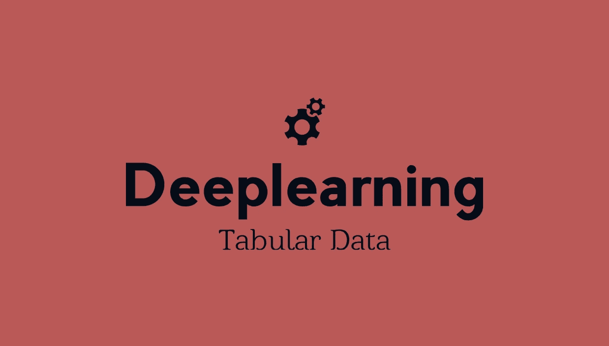
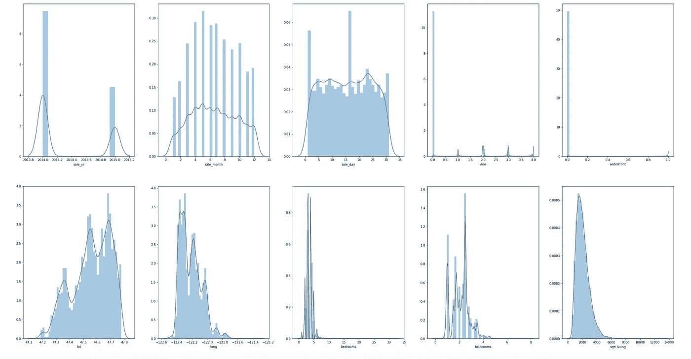
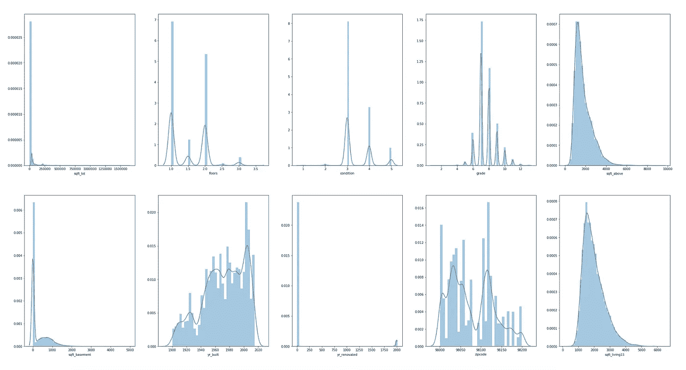
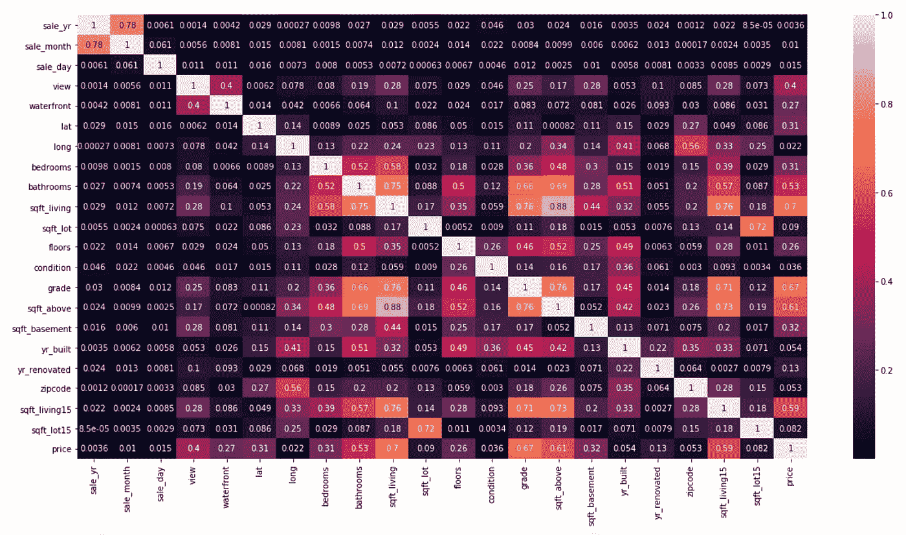
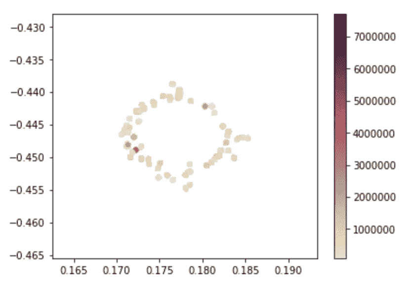

# 使用表格数据的深度学习:可视化、数据处理、分类嵌入

> 原文：<https://towardsdatascience.com/deeplearning-with-tabular-data-data-processing-cd2e73908257?source=collection_archive---------4----------------------->

(寻求项目合作)

与其他机器学习算法一样，在建立深度学习网络时，理解你的数据很重要。让我们使用一个简单的表格数据集来可视化数据，得出结论，以及不同的处理技术如何提高您的深度学习模型的性能。

[金县房价](https://www.kaggle.com/harlfoxem/housesalesprediction)数据集有 21613 个数据点，涉及金县的房屋销售价格。它有大约 19 个专栏，如下所示。它是日期、数字和分类数据的混合。使用开箱即用的数据，我们将得到 **149167.61 的 MAE。**然而，通过一些数据处理，我们可以得到低至 **69471.41 的平均汇率。这超过了 50%的改进。**

## 数据可视化

让我们深入研究数据，看看在构建模型之前，我们是否能对数据有所了解。我们将使用 Python 统计可视化库 [Seaborn](https://seaborn.pydata.org/) ，它构建在 matplotlib 之上。下面是每种功能相对于价格的分布。

*   销售年份数据是双峰数据，包含 2014 年和 2015 年的数据
*   诸如卧室数量、浴室数量、客厅平方英尺、楼上平方英尺、地下室平方英尺、销售价格等数据是单峰的，我们已经可以看出，对于这些特征具有较高价值的房屋，该模型可能具有较高的平均误差。

让我们看看特征 w.r.t .标签栏的相关性，也就是房子的销售价格。

## 构建深度学习模型

我将使用 keras 2.0 库构建一个序列神经网络来学习预测房价的回归模型。

导入数据集，然后将其分为定型集、验证集和测试集。

该模型有两个隐藏的密集图层和一个最终的线性组合图层来生成回归输出。我们将使用均方误差作为损失函数。

使用现成的数据给我们提供了 **149167.61** 的 MAE。现在让我们看看一些数据处理技术，以及它们如何帮助提高性能。

**白化数据**

我们的一些特征是 0.1 的数量级，一些是 10 的数量级，一些是 100 的数量级，一些是 10000 的数量级。不同数值顺序的这种差异会导致较高顺序的值支配其他值。“白化”数据有助于规范化不同值的顺序。

白化操作采用本征基中的数据，并将每个维度除以本征值，以标准化尺度。这种变换的几何解释是，如果输入数据是多变量高斯，那么白化后的数据将是均值为零、协方差矩阵相同的高斯。假设我们的数据应该是高斯分布，我们将计算每列的 z 得分。

关于预处理，重要的一点是任何预处理统计(例如，数据平均值)必须只在训练数据上计算，然后应用于验证/测试数据。

一旦我们用标准化的数据重新运行模型，**我们的 MAE 下降到** **99622.24。**这是对使用现有数据的巨大改进。

**将“经度”和“纬度”转换为距离**

虽然经度和纬度可以按原样使用，但我们可以通过将经度和纬度转换为房子与固定位置的距离以及表示房子相对于固定位置的方向的布尔值来获得更多的洞察力。

使用新的特征“距离”、“更长”、“更短”、“更长”和“更短”，我们在数据集上再次训练模型。训练集的结果 **MAE 进一步下降到 87231.59。**

**处理分类数据**

邮政编码是数据中的一个特征列。我们一直把它当作一个正常的数值，但是，不同的邮政编码值没有顺序关系。此外，它们编码一些更深层次的关系，例如，一些邮政编码有更昂贵的房子，因为它们更接近学校或交通等。

借助于嵌入，可以丰富地表达分类数据。你可以从 fast.ai 的这篇文章中阅读更多关于嵌入的内容。

为了在 Keras 2.0 中使用嵌入，我们必须使用函数式 API。输入之一将是邮政编码数据，我们将把它转换成一个嵌入。另一个输入将是其他特征的向量。

如果我们把模型打印出来并可视化，这个模型会更容易理解。

训练这个模型并在测试数据集上运行它，**MAE 急剧下降到 69471.41。**

让我们使用 TSNE 库来可视化 zipcode 嵌入，如下所示:

我们看到左侧有一组邮政编码，其中包含售价较高的房屋。

## 结论

因此，当我们从 MAE 为 **149167.61 开始，**在白化数据、处理数据、使用分类嵌入之后，我们将 MAE 减少到了 **69471.41。**