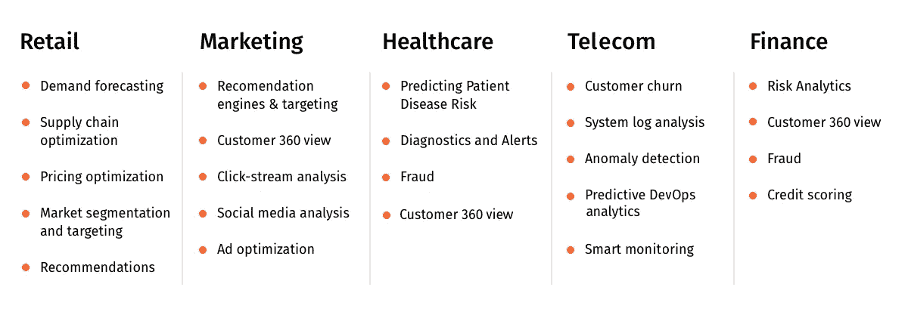
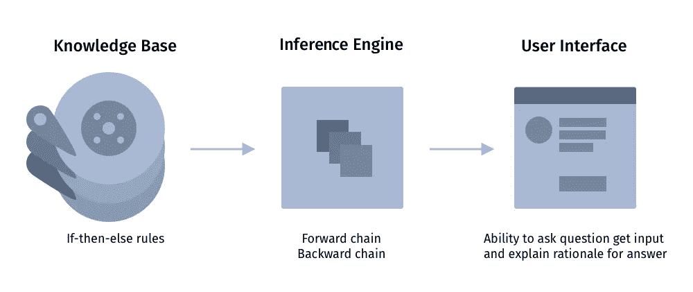
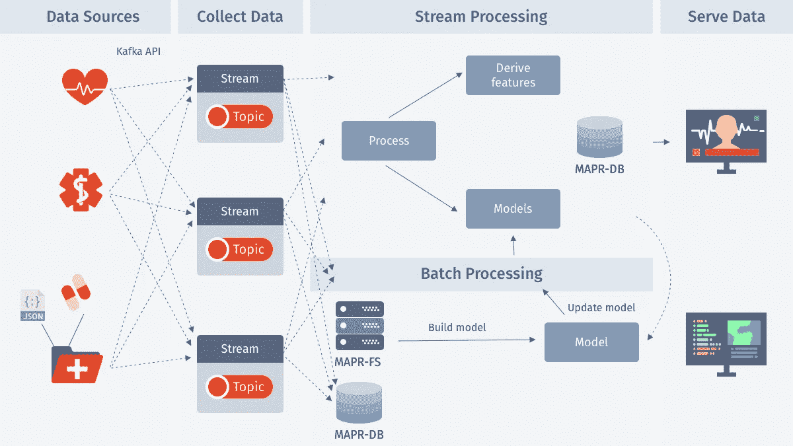
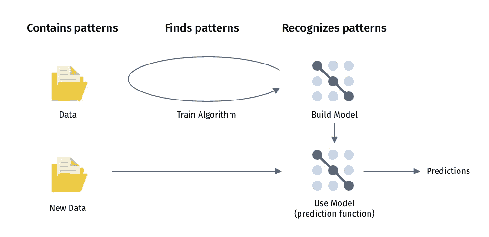
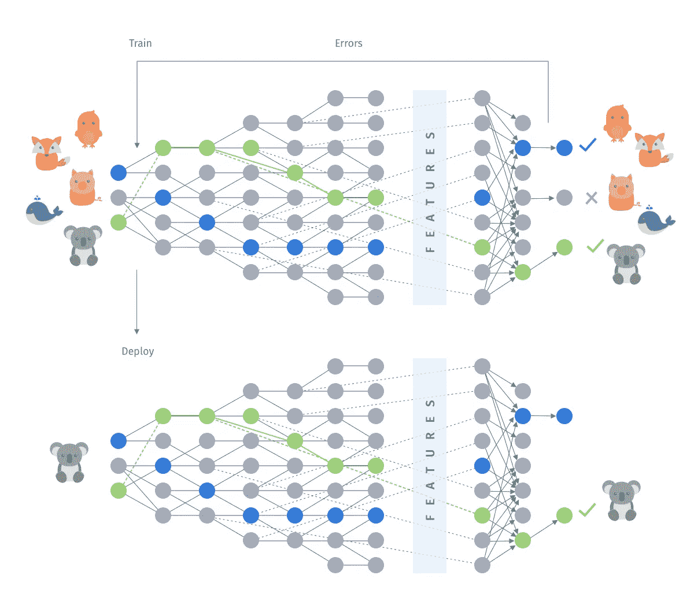
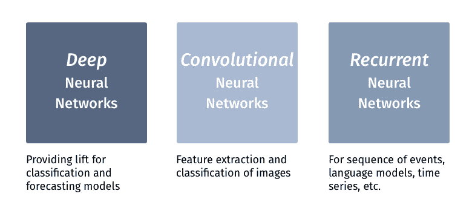

# 揭秘:人工智能，机器学习，深度学习

> 原文：<https://towardsdatascience.com/demystified-ai-machine-learning-deep-learning-c5259d38678e?source=collection_archive---------10----------------------->

很多人把人工智能(AI)、机器学习(ML)、深度学习(DL)这几个词当成同义词。这实际上与事实相差甚远，今天我们来揭开这些误解的神秘面纱。

AI、ML、DL 是各种数据分析模型和算法在不同行业各种用例的实际应用。虽然这些工具还不能做出道德选择或作为有意识的机器，但它们有潜力为任何企业创造更多价值。这是通过发现以前看不见的模式和预测某些行动的可能结果来实现的。我们希望这篇文章将提供对人工智能、ML 和 DL 能力的更好理解，并将成为你迈向人工智能驱动的数据分析之旅的起点。

沿着这条路的第一步是通过专家系统完成的，这是第一次尝试将数据分析的过程编码。专家解释了一些领域专业知识的规则，这些规则后来被编入规则引擎并用于回答问题。然而，这种结构只能根据这些预定义的规则工作，并且不能随着时间的推移而改进。随着新事实的增加，保持规则引擎的更新也是一项麻烦且费时的工作。然而，专家系统在医疗保健和金融领域仍然非常普遍。

机器学习的下一步是当现代计算机 CPU 架构被引入时，随后是图形处理器单元(GPU)。GPU 的核心优势在于，由于容纳了数千个较小的内核，它们能够进行并行数据处理，而不是在几个较大的 CPU 内核中进行串行处理。这项技术的进一步发展和所有数据密集型项目向云的过渡导致了人工智能开发的巨大繁荣。

此外，使用[大数据工具](https://itsvit.com/big-data/2017-review-big-data-projects-tools/)，如 Hadoop、Spark、Flink、Map Reduce 和 [Cassandra](https://itsvit.com/blog/top-5-reasons-use-apache-cassandra-database/) 确保企业最大限度地利用其大数据能力。以前，数据存储在某个地方，必须上传到其他地方进行处理。这导致数据传输速度成为瓶颈，而且非常昂贵。现代的方法意味着将数据存储在云中，并直接处理数据，而不是相反。这就划算多了，更别说快多了。

# 什么是人工智能:伟大的东西，只是还没有工作

我们已经发表了一篇文章解释说 [AI 不会以有意识机器人](https://itsvit.com/blog/ai-coming-not-sentient-robots/)的形式出现。事实上，自从引入了[图灵测试](https://en.wikipedia.org/wiki/Turing_test)，人工智能就成了一个总括术语和时髦词汇。科学家们努力在机器中创造智力，但这不应该是人类智力的复制品。

> ***AI 是一组随着时间的推移而学习和进化的算法，在处理它们的任务时变得越来越好，但却无法进行道德选择(不知道什么是好什么是坏)或理解艺术的价值，或从音乐中获得审美愉悦。***

事实上，人工智能现在更多的是人类头脑中一个新领域的代号。数学理论的每一个新方面都获得了实际的实现，不再是人工智能。MapR(企业 Hadoop 供应商)的首席应用架构师 Ted Dunning 博士描述了这一现象，他说“**当某些东西不起作用时——我们称之为 AI。当它开始正常工作时，我们称之为其他东西**。

# 什么是机器学习:人工智能应用于大数据分析

机器学习是 20 世纪 80 年代左右蓬勃发展的人工智能技术的子集。其主要应用是不断提升的大数据分析质量和精度。ML 算法在历史数据中发现模式，训练的 ML 模型遵循这些模式来预测新数据中有价值的见解。

最大似然学习领域有两个主要的子域:监督学习和非监督学习。

*   **监督学习**使用人类创建的数据标签(收入和输出数据都提供给算法)来构建数据。这个类别中的 ML 模型包括随机决策森林、朴素贝叶斯算法、SVM 和线性或逻辑回归训练。
*   **无监督学习**使用未标记的数据，ML 模型必须按照自己的速度训练自己，或者根据反馈最大化回报。

机器学习主要用于数据分类，并广泛用于金融和银行业，以打击欺诈和风险管理。我们已经描述了银行业中机器学习的[用例](https://itsvit.com/blog/5-use-cases-machine-learning-banking-industry/)或者各种业务如何[使用机器学习来改善金融服务](https://itsvit.com/blog/top-5-machine-learning-use-cases-financial-industry/)。

# 深度学习:多层神经网络

深度学习算法使用多层不同权重的节点，即所谓的深度神经网络或 DNNs。有输入和输出节点，它们之间至少有 10 层。通过调整每个 DNN 节点的逻辑权重，数据科学家可以影响结果，从而训练模型以达到大规模所需的结果。由于数据大规模并行处理的发展和强大 GPU 的使用，数据科学家现在可以使用数千层的 DNNs。

逻辑权重的每次重新调整都会使模型更好地理解所需的对象特征。这个过程的优点是，在开始时可以不定义特征，并且模型将随着时间的推移学会自己识别最佳结果。

dnn 是深度学习中使用最广泛但不是唯一的 ML 算法类型。

我们已经解释了[深度学习如何真正工作](https://itsvit.com/blog/short-guide-deep-learning-really-works/)，以及涵盖了 2017 年在[文本和语音应用](https://itsvit.com/blog/deep-learning-summary-2017-text-speech-applications/)、[机器感知和 OCR](https://itsvit.com/blog/deep-learning-summary-2017-text-speech-applications/) 、[增强学习和机器人运动应用](https://itsvit.com/big-data/deep-learning-summary-2017-reinforced-learning-miscellaneous-apps/)等领域取得的多项深度学习进展。这些应用扰乱并改善了医疗保健、金融和零售行业，以及生活中的许多其他领域。

# 人工智能技术演进展望

因此，在过去的十年里，人工智能应用的有效性有了显著的提高。尽管[深蓝在 20 多年前击败了加里·卡斯帕罗夫](https://en.wikipedia.org/wiki/Deep_Blue_versus_Garry_Kasparov)，但下一次这种类型的胜利只是最近才发生，当时谷歌 DeepMind 的 [AlphaGo 在 2016 年战胜了现役围棋冠军 Lee Sedol](https://en.wikipedia.org/wiki/AlphaGo_versus_Lee_Sedol) 。这并不意味着人工智能的发展停滞不前——恰恰相反，它蓬勃发展。

从 20 世纪 50 年代初的科幻刺激和有意识机器人的梦想，我们开始意识到人工智能最适合用于大规模自动化费力耗时的任务，而不是模仿人脑的功能。自然智能和人工智能之间的某些相似之处仍然存在，比如英特尔的自我学习芯片 [Loihi。然而，最近的技术进步巩固了采用最大似然算法进行大规模数据分析的趋势。](https://itsvit.com/blog/loihi-self-learning-chip-intel/)

# 关于人工智能、机器学习和深度学习的最终想法

[深度学习是 AI 进化的方向吗](https://itsvit.com/blog/future-ai-deep-learning-much/)？我们认为不会，因为在技术的前沿不断出现令人兴奋的新应用，以及在以前没有数字化的行业中应用 ML 和 DL 的新可能性。随着越来越多的企业完成云转型，越来越多的在大数据分析中利用人工智能算法的前景向他们展现出来。

在伦敦举行的 [AWS 2018 峰会](https://itsvit.com/blog/aws-summit-2018-london-highlights-takeaways/)期间，亚马逊首席技术官沃纳·威格尔博士透露，AWS 将集中精力为其产品提供人工智能功能和服务，以进一步增强其客户的价值交付。这导致在最近的 [AWS](https://aws.amazon.com/ru/blogs/aws/aws-previews-and-pre-announcements-at-reinvent-2018-andy-jassy-keynote/) re:Invent 2018 周期间出现了多个 AI/ML/DL 版本、公告和功能。

微软也是如此，在 R&D 有一个 8000 人的部门，专门致力于为 Azure 开发人工智能和人工智能服务。现在人工智能肯定比以往任何时候都热，并且在未来会变得更加有利可图和有用。

您是否已经在数据分析系统中实施了 ML 模型？你愿意做吗？如果是这样的话— [IT Svit 可以帮助](https://itsvit.com/our-services/big-data-and-data-science/)！

*原载于 2018 年 12 月 20 日*[*itsvit.com*](https://itsvit.com/blog/demystified-ai-machine-learning-deep-learning/)*。*