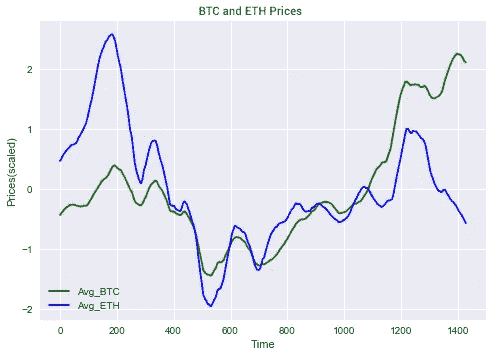
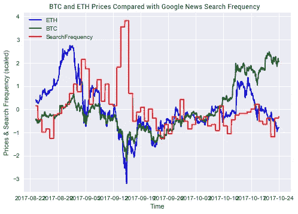
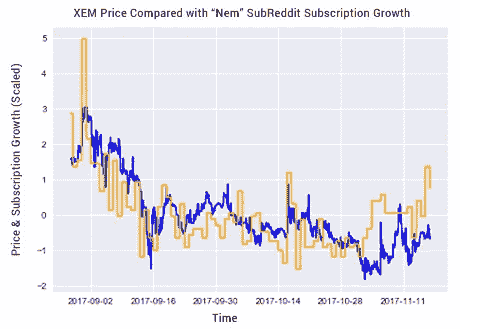
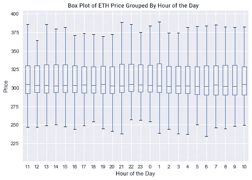
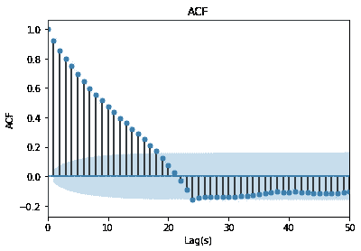
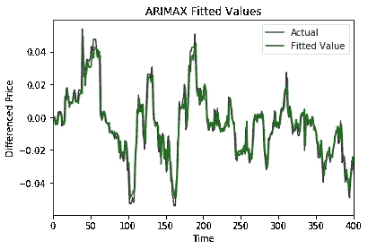

# 基于 Python 的加密货币价格预测

> 原文：<https://towardsdatascience.com/demystifying-cryptocurrency-price-prediction-5fb2b504a110?source=collection_archive---------3----------------------->

Photo by [André François McKenzie](https://unsplash.com/@silverhousehd?utm_source=medium&utm_medium=referral) on [Unsplash](https://unsplash.com?utm_source=medium&utm_medium=referral)

自从比特币的价格开始飙升以来，围绕加密货币市场的炒作一直在持续。备用硬币每天都在不断出现——有些是骗局，有些几个月内就登上了硬币排行榜的榜首。这个话题无处不在，无论是在电台、推特、脸书，还是在和你祖父的感恩节餐桌上。参与其中的人通常受到投机的刺激，希望从飙升的市场中获得一笔横财。我很好奇数据科学是否能揭示一些真相。这个项目使用历史价格、协整和宏观经济协变量来预测硬币的未来价格。样本外预测在前 100 小时是可以接受的。让我们深入研究一下。

当谈到经典时间序列分析时，我们认为一个观察到的时间序列是一个模式和一些随机变化的组合。使用这种方法，可以根据历史数据预测未来值。这种方法在大多数情况下都能很好地工作，但是如果我们看到的是一个比模式更随机的时间序列呢？如果一个时间序列纯粹是推测性的，并且大量基于当前事件，而不是一些节奏成分，会怎么样？你知道…类似于…密码流通价格。

那么，如果不只是一些简单的模式，是什么推动了加密货币的价格呢？投机？创新？法律问题？舆论？供给/需求？比特币普及？昨晚某个富人决定买一百万枚硬币？好了，推测够了。我就不说了，现在给你看数据。

# 那么是什么影响了加密价格呢？

大多数人认为比特币就是答案。区块链技术是一种去中心化的数据库系统，最早由比特币实现。随着比特币获得更多的牵引力，人们不断推出同样基于区块链技术的替代硬币。因此，几乎可以说比特币是所有加密货币之母，因为它们首先提出了这种很酷的技术。这就是为什么我认为当比特币飙升时，其他所有硬币都会飙升是有道理的。当它掉落时，其他硬币也会掉落。下图显示了比特币(绿色)和以太坊(蓝色)的缩放滚动平均值。

如你所见，这个声明看起来相当准确。但是没有统计方法，我们不会匆忙下结论。稍后，我们将更多地讨论使用格兰杰因果检验来识别“协整对”。

同样显而易见的是，法律问题或技术游戏规则改变者等时事也发挥了作用。还记得中国在 9 月禁止加密吗？价格迅速下跌，一切陷入混乱。为了捕捉像这样的重要事件，谷歌新闻搜索频率数据是从 [Pytrends API](https://github.com/GeneralMills/pytrends/blob/master/README.md#api-methods) 获得的。下图显示了随着 cryto 价格的下降，“加密货币”(红色)一词的搜索频率出现峰值。

有趣吧？本项目中使用的搜索词是使用谷歌关键词工具选择的。该工具不仅能让你知道一个搜索词有多受欢迎，还能给出相关关键词的列表。使用提供的列表和 Pytrend API，可以获得七个不同关键字的搜索频率数据。我将在后面的部分详细阐述这些术语。

对我来说，另一个突出的因素是公众的看法。买入越多，需求越多，价格也就越高。捕捉这些数据有点痛苦。付费的 Twitter API 是我需要的一切，但我是一名学生，所以我宁愿把钱存起来买杂货。取而代之的是，网站[redditmetrics.com](http://redditmetrics.com)列出了世界上几乎所有子网站的历史订阅增长数据。所以网络抓取是！！！下图比较了 Nem subreddit 订阅增长(橙色)和 Nem 历史价格(蓝色)。

正如预期的那样，订阅增长和价格在高点和低点之间保持一致。

我希望这些图片会让你感兴趣。这只是让您开始了解一些领域知识，并向您介绍我们正在尝试解决的问题。如果介绍没有引起你的兴趣，请点击这里查看我的 GitHub [上的完整 EDA。接下来，我将直接进入用来建立一个预测硬币未来价格的模型的统计方法。](https://github.com/litalert/Cryptocurrency_TimeSeries_Analysis/blob/master/capstone1-statistical_infference_EDA.ipynb)

# 我是如何建立模型的？

在这一部分，我们将深入研究方法论。它只是每一步的总结。如果你想深入挖掘代码，请参考我的 GitHub 资源库[这里](https://github.com/litalert/Cryptocurrency_TimeSeries_Analysis)。这将是技术性的，我会尽我所能让它变得有趣和容易消化。但是如果你对技术不感兴趣，可以直接跳到 TLDR 部分。

***1。* *识别协整对***

通过 [Cryptocompare API 获得了三个月内 12 种顶级硬币的历史价格。但是在我们对时间序列做任何事情之前，我们必须确保时间序列是平稳的。为了满足平稳性要求，时间序列必须具有恒定的均值、恒定的方差和恒定的自相关性。听起来要求很多，对吧？事实上，没有一个时间序列是完全静止的。但是不要担心我的朋友，迪基·富勒会支持你的！](https://www.cryptocompare.com/api/#-api-data-histohour-)

**平稳性的增强 Dickey-Fuller 检验。**这是一个统计测试，允许您检查是否满足平稳性的预期。这是一个单位根测试，它决定了一个时间序列被趋势定义的程度。该测试使用自回归模型，并在不同的滞后值之间优化信息标准。零假设是时间序列可以用单位根来表示(意味着它不是平稳的)。一些统计学家提出了 0.05 的神奇阈值，许多人同意这个数字。所以如果你的 p 值小于 0.05，你可以拒绝零假设。但话又说回来，对于给定的问题，结果应该被解释为有意义的。结果是，假设阈值为 0.05，所有 12 种硬币的历史价格都没有通过平稳测试(惊讶吧！).在这种情况下，我们必须对时间序列进行平稳化，并重新测试它们。

**求差。**这是一种用于平稳化时间序列的流行方法。它可以用来消除趋势和季节性。取连续观测值的差值(滞后 1)用于本项目。如果时间序列有季节性成分，滞后值应该是季节性的周期。在我们的例子中，没有明显的季节因素。下面的方框图显示了以太坊每小时的平均值在一天的 24 小时中是相对恒定的。方差各不相同，但没有明显的模式。

在我们对时间序列执行滞后-1 差分后，所有 12 个时间序列都通过了 Dickey-Fuller 平稳测试！唷。

**格兰杰因果关系检验。**这是一个统计假设检验，用于确定一个时间序列在预测另一个时间序列时是否有用。如果 A 的滞后值提供了关于 B 的未来值的具有统计意义的信息，则时间序列 A 是时间序列 B 的“格兰杰原因”。在本项目中，我们使用该测试来确定一个协整对，即一对加密货币，其中一个硬币的滞后值可用于预测另一个硬币的未来值。

既然所有 12 个硬币的历史价格数据都是固定的，我们总共构建了 132 个数据框架，每个数据框架都是 12 个硬币历史价格的排列对(不要与组合对混淆)。呀，这真让人困惑。例如，假设我有联邦理工学院、BTC 和长期资本公司的历史价格数据。然后，我需要制作六个数据框架:ETH & BTC 历史价格、ETH & LTC 历史价格、BTC & ETH 历史价格、BTC & LTC 历史价格、LTC & ETH 历史价格和 LTC & ETH 历史价格。请注意，BTC 联邦理工学院和 BTC 联邦理工学院不是一回事！这只是为 StatsModels 的格兰杰因果检验准备我们的数据。测试的零假设是第二列中的时间序列不会对第一列中的时间序列产生格兰杰因果关系。我们需要测试是 ETC 导致了 BTH 还是 BTH 导致了 ETC。这就是为什么我们需要排列对而不是组合对！在进行了 132 次测试后，由于最强的相关性，DASH & BCH 对先前被选为协整对。然而，随着进一步的研究，事实证明，这种强相关性是由于韩国交易量的激增。由于这不是正常情况，我们选择 XEM 和 IOT (Nem 和 Iota)作为我们的协整对，因为它在正常情况下具有最强的相关性。就本项目而言，IOT 历史价格将被用作 XEM 未来价格预测指标之一。

***2。* *功能选择***

**查询数据。**以下是获得的数据及其来源:

*   Cryptocompare API:以小时频率表示的 XEM 和 IOT 历史价格
*   Pytrends API:谷歌新闻搜索“加密货币”的频率
*   抓取 redditmetrics.com: Subreddit“加密货币”、“Nem”和“Iota”订阅增长
*   Pytrends API: Google 搜索短语“Nem 钱包下载”、“Iota 钱包下载”、“Nem 价格”、“Iota 价格”、“比特币价格”、“用于挖掘的 GPU”的频率-这些关键字是使用 Google 关键字工具选择的
*   雅虎金融 API: AMD 和 Nvidia 的股票价格——这是两大半导体公司用来挖矿的

**ElasticNet 正则化。**您可能已经注意到，查询的数据有些相关。例如，谷歌搜索“比特币价格”和“加密货币”的频率可能包含非常相似的信息。使用像这样的相关特征构建模型会产生冗余，这是不好的！就像人类因冗余而变得情绪不稳定一样，机器也会因多重共线性而变得不稳定。这时 ElasticNet 正则化就出现了。该算法线性结合了套索法和岭法的 L1 和 L2 罚函数。它将冗余预测器的系数“缩小”到零，因此它成为特征选择的行业标准方式。使用 ElasticNet 结果，将选择具有非零系数的特征。

在这个项目中，ElasticNet 是对上面获得的 13 个预测变量进行的，XEM 历史价格是因变量。运行该算法后，我们剩下三个具有非零系数的预测值。这些特征将用于构建最终模型。不管 ElasticNet 的结果如何，我还尝试使用所有 13 个预测值构建了一个模型，然后将结果与使用三个选定特征构建的模型进行了比较。结果表明，性能差异并不显著(所有 15 个特性的 MSE = 0.107，3 个特性的 MSE = 0.105)。然而，我仍然选择三个特征模型，因为我认为越精简越好。

***3。* *建筑模型***

对于这个项目，我们将使用 ARIMAX 模型来预测 XEM 期货价格。就像 ARIMA 模型一样，ARIMAX 基于自回归(AR)和移动平均(MA)项进行预测。然而，ARIMAX 在模型中也包括外生变量。在这种情况下，这里将使用之前选择的三个预测变量。

**数据预处理。由于我们在上一节已经讨论了静态测试和 Dickey-Fuller 测试，我将在此省略细节。获得的数据在 ElasticNet 之前已经标准化了，所以我们需要做的就是执行差分，然后确保它通过 Dickey-Fuller 测试。之后，数据被清理并分成测试集和训练集。**

PACF 的 ACF。现在我们的数据已经准备好了，我们需要(1)确定时间序列是 AR 还是 MA 过程，以及(2)确定我们需要在模型中使用什么顺序的 AR 或 MA 过程。使用 ACF 可以回答第一个问题。对于 AR 系列，相关性逐渐下降，没有截止值。ACF 也可以用来确定 MA 系列的滞后阶数——这是截止值。然而，如果我们有一个 AR 系列，PACF 截止值将用于确定滞后阶数。下图是 XEM 历史价格的 ACF 和 PACF。

正如我们所看到的，这是一个 AR 过程，因为 ACF 没有临界值。然后，看看 PACF，它在滞后 1 处截止，这将是我们用于 ARIMAX 模型的参数。

**ARIMAX。**使用 AR 1 和 3 外生变量，下图是与实际值相比的拟合值。

利用拟合的模型，对 XEM 价格进行了预测。下图是 XEM 提前 600 步的样本外预测。

正如所料，该模型在开始时表现更好。这是因为随着时间的推移，预测误差不断复合。在大约 100 步之后，该模型表现不佳。步骤 1-100 的均方误差为 0.039，而步骤 101-600 的均方误差为 0.119。

# TLDR

Iota 历史价格与其他宏观经济协变量(如“Nem 价格”一词的 Google 搜索频率和“Nem”subreddit 订阅增长数据)相结合，用于构建 ARIMAX 模型来预测 Nem 价格。前 100 小时的样本外预测性能是可以接受的。除此之外的都是垃圾。

这个项目是我的第一个数据科学项目，有很大的改进空间。获得付费 Twitter 数据或使用不同的机器学习模型可能会显著提高性能。到那个时候，我还不如想出一个交易信号算法，用它来自动化交易。但是现在，这个项目将继续作为投资组合的一部分。是的，我很失望我没有在这个项目结束时从加密交易中变得富有

我希望你和我一样喜欢这篇文章。留下你的评论，让我知道你的想法。

***来自《走向数据科学》编辑的提示:*** *虽然我们允许独立作者根据我们的* [*规则和指导方针*](/questions-96667b06af5) *发表文章，但我们不认可每个作者的贡献。你不应该在没有寻求专业建议的情况下依赖一个作者的作品。详见我们的* [*读者术语*](/readers-terms-b5d780a700a4) *。*