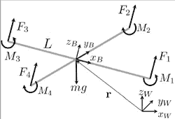
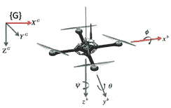
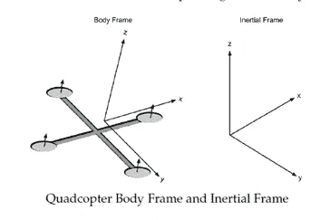
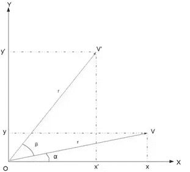
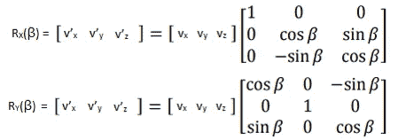

# 揭秘无人机动态！

> 原文：<https://towardsdatascience.com/demystifying-drone-dynamics-ee98b1ba882f?source=collection_archive---------3----------------------->

Demystifying Drone Dynamics!

1.  虽然我们大多数人都知道四轴飞行器/无人机的样子，但上面显示的是一张无人机的普通图片(来自 bitcraze 的一架名为 Crazyflie 的无人机)。它由 4 个马达，中间的控制电路和安装在转子上的螺旋桨组成。由于下节所述的原因，2 个转子顺时针(CW)旋转，其余 2 个逆时针(CCW)旋转。顺时针和逆时针电机彼此相邻放置，以抵消它们产生的力矩(在下一节中描述)。螺旋桨有不同的配置，如顺时针或逆时针旋转，推进器或牵引机，具有不同的半径，螺距等。

**2。力和力矩**

Figure 2: Forces and Moments

每个旋转的螺旋桨产生两种力。当转子旋转时，它的螺旋桨产生一个向上的推力，由 *F* = *K* _ *f * ω* (如图 2 中的力 F1、F2、F3 和 F4 所示)给出，其中*ω*(ω)是转子的转速，单位为弧度/秒。常数 K_ *f* 取决于许多因素，如扭矩比例常数、反电动势、周围空气密度、螺旋桨扫过的面积等。K_ *f* 和 *K_m* 的值(如下所述)通常根据经验获得。我们将电机和螺旋桨安装在称重传感器上，测量不同电机速度下的力和力矩。有关 K_ *f* 和 K_ *m* 测量的详细信息，请参考 Julian F \or ster 的“Crazyflie 2.0 Nano Quadrocopter 的系统识别”。
所有 4 个螺旋桨产生的总向上推力由产生的所有单个推力相加而得，对于 i= 1 至 4，其由
**F _ I = K _ F *ω**除了向上的力，旋转的螺旋桨还产生称为扭矩或力矩的反向旋转(如图 2 中的力矩 M1、M2、M3 和 M4 所示)。例如，沿顺时针方向旋转的转子将产生一个扭矩，该扭矩导致无人机的机身沿逆时针方向旋转。这种效果的演示可以在[这里](https://www.youtube.com/watch?v=P3fM6VwXXFM)看到。该旋转力矩由下式给出:M=K_ *m* * ω
电机产生的力矩与其旋转方向相反，因此顺时针和逆时针旋转电机产生相反的力矩。这就是为什么我们有顺时针和逆时针旋转电机，以便在稳定的悬停状态下，来自 2 个顺时针和 2 个逆时针旋转转子的力矩相互抵消，无人机不会继续围绕其机身轴旋转(也称为偏航)。
力矩/扭矩 M1、M2、M3 和 M4 是由单个电机产生的力矩。围绕无人机 Z 轴(图 2 中的 Z_b)产生的总力矩是所有 4 个力矩的总和。记住顺时针和逆时针方向的力矩符号相反。
**moment _ z = M1+M2+M3+M4**，CW 和 CCW 力矩将再次具有相反的符号，因此在理想状态下(或者每当我们不希望任何偏航(绕 z 轴旋转)运动时) *moment_z* 将接近 0。
与 *moment_z* 相反，围绕 x 轴和 y 轴产生的总力矩/扭矩的计算略有不同。查看图 2，我们可以看到电机 1 和 3 位于无人机的 x 轴上。所以它们不会对围绕 x 轴的任何力矩/力矩有贡献。然而，我们可以看到，电机 2 和 4 产生的力的差异将导致无人机的机身围绕其 x 轴倾斜，这就是围绕 x 轴的总力矩/扭矩，由
**moment _ x =(F2-F4)* L**，给出，其中 L 是从转子旋转轴到四旋翼中心的距离。同样的逻辑，
**moment _y =(F3—f1)* l .** 总结起来，绕所有 3 个轴的力矩可以用下面的向量表示
***moment*=【moment _ x，moment _ y，moment_z]^T** (^T 转置)

**3。方向和位置**

Figure 3: Orientation and position

无人驾驶飞机具有位置和方向属性，这意味着它可以是任何位置(x，y，z 坐标)，并且可以相对于世界/惯性坐标系成某些角度(θ，φ和ψ)。上图更清楚地显示了θ、φ和ψ。

**4。在 z 和 x 方向移动& y 方向移动**

Figure 4: Moving in z and x & y direction

每当无人机静止时，它都与世界坐标系对齐，这意味着它的 Z 轴与世界重力场方向相同。在这种情况下，如果无人机想要向上移动，它只需要设置合适的螺旋桨转速，就可以根据方程*产生的总力——重力开始在 z 方向移动。*然而，如果它想在 x 或 y 方向移动，它首先需要确定自己的方向(形成所需的θ或φ角)。当这种情况发生时，四个螺旋桨产生的总推力(F_thrust)在 z 方向和 x/y 方向都有一个分量，如上图 2D 所示。对于上述示例，使用基本三角学，我们可以通过以下等式找到 z 和 y 方向力，其中φ是无人机机身 z 轴与世界坐标系夹角。
***f _ y*=*f*_ 推力*罪恶*ϕ* *f _ z*=*f*_ 推力* cos *ϕ***

**5。世界和身体框架**

Figure 5: World and Body frame

为了测量上述θ、φ和 psi 角度，通常使用无人机的机载 IMU 传感器。这个传感器测量无人机的身体围绕其身体框架旋转的速度，并提供角速度作为其输出。在处理这种 IMU 输出时，我们需要小心，并理解它发送的角速度不是相对于世界坐标系的，而是相对于其体坐标系的。上图显示了这两个框架，以供参考。

**6。旋转矩阵**

Figure 6: Rotation Matrix

为了将坐标从身体坐标系转换到世界坐标系，反之亦然，我们使用一个称为旋转矩阵的 3x3 矩阵。也就是说，如果 v 是世界坐标中的一个矢量，v '是用体固定坐标表示的同一个矢量，那么下面的关系成立:
V' = R * V 和
V = R^T * V '其中 r 是旋转矩阵，R^T 是它的转置。为了完全理解这种关系，让我们从理解 2D 的旋转开始。让矢量 V 旋转一个角度β，得到新的矢量 V’。设 r=|V|。然后，我们有下面的关系:
vx = r*cosα和 vy = r*sinα
v'x = r*cos(α+β)和 v'y = r*sin(α+β)。对此展开，我们得到
v'x = r * (cosα * cosβ — sinα * sinβ)和 V ' y = r *(sinα* cosβ+cosα* sinβ)
V ' x = VX * cosβ—vy * sinβ和 v'y = vy * cosβ + vx * sinβ
这正是我们想要的，因为期望点 V '是用原点 V 和实际角度β来描述的。作为结论，我们可以用矩阵符号写为

在旋转矩阵的情况下，从 2D 到 3D 相对简单。事实上，我们刚刚导出的 2D 矩阵实际上可以被认为是绕 z 轴旋转的 3D 旋转矩阵。因此，对于绕 z 轴的旋转，旋转矩阵为

最后一行和最后一列中的值 0，0，1 表示旋转点的 z 坐标(v'z)与原始点的 z 坐标(vz)相同。我们将这个 Z 轴旋转矩阵称为 Rz(β)。将相同的逻辑推广到围绕 x 和 y 轴的旋转，我们可以得到 RX(β)和 RY(β)的值，如下所示

并且 3D 运动旋转矩阵的最终值将只是上述三个旋转矩阵的交叉乘积。
**R = Rz(ψ) x Ry(θ) x Rx(φ)** 其中 psi (ψ)，phi (φ，)和 theta (θ)分别是绕 z，y，x 轴的旋转。

**7。状态向量及其导数** 由于我们的无人机有 6 个自由度，我们通常通过监控这 6 个参数及其导数(它们如何随时间变化)来跟踪它，以获得对无人机位置和运动速度的准确估计。我们通过维护通常所说的状态向量 **X = [x，y，z，φ，θ，ψ，x_dot，y_dot，z_dot，p，q，r]** 及其导数 **X_dot= [x_dot，y_dot，z_dot，θ_dot，φ_dot，ψ_dot，x_doubledot，y_doubledot，z_doubledot，p_dot，q_dot，r_dot]** 来做到这一点，其中 X，y 和 zφ，θ，ψ表示世界坐标系中的无人机姿态/方向，而φ_dot，θ_dot，ψ_dot 表示该(欧拉)角度的变化率。p、q、r 是主体框架中的角速度，而 p_dot、q_dot 和 r_dot 是其导数(导数=变化率),也称为主体框架中的角加速度。x_doubledot，y_doubledot，z_doubledot 表示世界坐标系中的线性加速度。

**8。线性加速度** 如前所述，每当螺旋桨移动时，无人机将开始在 x、y 和 z 方向上移动(加速)，这取决于其 4 个螺旋桨产生的总推力(由下面等式中的 Ftotal 表示)和无人机的方向(由旋转矩阵 R 表示)。我们知道力=质量*加速度。忽略旋转矩阵 R，如果我们仅考虑 Z 方向上的加速度，它将由
Z_force =(质量*重力)—(质量* Z _ 加速度)
质量* Z _ 加速度=质量*重力— Z_force
给出，因此**Z _ 加速度=重力— Z_force /质量** 将其外推至 x 和 y 方向并包括旋转矩阵(出于第 4 和 6 节中描述的原因)，描述无人机的线性加速度的方程由以下方程给出，其中 *mF 中的负号表示我们认为重力在 z 轴的正方向。*

Linear Acceleration

**9。角加速度** 除了直线运动，由于旋转螺旋桨及其方位，无人机也会有一些旋转运动。。虽然在惯性/世界坐标系中有线性运动方程很方便，但在体坐标系中旋转运动方程对我们很有用，因此我们可以表示绕四轴飞行器中心的旋转，而不是绕惯性中心的旋转。如第 4 节所述，我们将使用无人机的 IMU 来获得其角加速度。让我们考虑 IMU 的输出为 p、q 和 r，代表围绕无人机 x、y 和 z 体轴的旋转速度。
我们从刚体动力学的欧拉方程推导出旋转运动方程。用矢量形式表示，欧拉方程可写成

Euler’s equations for rigid body dynamics

其中ω = [p，q，r]^T 是角速度矢量，I 是惯性矩阵，*力矩*是第 2 节中开发的外部力矩/扭矩矢量。。请不要将本节中ω(作为角速度)的用法与它作为螺旋桨转速的用法混淆。在本节之后，我们将坚持使用ω作为旋转速率。我们可以将上述等式改写为

用[p，q，r]^t]代替ω，展开*力矩*矢量，重新排列上述等式，我们得到车身框架中的角加速度为

Angular Accelerations in Body Frame

**10。欧拉角的变化率** 虽然无人机的方位最初是在人体坐标系中观察到的，但是我们需要将它们转换到世界坐标系中。同样，我们根据下面的公式使用旋转矩阵来达到这个目的。这个公式的推导过程很简单，在参考文献[6]中提供了

Rate of Change of Euler Angles

**11。回顾** 让我们回顾一下到目前为止所学的内容
1。一架四轴飞行器有 4 个(2 个顺时针和 2 个逆时针)旋转螺旋桨
2。每个螺旋桨在垂直于其平面的方向上产生 F =K_f * *ω* 力和绕其垂直轴的力矩 M = K_m * *ω* 。
3。无人驾驶飞机可以处于任何 x、y、z 位置以及θ、φ和ψ方向。
4。当无人机想要在 z 方向(世界坐标系中)移动时，它需要在每个螺旋桨上产生适当的力(总推力除以 4)。当它想在 x 或 y 方向移动时(同样是世界坐标系)，它在产生所需力的同时考虑θ/φ角
5。当跟踪无人机的运动时，我们需要处理世界和身体框架中的数据
6。为了将角度数据从身体坐标系转换到世界坐标系，使用旋转矩阵
7。为了跟踪无人机的运动，我们跟踪它的状态向量 X 及其导数 X_dot
8。旋转螺旋桨产生 x、y 和 z 方向的线性加速度，如第 8 节
9 所示。旋转螺旋桨在机身框架中产生绕 z、y 和 z 轴的角加速度，如第 9 节
10 所示。按照第 10 节中所示的等式，我们将体坐标系中的角速度转换为世界坐标系中的欧拉角速度。

**12。参考文献** 我不想只列出参考文献，而是想真诚地感谢个别作者的工作，没有他们的工作，这篇文章和我对无人机动力学的理解几乎是不可能的。
1。Julian Forster 对 Crazyflie 2.0 Nano Quadrocopter 的系统识别—[http://Mike hamer . info/assets/papers/crazy flie % 20 modelling . pdf](http://mikehamer.info/assets/papers/Crazyflie%20Modelling.pdf)
2。丹尼尔·沃伦·梅林杰的四旋翼飞行器轨迹生成和控制—[https://repository.upenn.edu/cgi/viewcontent.cgi?article = 1705&context = edisser stations](https://repository.upenn.edu/cgi/viewcontent.cgi?article=1705&context=edissertations)
3。四轴飞行器动力学、模拟和控制作者 Andrew Gibiansky—[http://Andrew . Gibiansky . com/downloads/pdf/quad copter % 20 Dynamics、%20Simulation、%20Control.pdf](http://andrew.gibiansky.com/downloads/pdf/Quadcopter%20Dynamics,%20Simulation,%20and%20Control.pdf)
4。绕 x 轴、y 轴或 z 轴基本旋转的简单推导—[http://www.sunshine2k.de/articles/RotationDerivation.pdf](http://www.sunshine2k.de/articles/RotationDerivation.pdf)
5。你如何得到旋转矩阵？—Quora—[https://www . Quora . com/How-do-you-derive-the-rotation-matrix](https://www.quora.com/How-do-you-derive-the-rotation-matrices)
6 .詹姆斯·迪贝尔的《表现姿态:欧拉角、单位四元数和旋转矢量》——[https://www . astro . rug . nl/software/kapteyn/_ downloads/Attitude . pdf](https://www.astro.rug.nl/software/kapteyn/_downloads/attitude.pdf)

如果你喜欢这篇文章，在[推特](https://twitter.com/percyjaiswal)上关注、转发或者鼓掌，媒体上的赞会鼓励我继续我的博客世界之旅。

直到下一次…干杯！！