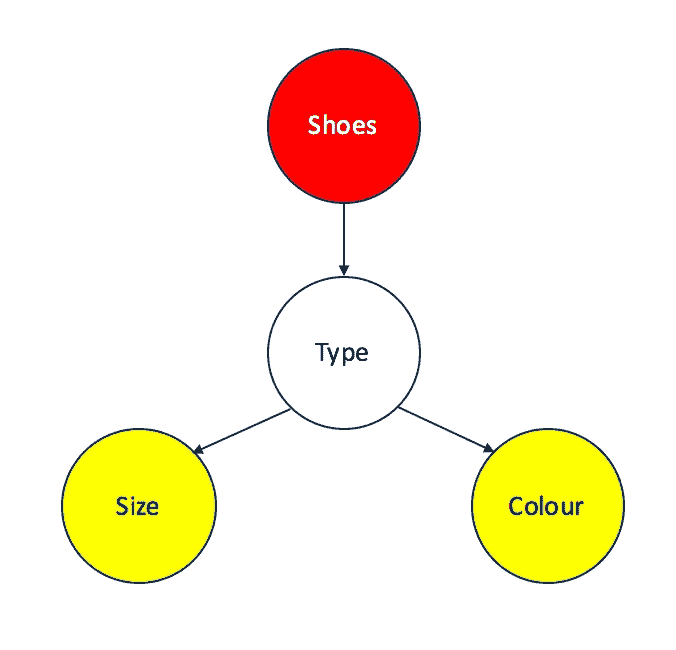

# 揭开超参数调谐的神秘面纱

> 原文：<https://towardsdatascience.com/demystifying-hyper-parameter-tuning-acb83af0258f?source=collection_archive---------11----------------------->

## 它是什么，为什么是自然的

超参数结构每天都有许多过程，但很少有人意识到它们的存在。当你想买一双鞋的时候，你正在解决一个超参数优化问题。一旦你决定了要买哪种 ***类型*** 的鞋子(***hyper-parameter***)你就需要根据鞋子的 ***参数*** 来满足你的要求( ***尺码、颜色、…*** )。你的可用预算也是一个超级参数，会影响你的选择。

An everyday hyper-parameter optimization problem

## 超参数调谐

如果你选择了一双适合你的鞋子，而且颜色也合适，你就能穿上它们。然而，如果你选择了一双红色高跟鞋，你可能会发现跑马拉松很有挑战性。超参数调整对于大多数用例来说可能并不重要，但会显著影响您的流程效率和您试图获得的结果的质量(例如，您可以穿着靴子跑步，但可能没有穿着运动鞋跑得快)。

## 数据科学中的超参数调整

大多数机器学习模型都有超参数。

例如，一个简单的随机森林算法会有相当多的:

Scikit-Learn implementation of a Random Forest Classifier

一旦用户指定了其超参数的值，该算法将在基础数据集上进行训练。超参数的选择将影响训练的持续时间和预测的准确性。不幸的是，选择超参数并不是直截了当的，因为可能的配置数量随着它们的数量而爆炸，并且配置的评估时间是模型复杂性和底层训练数据大小的函数。此外，这是一种有点黑暗的艺术，正如威廉·科尔森在他的媒体文章[中所说:](/hyperparameter-tuning-the-random-forest-in-python-using-scikit-learn-28d2aa77dd74)

> 超参数调整更多地依赖于实验结果而不是理论，因此确定最佳设置的最佳方法是尝试许多不同的组合来评估每个模型的性能。

面对如此多的不确定性，大多数数据科学家放弃超参数调整，坚持使用模型提供的默认值是可以理解的。这在大多数情况下是可行的，但是根据我的初步类比，你可能很难穿着高跟鞋跑马拉松。

> 在现实生活中你不会这样做(除非是为了一个好的理由)，那么在数据科学领域你为什么会这样做呢？

第二种最流行的方法是通过 ***网格搜索*** (评估每一个配置)找到最佳配置，这将最终导致一个答案。

> **但是你不会穿着你所有的每一双鞋跑完一场马拉松，从而得出结论说你穿着运动鞋跑得最好，那么你为什么要在数据科学领域做同样的事情呢？**

第三种最流行的方法是通过 ***随机搜索*** 找到最佳配置，但这仅比网格搜索略好。我就不跟你打这个比方了，因为我希望现在你明白我的意思了。

> 那么如何更有效地进行超参数调优呢？

头脑铸造公司的推特粉丝似乎知道答案

## 贝叶斯优化

贝叶斯优化通过结合对解空间看起来像什么的“信念”,并通过从它评估的配置中“学习”,解决了网格和随机搜索的陷阱。这种信念可以由领域专家指定，但也可以在开始时是平的。如果当你尝试穿着细高跟鞋跑马拉松，你不会再穿你所有的其他高跟鞋了，因为你会知道这很痛苦。此外，如果你有先验知识，你可能从一开始就选择平底鞋！

我已经写了一篇更详细的文章(用更少的类比)来解释贝叶斯优化背后的直觉:

 [## 高斯过程贝叶斯优化背后的直觉

### 在某些应用中，目标函数是昂贵的或难以评估的。在这些情况下，一般…

towardsdatascience.com](/the-intuitions-behind-bayesian-optimization-with-gaussian-processes-7e00fcc898a0) 

可以在[这里](https://www.mindfoundry.ai/learning-hub/the-intuitions-behing-bayesian-optimization)找到可下载的白皮书版本。

您可以在这里自动接收我们的贝叶斯优化器 OPTaaS 的 API 密钥！

【**更新**:我开了一家科技[公司](http://www.legislate.tech/)。你可以在这里找到更多的

## 贝叶斯优化的扩展

如果你有可以尝试其他鞋子的朋友，你们会集体找到跑马拉松用得更快的最好的一双。同样可以在 BO [中通过智能配料](https://mindfoundry.ai/wp-content/uploads/optaas-2-pager.pdf)实现。

如果你穿着高跟鞋跑马拉松，你应该(在理论上)很早就意识到这相当痛苦，你应该停下来换双鞋？

嗯，这在贝叶斯优化的某些实现中是可能的，在我的下一篇文章中，我将解释如何实现。