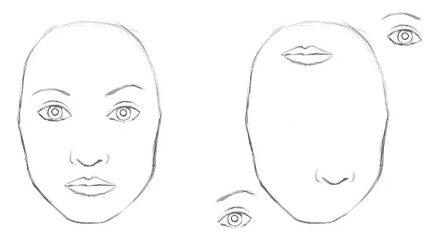
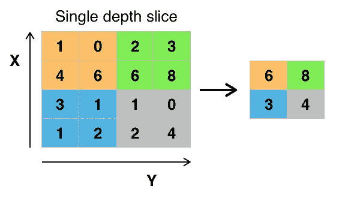
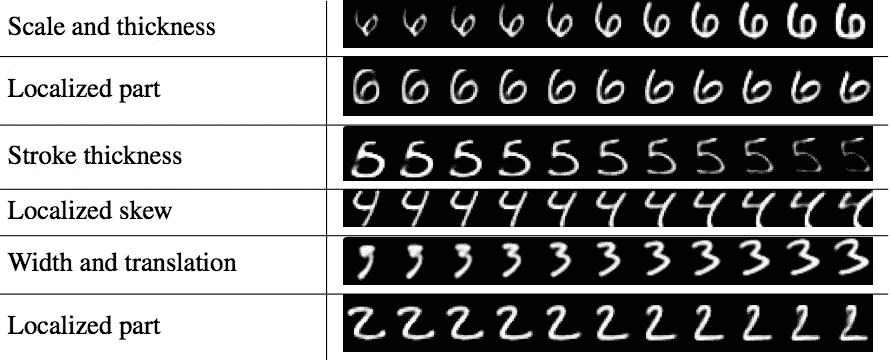
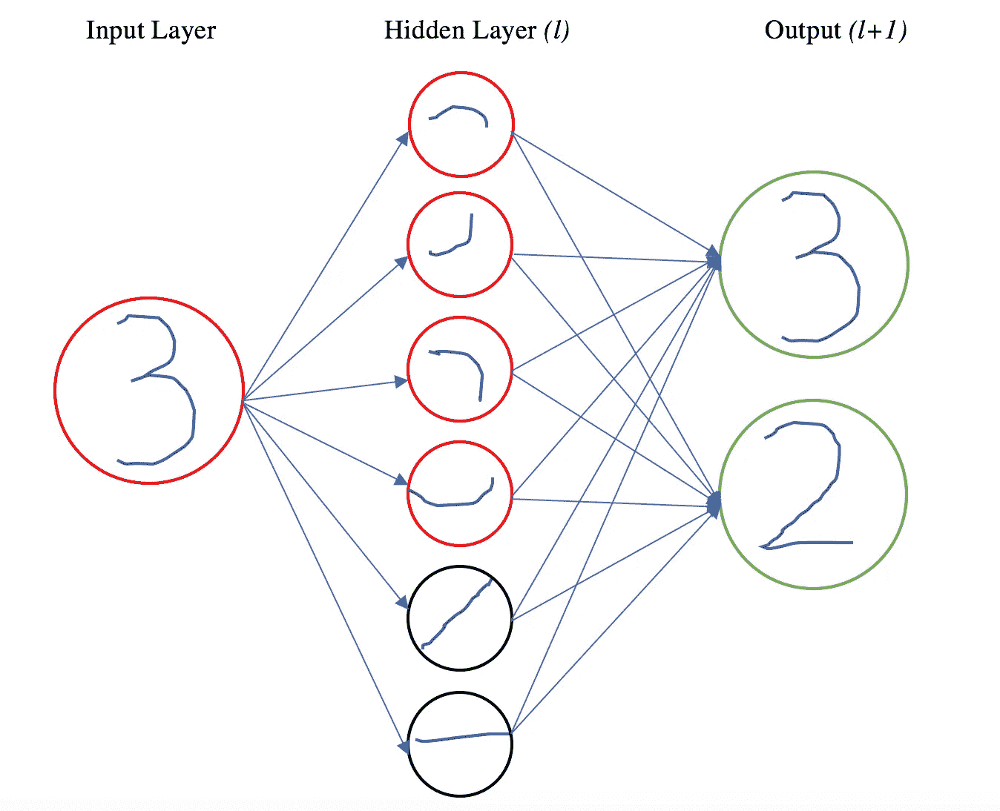
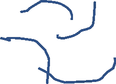
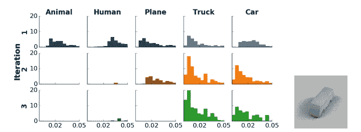
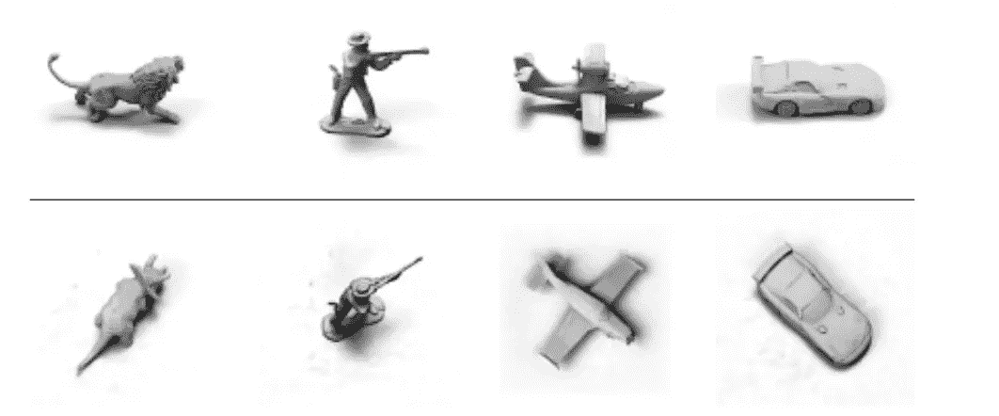

# 揭秘“EM 路由矩阵胶囊”

> 原文：<https://towardsdatascience.com/demystifying-matrix-capsules-with-em-routing-part-1-overview-2126133a8457?source=collection_archive---------0----------------------->

最近，深度学习之父之一的杰弗里·辛顿(Geoffrey Hinton)发表了一项革命性的计算机视觉架构，在机器学习界掀起了波澜:**胶囊网络**。Hinton 自 2012 年以来一直在推动使用胶囊网络，此前他首次革命性地使用卷积神经网络(CNN)进行图像检测，但直到现在他才使它们变得可行。两周前发表的最初的成功方法名为“胶囊之间的动态路由”动态路由——我们将在本文中深入探讨——允许网络更直观地理解部分-整体关系。

在这篇论文发布后的三天内，另一篇关于胶囊网络中动态路由的论文被提交给 ICLR 2018 进行审查。这篇题为“EM 路由的矩阵胶囊”的论文被广泛认为是由 Hinton 撰写的，讨论了一种革命性的动态路由新方法，甚至与他的第一篇论文相比。尽管这种方法显示出巨大的前景，但迄今为止媒体对它的关注相对较少。由于作者身份的不确定性，我在这篇文章的其余部分提到了“作者”。

在这篇博文中，我将讨论 matrix capsules 动态路由背后的直觉和动态路由的机制。第一部分将概述胶囊网络的直觉，以及它们如何利用动态路由比传统 CNN 更有效。第二部分将深入研究 **EM 路由**的数学和技术细节。

*(注:如果你读过 Sabour et。艾尔。“胶囊之间的动态路由”，直觉上是非常相似的，但是路由机制是非常不同的。)*

# CNN 怎么了？

自 2012 年 Hinton 合著了一篇介绍 AlexNet 的论文以来，CNN 在 ImageNet 的图像分类方面的表现优于任何以前的方法，CNN 一直是计算机视觉的标准方法。本质上，CNN 通过检测图像中特征的存在来工作，并使用这些特征的知识来预测对象是否存在。然而，CNN 只检测特征的存在——所以即使是右边的图像，包含错位的眼睛、鼻子和耳朵，也会被认为是一张脸，因为它包含了所有必要的特征！

A CNN would classify both images as faces because they both contain the elements of faces. [Source](http://sharenoesis.com/wp-content/uploads/2010/05/7ShapeFaceRemoveGuides.jpg).

CNN 未能处理此类图像的原因是辛顿在过去几年中批评 CNN 的原因。问题归结为 CNN 从一层到另一层传递信息的方式:**最大池**。最大池检查像素网格，并在该区域进行最大激活。该程序主要检测特征是否在图像的任何*区域*中*存在*，但是会丢失关于该特征的空间信息。

Max Pooling preserves existence (maximum activation) in each region, but loses spatial information. [Source](https://upload.wikimedia.org/wikipedia/commons/e/e9/Max_pooling.png).

胶囊网络试图通过捕捉**部分-整体关系**来解决 CNN 的局限性。例如，在一张脸上，两只眼睛都是前额的一部分。为了理解这些部分-整体关系，胶囊网络需要知道的不仅仅是某个特征是否存在——它需要知道该特征在哪里，它是如何定向的，以及其他类似的信息。胶囊网络以 CNN 没有的方式取得了成功，因为它们成功地捕捉了这些信息，并将信息从一部分传递到整体。

# **那么，胶囊网络到底是什么？**

传统的神经网络由神经元组成。胶囊网络通过将神经元分组到称为胶囊的模块中，在 CNN 上强加结构。

**囊**是一组神经元，其输出代表*相同*特征的不同属性。通过对神经元进行分组，胶囊的输出是 4x4 矩阵(或 16 维向量)，其条目表示诸如特征的 x 和 y 坐标、对象的旋转角度以及其他特征的信息。例如，在数字识别中，一层胶囊对应数字。输出层中的一个胶囊可以对应于 6。4×4 矩阵中的不同条目将对应于 6 的不同属性。如下所示，如果您修改矩阵的一个条目，6 的比例和厚度会发生变化，如果您修改矩阵的另一个条目，6 的顶钩也会发生变化。

This image, from Hinton’s first paper, shows what happens to numbers when perturbing one dimension of the capsule output. This demonstrates spatial information about the numbers stored in each entry. [Source](https://arxiv.org/abs/1710.09829).

当想到神经网络时，我们会想到神经元之间的连接。虽然胶囊是由神经元组成的，但更容易(也更有效)的是将网络想象成由称为胶囊的组件组成。整个**胶囊网络**由多层胶囊组成。每层可由任意数量的胶囊组成(通常为 8-32 个)。

将胶囊与传统神经网络中的神经元进行比较在直觉上是有帮助的。神经网络中的单个神经元从(0，1)输出一个激活，并表示一个特征的存在。另一方面，胶囊输出关于特征的存在的逻辑单元(0，1)以及表示关于特征的附加信息的 4×4 矩阵。这个 4x4 矩阵被称为**姿态矩阵**，因为它代表了关于特征的空间信息。上图说明了修改姿势矩阵中的条目时会发生什么。

此外，我们可以考虑神经元-神经元连接与囊-囊连接，这在典型的图中用单个箭头表示。在神经网络中，一个神经元使用标量权重连接到下一个神经元。另一方面，两个胶囊之间的连接现在是一个 4x4 **变换矩阵**，因为一个胶囊的输入和输出都是 4x4 矩阵！

到目前为止，胶囊网络还没有做任何革命性的事情:毕竟，胶囊往往只是卷积层。胶囊网络的有效性来自于信息从一层传递到另一层的方式——这就是所谓的**路由机制。**与使用最大池路由信息的 CNN 不同，胶囊网络使用一种称为**动态路由**的新流程来捕捉部分-整体关系。

# **协议动态路由:从局部到整体**

在本节中，我们将考虑如何将输出从层 *(l)* 路由到层 *(l+1* )。此过程取代了 CNN 的最大池。请记住，正如我们之前所讨论的，我们的网络学习转换矩阵(类似于权重)作为胶囊之间的连接。然而，除了使用这些变换矩阵将信息从一层路由到另一层之外，每个连接还要乘以一个动态计算的路由系数**。如果这还不清楚，不要担心；我们将首先讨论这些路由系数背后的直觉，然后再讨论数学。**

为了使我们的分析更具体，我们考虑数字识别的例子，并且只对数字 2 和 3 进行分类。我们的隐藏层 *(l)* 由一个有六个胶囊的胶囊层组成，对应于特性，我们的最终层 *(l+1)* 由 2 个胶囊组成，对应于数字 2 或 3。层 *(l)* 中的特征代表数字 2 和 3 的不同部分。为了说明起见，假设我们的六个胶囊节点对应于以下特征。A 3 由前四个特征组成，a 2 由第一、第五和第六个特征组成。在我们的例子中，我们的网络将获取 3 的输入图像，并将尝试对其进行分类。

Capsules are shown as nodes, but output matrices. Arrows represent transformation matrices. Red capsules are active, and black capsules are inactive. The green capsules in the output layer have not yet been predicted.

直观上，我们知道层 *(l)* 中的每个对象都来自层 *(l+1)中的一个更高级别的对象。*我们知道第一个胶囊在我们的网络中是活跃的，因为它不是 a 2 就是 a 3。**我们的目标是计算出我们的特征因下一层的每个特征而被激活的概率**。基于我们认为层 *(l)* 中的胶囊被激活的原因，我们可以将我们的信息从层 *(l)* 引导到 *(l+1)。*

问题变成了我们如何决定这些概率。让我们以第一个胶囊特性为例，它可能是 a 2 或 a 3 的一部分。它的数量很大程度上取决于图层中第一个要素和其他要素之间的空间关系。在我们的示例中，图层 *(l)* 看到第一个要素(在图像中)位于第二个要素之上，第三个要素位于第四个要素之上。(*注意:我们的姿态矩阵输出可以捕捉这些特征之间的空间关系)。*因此，层 *(l)* 已经看到了关于具有正确关系的 a 3 的所有信息。如果是这样，那么在层 *(l)* 中存在显著一致的 a 3。与此同时，2 的另外两个节点并不活跃，因此，人们对图中有一个 2 的看法相对较少。基于这种一致，我们可以很大概率地说，第一个特性实际上来自于 a 3，而不是 a 2。

这个总体概念被称为**协议路由**。通过这样做，来自层 *(l)* 中的胶囊的信息仅被提供给层 *(l+1)* ，如果特征看起来来自后续层中的那个胶囊。换句话说，如果有更多关于 2 的一致，2 胶囊*仅*从第一个特征接收信息。这种动态计算向哪个更高级别的胶囊发送信息的过程被称为**动态路由**。通过将第一个特征(顶钩)动态地仅路由到 3，我们可以对我们的预测更有信心，并将低概率分配给 2。

Transformation matrices capture the fixed relationships between part and whole

这里是动态路由最棘手的部分:这些路由系数不是网络的学习部分！接下来的三段将解释为什么。我们在胶囊网络中学习到的权重是转换矩阵——类似于神经网络中的权重。这些变换矩阵可以捕捉每个特征如何与整体相关。例如，这可以告诉我们，第一个特征是 3 的顶部或 2 的顶部，第二个特征是 3 的中右，等等。

然而，给定单个图像，我们不知道第一特征是 a 3 还是 a 2 的一部分。如果 a 3 的不同部分与整体有着密切的联系，那么我们认为第一个特征应该被路由到 a 3。然而，其他时候，我们可能会认为这是二的一部分。因此，第一特征是 2 的一部分还是 3 的一部分取决于*单个图像*。因此，这些路由系数不是固定的权重；他们是学会了 ***的每一个单向前传递*** 的网络，并依赖于个人形象。这就是为什么这个过程被称为**动态**路由——它是正向传递的一部分。

A jumbled 3\. It has all the features of a 3, but is not correctly aligned.

让我们考虑一下，当特性不在正确的位置时，这是如何修复这个例子的，这给 CNN 造成了一个问题。动态路由过程有助于解决这个问题。考虑当一个 3 的四个特征被随机放置在一个输入中时，如左边。卷积网络会认为这是 a 3，因为它有 a 3 的四个组成部分。然而，在胶囊网络中,“3 胶囊”将从隐藏层接收信息，表明 3 的各部分没有正确地关联到形成 3！因此，当第一个封装决定将其输出路由到哪里时，它不会看到 2 或 3 的协议，而是平等地发送其输出。结果，胶囊网络不能有把握地预测 2 或 3。希望这说明了为什么路由必须由**动态**，因为它取决于胶囊网络激活的特征的**姿态**。

如上所述，这种路由是可行的，因为每个胶囊的输出是一个 4x4 矩阵。这些矩阵捕获了 a 3 的不同部分之间的空间关系，如果它们作为整体的一部分不正确地一致，胶囊网络就不能可靠地路由信息。另一方面，对于 CNN，标量激活不能捕捉每个部分和整体之间的关系。

构建动态路由的另一种方式是**投票**的概念。层 *(l)* 中的每个胶囊可以投票选择它认为来自层 *(l+1)* 中的哪个胶囊。胶囊总共获得一票，并且可以在所有随后的层胶囊中分配这一票。这种投票机制确保了基于空间关系的信息的有效路由。投票/路由机制来自下面讨论的过程。

# EM 路由:总体思路

我们已经模糊地概述了动态路由背后的直觉，但是没有提到如何计算它。这个主题既冗长又复杂，将在本系列的下一部分中详细讨论。在这里，我将概述一下 **EM 路由**背后的基本思想。

本质上，当路由时，我们假设层 *(l)* 中的每个胶囊被激活，因为它是下一层中某个“整体”的一部分。在这一步，我们假设有一些潜在的变量来解释我们的信息来自哪个“整体”，并试图推断每个矩阵输出来自级别 *(l+1)* 中的高阶特征的概率。

这归结为一个无监督的学习问题，我们用一种叫做**期望最大化**的算法来解决它。本质上，期望最大化试图最大化我们的数据(层 *(l)* 的输出)被层 *(l+1)* 中的胶囊解释的可能性。期望最大化是一种迭代算法，包括两个步骤:期望和最大化。通常，对于胶囊网络，每个步骤执行三次，然后终止。

The output capsules converge toward the correct classes over the three iterations of EM. [Source](https://openreview.net/pdf?id=HJWLfGWRb).

作者解释的步骤如下。期望分配层 *(l)* 中的每个胶囊被层 *(l+1)* 中的胶囊解释的概率。然后，最大化步骤决定层 *(l+1)* 中的胶囊是否是活动的，如果它们看到对它的输入的显著聚类(一致)，并且通过对路由的输入取加权平均来决定对胶囊的输入是什么。

如果这没有意义，不要担心——我用很少的话解释了很多密集的数学。如果您想了解路由机制的深层技术，请继续关注本周晚些时候的下一篇博文。

# **胶囊网络架构**

现在我们理解了胶囊网络背后的直觉，我们可以检查作者如何在他们的论文“带有 EM 路由的矩阵胶囊”中使用矩阵胶囊

本文在 SmallNORB 数据集上评估矩阵胶囊。该数据集由从不同角度和高度拍摄的五种类型的儿童玩具组成。数据集准确捕捉同一物体的不同**视点**。回想一下，由于胶囊的多维输出(姿势矩阵)，胶囊在理解视点方面基本上更好——这就是为什么 SmallNORB 数据集是胶囊网络目标的优秀评估指标。

Example images from the SmallNORB dataset. The second row consists of photos taken from a different elevation from the first set. [Source](https://openreview.net/pdf?id=HJWLfGWRb).

该架构包括一个卷积层，接着是两个胶囊层，最后是一个分类胶囊层，有五个胶囊，每个类一个。这种架构在数据集上的表现优于之前的任何模型，并将之前的最佳错误率降低了 45%以上！

Architecture in “Matrix Capsules with EM Routing.” See the [paper](https://openreview.net/pdf?id=HJWLfGWRb) for more details.

# 胶囊网络的优势

胶囊网络相对于 CNN 有四个主要的概念优势。

1.  **观点不变性**。正如整篇文章所讨论的，姿态矩阵的使用允许胶囊网络识别对象，而不管它们是从哪个视点被观看的。
2.  **参数少**。因为矩阵胶囊将神经元分组，所以层之间的连接需要较少的参数。实现最佳性能的模型仅包括 300，000 个参数，相比之下，其基线 CNN 包括 4，000，000 个参数。这意味着模型可以更好地概括。
3.  **更好地概括新观点**。CNN 在被训练理解旋转时，通常会记住一个物体可以从几个不同的旋转角度被相似地观察到。然而，胶囊网络也可以更好地推广到新的视点，因为姿态矩阵可以将这些特征捕捉为简单的线性变换。
4.  **抵御白盒对抗性攻击**。快速梯度符号法(FGSM)是攻击细胞神经网络的典型方法。它评估每个像素相对于网络损失的梯度，并且最多改变每个像素ε以最大化损失。虽然这种方法可以将 CNN 的准确率显著降低到 20%以下，但是胶囊网络可以保持 70%以上的准确率。

在这篇文章中，我将讨论一些关于基质胶囊的细节。在 EM 路由中使用矩阵胶囊而不是在初始论文中使用矢量胶囊的细节也呈现了三个主要优点。我将在下一篇文章中解释这三个好处的技术细节。

# 计算机视觉的未来

胶囊网络已经推出两周了，没有人知道它们是否是另一种人们会忘记的模式，或者它们是否会彻底改变计算机视觉。在目前的状态下，它们有很多缺点——最明显的是使用 EM 从一层到另一层动态路由需要大量的时间。当在 GPU 上并行化时，这可能会特别成问题。

不管怎样，这篇论文有效地充当了胶囊网络的概念证明，而且做得相当优雅。不过，在未来，它们的有效性必须在各种各样的数据集上进行测试，包括具有许多类的更适用的数据集，如 ImageNet。随着时间的推移，可能会引入新的路由机制，其他创新可能会使胶囊网络更有效(我们已经在“带 EM 路由的矩阵胶囊”中看到了这一点，它完全改变了路由机制！).然而，如果它们可行，应用将是无穷无尽的——图像分类、物体检测、密集字幕、生成网络和少镜头学习。

*致谢*——非常感谢舒邦德赛、阿迪加内什、张家瑞和乔丹亚力山大在这篇文章上给了我很好的反馈。查看原文[这里](https://arxiv.org/abs/1710.09829)和[这里](https://openreview.net/pdf?id=HJWLfGWRb)。