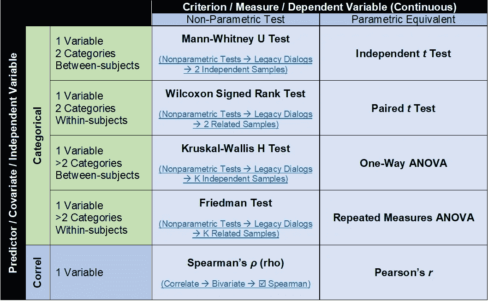

# 揭秘统计分析 7:数据转换和非参数检验

> 原文：<https://towardsdatascience.com/demystifying-statistical-analysis-7-data-transformations-and-non-parametric-tests-7c02cc4c8168?source=collection_archive---------17----------------------->

在阅读这篇文章的标题时，有些人可能想知道为什么“数据转换”和“非参数测试”会在同一篇文章中同时出现。非参数测试通常与参数测试一起介绍，但是当我在本系列开始时分享了一个关于统计分析的[备忘单](/demystifying-statistical-analysis-1-a-handy-cheat-sheet-b6229bf992cf)时，我似乎把它们遗漏了。这种排除是有意的，我将在本帖中解释非参数测试实际上如何与数据转换相关联。

## 数据转换

进行参数测试时，通常假设:

*   数据呈正态分布
*   误差方差是常数
*   误差是独立的
*   预测值不相关
*   数据中的关系是线性的

然而，这些假设并不总是适用于我们试图分析的数据，因此可以进行某些转换来帮助数据符合这些假设，以便使用通常的参数测试。

在之前关于[单向方差分析](https://learncuriously.wordpress.com/2018/09/09/one-way-anova/)的一篇文章中，展示了如何使用对比代码来测试有序分类预测符中潜在的多项式关系。因此，连续预测值也不一定与其因变量成线性关系也就不足为奇了。在这种情况下，可以使用**电源转换**。通过在回归模型中加入连续预测值的 *Xi* 项，*b*-系数将是对是否存在二次关系的检验；同样，增加的 *Xi* 项的*b*-系数将是对是否存在三次关系的检验。高阶项也可以包括在内，但它们变得越来越难以解释。

对于其他类型的场景，可以使用不同的转换:

Types of transformations with their respective formulae and type of data that they are used for.

到目前为止所描述的变换是在预测器上完成的，但是也可以变换因变量的值。从本质上讲，为数据集找到正确的转换是一个反复试验的过程。事实上，在每次转换后，重新绘制可视化数据并进行必要的统计测试以检查假设是否仍然违反，这是一个很好的实践。

## 非参数检验

当数据不是正态分布时，通常使用非参数检验。这些测试被认为是一种转换，因为除了数据被转换为从最低值到最高值的等级(1，2，3，…)之外，它们基本上等同于它们的参数对应项。然而，当数据经历等级变换时，诸如数据点的方差之类的重要信息会丢失。这就做了一个强有力的假设，即数据点是有意义地有序的，即使它们实际上彼此接近并且没有太大的变化。非参数检验也与均值和方差的报告不兼容，但这可以用中位数的报告来代替。

教材《[数据分析:一种模型比较方法](https://www.amazon.com/Data-Analysis-Comparison-Approach-Second/dp/0805833889)》的作者凯里·瑞安、查尔斯·m·贾德和加里·h·麦克莱兰甚至走得更远*“不推荐非参数程序”*。他们认为*“如果人们认识到大多数非参数程序只是应用于已进行秩变换的数据的参数程序，那么很明显，如果有更好的变换，在更可能处理非正态性和异质性方差问题的意义上更好，那么这些应该用来代替非参数统计程序”*。尽管如此，[这篇博客](http://blog.minitab.com/blog/adventures-in-statistics-2/choosing-between-a-nonparametric-test-and-a-parametric-test)概述了使用非参数测试的一些原因:

1.  你的样本量很小。
2.  您有无法移除的序数数据、等级数据或异常值。
3.  你的研究领域最好用中位数来代表。

本质上，如果有可能通过其他类型的转换来解决假设违反，那么避免使用非参数测试可能会更好。但是由于在小样本的研究中我们无能为力，所以非参数检验常常成为唯一的选择。

为了那些仍然需要使用非参数测试的人，我创建了一个备忘单来为数据集中的每种类型的预测值选择非参数分析，在 SPSS 中执行分析的快速步骤，以及将非参数测试与它们的等效参数进行比较:

* * * * * * * * * *

我希望这篇文章有助于解决非参数测试到底是什么，它们实际上如何与数据转换相关，以及为什么在数据不是正态分布的情况下没有必要使用它们。

**有关参数测试的备忘单，请访问以下链接:**

 [## 揭开统计分析 1 的神秘面纱:一份方便的备忘单

### 统计分析方法的选择主要取决于数据集中变量的类型，变量的数量…

towardsdatascience.com](/demystifying-statistical-analysis-1-a-handy-cheat-sheet-b6229bf992cf) 

*最初发布于:*[*https://learn curely . WordPress . com/2018/10/06/data-transformations-and-nonparametric-tests*](https://learncuriously.wordpress.com/2018/10/06/data-transformations-and-nonparametric-tests/)