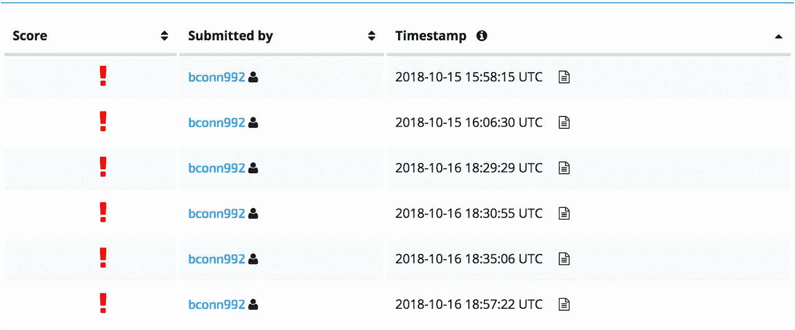
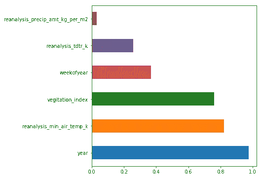

# 登革热及如何预测

> 原文：<https://towardsdatascience.com/dengue-fever-and-how-to-predict-it-a32eab1dbb18?source=collection_archive---------11----------------------->

# 介绍

作为我的期末项目，我决定用更先进的数据科学技能重新审视机器学习竞赛。我选择[预测波多黎各圣胡安和秘鲁伊基托斯的登革热病例](https://www.drivendata.org/competitions/44/dengai-predicting-disease-spread/)是因为它对全球健康的影响，部分原因是我想改进我在芝加哥的西尼罗河项目的方法。

那么，为什么是登革热呢？在全球健康范围内，登革热是一种重要但有时被[忽视的](http://www.who.int/neglected_diseases/diseases/en/)疾病，估计每年影响[5000-1000 万人](https://www.cdc.gov/dengue/epidemiology/index.html#global)，并在全球造成[近 90 亿美元](https://www.breakdengue.org/economic-cost-of-dengue/)的损失。在秘鲁，2016 年报告的病例超过 27，000 例，在波多黎各，2010 年报告的病例超过 26，000 例。

使用神经网络和回归模型的组合，我能够适度地预测登革热病例，并对一些关键的预测因素有所了解。

# 数据

这个项目的数据是从 DrivenData.org 下载的，作为他们“邓艾:预测疾病传播”挑战的一部分。除了每个地点的病例数，数据还包括温度、降水、湿度、植被以及数据获取时间等信息(完整的特征列表可在[此处](https://www.drivendata.org/competitions/44/dengai-predicting-disease-spread/page/82/#features_list)找到)。在所提供的数据中，我需要仔细观察的唯一特征是卫星植被，我了解到这基本上是一个给定区域的“绿色”指数，基于对植物光辐射的卫星测量的计算。例如:

https://en.wikipedia.org/wiki/Normalized_difference_vegetation_index#/media/File:NDVI_062003.png

这些数据还包含大量的空值。我没有删除所有的空值，而是只删除了最差的列(ndvi_ne，城市质心东北方向的植被指数像素)中的空值，总共 1450 行中的大约 200 行，并用该列同一周的平均值填充其余的缺失数据。在这里，我假设，例如，1995 年的第 36 周在天气特征方面与 1998 年的第 36 周相似。

我还尝试根据城市将数据集分成两个不同的数据集，这样信息就不会从圣胡安流向伊基托斯，并假设每个城市相似的天气条件会导致蚊子的数量明显不同。不幸的是，分割数据实际上使我的预测更糟糕，可能是因为它将每个模型的可用数据减半。因此，我的最终模型使用了一个组合数据集，尽管使用更强的模型，我仍然想尝试分离城市，因为我认为这个假设仍然有效。

# 建模和结果

我在建模过程中的第一直觉是建立一个神经网络，这起初看起来几乎像是一颗银弹。但在我能为我的第一个模型打分之前，我遇到了一个障碍:

Submitting is as easy as 1, 2, 3… 4… 5… 6…

可怕的提交格式！幸运的是，由于我巨大的编码能力，我能够编写一个函数来接受一个模型，并以一个漂亮的、准备好提交的 CSV 格式输出预测。

解决了这个问题，我终于可以给我的神奇神经网络打分了。不幸的是，他们并不完全符合我自己的宣传。我的第一个模型是用 Keras 制作的，表现仅仅是 *ok，*产生一个平均绝对误差，MAE 从现在开始是 29.6(作为参考，DrivenData 上最好的分数是 13 MAE)。幸运的是，这个特别的项目受益于*无限提交*！嗯，有一点点限制，准确的说是每天 3 个。正因为如此，我不得不在如何生成预测时使用一点战术。那时我偶然发现了一个叫做 [Talos](https://github.com/autonomio/talos) 的 Python 包，它是专门为优化 Keras 中的超参数而构建的，本质上像神经网络的 GridSearch 一样工作。

Various neural nets and their scores

分数方面，我所有的神经网络都归结为“30 分左右”。对于标签上的一点澄清，“poly-weather”表示使用从天气预报器设计的多项式特征，“cleaning”表示 ndvi_ne 空值是填充(1)还是丢弃(2)，“tuned/early”分别表示使用 Talos 和 early stopping，“adjusted”是指当我不科学地从每个预测中减去 1 时，因为我似乎无法让我的模型预测 0。总的来说，我创建的每个模型都是过度拟合的，测试 MAE 和维持 MAE 之间通常相差 15 个点。

在感觉我已经尝试了足够数量的神经网络预测以确保下一组预测也将具有“大约 30”的分数之后，我决定研究其他方法。虽然我肯定想努力提高我的分数，但我也想尝试一些更容易理解的东西；能够预测登革热病例是一回事，但下一步将是确定哪些特征对该疾病的发病率最重要。为了解决这个双重目标，我将 pipeline 与 GridSearch 结合起来，一次尝试多个不同的模型和参数:

Thanks to my friend William “Mac” McCarthy!

在这些新模型中，random forest 表现最佳，MAE 为 26.1，提高了四个百分点！紧随其后的是 bagging 回归因子，为 26.5，其次是 K 近邻，为 30.2。我最终没有提交 AdaBoost，因为训练/测试分割分数太差了，比其他人高 15 分左右。为了看一些更有解释力的东西，我决定把重点放在套索模型(得分 34.3)。

LASSO coefficients

值得一提的是，对于这些模型，我使用神经网络将各个植被指数合并成一个单一的(拼写错误的)预测指数。一般来说，系数较大的特征(因此预测能力较强)并不令人惊讶，因为年份、一年中的周数、降水量和最低气温对模型有重大影响。植被指数也是一个强大的预测因子，因此未来的一步可能是再次将其分离出来，并研究如何解释 NDVI 本身。众所周知，TDTR 代表时域热反射率，这是你*可能*必须亲自调查的事情。

# 最后的想法

虽然我对我在这个项目过程中所创造和学到的东西非常满意，但为了追求更准确的预测和更好的分数，仍然有很多东西要尝试，而且在撰写本文时比赛还剩 7 周，时间也很充裕！我认为首先要解决的最重要的问题是我的模型中大量的过度拟合，我可以通过限制神经网络特征的数量来解决这个问题。我还认为尝试提出一些基于人口密度、医疗保健支出或治疗方法数据的全新特征是值得的，看看它们是否会比一些较弱的预测指标更有效。

期待在几周内再次访问这个项目，但现在感谢阅读！