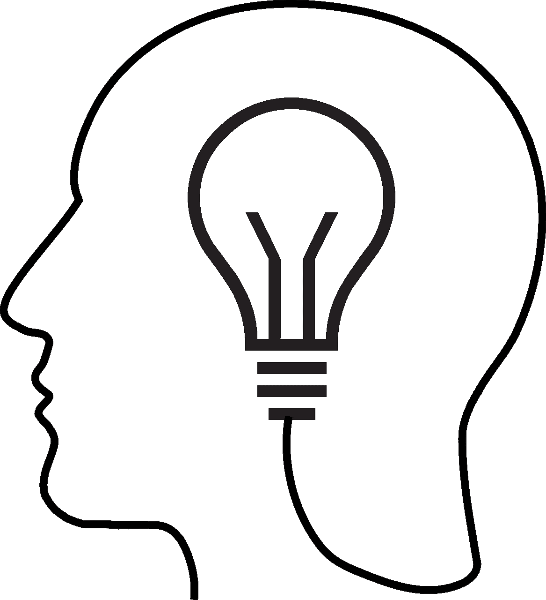
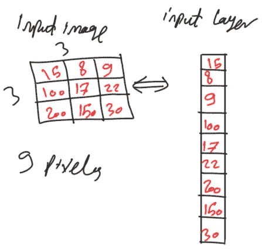
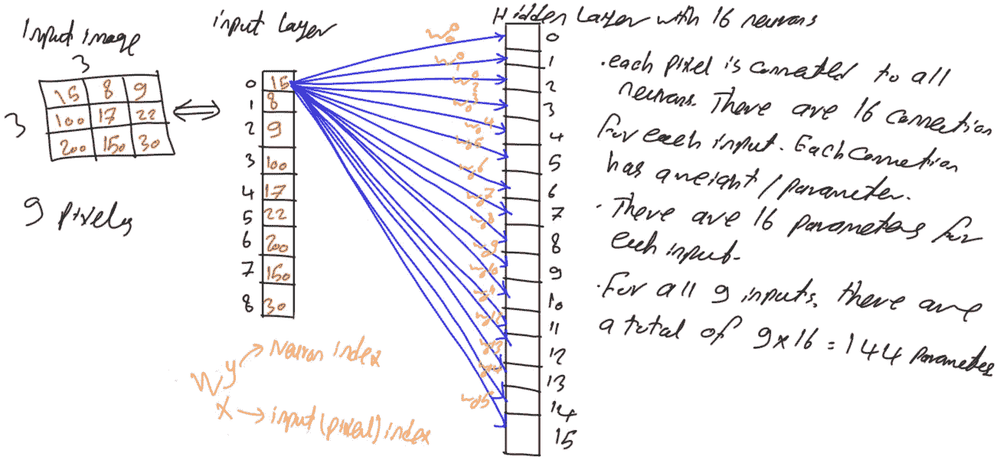
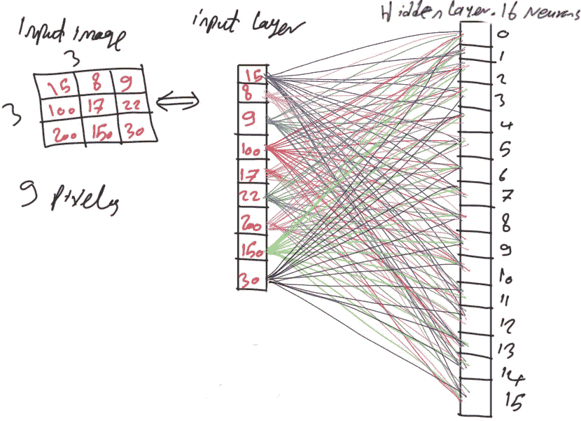
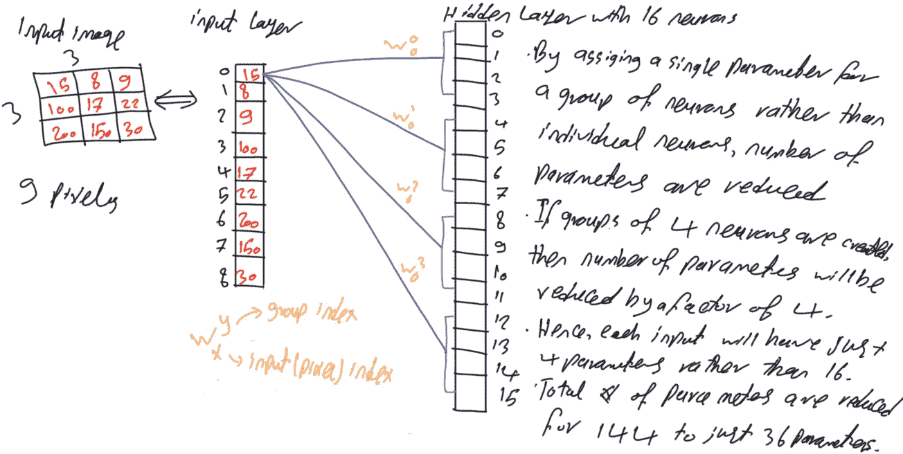
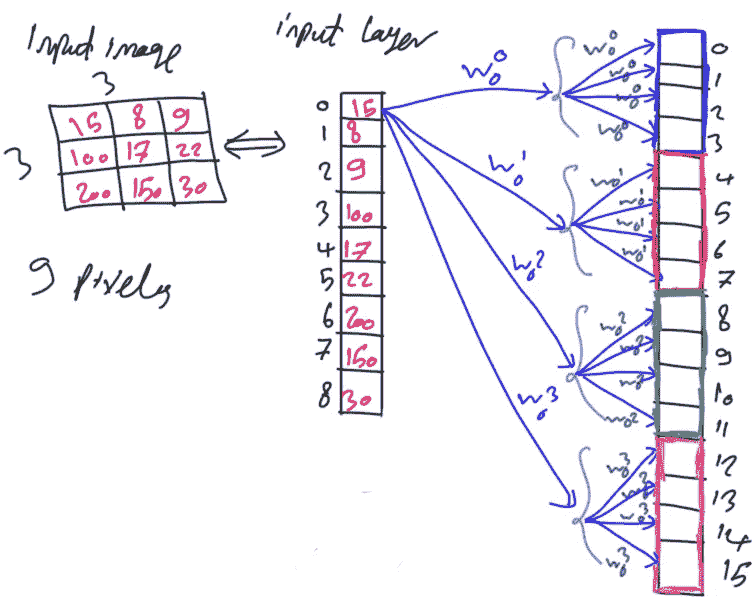
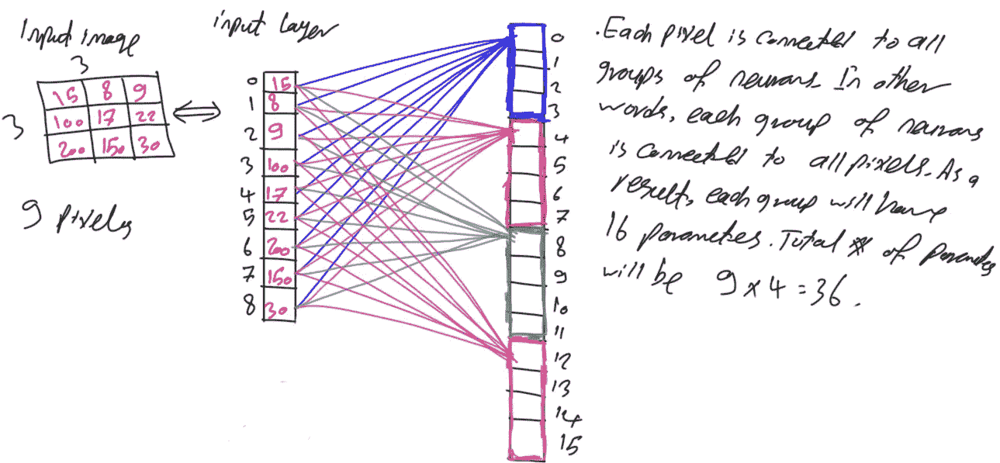

# 从全连接网络逐步推导卷积神经网络

> 原文：<https://towardsdatascience.com/derivation-of-convolutional-neural-network-from-fully-connected-network-step-by-step-b42ebafa5275?source=collection_archive---------6----------------------->

在图像分析中，卷积神经网络(简称为 CNN 或 ConvNets)比全连接(FC)网络具有更高的时间和内存效率。但是为什么呢？在图像分析方面，ConvNets 比 FC 网络有什么优势？ConvNet 是如何从 FC 网络派生出来的？CNN 中卷积这个术语是从哪里来的？这些问题将在本文中得到解答。

From Pixabay

1.  **简介**

图像分析面临许多挑战，如分类、对象检测、识别、描述等。例如，如果要创建一个图像分类器，它应该能够以高精度工作，即使存在诸如遮挡、照明变化、视角等变化。以特征工程为主要步骤的传统图像分类流水线不适合在丰富的环境中工作。即使是该领域的专家也无法给出一个或一组能够在不同变化下达到高精度的特征。在这个问题的激励下，产生了特征学习的想法。自动学习适合处理图像的功能。这就是为什么人工神经网络(ann)是图像分析的稳健方法之一的原因。基于诸如梯度下降(GD)的学习算法，ANN 自动学习图像特征。原始图像被应用到人工神经网络，人工神经网络负责生成描述它的特征。

**2。使用 FC 网络的图像分析**

让我们看看 ANN 是如何处理图像的，以及为什么 CNN 在时间和内存需求方面是高效的。为了简单起见，给出的例子使用小的图像尺寸和较少数量的神经元。

**Figure 1\. Input image**

ANN 输入层的输入是图像像素。每个像素代表一个输入。因为人工神经网络处理的是 1D 向量，而不是 2D 矩阵，所以最好将上面的 2D 图像转换成 1D 向量，如图 2 所示。

**Figure 2\. Input image to CNN input layer**

每个像素映射到向量中的一个元素。向量中的每个元素代表人工神经网络中的一个神经元。因为图像有 **3x3=9** 个像素，那么输入层会有 9 个神经元。将向量表示为行或列并不重要，但 ANN 通常水平延伸，其每一层都表示为列向量。

准备好人工神经网络的输入后，下一步是添加学习如何将图像像素转换为代表性特征的隐藏层。假设有一个 16 个神经元的隐藏层，如图 3 所示。

**Figure 3\. Parameters per Neuron**

因为网络是完全连接的，这意味着层 **i** 中的每个神经元都连接到层 **i-1** 中的所有神经元。因此，隐藏层中的每个神经元都连接到输入层中的所有 9 个像素。换句话说，每个输入像素连接到隐藏层中的 16 个神经元，其中每个连接都有相应的唯一参数。通过将每个像素连接到隐藏层中的所有神经元，对于如图 4 所示的这种微小网络，将会有 **9x16=144** 个参数或权重。

**Figure 4\. Fully Connected Network**

**3。大量参数**

此 FC 网络中的参数数量似乎可以接受。但是这个数字随着图像像素和隐藏层的数量的增加而大大增加。

比如这个网络有两个隐层，神经元个数分别为 90 和 50，那么输入层和第一个隐层之间的参数个数为 **9x90=810** 。两个隐藏层之间的参数个数为**90x 50 = 4500**。该网络中的参数总数为**810+4500 = 5310**。这对于这样的网络来说是一个很大的数字。另一个例子是尺寸为 32 x32(1024 像素)的非常小的图像。如果网络以 500 个神经元的单隐层运行，则总共有**1024 * 500 = 512000 个**参数(权重)。对于只有一个隐藏层处理小图像的网络来说，这是一个巨大的数字。必须有一种减少这种参数数量的解决方案。这就是 CNN 发挥关键作用的地方。它创建了一个非常大的网络，但参数数量少于 FC 网络。

**4。神经元分组**

即使对于小型网络，使参数数量变得非常大的问题是 FC 网络在连续层中的每两个神经元之间添加一个参数。不是在每两个神经元之间分配单个参数，而是如图 5 所示，可以将单个参数给予神经元的块或组。图 3 中索引为 0 的像素连接到具有 4 个不同权重的索引为(0、1、2 和 3)的前 4 个神经元。如果神经元如图 5 所示被分成 4 个一组，那么同一组中的所有神经元将被分配一个参数。

**Figure 5\. Grouping Neurons**

因此，图 5 中索引为 0 的像素将连接到图 6 中权重相同的前 4 个神经元。相同的参数被分配给每 4 个连续的神经元。结果，参数的数量减少了四分之一。每个输入神经元将有 **16/4=4** 个参数。整个网络将有 **144/4=36 个**参数。参数减少了 75%。这很好，但仍然有可能减少更多的参数。

**Figure 6\. Weights per group of neurons**

图 7 显示了从每个像素到每个组的第一个神经元的独特连接。也就是说，所有缺失的连接都只是现有连接的副本。假设，从每个像素到每个组中的每个神经元都有连接，如图 4 所示，因为网络仍然是完全连接的。

**Figure 7\. Connections after neurons grouping**

为了简单起见，除了所有像素与第一组中的第一个神经元之间的连接之外，所有连接都被省略，如图 8 所示。似乎每个组仍然连接到所有 9 个像素，因此它将有 9 个参数。有可能减少这种神经元所连接的像素数量。

**Figure 8\. Parameters per Group**

**5。像素空间相关性**

当前配置使每个神经元接受所有像素。如果有一个函数 f(x1，x2，x3，x4)接受 4 个输入，这意味着要基于所有这 4 个输入做出决定。如果只有 2 个输入的函数给出了与使用所有 4 个输入相同的结果，那么我们不必使用所有这 4 个输入。给出所需结果的 2 个输入就足够了。这和上面的情况类似。每个神经元接受所有 9 个像素作为输入。如果使用更少的像素会返回相同或更好的结果，那么我们应该通过它。

通常，在图像分析中，每个像素与其周围的像素(即邻居)高度相关。两个像素之间的距离越大，它们就越不相关。例如，在图 9 所示的摄影师图像中，人脸内部的像素与其周围的人脸像素相关。但它与远处像素(如天空或地面)的相关性较小。

**Figure 9\. Cameraman Image**

基于这样的假设，上面例子中的每个神经元将只接受彼此空间相关的像素，因为对所有像素进行处理是合理的。如图 10 所示，可以只选择 4 个空间相关的像素，而不是将所有 9 个像素作为输入应用于每个神经元。图像中位于(0，0)处的列向量中索引为 0 的第一个像素将作为输入应用于具有其 3 个最大空间相关像素的第一个神经元。基于输入图像，与该像素在空间上最相关的 3 个像素是索引为(0，1)、(1，0)和(1，1)的像素。因此，神经元将只接受 4 个像素，而不是 9 个。因为同一组中的所有神经元共享相同的参数，所以每组中的 4 个神经元将只有 4 个参数，而不是 9 个。因此，参数的总数将是 4x4=16。与图 4 中的全连接网络相比，参数减少了 144–16 = 128(即减少了 88.89%)。

**Figure 10\. Working locally inside the first neuron inside a the first group.**

**6。CNN 中的卷积**

至此，为什么 CNN 比 FC 网络更具时间和内存效率的问题得到了解答。使用较少的参数允许增加具有大量层和神经元的深度 CNN，这在 FC 网络中是不可能的。接下来是得到 CNN 中卷积的思想。

现在只有 4 个权重分配给同一个块中的所有神经元。这 4 个权重将如何覆盖所有 9 个像素？让我们看看这是如何工作的。

图 11 示出了图 10 中的先前网络，但是在将权重标签添加到连接之后。在神经元内部，4 个输入像素中的每一个都乘以其相应的权重。该等式如图 11 所示。四个像素和权重可以更好地显示为矩阵，如图 11 所示。先前的结果将通过逐个元素地将权重矩阵乘以当前的 4 个像素的集合来实现。实际上，卷积掩模的尺寸应该是奇数，例如 3×3。为了更好地处理，在这个例子中使用了 2x2 掩模。

**Figure 11\. Convolution Derivation**

移动到索引为 1 的下一个神经元，它将与索引为 0 的神经元所使用的具有相同权重的另一组空间相关像素一起工作。此外，指数为 2 和 3 的神经元将与其他两组空间相关的像素一起工作。这如图 12 所示。似乎组中的第一个神经元从左上角的像素开始，并选择它周围的许多像素。该组中的最后一个神经元处理右下角的像素及其周围的像素。调节中间神经元以选择中间像素。这种行为等同于卷积。该组的一组权重和图像之间的卷积。这就是为什么 CNN 有卷积这个术语。

**Figure 12\. Convolution across all neurons per the first group**

同样的程序也适用于其余的神经元群。每组的第一个神经元从左上角及其周围的像素开始。每组的最后一个神经元处理右下角及其周围的像素。中间神经元作用于中间像素。

7 .**。参考文献**

Aghdam、Hamed Habibi 和 Elnaz Jahani Heravi。 ***卷积神经网络指南:交通标志检测和分类的实际应用*** 。斯普林格，2017。

本文原载于 **LinkedIn** on [**本页面**](https://linkedin.com/pulse/derivation-convolutional-neural-network-from-fully-connected-gad) 。

也可以在 [**SlideShare 上下载 PDF 文件**](https://www.slideshare.net/AhmedGadFCIT/derivation-of-convolutional-neural-network-convnet-from-fully-connected-network) 。

联系作者:

艾哈迈德·法齐·加德:[http://www.linkedin.com/in/ahmedfgad](http://www.linkedin.com/in/ahmedfgad)ahmed.f.gad@gmail.com