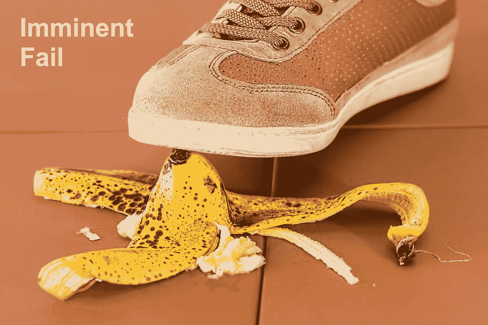

# 描述一次你失败的经历

> 原文：<https://towardsdatascience.com/describe-a-time-you-failed-1f67a091f0c7?source=collection_archive---------4----------------------->

工作面试通常是一个尴尬的过程。你很紧张，你需要看起来既有个性又专业，你需要把自己推销成一个了不起的产品，同时又不要自大。更尴尬的是当面试官探究你的弱点时。这里的老一套答案是把你的缺点变成优点——我工作太努力，关心太多！

我发现这令人沮丧，因为如果我们是一个真正重视学习的社区，那么我们需要诚实地面对我们的弱点，以便我们能够克服或管理它们。我的总会职业教练在一次模拟面试中问了我一个这样的问题。问题是“描述一次你失败的经历”，这是我的答案。

**失败——我有史以来最糟糕的演讲**

我们在劳联-产联利用我们的会员数据做了一些惊人的工作，我被要求在一次客户政治主管会议上就此做一个简短的介绍。我需要说的是，我们为客户开发了一个新的门户网站来上传他们的数据，这使我们能够更快地向他们提供他们需要的交付品。

当热情的技术人员与非技术利益相关者混合时，我遇到的问题是常见的。我为我们团队的工作感到非常自豪，所以我想了解它是如何工作的细节。

我做了一个工具如何工作的现场演示，展示了上传他们组织的数据的过程中的每一步。问题是房间里的人是高级职员，他们可能会将此任务委派给他们的 IT 团队。我在一台不熟悉的笔记本电脑上做这件事，拖长了演示时间，使问题变得更加复杂。

房间里的客户积极地给我负面的反馈。一位客户评论说“你不应该展示这个”。

**复苏——内容拯救了我**

尽管有这样的负面反馈，我还是坚持给他们看了一些我们写的关于他们成员的报告。因为观众是政治指导者，他们关心关于他们成员的政治统计。随着我们的新发展，我们将定期向政治董事提供他们需要的信息，如有多少成员登记投票。

这是一款易于决策者使用和理解的产品。会后，几名政治主任与我联系，确保他们会在接收这些例行报告的名单上。

**我学到的——保持简单愚蠢**

他们说你应该在演讲前了解你的听众。你不仅要知道他们是谁，还要知道他们想知道什么。我知道这些观众成员是非技术利益相关者，但是我错误地认为他们会像我一样对这些新开发的技术细节充满热情。

现在，当我向非技术利益相关者演示时，我尽量不让我的热情冲昏了头脑。在这些陈述中，我关注的是我们试图解决的问题，给出我们如何解决问题的高层次观点，并解释最终结果是什么。

如果听众中有技术利益相关者在细节上向我施压，我会尝试回答他们，或者与他们进行讨论，以便我们可以更深入地讨论细节。

我希望将来社区里的人们对他们的失败更加开放。这不仅包括像我这样的技术专家对这些问题持开放态度，还要求公司真诚地提出这类问题，并承认我们都有弱点。如果我们能建立起这种信任，那么我们就能共同从失败中吸取教训。