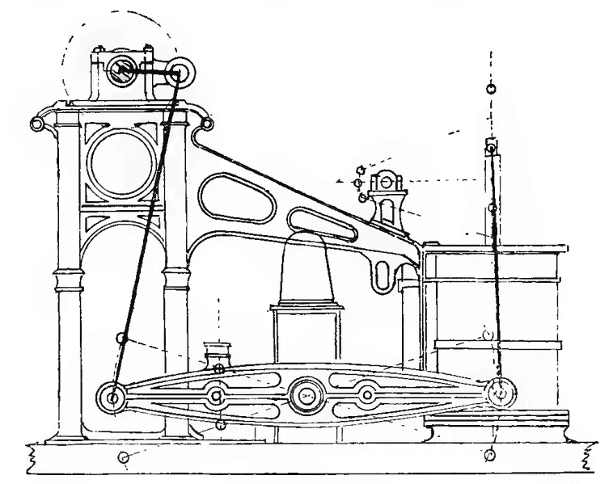

# 设计由算法驱动的产品

> 原文：<https://towardsdatascience.com/designing-a-product-driven-by-algorithms-6604a71d62c?source=collection_archive---------9----------------------->

我们已经写了很多关于实现不同算法的实用性的文章，从计算机视觉到自然语言处理。在这篇文章中，我们想把重点放在设计使用数据的产品的实用性上。我们如何才能建立一个人们会真正使用的数据产品？在我们开始之前，我们想举起手来说，我们并不自称是这方面的专家，而是想把我们从各种不同来源学到的东西结合起来，以一种我们认为可能有用的方式。

如前所述，我们已经结合了几种不同的方法，我们将在它们出现时引用它们，并使用这些方法的组合，我们试图概述我们可以如何考虑建筑产品，特别是我们应该如何将数据结合到它们的设计中。

# 以结构化的方式构建数据产品

Source: [Wikimedia Commons](https://commons.wikimedia.org/wiki/File:Side_lever_engine_from_The_Development_of_Navies.png)

我们介绍的第一种方法是在 O'Reilly 的文章中开发的“传动系统方法”。作者是著名的数据科学家，他们开发了一个很好的框架，在构建产品时，数据是产生可操作结果不可或缺的一部分，而不仅仅是更多的数据。

# 方法的结构🚀

## **目标**

定义客户目标或需求以及相关的输出/行动

## 杠杆

确定输入，即我们作为设计师可以控制的所有东西

## **数据**

确定我们可以收集的数据集

## **型号**

创建从输入到定义的输出/行动的映射，以便我们实现客户目标

作为示例，我们将介绍为 [ARTimbarc](http://web.artimbarc.com) 平台设计数据产品特性的过程。这一功能的目的是使平台上的内容更容易访问，并鼓励访问者参与他们可能不会参与的内容。

# 目标

定义**目标**的过程可以使用现代产品设计和管理原则来完成；首先关注公司的使命和产品特性，了解谁是目标用户，然后了解这些用户的需求。从这里开始，我们根据对产品和公司的高层次目标的理解，优先考虑用户的需求。

## 做功理论

这是一个引入创新理论的好时机，这一理论被称为“要做的工作”(JTBD)及其延伸客户工作(见伟大著作[此处](https://jtbd.info/wcakc/home))。潜在的概念是人们使用产品和服务来完成工作；虽然产品来来去去，但潜在的工作不会消失。露华浓的首席执行官曾经说过“在工厂里，我们生产化妆品。在药店里，我们出售希望。”—客户不想要特定的产品，但他们希望完成特定的“工作”。将精力集中在解决“客户工作”的创新上比当前产品的增量创新更有成效。

对这一理论的全面描述超出了本文的范围，但我们想强调几点，我们认为在给定“客户工作”的情况下尝试创建创新产品时，必须牢记这几点。

## 客户工作的力量

## 推拉

客户工作将需求挖掘分解为两种“力量”——推动和拉动。推动是那些促使顾客想要改变他们当前行为的力量，并激励他们寻找解决方案，它们是他们寻找产品解决工作的首要原因。例如，推动购买电动汽车可能是因为附近的每个人都很环保，所以我不想看起来不关心环境。“拉”是将客户拉向某个特定解决方案的力量，因为他们觉得这个解决方案具体解决了他们的“工作”。在我们的电动汽车场景中，这可能会吸引购买特斯拉，因为在我工作的地方附近有很多充电点，所以在工作日充电非常容易。

## 焦虑和惰性

接下来，我们把减少需求分解成两种力量；焦虑和惰性。焦虑是客户在第一次使用产品之前的一种感觉，担心它不能解决工作，或者担心继续使用产品的行为不能解决工作。例如，电动车每天晚上充电会不会很麻烦，以至于我想在六个月后卖掉它？当客户固步自封，因此不关心新的创新或觉得改变当前解决方案太难时，惰性就会显现出来。

阐明对客户工作的这些力量的理解对于开发正确的解决方案和最终设计客户将使用的产品是至关重要的。

现在，我们已经详细了解了客户做出决策的环境及其用户需求，我们可以生成一个潜在解决方案列表，然后根据收入潜力、实施简易性、客户满意度等权衡因素，确定我们应该重点构建测试 MVP 的优先顺序。

# 实际例子

这与 ARTimbarc 平台有什么关系？

## **客户工作**

发现我们知道我们会喜欢的新的和令人兴奋的文化机构

**推送**——我们希望能够与朋友分享他们周末看到的新画廊的故事

我们已经找到了很多关于他们城市即将举办的活动的信息，但是我们发现很难知道我们会喜欢哪一个

焦虑——我们的周末时间很宝贵，我们不想浪费在去看我们不感兴趣的展览上

**惯性**——我们已经习惯了我们常用的发现方法，比如暂停，所以坚持下去

鉴于我们的高层次目标是使内容更易访问，我们将把目标锁定在对其最有用的访问者，因此我们将把重点放在过去一个月在不同画廊不止一次使用该产品的用户上，因为我们将从这些观众那里获得最大的回报。该平台处于非常有利的位置，因为我们帮助各种机构放大他们的故事，并且已经拥有这个网络，我们可以利用它来帮助用户发现新的内容。

上面我们发现了我们的客户工作和相关的力量。下一步是找到合适的解决方案。出于说明的目的，我们将假设我们已经经历了适当的排除过程，并且基于他们之前的行为登陆到推荐系统来呈现个性化的相关内容。这显然并不新颖，但却是一种屡试不爽的提高参与度的方法。

现在我们有了目标——允许参观者通过展示与用户相关的内容来发现新的展览——我们可以进入驱动方法的下一阶段。

# 杠杆

平台的**杠杆**在很大程度上取决于产品的设计，但通常会围绕我们向用户展示什么以及何时展示。我们可以在用户到达场馆前，在探索区向他们展示推荐内容，或者在他们到达场馆时展示周边地区的推荐展览，或者在他们参观后展示个性化的电子邮件。我们可以控制的另一个杠杆是展示给用户的展品和展览的排名。我们有能力根据用户受欢迎程度、外部评论、定价、用户评级等对内容进行评分。

# 数据

我们可以收集什么样的**数据**来向我们的用户展示最相关的内容？首先，我们可以看看个人用户之前的行为；他们喜欢的展览，他们去过的展览，他们是否捐过款等等。我们可以看看相似的用户是如何行动的，或者他们的朋友喜欢什么。我们可以看看外部艺术评论是如何谈论展览的，以及它们是如何被评级的。我们可以查看展览和用户的位置数据。我们可以看看用户普遍支付的门票价格。我们也可以看看用户如何评价展品、展览和画廊。并且有许多其他数据源可能与建议特定用户接下来可能想要去看什么展览相关。

# 模型

对于传动系统方法的**模型**阶段，我们必须决定将我们的输入数据集映射到我们的输出(建议的展览)的最佳方法。有很多关于推荐引擎架构的文献，本文的目的并不是介绍这些机制。然而，一种常见的方法是查看一个协作过滤模型，根据具有类似行为的用户所做的事情来推荐内容。我们还可以在此基础上添加一些其他数据，如位置和场地偏好，以便我们只推荐附近的场地和我们知道用户和/或类似用户喜欢的场地。如果我们想要更加具体/有针对性，我们可以建立一个艺术评论的情感分析模型，只推荐那些有“积极”情感的评论。

# 摘要

我们设计了一个产品功能，以对用户有用的方式推荐内容。它不仅考虑了类似用户以前做过的事情，还根据内部评级和外部评论对内容进行评分，以便我们能够展示与我们的用户相关的最高质量的新展览。我们使用数据不仅是为了产生更多的数据，也是为了产生可操作的结果，让我们向用户展示更多相关的内容，并让他们参与更长时间。通过使用上述框架来指导我们的思考，我们保证我们正在解决用户需求，并以智能的方式使用数据来帮助解决这一需求。

我们有意略过了这一过程的某些部分，因为我们不希望这是一篇论文，正如一开始提到的，我们可能没有完全按照作者的意图使用框架。尽管如此，我们发现这些结构在考虑如何设计数据产品时非常有用，并建议任何设计师或产品经理记住这些结构。