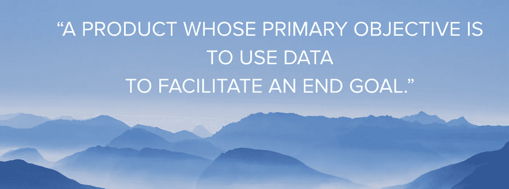
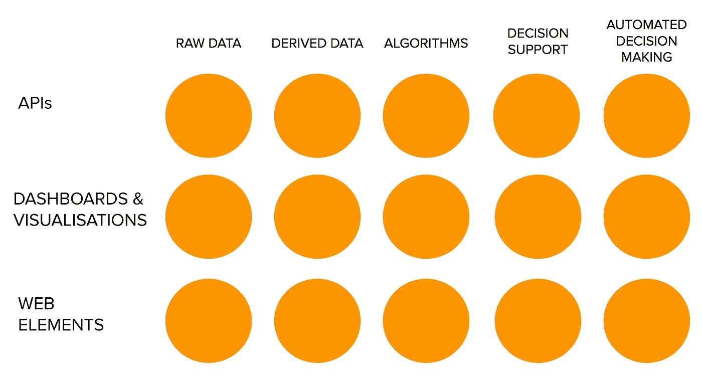

# 设计数据产品

> 原文：<https://towardsdatascience.com/designing-data-products-b6b93edf3d23?source=collection_archive---------0----------------------->

Mountainous time series. [Paul Gilmore](https://unsplash.com/@paulgilmore_?utm_source=medium&utm_medium=referral) on [Unsplash](https://unsplash.com?utm_source=medium&utm_medium=referral)

## 数据产品的 15 个方面略有不同。

什么是数据产品，为什么要关注它？

DJ Patil 将数据产品定义为“…通过使用数据促进最终目标的产品”。乍一看，这似乎很宽泛——网络上的一切都是数据产品吗？毕竟，所有的网络产品都使用数据。在大多数情况下，他们使用数据来促进最终目标。

我想在这里补充一个重要的区别；使用数据促进最终目标的*产品与主要目标是使用数据促进最终目标的*产品之间的区别。**

数据产品要求有自己的类别，从这个意义上说，数据产品是以数据为主要目标的产品。

Defining Data Products.

为什么要如此迂腐——好吧，我的论点是，数据产品，无论是整个面向客户的产品还是部分后端产品，都有着不同于其他技术产品的特征。

虽然许多标准的产品开发规则都适用——解决客户需求、从反馈中学习、坚持不懈地划分优先级等等。—有些细微之处可能会使对数据产品的思考有所不同。

上面的定义用于辨别我们是否应该像通常那样考虑产品，或者我们是否需要考虑更适合数据世界的产品开发方面。

# 一些例子

以此衡量，我们来举几个例子。

[介质](https://medium.com/u/504c7870fdb6?source=post_page-----b6b93edf3d23--------------------------------)是数据产品吗？不，不是根据我们的定义；它使用数据，但它的主要目标是*“…建立一个更好的发布平台——一个允许任何人向世界提供他们的故事和想法，并帮助伟大的人脱颖而出的平台”。*虽然数据将在这一任务中发挥关键作用，但它不是这一目标的主要驱动力。这也不是媒体的目标——对媒体来说，数据是达到目的的手段。

如果我们在 Medium 平台中深入挖掘一下，我们会发现一些产品的用途是由数据的使用来定义的。Medium 的搜索功能是一个数据产品。目标是将相关文章返回给读者，而数据是实现这一目标的核心。

Medium 的文章提要怎么样？同样，是的——数据在决定向读者展示什么方面起着关键作用。

再举个例子:Gmail 是数据产品吗？不，Gmail 是一种电子邮件服务，其主要目标是允许个人之间的异步书面交流。然而，Gmail 将我们的电子邮件分为重要和不重要是一种数据产品。主要目标是对电子邮件进行分类，其核心是自然语言处理。

Instagram 是数据产品吗？不会。但如果将其视为独立产品，它的许多功能都是数据产品，例如:标记、搜索、发现。

谷歌分析是数据产品吗？是的，的确如此——它的主要目标是给用户带来对在线行为的定量理解。在这里，数据是与用户交互的核心，不像前面提到的其他产品，它的用途是明确的。

# 数据产品的类型

显然，存在各种不同类型的数据产品。即使将可能的产品范围缩小到那些满足我们定义的产品，这些产品中仍然有相当多的种类。随着这种多样性而来的是产品开发的进一步微妙之处。

我们可以将这些数据产品分为 5 大类:原始数据、衍生数据、算法、决策支持和自动化决策。

一般来说，这些产品类型是按照复杂性的增加来排列的。更具体地说，它们是按照内部复杂度增加和(应该)用户端复杂度降低来列出的。

换句话说，数据产品本身进行的计算、决策或“思考”越多，用户需要的思考就越少。

典型地(但不排他地)，原始数据、派生数据和算法具有技术用户。大多数情况下，它们往往是组织的内部产品，但反例包括广告交换或 API 套件。决策支持和自动化决策产品倾向于拥有技术和非技术用户的更平衡的组合；虽然对于任何给定的产品，用户群往往是这样或那样的。

**原始数据。**从原始数据开始，我们收集并按原样提供数据(也许我们正在做一些小的处理或清理步骤)。然后用户可以选择适当地使用数据，但是大部分的*工作*都是在用户端完成的。

**导出数据。**在为用户提供衍生数据的过程中，我们正在做一些我们这边的处理。对于客户数据，我们可以添加额外的属性，比如为每个客户分配一个客户细分，或者我们可以添加他们点击广告或购买某个类别产品的可能性。

**算法。**接下来我们有算法，或算法即服务。我们得到一些数据，我们通过算法运行它——不管是机器学习还是其他方式——然后我们返回信息或见解。一个很好的例子是 Google Image:用户上传一张图片，然后收到一组与上传的图片相同或相似的图片。在幕后，该产品提取特征，对图像进行分类，并将其与存储的图像进行匹配，返回最相似的图像。

**决策支持。**在这里，我们希望为用户提供信息，帮助他们做出决策，但我们自己并不做决定。Google Analytics、Flurry 或 WGSN 等分析仪表盘就属于这一类。我们正在做我们这边的大部分繁重工作；我们的目的是以一种易于理解的格式向用户提供相关信息，让他们做出更好的决定。就谷歌分析而言，这可能意味着改变编辑策略，解决转化漏斗中的漏洞，或者在给定的产品策略上加倍努力。这里要记住的重要事情如下:虽然我们已经在数据收集、新数据的导出、选择显示什么数据以及如何显示数据方面做出了设计决策，但是用户仍然需要自己解释数据。他们控制着对该数据采取行动(或不采取行动)的决策。

**自动化决策。**在这里，我们将特定领域内的所有智能外包出去。网飞产品推荐或 Spotify 的 Discover Weekly 是常见的例子。自动驾驶汽车或自动化无人机更多的是这种封闭决策循环的物理表现。

我们允许算法完成工作，并向用户呈现最终的输出(有时会解释为什么 AI 选择了那个选项，其他时候完全不透明)。

# 数据交互

到目前为止，我们已经讨论了*功能性*数据产品类型。

这些数据产品中的每一个都可以以多种方式呈现给我们的用户，并对他们的设计有明确的暗示。这些界面或交互是什么？

**原料药。**在 API 的情况下，我们假设一个技术用户。我们仍然应该遵循良好的[产品实践](https://medium.com/api-product-management)并确保 API 使用直观、记录良好、能够满足用户需求并值得使用。

**仪表盘&可视化。**对于仪表板和可视化，我们假设您具备一些统计知识或处理数字的能力。在最极端的情况下，我们可以为用户做很多繁重的工作，并努力确保我们只以易于理解的格式呈现最相关的信息。通过选择显示什么信息，我们正在影响决策，但它仍然把解释和决策留在用户的手中(或头脑中)。

**网页元素。**在过去 5 年左右的时间里，用户最少看到的数据产品技术界面是 web 元素。最近，这些界面已经广泛扩展到包括语音、机器人和增强现实等。虽然这些新界面的设计细节都非常独特，但有相当多的重叠，因为它们都围绕着向用户呈现决策的结果，或许还传达了人工智能为什么或如何做出决策。

# 了解我们在建造什么

根据可能的接口绘制数据产品的类型，我们得到一个橙色点的矩阵，每个点代表一个不同的数据产品变体。

Data Product Matrix — different products require different approaches.

矩阵中的每一个元素都需要设计考虑，这些考虑在用户需求和我们使用的设计过程方面都有很大的不同。

从左上角的圆圈(原始数据-API)对角移动到右下角的圆圈(自动决策-Web 元素)是从技术、工程驱动的产品移动到更典型的软件产品(即产品经理和设计师更直观的产品，那些往往出现在书籍、杂志和文章中的产品)。

## 困难和方法

以我的经验来看，团队在数据产品方面遇到的最大问题发生在他们在更具技术性的数据产品上应用以人为中心的设计等方法时。这并不是说工程师不是人。大多数是，那些不经常有不可思议的相似之处。但 HCD 是一种产品开发的整体方法，当设计师理解用户的动机和行为时，这种方法就很出色。对于技术数据产品，产品边界通常受到职能组织考虑因素的人为限制，产品和 UX 团队通常缺乏足够的技术知识来 a)理解技术用户行为的复杂性，或者 b)缺乏探索这些复杂性的倾向。

那么，假设我们读到的设计思维或精益方法应该开箱即用是天真的。

然而，这不是恐慌的理由。

尽管用户研究的结果可能与面向消费者的产品或典型的 SaaS 产品有很大不同，KPI 的定义也可能在技术方面出错，但设计思维和精益都有足够的延展性，允许我们针对这个新领域定制我们的方法。

我的建议是，在将这些方法应用于数据产品时，要确保问题空间是根据最终用户来定义的，而不仅仅是直接数据输出的用户。十有八九，这将意味着扩大团队，以包括相邻的产品及其经理。

类似地，如果用户是技术人员，我们有责任去适应环境。同情一个经历工程问题的用户可能意味着我们必须打开一个 IDE 并开始编码。

# 感谢您的阅读🙏🏻

如果你喜欢这个，你可能会喜欢****部署时代——每周更新的工具和思考，揭示了 2020 年代的新兴技术和趋势。****

********

****Watercress, developed using a HCD-Lean combo. Photo by [Markus Spiske](https://unsplash.com/@markusspiske?utm_source=medium&utm_medium=referral) on [Unsplash](https://unsplash.com?utm_source=medium&utm_medium=referral)****

*****这篇文章形成了我在 2017 年都柏林产品罐见面会上的一次演讲的部分内容。*****