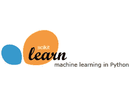
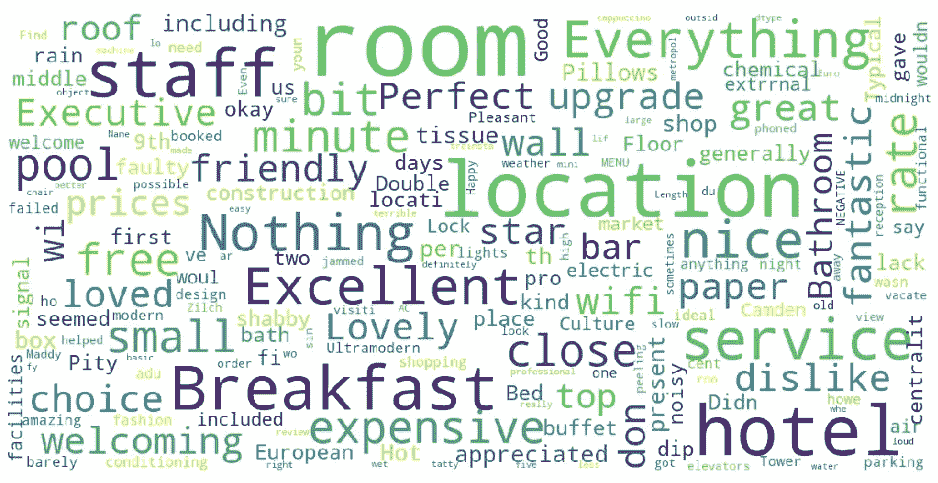
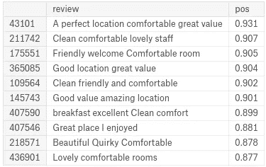
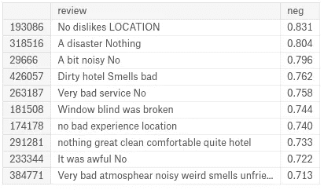
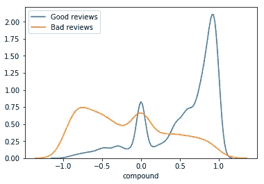
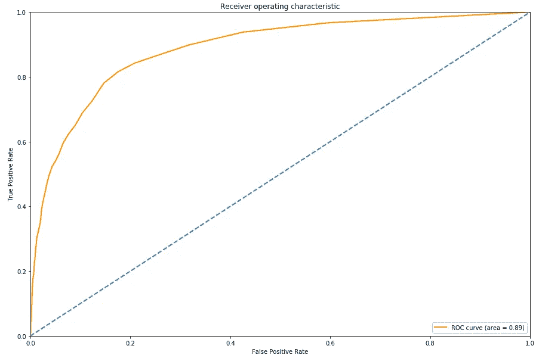
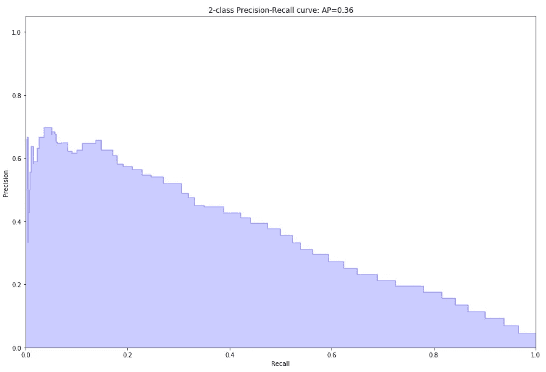

# 用自然语言处理检测不良顾客评论

> 原文：<https://towardsdatascience.com/detecting-bad-customer-reviews-with-nlp-d8b36134dc7e?source=collection_archive---------1----------------------->

## 用 Python 进行情感分析和文本分类


Photo by [Thought Catalog](https://unsplash.com/@thoughtcatalog?utm_source=medium&utm_medium=referral) on [Unsplash](https://unsplash.com?utm_source=medium&utm_medium=referral)

# 介绍

情感分析是自然语言处理(NLP)技术的一部分，包括提取与一些原始文本相关的情感。这通常用于社交媒体帖子和客户评论，以便自动了解一些用户是积极还是消极以及为什么。这项研究的目标是展示如何使用 python 进行情感分析。以下是我们将使用的一些主要库:

*   NLTK:NLP 技术最著名的 python 模块
*   Gensim:一个主题建模和向量空间建模工具包


Gensim module

*   Scikit-learn:最常用的 python 机器学习库



Scikit-learn module

我们将在这里使用一些酒店评论数据。每个观察包括对一个酒店的一个顾客评论。每个顾客评论由顾客对酒店体验的文字反馈和总体评分组成。数据可以在这里找到:

[https://www . ka ggle . com/jiashenliu/515k-hotel-reviews-data-in-Europe](https://www.kaggle.com/jiashenliu/515k-hotel-reviews-data-in-europe)

对于每个文本评论，我们想要预测它是对应于一个好的评论(客户满意)还是一个坏的评论(客户不满意)。评论的总体评分从 2.5/10 到 10/10 不等。为了简化问题，我们将把它们分成两类:

*   差评有总评< 5
*   good reviews have overall ratings > = 5

这里的挑战是能够仅使用来自综述的原始文本数据来预测这些信息。让我们开始吧！

# 加载数据

我们首先从加载原始数据开始。每篇文本评论分为正面和负面两部分。我们将它们组合在一起，以便只从原始文本数据开始，没有其他信息。


Initial dataset

# 抽样资料

为了加快计算速度，我们对数据进行了采样。

# 干净的数据

如果用户没有留下任何负面反馈意见，这将在我们的数据中显示为“无负面”。默认值为“无正面”的正面评论也是如此。我们必须从课本中删除这些部分。

下一步是用各种操作清理文本数据:

为了清理文本数据，我们调用自定义的“clean_text”函数来执行几个转换:

*   降低文本
*   将文本标记化(将文本拆分成单词)并删除标点符号
*   删除包含数字的无用单词
*   删除无用的停用词，如“the”、“a”、“this”等。
*   词性标注:给每个单词分配一个标签，以确定它是否对应于名词、动词等。使用 WordNet 词汇数据库
*   对文本进行词汇化:将每个单词转换成它们的词根形式(例如，rooms -> room，sleeped-> sleep)

现在我们已经清理了我们的数据，我们可以为我们的模型化部分做一些特征工程。

# 特征工程

我们首先从添加情感分析特性开始，因为我们可以猜测客户评论与他们对酒店住宿的感受高度相关。我们使用 Vader，它是为情感分析设计的 NLTK 模块的一部分。维德使用词汇来找出哪些是肯定的，哪些是否定的。它还考虑句子的上下文来确定情感分数。对于每个文本，Vader 返回 4 个值:

*   中立分数
*   积极得分
*   消极得分
*   总结以前分数的总分

我们将整合这 4 个值作为数据集中的特征。

接下来，我们为每个文本添加一些简单的指标:

*   文本中的字符数
*   文本中的字数

下一步是为每个评论提取矢量表示。Gensim 模块通过使用单词出现的上下文来创建语料库中每个单词的数字向量表示(Word2Vec)。这是使用浅层神经网络来执行的。有趣的是，相似的词会有相似的表示向量。

还可以使用单词 vectors (Doc2Vec)将每个文本转换成数字向量。相同的文本也将具有相似的表示，这就是为什么我们可以使用这些向量作为训练特征。

我们首先必须通过输入文本数据来训练 Doc2Vec 模型。通过在我们的评论上应用这个模型，我们可以得到那些表示向量。

最后，我们为每个单词和每个文档添加 TF-IDF(术语频率——逆文档频率)值。

但是为什么不简单地计算每个单词在每个文档中出现的次数呢？这种方法的问题是，它没有考虑到文本中单词的相对重要性。一个出现在几乎所有文本中的单词不太可能为分析带来有用的信息。相反，生僻字可能有更多的含义。

TF-IDF 度量解决了这个问题:

*   TF 计算单词在文本中出现的经典次数
*   IDF 计算该单词的相对重要性，这取决于可以找到多少文本

我们为出现在至少 10 个不同文本中的每个单词添加了 TF-IDF 列，以过滤其中的一些单词并减少最终输出的大小。

# 探索性数据分析

为了更好地理解我们的数据，让我们稍微探究一下:

```
0    0.956761
1    0.043239
Name: is_bad_review, dtype: float64
```

我们的数据集是高度不平衡的，因为不到 5%的评论被认为是负面的。这些信息对建模部分非常有用。

现在，让我们打印一些单词云，看看哪些单词出现在我们的评论中:



WordCloud from the customer reviews

大多数单词确实与酒店有关:房间、员工、早餐等。有些词与顾客对酒店住宿的体验更相关:完美、喜爱、昂贵、不喜欢等。



Highest positive sentiment reviews

最积极的评价确实对应着一些好的反馈。



Highest negative sentiment reviews

在最负面的评论中可以发现一些错误:维达有时将“不”或“什么都没有”解释为负面词汇，而它们有时被用来表示酒店没有任何问题。幸运的是，大多数评论确实是不好的。



Sentiment distribution

上图显示了好评和差评的评论情绪分布。我们可以看到，维达认为大多数好评都是非常正面的。相反，差评往往复合情绪得分较低。

这向我们表明，先前计算的情感特征在我们的建模部分将非常重要。

# 造型很差

我们首先选择要用来训练模型的特征。然后我们将数据分成两部分:

*   一个用来训练我们的模型
*   一个是评估它的表现

接下来，我们将使用随机森林(RF)分类器进行预测。


Most important features

最重要的特征确实是来自前面的情感分析的特征。文本的向量表示在我们的训练中也很重要。一些单词似乎也有相当的重要性。



ROC curve

ROC(接收器操作特性)曲线通常是总结我们的分类器质量的好图。曲线在对角线基线之上越高，预测就越好。虽然 AUC ROC(ROC 曲线下的面积)非常好，但我们不应该在这里使用 ROC 曲线来评估我们模型的质量。

为什么？首先让我们提醒一下假阳性率公式，它对应于 ROC 曲线的 x 轴:FPR(假阳性率)= #假阳性/ #阴性。

这里的#负数对应于我们的好评数，因为我们的数据集不平衡，所以好评数非常高。这意味着，即使有一些假阳性，我们的 FPR 将倾向于保持很低。我们的模型将能够做出许多假阳性预测，并且仍然具有低假阳性率，同时增加真阳性率，因此人为地增加 AUC ROC 度量。



PR curve

在这种不平衡的情况下，一个更好的指标是 AUC PR(曲线下面积精度召回)，也称为 AP(平均精度)。

我们可以看到，当我们提高召回率时，精确度会降低。这告诉我们，我们必须选择一个适合我们需要的预测阈值。如果我们的目标是高召回率，我们应该设置一个低的预测阈值，这将允许我们检测大多数阳性类别的观察值，但是精度较低。相反，如果我们想对我们的预测真正有信心，但不介意没有找到所有积极的观察结果，我们应该设置一个高阈值，这将使我们获得高精度和低召回率。

为了知道我们的模型是否比另一个分类器执行得更好，我们可以简单地使用 AP 度量。为了评估我们模型的质量，我们可以将其与简单的决策基线进行比较。让我们以一个随机分类器作为基线，它将预测标签的一半时间 1 和一半时间 0。

这种分类器将具有 4.3%的精度，这对应于正面观察的比例。对于每个召回值，精度将保持不变，这将导致 AP 为 0.043。我们模型的 AP 约为 0.35，比随机方法的 AP 高 8 倍以上。这意味着我们的模型有很好的预测能力。

# 结论

完全可以只使用原始文本作为输入来进行预测。最重要的是能够从原始数据中提取相关特征。这种数据通常可以作为数据科学项目中的一个很好的补充来源，以便提取更多的学习特征并提高模型的预测能力。

下面是 Github 上 Jupyter 原始笔记本的链接:

[](https://github.com/jonathanoheix/Sentiment-analysis-with-hotel-reviews) [## jonathanoheix/酒店评论情感分析

### 使用 Python-jonathanoheix/带酒店评论的情感分析进行情感分析和文本分类

github.com](https://github.com/jonathanoheix/Sentiment-analysis-with-hotel-reviews) 

同样在 Kaggle 上:

 [## 酒店评论的情感分析| Kaggle

www.kaggle.com](https://www.kaggle.com/jonathanoheix/sentiment-analysis-with-hotel-reviews/) 

我的 LinkedIn 个人资料:

[https://www.linkedin.com/in/jonathanoheix/](https://www.linkedin.com/in/jonathanoheix/)