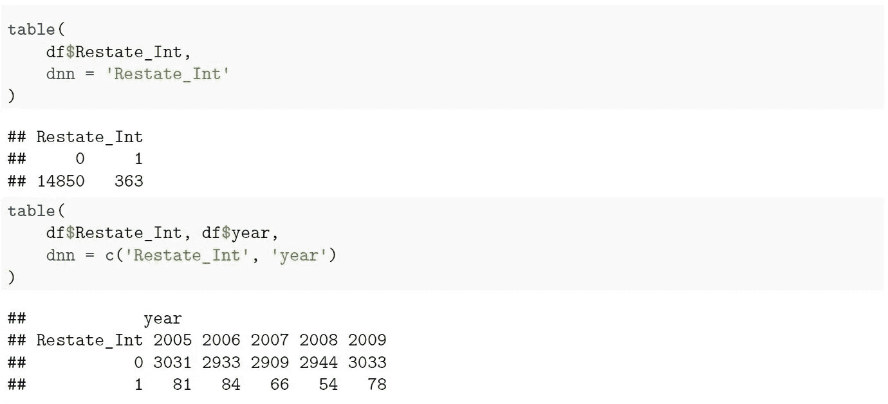
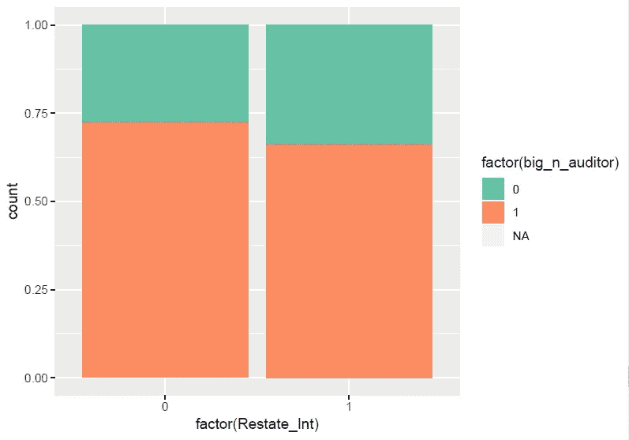
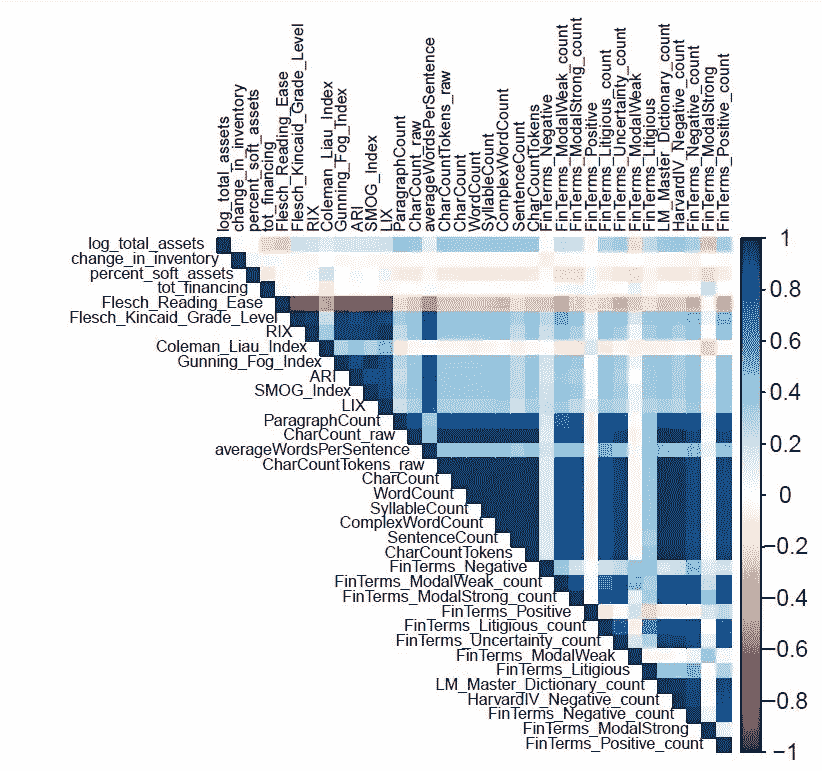
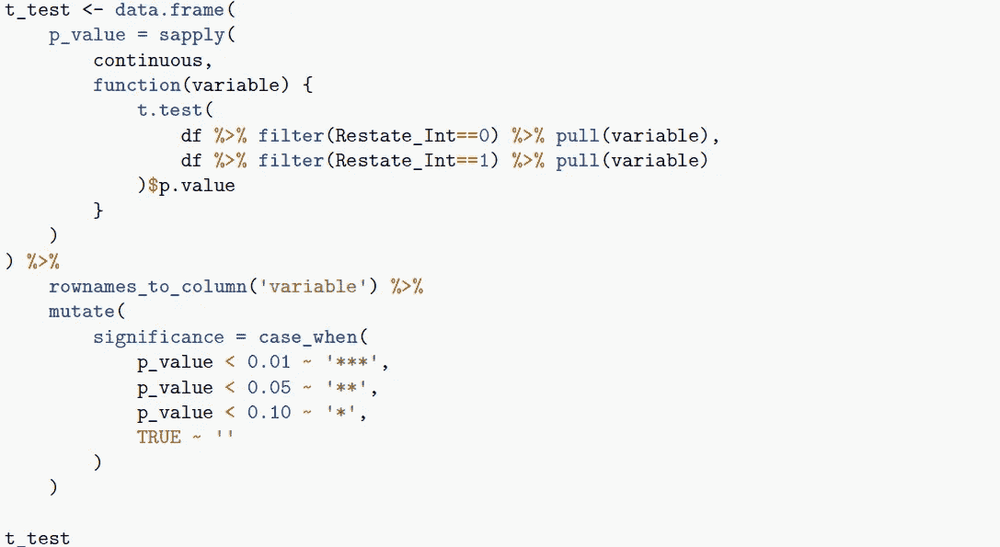
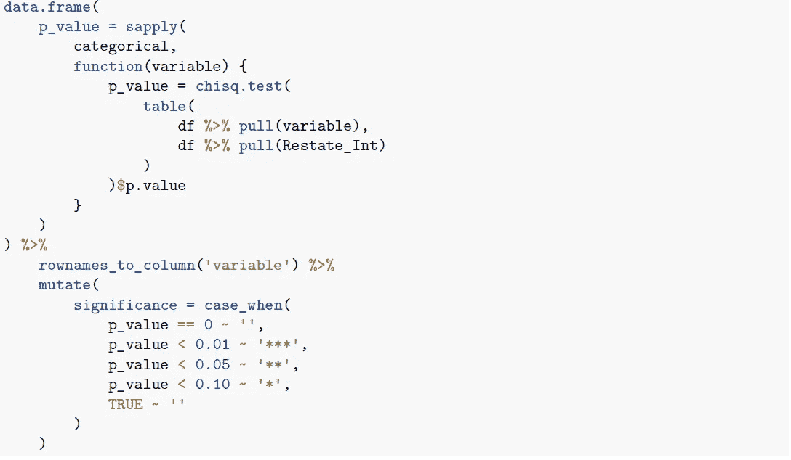
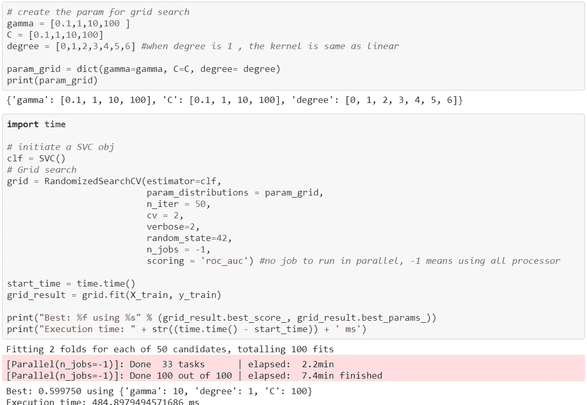
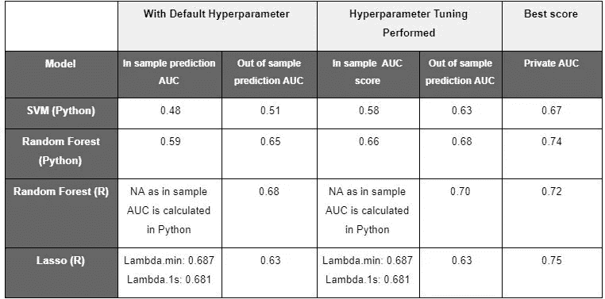
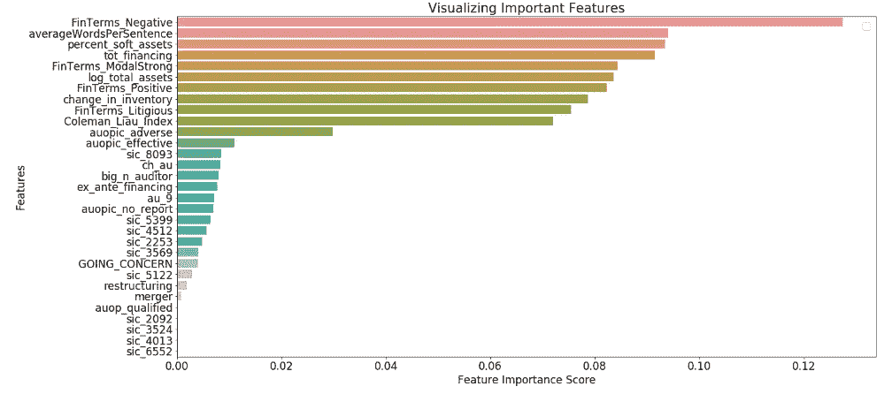

# 用机器学习检测财务报表欺诈

> 原文：<https://towardsdatascience.com/detecting-firms-with-intentional-misstatements-using-machine-learning-a943191f88cf?source=collection_archive---------14----------------------->

## 了解机器学习如何检测会计欺诈

Photo by [M. B. M.](https://unsplash.com/@m_b_m?utm_source=medium&utm_medium=referral) on [Unsplash](https://unsplash.com?utm_source=medium&utm_medium=referral)

查明扭曲财务报表的公司仍然被审计人员视为一项挑战，因为多年来欺诈手段变得越来越复杂——通过其他实体隐瞒损失，过早确认收入，甚至让未注册的审计人员声称财务报表真实、公平。

最近，我完成了一个机器学习项目，根据 2005-2009 年的历史数据来识别 2010 年有故意错报的美国公司。

我认为分享这个数据科学项目的方法和关键学习点会很有趣，如果你想了解更多，请继续阅读。

## **详细讨论的关键步骤概述:**

*   特征工程
*   探索性数据分析
*   特征选择采用 t 检验和卡方检验
*   模型选择与实现
*   随机搜索 CV 模型的微调
*   模型评估
*   模型解释

# 第一步:特征工程

在这个项目中，第一个挑战是完全没有提供任何功能，不像大多数的 Kaggle 比赛都有训练数据。我们唯一的属性是公司识别码、年份以及该公司在该年是否实施了金融服务欺诈。

特征工程是每个数据科学项目的关键步骤，数据科学家在特征工程上花费大量的时间来创建有意义的特征，以捕捉正在观察的现象的特征。没有高质量的数据，最复杂的机器学习算法将无法胜过具有高质量特征的简单模型。

## 你会问，我们如何找到可以训练的功能？

*   阅读研究论文:有趣的是，这个主题被其他研究者广泛撰写——[德绍(2011)](http://thecaq.org/sites/default/files/DECHOW_et_al-2011-Contemporary_Accounting_Research.pdf) 和 [BCE(2018)](https://papers.ssrn.com/sol3/papers.cfm?abstract_id=2803733)
*   通过问正确的问题来集思广益

## 利用过去的研究论文

依靠过去的研究论文，如 [Dechow(2011)](http://thecaq.org/sites/default/files/DECHOW_et_al-2011-Contemporary_Accounting_Research.pdf) 和 [BCE(2018)](https://papers.ssrn.com/sol3/papers.cfm?abstract_id=2803733) 非常有助于理解可以提取实施会计欺诈的公司特征的特征类型。

以下是这些研究论文中探索的一些不同类型的变量:

*   **捕捉公司财务活动的财务变量**:例如，应收账款的变化、存货的变化、账面市值比以及公司是否进行了重组
*   **文本风格特征**捕捉财务报表的可读性、长度、语气和用词
*   捕捉业务性质的特征:例如，公司是在零售、服务还是计算机行业

将这两篇研究论文的显著特征包括在我们的初始 Lasso 模型中，R 仅能够实现 0.64 的样本外 AUC 得分，这表明该模型仅能够在 64%的时间内正确预测目标。

## 利用领域知识进行头脑风暴

很明显，我们需要更多的特征工程，然后**问自己，如果我们是审计师、内部审计师、监管者和投资者，我们如何通过利用任何数据来发现存在故意错报的公司？**假设您可以获得任何数据，您会为模型添加哪些功能。经过一番头脑风暴，我们想出了一些可能的变量:

*   **审计师**将有权访问重大错报的领域/数量、管理审查点的数量、审计师意见、行业以及该行业是否为高风险行业。
*   内部审计员评估公司的内部控制，他们可以得到内部控制强度的分数和内部邮件。一些可能的变量是对内部控制的看法，以及内部电子邮件是否包含表明欺诈的可疑消息。
*   **监管机构**将有权获得高层管理信息和薪酬详情，一个可能的变量是计算首席执行官或首席财务官的流动率，因为高层管理人员往往会在财务报表操纵期间或监管机构发现欺诈后离开公司。高层管理人员未行使的股票期权的数量也经常与激进的会计方法有关。
*   **投资者**由于公众可以访问财务报告和股票数据，因此可以关注股价和股票回报的波动性，因为管理层经常操纵财务报表以满足投资者或分析师的预期，从而维持股价。

考虑到可能的变量，我们从 WRDS 数据库中搜索这些变量的可用性，以获得以下变量:

*   **审计意见**:审计师的意见可能预示着潜在的欺诈案件。例如，反对意见、有保留意见和无保留意见。
*   **对内部控制的看法:**不良的内部控制增加了舞弊的机会。例如有效、不利和免责。
*   **财务报表审计师:**某些审计公司可能面临更大的压力，要求其签署存在重大错报的财务报表
*   **行业:**部分行业易受欺诈打击，且被发现与欺诈案件有关联
*   **CEO 更替与薪酬:**该变量因数据缺失过多而未被使用
*   **与股票回报和波动性相关的变量:**这个变量后来没有被使用，因为这将限制我们的训练数据集只包含上市公司

# 第 2 步:数据清理

Photo by [pan xiaozhen](https://unsplash.com/@zhenhappy?utm_source=medium&utm_medium=referral) on [Unsplash](https://unsplash.com?utm_source=medium&utm_medium=referral)

将所有变量与给定的包含公司标识符、年份和目标变量的培训数据集合并后。进行探索性数据分析之前，检查缺失数据和重复数据的程度很重要。

1.  **检查重复项:统计新合并的训练数据帧的行数**，并与原始数据帧进行比较，如果有重复项，根据唯一的公司标识进行删除
2.  **检查缺失数据:**使用 **R 的 Visdat package** 下的 **vis_miss** 功能将缺失数据可视化，如果缺失数据占训练数据集的 2%以上(具有国际错报的观察结果的百分比占数据集的 2%)，我会完全丢弃该变量

# 第 3 步:通过探索性数据分析获得见解

## 3.1 了解目标变量的分布:生成目标变量的频率表

从该表中，我们可以看出，由于预测问题的性质，存在不平衡的类分布，因为在整个训练数据集中只有 2%的观察结果包含有意的错报。这是分类问题中的一个常见问题，有几种方法可以处理[不平衡的类分布](https://machinelearningmastery.com/tactics-to-combat-imbalanced-classes-in-your-machine-learning-dataset/) ns。一些解决方案包括数据集的重采样、生成的合成样本、较少偏向多数类的挑选算法以及惩罚模型。

## 3.2 识别有助于预测故意错报的变量:可视化所有变量的分布和相对频率

我们绘制了每个连续/分类变量的密度图和条形图，以比较错报公司和非错报公司。为了使本文简短易懂，以下是一些有趣的观察结果:

The mean of log_total_assets for observations where Restate_Int = 1 is approximately 5, while the mean of log_total_assets for observations where Restate_Int = 0 is approximately 6.5.

平均而言，故意错报财务报表的公司被发现具有较低的总资产对数值，而那些没有故意错报财务报表的公司往往具有较高的总资产对数值。看起来小公司可能会扭曲其财务报表。

As seen from the bar chart above, of all observations where Restate_Int = 0, 70% had engaged a Big N auditor for their financial statement audit. This proportion is relatively higher than the 65% of observations where Restate_Int = 1

似乎没有故意错报的**事务所**更有可能是雇佣了**大型审计事务所的事务所。**

## 3.3 绘制相关矩阵，以移除变量之间高度相关的变量

基于相关矩阵，我们发现与财务报表长度相关的变量倾向于彼此相关，可读性变量也是如此。

然后去除高度相关的变量，只保留一个有意义的变量。这也被称为多重共线性的**问题。尽管一些机器学习模型(如 tree methods 和 Lasso)能够处理多重共线性，但是，包括**高度相关的变量可能会导致算法选择“不太正确”的变量**，从而**影响模型结果的解释。****

# 步骤 4:特征选择

特征选择可以通过您自己对问题的了解来完成，或者使用选择模型(Lasso)来自动完成，或者使用简单的相关矩阵来识别与目标变量相关的特征。

最好使用第一种方法，因为使用选择模型来自动化特征选择可能会导致更难解释的结果。

**对于该项目，我们对所有连续变量进行了 t 检验，对所有分类变量进行了卡方检验，以确定显著特征。**

t-test in R

在 t 检验下，p 值告诉我们公司由于某一特定变量而不是由于随机抽样而不重述其财务报表的概率。因此，如果 p 值低于 0.1，我们拒绝零假设，支持替代方案。

chi-square test in R

而对于卡方检验，p 值告诉我们特征的概率独立于整个群体中的目标。

考虑到 t 检验结果、卡方检验结果和探索性数据分析结果，选择了 32 个特征。

# 步骤 5:模型选择和实现

有许多机器学习模型可以用来解决这个机器学习问题，列出模型选择的标准是有帮助的。

机器学习算法必须能够:

*   **执行监督二元分类:**因为预测一家美国公司是否故意错报其财务报表是一个二元分类问题
*   **处理不均衡的班级分布**
*   **接受更大数量的维度**

考虑到这些限制，满足这些标准的算法是支持向量机、随机森林和 LASSO。

为了比较所有机器学习模型的模型性能，我们使用了具有五倍 CV 的样本内平均 AUC 分数，以及从 Kaggle 上的公共领导力仪表板获得的样本外 AUC 分数。

在第一轮模型评估中，我们比较了所有用**默认超参数训练的机器学习模型的样本外 AUC 得分。**R 中的随机森林表现最好(AUC 为 0.68)，其次是 Python 中的随机森林(AUC 为 0.65)，Lasso (AUC 为 0.63)，SVM (AUC 为 0.51)表现最差。

# 步骤 6:模型的微调

使用默认的超参数，最佳模型能够获得 0.68 的样本外 AUC 分数。为了进一步提高模型性能，我们**使用 scikit-learn 软件包中的随机搜索交叉验证功能**对随机森林和 SVM 进行了微调。

## 随机森林模型的超参数调整

## 超参数调整支持向量分类器模型

**点击** **查看 Python** [**中超参数调优的完整实现。**](https://github.com/SofiaKung/Portfolio/blob/master/Detecting%20Intentional%20Misstatements%20by%20US%20Corporations.ipynb)

Lasso 不需要超参数调整，因为在 R 的 glmnet 软件包中，Lasso 默认具有内置功能，可以通过交叉验证来选择最佳的 lambda 值。

超参数调整能够将所有模型的 AUC 分数提高约 0.03-0.04。在 R 中训练的随机森林继续以 0.70 的样本外 AUC 胜过其余模型。

在私人领导委员会发布 AUC 分数后，最佳模型是随机森林(Python ),其样本外 AUC 分数为 0.74，因为它在 50%和 100%的测试数据上具有更稳定的 AUC 分数。

AUC 分数 0.74 被认为是可接受的表现，因为该模型有 0.74 的机会能够区分具有故意错报的公司。

# 步骤 7:模型解释——特征重要性

基于决策树的模型具有[特征重要性属性](https://www.stat.berkeley.edu/~breiman/RandomForests/cc_home.htm#varimp)来识别对模型性能贡献最大的特征。有许多方法可以计算特征重要性值，而 scikit-learn 实施了“平均减少杂质”指标，该指标用于测量随机置换变量值后出袋病例的准确性下降。如果准确度的降低很低，则该特征不太重要。

Code to visualize the feature importance in Python

驱动该模型性能的有趣特性包括:

*   财务报表中使用更多的负面词汇表明财务表现不佳，因此操纵账目的压力更大
*   **平均每句话字数**:该特征衡量财务报表的复杂程度和可读性。难以阅读的财务报表可能表明复杂的会计活动(需要主观判断的会计处理，因此存在更大的操纵风险)或故意措辞，使投资者更难理解以隐藏财务报表操纵
*   **软资产百分比**:不包括物业、厂房及设备、现金及现金等价物的总资产百分比。应收账款和应收账款是更难核实的账户，因此受到管理层操纵的风险更高
*   (Loughran-McDonald 诉讼词比例):包含更多诉讼词的财务报表意味着更大的诉讼风险，因此面临更大的操纵账目的压力
*   **Tot 融资:**杠杆率较高的公司破产风险更大，因此面临更大的操纵账目的压力
*   对内部控制持负面意见的公司有更大的机会操纵账目

**最终想法**

当我们尝试 Kaggle 竞赛时，通常会给出大多数变量，这并不要求我们从头开始执行特征工程。这个项目通过提出正确的问题让我体会到了特征工程的重要性。

我从这个项目中获得的主要收获是:

*   在功能工程上要有创造性，不要在头脑风暴出可能的功能之前就假设某些功能是不可用的
*   利用过去的研究论文来理解选择某些变量和相关限制的基本原理
*   可用于特征选择和处理不平衡类别分布的技术
*   始终执行超参数调整以提高模型性能

我要感谢我的队友们为这个项目付出的努力，也要感谢我们的教授给予的指导和鼓励。