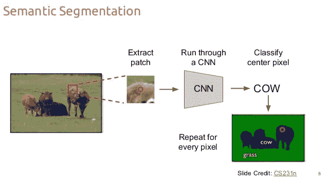
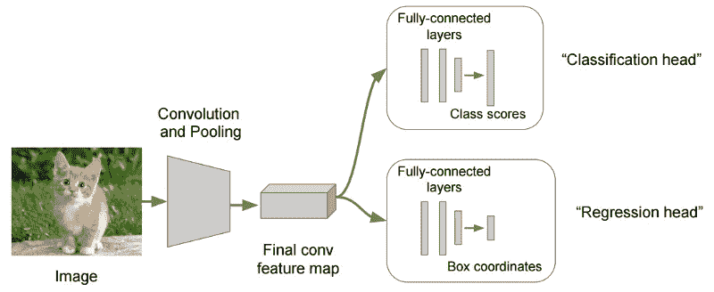
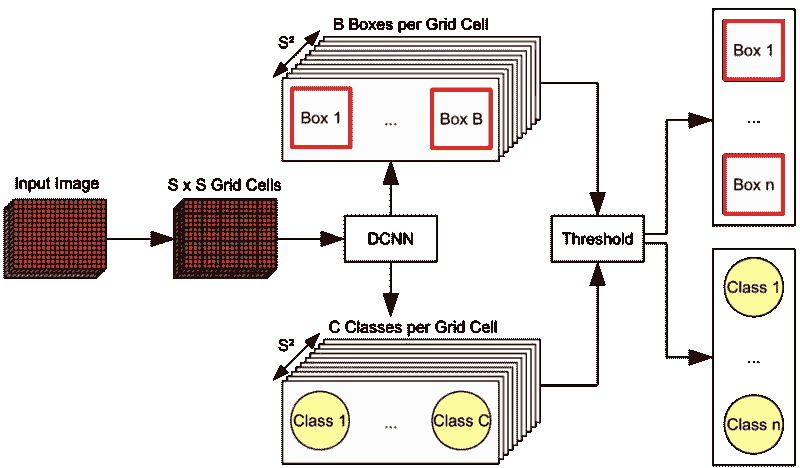

# 通过 ConvNets 进行检测和分割

> 原文：<https://towardsdatascience.com/detection-and-segmentation-through-convnets-47aa42de27ea?source=collection_archive---------6----------------------->


Computer vision — Object detection and segmentation

神经网络在计算机视觉领域有广泛的应用。稍加改变，同样的工具和技术可以有效地应用于各种任务。在本文中，我们将介绍其中的几个应用程序以及接近它们的方法。最常见的四种是

*   *语义分割*
*   *分类和定位*
*   *物体检测*
*   *实例分割*

## 语义分割

我们输入一幅图像，并输出每个像素的类别判定。换句话说，我们希望将每一个像素归入几个可能的类别之一。这意味着，所有带有绵羊的像素将被分类到一个类别中，带有草地和道路的像素也是如此。更重要的是，输出不会区分两只不同的羊。

解决这个问题的一个可能的方法是把它当作一个带有滑动窗口的[分类问题。通过这种方式，我们获取一个输入图像，并将其分成几个相同大小的裁剪部分。然后，每种作物都会被输入到 CNN，以获取该作物的分类类别作为输出。像素级的作物将对每个像素进行分类。那是超级容易的不是吗？](https://www.pyimagesearch.com/2015/03/23/sliding-windows-for-object-detection-with-python-and-opencv/)



Semantic segmentation using sliding window

好吧，它甚至不需要一个研究生学位就能看出这种方法在实践中的计算效率有多低。我们需要的是一种将图像的通过次数减少到最多一次的方法。幸运的是，有建立具有所有卷积层的网络的技术来一次对所有像素进行预测。


Fully convolutional layer for semantic segmentation

如你所见，这样的网络将是*下采样*和*上采样*层的混合，以便保持输入图像的空间大小(在像素级进行预测)。下采样是通过使用步长或最大/平均池来实现的。另一方面，上采样需要使用一些巧妙的技术，其中两种是— [最近邻](https://groups.google.com/d/topic/neon-users/I-x9ooJO5PA)和[转置卷积](/up-sampling-with-transposed-convolution-9ae4f2df52d0)。


Up sampling techniques

简而言之，最近邻只是复制其感受野中的特定元素(上面例子中的 2x2)。另一方面，转置卷积努力学习执行上采样所需的滤波器的适当权重。在这里，我们从左上角值开始，它是一个标量，乘以过滤器，并将这些值复制到输出像元中。然后，我们在输出中按输入中一个像素移动的比例移动滤波器的一些特定像素。这个，输出和输入之间的比率，会给我们想要使用的步幅。在重叠的情况下，我们只是将这些值相加。这样，这些滤波器也构成了这些网络的可学习参数，而不是像最近邻的情况那样的某个固定值集。最后，我们可以使用像素级的[交叉熵损失](https://rdipietro.github.io/friendly-intro-to-cross-entropy-loss/)通过[反向传播](http://neuralnetworksanddeeplearning.com/chap2.html)来训练这整个网络。

## 分类和本地化

[图像分类](https://medium.com/@tifa2up/image-classification-using-deep-neural-networks-a-beginner-friendly-approach-using-tensorflow-94b0a090ccd4)处理给图像分配类别标签。但有时，除了预测类别，我们还对图像中该对象的位置感兴趣。用数学术语来说，我们可能想要在图像中的对象周围画一个边界框，如顶部的图片所示。幸运的是，我们可以重用我们在图像分类中学到的所有工具和技术。



Convolutional network for Classification + Localization

我们首先将输入图像输入到一个巨大的 ConvNet，它会给我们每个类别的分数。但是现在我们有了另一个完全连接的层，它从早期层生成的特征图中预测对象边界框的坐标(中心的 x，y 坐标以及高度和宽度)。因此，我们的网络将产生两个输出，一个对应于图像类，另一个对应于边界框。此后，为了训练这个网络，我们必须考虑两个损失，即分类的交叉熵损失和边界框预测的 [L1/L2 损失](https://letslearnai.com/2018/03/10/what-are-l1-and-l2-loss-functions.html)(某种回归损失)。

概括地说，这种预测固定数目集合的思想可以应用于各种各样的计算机视觉任务，而不是定位，例如人类姿势估计。


Human pose estimation

在这里，我们可以通过身体上的一组固定点来定义人的姿势，例如关节。然后，我们将图像输入到 ConvNet，并输出相同的固定点(x，y)坐标。然后，我们可以在这些点上应用某种回归损失，通过反向传播来训练网络。

## 目标检测

对象检测的思想是，我们从一些我们感兴趣的固定类别集合开始，并且任何时候这些类别中的任何一个出现在输入图像中，我们将在该图像周围绘制边界框，并预测其类别标签。这在某种意义上不同于图像分类和定位，在前者中，我们将只围绕单个对象分类和绘制边界框。而在后一种情况下，我们事先不知道在图像中预期有多少对象。同样，我们也可以应用强力[滑动窗口](https://www.pyimagesearch.com/2015/03/23/sliding-windows-for-object-detection-with-python-and-opencv/)方法来解决这个问题。然而，这也是计算效率低下的。相反，很少有算法被开发来有效地解决这个问题——基于区域提议的算法和 [YOLO 对象检测算法](https://pjreddie.com/darknet/yolo/)。

**基于区域提议的算法**

给定一幅输入图像，区域提议算法将给出数千个可能存在物体的方框。当然，输出中有可能存在噪声，就像没有物体的盒子一样。然而，如果图像中存在任何对象，则该对象将被算法选为候选框。


Selective search for region proposals

为了使所有的候选盒子大小相同，我们需要将它们扭曲成某个固定的正方形大小，这样我们就可以最终把它提供给网络。然后，我们可以将一个巨大的 ConvNet 应用于从区域建议输出的每个候选框，以获得最终的类别。毫无疑问，与强力滑动窗口算法相比，它的计算效率要高得多。这是 R-CNN 背后的整个想法。现在，为了进一步降低复杂性，使用了快速 R-CNN。快速 R-CNN 背后的思想是首先通过使输入图像通过 ConvNet 来获得高分辨率的特征图，然后将那些区域建议施加到该特征图上，而不是实际图像上。当我们有大量的作物时，这允许我们在整个图像上重复使用大量昂贵的卷积计算。

**YOLO(你只看一次)**



YOLO object detection

YOLO 背后的想法是，通过将它重新构建为一个单一的回归问题，直接从图像像素到边界框坐标和类概率，而不是在提议的区域中进行独立的处理，来一次做出所有的预测。

我们首先把整个输入图像分成 SxS 网格。每个网格单元预测 C 个条件类概率(Pr(Class | Object))以及 B 个边界框(x，y，w，h)，每个边界框都有一个置信度得分。(x，y)坐标表示相对于网格单元边界的框的中心，而宽度和高度是相对于整个图像预测的。概率取决于包含对象的网格单元。我们只预测每个网格单元的一组类概率，而不考虑盒子 b 的数量。置信度得分反映了模型对盒子包含对象的置信度。如果盒子中没有物体，那么置信度得分必须为零。在另一个极端，置信度得分应该与预测框和真实标签之间的交集(IOU)相同。

```
 **Confidence score = Pr(Object) * IOU**
```

在测试时，我们将条件类概率和单个盒子的置信度预测相乘，这给出了每个盒子的特定于类的置信度得分。这些分数编码了该类出现在框中的概率以及预测的框与对象的匹配程度。

```
 **Pr(Class | Object) ∗ (Pr(Object) ∗ IOU) = Pr(Class) ∗ IOU**
```

## 实例分割

实例分割采用语义分割和对象检测技术。给定一幅图像，我们希望预测该图像中对象的位置和身份(类似于对象检测)，然而，我们希望预测这些对象的整个分割掩模，即输入图像中的哪个像素对应于哪个对象实例，而不是预测这些对象的边界框。在这种情况下，我们为图像中的每只羊获得单独的分割掩码，这与语义分割形成对比，在语义分割中，所有的羊获得相同的分割掩码。


Mask R-CNN for instance segmentation

Mask R-CNN 是这类任务的首选网络。在这个多阶段处理任务中，我们将输入图像通过一个 ConvNet 和一些学习区域建议网络。一旦我们有了这些区域建议，我们就把这些建议投射到卷积特征图上，就像我们在 R-CNN 中所做的那样。然而现在，除了进行分类和边界框预测之外，我们还为这些区域提议中的每一个预测分割掩模。

## 资源

[](https://cs.stanford.edu/people/karpathy/rcnn/) [## RCNN 示例结果

### 我在玩一个最先进的物体探测器，Ross Girshick 最近发布的 RCNN。方法…

cs.stanford.edu](https://cs.stanford.edu/people/karpathy/rcnn/) [](https://www.coursera.org/lecture/convolutional-neural-networks/yolo-algorithm-fF3O0) [## YOLO 算法-对象检测| Coursera

### deeplearning.ai 为课程“卷积神经网络”创建的视频。学习如何运用你在…方面的知识

www.coursera.org](https://www.coursera.org/lecture/convolutional-neural-networks/yolo-algorithm-fF3O0) 

请让我在评论中知道这篇文章可以容纳的任何改进/修改。