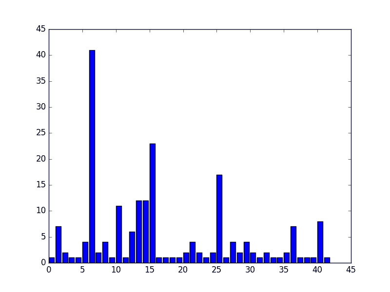
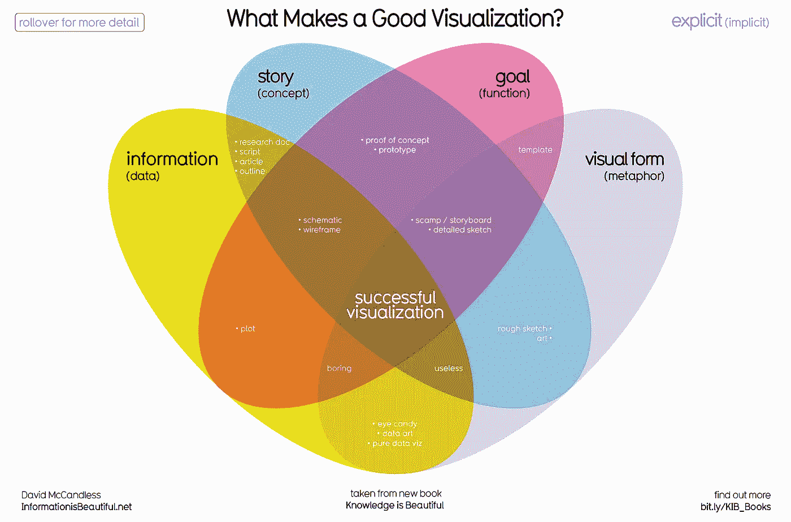
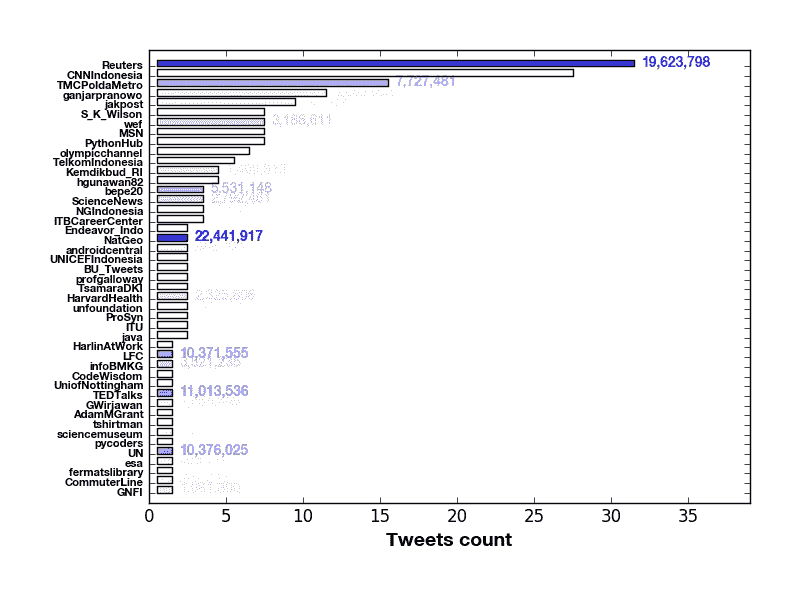
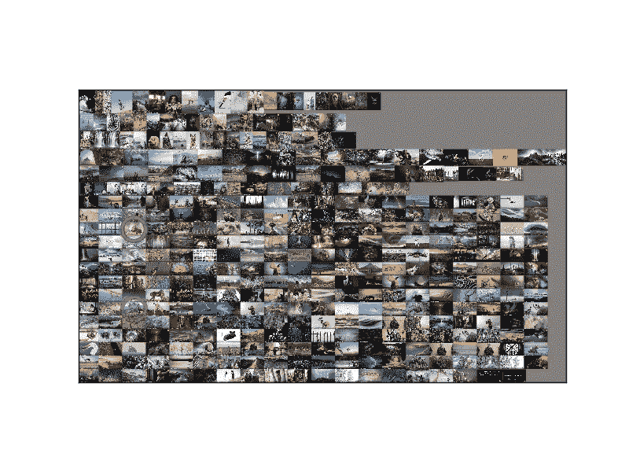
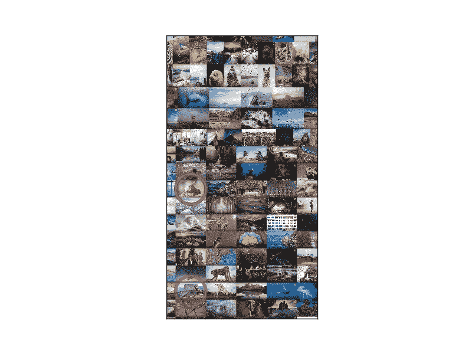
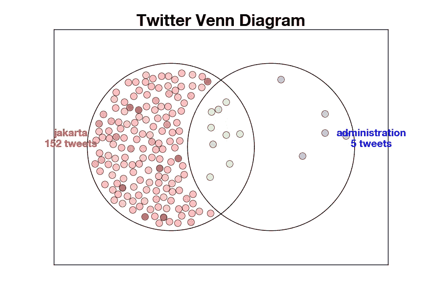
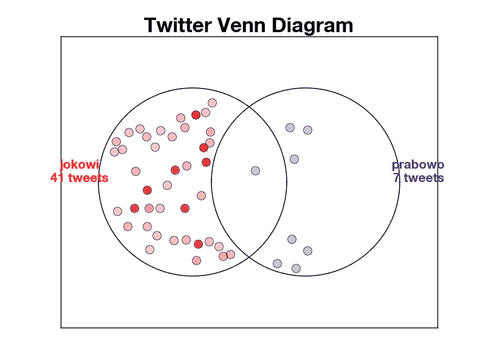

# 使用 Matplotlib 开发良好的 Twitter 数据可视化

> 原文：<https://towardsdatascience.com/developing-good-twitter-data-visualizations-using-matplotlib-8e39906b6be6?source=collection_archive---------4----------------------->

在本文中，我们将学习如何收集 Twitter 数据并使用 Python 创建有趣的可视化。我们将简要探讨如何使用 [Tweepy](http://www.tweepy.org/) 收集 tweets，并且我们将主要探讨使用 Matplotlib 的 Twitter 数据的各种数据可视化技术。在此之前，将解释数据可视化和实现它的总体统计过程。

**首先，什么是数据可视化？**
它是数据的图示或视觉表示。我们在报纸、新闻媒体、体育分析、研究论文中看到过，有时也在广告中看到过。数据可视化模型常见的例子有:[折线图](https://datavizproject.com/data-type/line-chart/)，散点图，饼图，条形图(使用这些模型很容易做可视化)。

**创建数据可视化模型很重要，为什么？**
——一张图能说千言万语。表示多行数据的图形可以提供数据的全貌，并可以揭示数据中包含的模式。
-数据可视化是统计分析的一部分。统计学在各个领域都有很多应用。
-开发新算法可以训练你的创造力和解决问题的能力。Matplotlib 有自己的绘制数据的工具，但是我们可能不局限于它，以便有更多的模型和更多种类的可视化。
-不同的模型可以给出关于数据的不同观点。

**统计过程(P-C-A-I)**
该过程遵循一个简单的流程。流程从提出问题开始，例如:“NatGeo 帐户倾向于发布什么？”。有了问题之后，我们进行适当的数据收集。在收集阶段，也许有许多方法可以获得 Twitter 数据，但这里选择使用 Tweepy。收集完毕后我们将进入**一**分析部分。这就是我们应该选择适当的数学或统计方法来分析数据的地方。分析数据的一种方式是通过*数据可视化*。最后，最后一个阶段是解释结果。请注意，我们最终可能会得到另一个问题的答案，这意味着流动可能是循环的。


PCAI flow ([source](https://place.fi.ncsu.edu/local/catalog/course.php?id=4&ref=1))

我们已经简要讨论了数据可视化和支持它的统计过程。对于我们的调查，我们已经知道要回答的问题将与 Twitter 数据相关，因此在具体定义问题之前，我们将首先查看数据收集。

**收集 Twitter 数据**
我们可以使用 Python 中的 Tweepy 库自动收集一个比较大的 Twitter 数据。这是一个用于访问 Twitter API 的外部 Python 库。为了使这个库有用，我们必须首先为我们的 Twitter 帐户创建一个 [Twitter 应用程序](https://apps.twitter.com/)。注册后，我们将获得私有信息:*消费者密钥、消费者秘密、访问秘密*和*访问令牌*。使用 Tweepy 访问我们的 Twitter API 需要这些信息。

用 Python 创建 Twitter API 对象的一个例子:

```
import tweepy
consumer_key = 'ecGxfboL66oO2ZwxfKkg7q3QK'
consumer_secret = 'exVRiv517gdwkPLP19PtlQMEIRjxgJr21JZCAAQYIqJCUW5vmh'
access_token = '3151279508−Ywd662Zv97Ie7E7I97dUm0e3s2X8yYBloJQd6Gr'
access_secret = 'BH5REW4V7RdGadMr31NLY9ksFypG12m8BR04S32ZF7jO3'auth = tweepy.OAuthHandler(consumer_key, consumer_secret)
auth.set_access_token(access_token, access_secret)
our_api = tweepy.API(auth)
```

现在我们可以通过`**our_api**` 开始使用 Twitter API 了。

我们可以通过应用方法`**our_api.home_timeline()**` 直接从我们的 home timeline 中收集推文，该方法默认收集 20 条最近的推文(包括转发的推文)。要调整所需的推文数量(以 100 条推文为例)，请使用`**our_api.home_timeline(count = 100)**`。要收集特定账户的推文(以@NatGeo 为例)，使用方法`**our_api.user_timeline(screen_name = 'NatGeo', count = 100)**`。

上述方法的一个缺点是，它最多只能收集 200 条推文。为了克服这一点，我们可以使用`**tweepy.Cursor**` 类。要收集 2000 条@NatGeo tweets，然后将文本、转发数和赞数保存在一个列表中，我们可以执行如下操作。

```
natgeo_cursor = tweepy.Cursor(our_api.user_timeline, screen_name = 'NatGeo')
natgeo_tweets = [(tweet.text, tweet.retweet_count, tweet.favorite_count) \
                 for tweet in natgeo_cursor.items(2000)]
```

`**natgeo_cursor.items(n)**`中的每一项都是一个`**tweepy.models.Status**`对象，从中我们可以获得 tweet 数据，比如文本、作者信息(以`**tweepy.models.User**` 对象的形式)、创建时间、转发次数、赞数和媒体。

结果:

```
>>> natgeo_tweets[0]
("As Chernobyl's gray wolf population increases, their influence 
on the surrounding environment is called into questi… https://t.co/elsb4FJQGZ", 428, 1504)
>>> natgeo_tweets[1]
('1,058 temples in the south Indian state of Kerala that have 
pledged to eliminate plastic this year [https://t.co/ltJ6mFIWpV',](https://t.co/ltJ6mFIWpV',) 268, 985)
```

到目前为止，我们已经看到了如何使用 Tweepy 来收集实际的 Twitter 数据。现在让我们好奇，用 Matplotlib 把它们可视化。

*代替上述结果，我们将使用各种 Twitter 数据集进行可视化。

**最小数据可视化**
首先，让我们看一个在我们的家庭时间轴中绘制推文的*用户名频率*的例子。*用户名频率*是在我们的数据中出现的来自特定用户名的推文数量。推文数据将是来自家庭时间轴的 200 条推文。下面是条形图结果后面的代码示例。

```
import matplotlib.pyplot as plthome_cursor = tweepy.Cursor(api.home_timeline)
tweets = [i.author.screen_name for i in home_cursor.items(200)]
unq = set(tweets)
freq = {uname: tweets.count(uname) for uname in unq}
plt.bar(range(len(unq)), freq.values())
plt.show()
```



正如你所看到的，该图显示在时间轴中有 42 个不同的 Twitter 帐户发推文，只有一个帐户发推文最多(41 条推文)。万一你想知道，最常去的账号是@CNNIndonesia。但我们必须承认，我们无法看到数据中出现的用户名，从条形图中无法收集到太多信息(尽管这仍然比完全没有可视化要好)。这就是为什么我们应该学习在 Matplotlib 之上开发自己的算法来修改数据可视化(这可以导致各种模型)。

从上面的尝试中我们能学到什么？
根据[www.informationisbeautiful.net 的作者 David McCandless 的观点，](http://www.informationisbeautiful.net,)一个好的数据可视化有 4 个关键要素:**信息**、**故事(概念)**、**目标**、**视觉形式(隐喻)**。信息是数据，这个元素的关键词是准确性、一致性和诚实。*故事(概念)*就是让数据 vis 变得有趣。*目标*是数据的有用性和效率。*视觉形式(比喻)*就是美和外观。



by David McCandless

上面的第一个条形图肯定有*信息*元素，数据是准确的。它还有一点*目标*和最小*视觉形式*(横条)。但它根本没有*故事(概念)*(只有数据的创造者 vis 才知道剧情背后的故事)，它至少应该告知观者它是关于 Twitter 数据的。

为了提高我们的视觉效果，我们将应用 4 个关键要素。但是为了有趣，我们将只在 Python 中使用 Matplotlib。

在接下来的部分中，我们将会看到一些与各种 Twitter 数据相关的问题或目标，并执行数据可视化。

**案例一。目标:账户对比，模型:修改后的横条图**
在这种情况下，我们将使用我几个月前从我的家庭时间轴中收集的 192 条推文的数据。数据将被转换，这样我们可以按账户对推文进行分组，然后我们将通过数据可视化来比较这些数字。值得注意的是，我们将开发一个良好的数据可视化，它结合了各种 Matplotlib 特性，而不局限于它所拥有的绘图模型。

我们将在 Python 中使用的模块有:

```
import numpy
import matplotlib.pyplot as plt
import matplotlib.font_manager as fm
import operator
import itertools
```

数据表示的代码如下所示。它将按用户名对推文进行分组，然后统计推文数量(也可以被视为用户名频率)和每个用户名的关注者数量。它还将按用户名频率对数据进行排序。

```
home_tweets = list(numpy.load('testfile.npy'))unicity_key = operator.attrgetter('author.screen_name')
tweets = sorted(home_tweets, key=unicity_key)authors_tweets = {}
followers_count = {}
sample_count = {}

for screen_name, author_tweets in itertools.groupby(tweets, key=unicity_key):
    author_tweets = list(author_tweets)
    author = author_tweets[0].author authors_tweets[screen_name] = author
    followers_count[screen_name] = author.followers_count
    sample_count[screen_name] = len(author_tweets)maxfolls = max(followers_count.values())sorted_screen_name = sorted(sample_count.keys(), key = lambda x: sample_count[x])
sorted_folls = [followers_count[i] for i in sorted_screen_name]
sorted_count = [sample_count[i] for i in sorted_screen_name]
```

接下来，我们可以通过`**plt.hbar(range(len(sorted_count)),sorted_count)**`轻松地执行水平条形图，然后设置图形和 x-y 轴的标题，但是让我们随机应变。我们将通过添加颜色透明度差异来添加额外的*视觉形式*，例如:条形的透明度可能代表账户的关注者数量。我们还将把 y 轴上的刻度标签从数字改为用户名字符串。代码如下:

```
colors = [(0.1, 0.1, 1, i/maxfolls) for i in sorted_folls]fig, ax = plt.subplots(1,1)y_pos = range(len(colors))
ax.set_yticks(y_pos)
ax.set_yticklabels(sorted_screen_name, font_properties = helv_8)ax.barh(y_pos, sorted_count, \
        height = 0.7, left = 0.5, \
        color = colors)for i in y_pos:
    ax.text(sorted_count[i]+1, i, style_the_num(str(sorted_folls[i])), \
            font_properties = helv_10, color = colors[i])ax.set_ylim(-1, y_pos[-1]+1+0.7)
ax.set_xlim(0, max(sorted_count) + 8)ax.set_xlabel('Tweets count', font_properties = helv_14)plt.tight_layout(pad=3)
fig.show()
```

请注意，我们还更改了字体样式，并使用`**style_the_num**`函数为关注者计数的字符串即兴创作(将`**22441917**`映射到`**22,441,917**`)。以下是绘图结果:



很明显，上面的图显示了更多的信息，看起来比第一个图更好。视觉效果也有助于解释数据。剧情在*故事(概念)*元素上也更有价值，看起来相当活灵活现(我们不需要投入太多精力去理解可视化)。

*对不起，但也许情节应该有一个文本解释蓝色透明度的含义(这是帐户的追随者数量)。

**案例二。目标:一个账号发布的图片的种类和受众的喜好，模型:图片情节**
在这种情况下，我们将 1000 条@NatGeo 推文的数据集(收集于 2018 年 9 月 19 日)。1000 条推文中的每一条都可以有图片，也可以没有。因此，为了实现本案例的目标，我们必须首先收集数据中存在的所有图像。之后会介绍一个形象剧情。Python 的实现是通过创建`**PlotDecorator**`类来完成的，然后使用实例来生成图像 plot。`**PlotDecorator**`类有方法`**gen_img(prev_img, next_img)**`、`**put_below(left_img, next_img)**`和`**generate(imgs, ncol)**`。对算法的解释:

- `**gen_img(prev_img, next_img)**` :
紧紧在前一幅图像的右侧绘制下一幅图像。`**next_img**`参数是一个`**matplotlib.image.AxesImage**`对象，而`**prev_img**` 是一个包含左侧图像的`**AxesImage**`对象的字典。该函数使用`**next_img.get_extent(...)**`和`**next_img.set_extent(...)**`方法设置下一幅图像的属性，使其位于前一幅图像(左侧图像)的旁边。

- `**put_below(left_img, next_img)**` :
与上述第一种方法相似，但下一幅图像位于该行最左侧图像下方的*。这是因为每行只能有`**ncol**`个图像。*

- `**generate(imgs, ncol)**` :
这是我们生成图像新位置的地方。`**imgs**`是我们想要绘制的`**AxesImage**`对象的列表。例如，如果`**ncol=10**`，该功能将应用`**gen_img(prev_img, next_img)**` 10 次，然后应用`**put_below(left_img, next_img)**`并重新开始新一行图像。

在收集和放置好图片后，我们计算每张图片的转发次数，然后只显示转发次数最多的前 3 张图片的辅助装饰。装饰只是一个紫色的圆圈，图像周围没有填充(透明度给出了等级的线索)。这是结果，它从完整的图像开始，然后放大，然后再次放大转发最多的图像:



让我们评价一下上面的数据可视化。很明显它有着*视觉形式(隐喻)*的体面价值(还不错)*概念*相当好听(很有意思)。我们得到的信息是转发数最高的前 3 张图片和图片的模式(所有图片都是很棒的照片，没有海报、引用等图片)。

*还是那句话，也许剧情应该有一小段说明剧情的意义。

**案例三。目的:两个词之间的关系，模型:Twitter 维恩图**
在这种情况下，我们将使用@jakpost(雅加达邮报)3214 条推文的数据集。最早的推文创建于 2018 年 5 月 8 日，最新的创建于 2018 年 6 月 22 日。我们的目标是想知道一组推文中的两个词之间是否有联系。找出答案的一个方法是检查所选的单词是否在一条推文中使用。

有一种叫做 [Twitter 维恩图](http://www.neoformix.com/2008/TwitterVenn.html)的方法可以用来可视化两个词在一组推文中是如何连接的。我们将采用 Twitter 维恩图，并使用 Matplotlib 进行一点即兴创作(代码示例可在此 [repo](https://github.com/anbarief/Blog/tree/master/Twitter%20Venn%20diagram) 中获得)。我使用 TextBlob 从推文中收集单词。
*算法以最明显的方式编写，没有任何优化尝试。

即兴创作:代表每条推文的每个标记都有可见性值，该值代表转发计数比率(在圆圈中的推文中，转发计数最多的推文将具有最高的可见性值，即 1)。

现在让我们挑选两个有趣的词，例如，“雅加达”和“行政”。包含“雅加达”但不包含“行政”的推文将有红色标记，包含“行政”但不包含“雅加达”的推文将有蓝色标记。包含这两个词的推文将有绿色标记。下面是剧情。



上面的情节应该已经讲了意义本身。在 3214 条推文中，有 161 条推文包含“雅加达”，只有 14 条推文包含“行政”，9 条推文包含两者。转发聚集在“雅加达”圈，请注意有 3 条转发量非常高的推文。

现在让我们再举一个例子，用单词‘jokowi’和‘prabowo’。佐科维是红色的，普拉博沃是蓝色的。下面是剧情。



如果你对十字路口的一条推文感到好奇，下面是它的内容:
“普拉博沃指责佐科威政府削弱了 https://t.co/BxJ7hum7Um 的 TNI #杰克波斯特

总的来说，上面的 Twitter 数据可视化示例并不是可视化的最佳示例。但是我们已经看到了如何利用 Tweepy 和 Matplotlib，同时将良好的数据可视化的 4 个元素牢记在心。我们已经看到了如何组合不同的颜色和形状来为*视觉形式(隐喻)*和*故事(概念)*增加更多的价值。

在下面的链接中可以看到一些很棒的数据可视化示例(一般来说，不限于 Python 或 Matplotlib)。
-[https://informationisbeautiful.net/](https://informationisbeautiful.net/)
-[https://datavizproject.com/](https://datavizproject.com/)