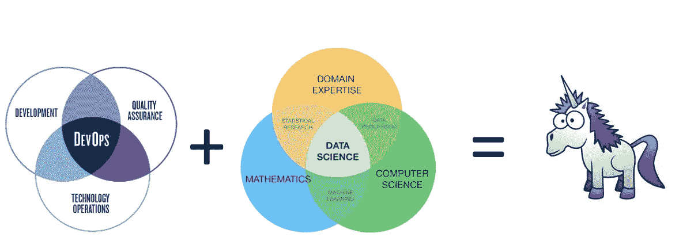
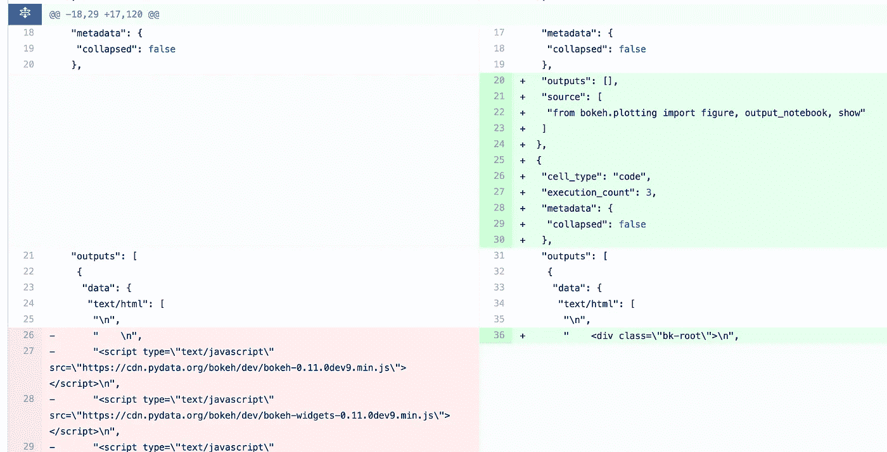
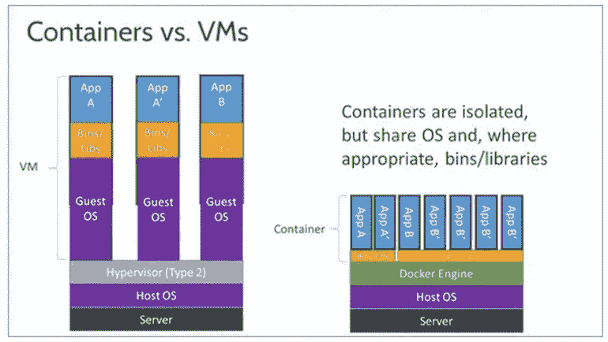
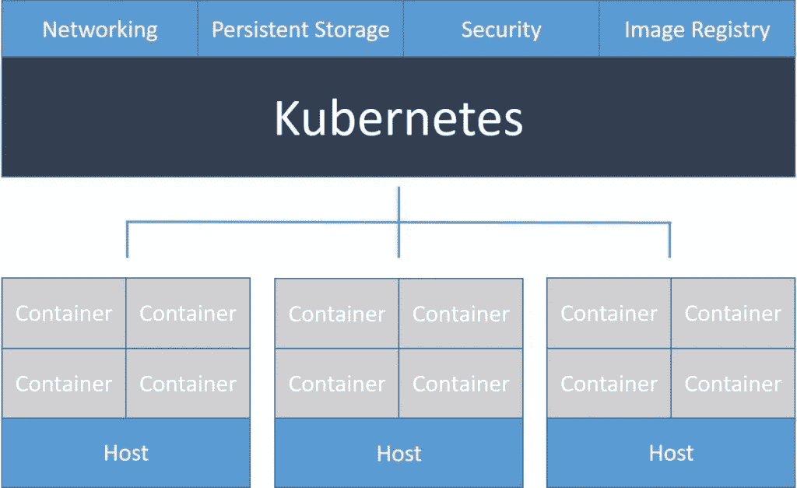

# 数据科学家 DevOps:驯服独角兽

> 原文：<https://towardsdatascience.com/devops-for-data-scientists-taming-the-unicorn-6410843990de?source=collection_archive---------0----------------------->

当大多数数据科学家开始工作时，他们配备了从学校教科书中学到的所有简洁的数学概念。然而，很快，他们意识到数据科学的大部分工作涉及将数据转换成模型使用所需的格式。除此之外，正在开发的模型是最终用户应用程序的一部分。现在，数据科学家应该做的一件正确的事情是在 Git 上控制他们的模型代码版本。然后 VSTS 会从 Git 下载代码。然后，VSTS 将被包装在 Docker 映像中，该映像将被放在 Docker 容器注册表中。一旦注册，它将使用 Kubernetes 进行编排。现在，对普通的数据科学家说这些，他的大脑会完全关闭。大多数数据科学家知道如何提供带有预测的静态报告或 CSV 文件。然而，我们如何对模型进行版本控制并将其添加到应用程序中？根据结果，人们将如何与我们的网站互动？它将如何扩展！？所有这些都将涉及到信心测试、检查是否有任何东西低于设定的阈值、不同方的签署以及不同云服务器之间的协调(以及所有丑陋的防火墙规则)。这就是一些基本的 DevOps 知识派上用场的地方。

# DevOps 是什么？

长话短说，开发人员是帮助开发人员(例如数据科学家)和 IT 人员一起工作的人。

Usual battle between Developers and IT

开发人员有他们自己的指挥链(即项目经理),他们希望尽快为他们的产品获得特性。对于数据科学家来说，这意味着改变模型结构和变量。他们根本不关心机器会发生什么。数据中心冒烟？只要他们得到数据来完成最终产品，他们就不会在乎。在光谱的另一端是它。他们的工作是确保所有的服务器，网络和漂亮的防火墙规则得到维护。网络安全也是他们非常关心的问题。只要机器运转良好，他们就不会对公司的客户不感兴趣。DevOps 是开发者和 IT 之间的中间人。一些常见的 DevOps 功能包括:
-集成
-测试
-打包
-部署

博客的其余部分将详细解释整个持续集成和部署过程(或者至少是与数据科学家相关的内容)。在阅读博客的其余部分之前，有一点很重要。理解业务问题，不要和工具结婚。博客中提到的工具将会改变，但是潜在的问题将会大致保持不变(至少在可预见的将来)。

# 源代码控制

想象一下将您的代码推向生产。而且很管用！完美。没有抱怨。随着时间的推移，您会不断添加新功能并不断开发它。然而，这些特性中的一个给你的代码引入了一个错误，严重扰乱了你的生产应用程序。您希望您的许多单元测试中的一个能够发现它。然而，仅仅因为一些东西通过了你所有的测试并不意味着它没有错误。这只是意味着它通过了当前编写的所有测试。因为这是生产级代码，所以你没有时间去调试。时间就是金钱，你有愤怒的客户。回到代码工作的时候不是很简单吗？？？这就是版本控制的用武之地。在[敏捷](https://www.agilealliance.org/agile101/)风格的代码开发中，产品在一个不确定的时间周期内保持零碎的开发。对于这样的应用程序，某种形式的版本控制将非常有用。

Bitbucket Repository

我个人喜欢 [Git](https://git-scm.com/) ，但是 [SVN](https://subversion.apache.org/) 用户依然存在。Git 可以在所有形式的平台上工作，如 [GitHub](https://github.com/) 、 [GitLab](https://gitlab.com/) 和 [BitBucket](https://bitbucket.org/) (每种平台都有自己独特的优缺点)。如果你已经熟悉了 Git，可以考虑在 Atlassian 上学习更高级的 Git 教程。我推荐查找的一个高级特性是 [Git 子模块](https://git-scm.com/book/en/v2/Git-Tools-Submodules)，在这里您可以存储多个独立 Git 存储库的特定提交散列，以确保您可以访问一组稳定的依赖项。有一个 README.md 也很重要，它概述了存储库的细节以及必要时的打包(例如使用 Python 的 setup.py)。如果你存储的是二进制文件，可以考虑使用 [Git LFS](https://git-lfs.github.com/) (尽管我建议尽可能避免这种情况)。

Merging Jupyter Notebooks on Git

版本控制的一个数据科学特有的问题是 Jupiter/Zeppelin 笔记本的使用。数据科学家绝对喜欢笔记本。然而，如果你把你的代码存储在一个笔记本模板上，并试图在版本控制中改变代码，当执行 diff 和 merge 时，你将会留下疯狂的 HTML 垃圾。您可以完全放弃在版本控制中使用笔记本(并简单地从版本控制库中导入数学函数)，或者您可以使用现有的工具，如 [nbdime](https://nbdime.readthedocs.io/en/stable/) 。

# 自动测试

从数据科学家的角度来看，测试通常分为两个阵营。你有通常的单元测试，它检查代码是否正常工作，或者代码是否做了你想要它做的事情。另一个更具体的领域是数据科学，即数据质量检查和模型性能。你的模型能给你一个准确的分数吗？现在，我确信你们中的许多人想知道为什么这是一个问题。您已经完成了分类评分和 ROC 曲线，并且该模型对于部署来说足够令人满意。嗯，有很多问题。主要问题是，开发环境中的库版本可能与生产环境中的完全不同。这将意味着不同实现、近似以及不同的模型输出。

Model output should be the same on dev and prod if integration and deployment are done right

另一个经典的例子是使用不同的语言进行开发和生产。让我们想象一下这个场景。您，这位高贵的数据科学家，希望用 R、Python、Matlab 或上周刚刚发布白皮书的许多新语言中的一种来编写一个模型(可能没有经过很好的测试)。你带着你的模型去生产团队。制作组怀疑的看着你，笑了 5 秒，才意识到你是认真的。他们会嘲笑。生产代码是用 Java 写的。这意味着将整个模型代码重新编写成 Java 用于生产。这又意味着完全不同的输入格式和模型输出。因此，自动化测试是必需的。

Jenkins Home Page

单元测试非常普遍。JUnit 面向 Java 用户，而[非 ittest](https://docs.python.org/3/library/unittest.html) 库面向 Python 开发者。然而，在将代码投入生产之前，有些人可能会忘记在团队中正确运行单元测试。虽然你可以使用 [crontab](http://www.adminschoice.com/crontab-quick-reference) 来运行自动化测试，但我建议使用更专业的工具，比如 [Travis CI](https://travis-ci.org/) 、 [CircleCI](https://circleci.com/) 或 [Jenkins](https://jenkins.io/) 。Jenkins 允许你安排测试，从版本控制库中挑选特定的分支，如果有问题可以发送电子邮件，如果你想保护你的测试，甚至可以旋转 Docker 容器映像。基于集装箱化的沙箱将在下一节详细解释。

# 集装箱化

Containers vs VMs

沙盒是编码的重要组成部分。这可能涉及到为各种应用程序提供不同的环境。它可以简单地将生产环境复制到开发中。这甚至意味着拥有多个不同软件版本的生产环境，以迎合更大的客户群。如果您想到的最佳方法是使用带有[虚拟盒](https://www.virtualbox.org/)的虚拟机，我相信您已经注意到，要么需要使用完全相同的虚拟机进行多轮测试(糟糕的 DevOps 卫生状况)，要么为每次测试重新创建一个干净的虚拟机(根据您的需要，这可能需要近一个小时)。一种更简单的替代方法是在虚拟机上使用容器而不是完整容器。容器只是一个 unix 进程或线程，看起来、闻起来和感觉起来都像 VM。它的优势在于低功耗和低内存消耗(这意味着你可以在几分钟内随意启动或关闭它)。流行的容器化技术包括 [Docker](https://www.docker.com/) (如果您希望只使用一个容器)或 [Kubernetes](https://kubernetes.io/) (如果您喜欢为多服务器工作流编排多个容器)。

Kubernetes Workflow

容器化技术不仅有助于测试，还有助于可伸缩性。当您需要考虑多个用户使用基于模型的应用程序时，尤其如此。就训练或预测而言，这可能是真的。

# 安全性

在数据科学领域，安全性很重要，但往往被低估。用于模型训练和预测的一些数据涉及敏感数据，如信用卡信息或医疗保健数据。在处理此类数据时，需要遵循一些法规遵从性政策，如 GDPR 和 HIPAA。不仅仅是客户需要安全。当在客户端服务器上部署商业秘密模型结构和变量时，它们需要一定级别的加密。这通常通过在加密的可执行文件(例如 JAR 文件)中部署模型，或者在将模型变量存储到客户端数据库之前对其进行加密来解决(但是，除非您完全知道自己在做什么，否则请不要编写自己的加密程序……)。

Encrypted JAR file

此外，明智的做法是在逐个租户的基础上建立模型，以避免可能导致信息从一家公司泄露到另一家公司的意外转移学习。在企业搜索的情况下，数据科学家可以使用所有可用的数据建立模型，并根据权限设置，过滤掉特定用户无权查看的结果。虽然这种方法看起来很合理，但用于训练模型的数据中的部分可用信息实际上是由算法学习并转移到模型中的。所以，无论哪种方式，用户都有可能推断出被禁页面的内容。没有完美的安全保障。但是，它需要足够好(其定义取决于产品本身)。

# 合作

作为一名数据科学家，在与 DevOps 或 IT 合作时，坦率地说出需求和期望非常重要。这可能包括编程语言、包版本或框架。最后但同样重要的是，互相尊重也很重要。毕竟，DevOps 和数据科学家都有难以置信的困难挑战要解决。开发人员不太了解数据科学，数据科学家也不是开发人员和 IT 方面的专家。因此，沟通是取得成功的关键。

# 附加说明

 [## 软件开发设计原则

### 当人们开始成为自学的程序员时，很多时候我们想的是创建一个应用程序，简单地…

medium.com](https://medium.com/@sadatnazrul/software-development-design-principles-79d15ef765f3)  [## 如何让你的软件开发体验…没有痛苦…

### 工作在各种形式的组织(从大型软件开发为导向的利基启动到学术实验室)，我…

towardsdatascience.com](/how-to-make-your-software-development-experience-painless-2591ebcc69b6)  [## 数据科学面试指南

### 数据科学是一个相当大且多样化的领域。因此，做一个万事通真的很难…

towardsdatascience.com](/data-science-interview-guide-4ee9f5dc778)