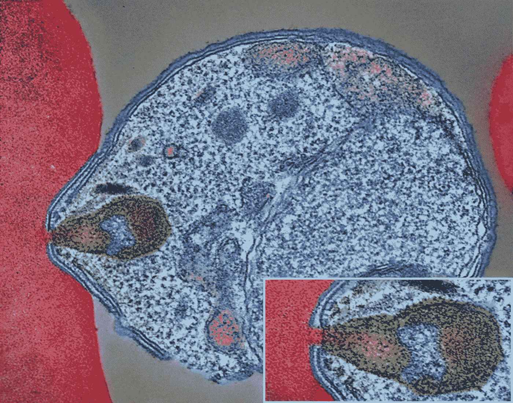
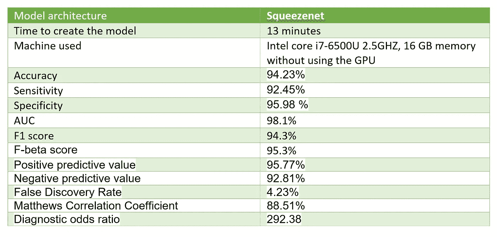
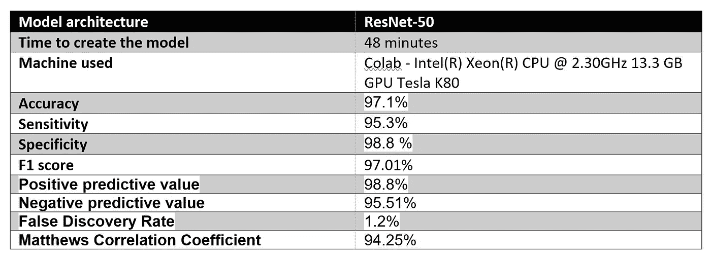
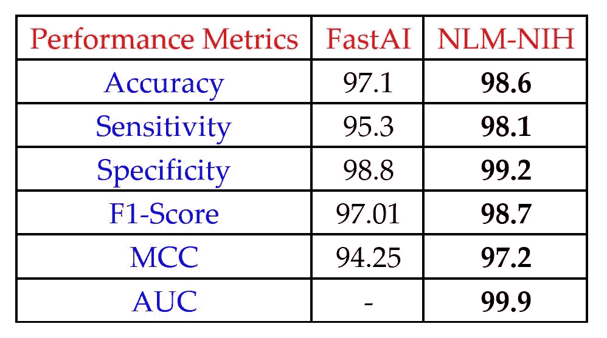

# 使用 Fastai 库和 Turicreate 从手机捕获的显微图像中诊断疟疾

> 原文：<https://towardsdatascience.com/diagnose-malaria-from-cellphone-captured-microscopic-images-using-fastai-library-and-turicreate-ae0e27d579e6?source=collection_archive---------7----------------------->

灵感:在读了卡洛斯·阿蒂科·阿里扎的一篇文章后，我偶然发现了疟疾数据库。

Colorized electron micrograph showing malaria parasite (right, blue) attaching to a human red blood cell. The inset shows a detail of the attachment point at higher magnification. Credit: NIAID

## 为什么要创建深度学习模型来预测疟疾？

疟疾是一种由蚊子传播的疾病，由不同种类的疟原虫引起。它不成比例地影响世界上资源贫乏的地区，导致生命损失和巨大的经济负担。根据 CDC 网站的数据，2016 年发生了 2.16 亿例疟疾，其中 44.5 万例是致命的。其中大多数是儿童。最初，感染疟疾的患者会出现类似流感的症状。在严重的情况下，患者可能会出现呼吸困难和昏迷。尽早诊断疟疾以防止疾病在社区传播是非常重要的。诊断疟疾的金标准是在显微镜下检查血涂片。将患者的一滴血涂在载玻片上，用姬姆萨染色剂染色。当在显微镜下观察时，这种染色会使寄生虫突出。诊断取决于染色的质量和读片人的专业知识。根据世卫组织协议，受过训练的医生/技术人员必须在 100 倍的放大倍数下观察 20 个微观区域。他们必须计算 5000 个细胞中寄生虫的数量。可以想象，这是一个非常费力的过程，而且容易出错。用于检测具有高阴性预测值的疟疾寄生虫的深度学习算法将使这一过程变得不那么繁琐，并节省医疗保健人员的宝贵时间。

## 数据库背后的故事

国立卫生研究院意识到了上述问题，并着手创建一个图像数据库。李斯特希尔国家生物医学通信中心(LHNCBC)的研究人员开发了一种移动应用程序，可以在标准的 Android 智能手机上运行，可以连接到显微镜上。在孟加拉国，这个应用程序被用来拍摄感染和未感染疟疾患者的血液涂片图像。后来，泰国的研究人员对这些图像进行了注释。从这些照片中分割出红细胞，并创建了最终的数据库。您可以了解更多相关信息，并在 https://ceb.nlm.nih.gov/repositories/malaria-datasets/[下载数据集](https://ceb.nlm.nih.gov/repositories/malaria-datasets/)

## NIH 集团提出的当前解决方案

NIH 的研究人员使用上述数据库，使用 AlexNet、VGG-16、Resnet-50、Xception、DenseNet -121 和定制的 CCN 创建了深度学习模型。他们使用“具有英特尔至强 CPU E5–2640 v3 2.60 GHz 处理器、16 GB RAM、支持 CUDA 的英伟达 GTX 1080 Ti 11GB 图形处理单元(GPU)、MATLAB R2017b、Python 3.6.3、Keras 2.1.1(具有 Tensorflow 1.4.0 后端)和 CUDA 8.0/cuDNN 5.1 依赖项的 Windows 系统来训练该模型。”获得的最佳性能指标大多来自 ResNet-50 模型。以下是统计数据

在 15k 迭代后，他们停止运行定制模型，验证准确性停止提高，大约需要 24 小时。国家卫生研究院的文章全文可在[https://lhncbc.nlm.nih.gov/system/files/pub9752.pdf](https://lhncbc.nlm.nih.gov/system/files/pub9752.pdf)获得

## 为什么要创建另一个模型？

最初，我想修补数据，看看我是否能赶上他们的表现，并在这个过程中提高我的深度学习技能。

**项目目标**

1.创建一个深度学习模型，可以在不使用 GPU 的情况下匹配 NIH 解决方案的性能。

2.创建一个小得多的模型，这样它就可以部署在手机上。

3.创建一个比 NIH 团队发表的论文中提到的性能指标更好的模型。

4.使用 Fastai ad Turicreate 减少迭代次数和训练时间，但保持性能。

5.开放源代码，这样其他人可以复制我的实验。

## 为什么[图瑞创造](https://github.com/apple/turicreate)？

[turcreate](https://github.com/apple/turicreate)是苹果公司的一个机器学习平台。Turicreate 可用于在笔记本电脑上创建深度学习模型，无需使用 GPU。如果 GPU 可用，也可以利用它来提高训练时间。即使没有 GPU，Turicreate 也可以在更短的时间内生成模型。您可以使用几行代码创建最先进的模型。创建的模型可以很容易地部署在 iOS 设备上。它也可以作为 web 服务来部署。

创建统计数据

SqueezeNet 型号小于 5mb。ResNet-50 也进行了尝试，没有看到太大的性能差异。[点击此处](https://github.com/johnyquest7/Malaria_detection_TuriCreate/blob/master/Detect%20malaria%20squeezenet.ipynb)访问 Github repo 上的源代码。

## 为什么 [Fastai](https://www.fast.ai/2018/10/02/fastai-ai/) ？

Fastai 是一个深度学习平台，因杰瑞米·霍华德教授的在线课程而走红。新的 [fastai 库](https://docs.fast.ai/)可以用来用几行代码创建最先进的模型。Fastai 可以在谷歌的 Colab 上运行，Colab 提供免费的 Telsla K80 GPU，每次运行 12 小时。通过结合 Fastai 和 Colab，世界各地的任何研究人员都可以利用免费的 GPU 在更短的时间内创建模型，而不会产生任何成本。

Fastai 模型的完整代码可在[这里](https://github.com/johnyquest7/Malaria_Fastai/blob/master/Malaria_detection2_Fastai_Resnet50.ipynb)获得。

Fastai 模型可以作为 web 服务部署。[点击此处](https://course-v3.fast.ai/deployment_zeit.html#upload-your-trained-model-file)了解更多信息。

## Turicreate、Fastai 和 NIH 方法的比较。

最佳统计数据以粗体显示。(请参见下面的附录)

*NIH 统计数据来自不同的模型。总的来说，NIH 研究中表现最好的模型是 ResNet-50 和 VGG-16 模型。

基于此，Fastai 模型赢得比赛！Mathews 相关系数被认为是具有二元结果的医学测试的最佳度量，Fastai 模型具有最佳 MCC。Turicreate 仅用了 13 分钟就创建了模型，而且性能不相上下。NIH 做了 5 倍交叉验证，我没有对我的模型做这个。如果有兴趣，可以看 NIH 的文章，做 5 折交叉验证。如果你有，请在下面张贴你的回复。

2018 年 11 月 13 日增编

今天，我给 NIH 研究的通讯作者 Sivaramakrishnan Rajaraman 发了电子邮件。他向我指出了细胞水平的指标以及与 Fastai 的精确比较。Rajaraman 博士制作的表格附后。

