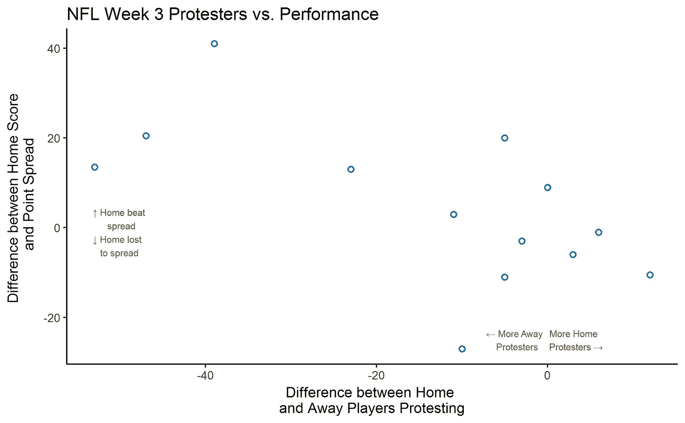
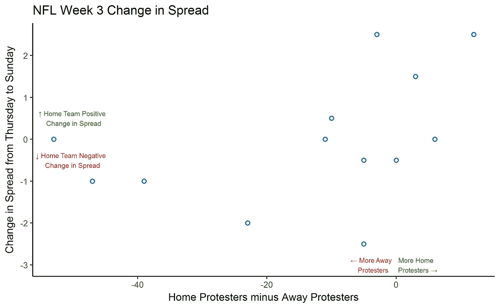
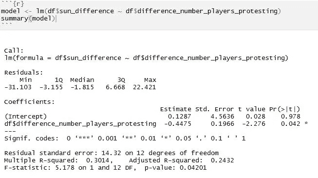
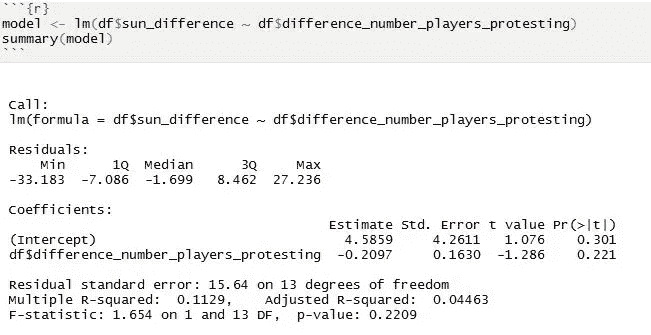

# 国歌抗议导致你的地区运动队输了吗？:统计分析

> 原文：<https://towardsdatascience.com/did-national-anthem-protests-cause-your-area-sports-team-to-lose-a-statistical-analysis-1f3dbf0245ae?source=collection_archive---------8----------------------->

上周，特朗普总统在阿拉巴马州的一次集会上发表了明确的讲话，他建议 NFL 球员应该被解雇，因为他们在国歌期间跪下抗议。NFL 球员的反应非常热烈——本周末有超过 200 名球员抗议。

昨天，右倾犯罪预防研究中心主席约翰·r·洛特在福克斯新闻频道发表了一篇文章，概述了他对这些抗议活动的统计研究。他得出结论，在 2017 年 NFL 赛季第 3 周，抗议的球员数量和球队的表现之间存在“巨大的、具有统计意义的”关系。洛特先生好心地公布了他使用的数据和他的回归结果。在本文中，我将检验洛特先生的分析，并提供我自己的观点。这将不是一个关于抗议国歌的好处的帖子，而是一个关于统计意义的帖子。

*Tl；dr；这种关系没有统计学意义。洛特先生的分析包含许多统计谬误。所有的 R 代码都可以在* [*这里*](https://medium.com/@NickDoesData/did-national-anthem-protests-cause-your-area-sports-team-to-lose-a-statistical-analysis-1f3dbf0245ae) *找到。*

# 初始回归模型

洛特先生提供的数据包含了 NFL 赛季第三周的比赛。它详细列出了截至周四和周日每支球队的抗议者人数、每场比赛的比分以及每场比赛的投注线。

该分析包含线性回归模型。该模型旨在预测一个比较主队表现与价差的指标。如果一个主队以 7 比 10 获胜，这个标准将会得到 3 分。该模型使用了一个变量来比较客队和主队抗议数量的差异。如果主队有 20 名抗议球员，而客队有 10 名，这个指标将是-10。

我在 R 中复制的模型产生了以下结果:

该模型包含 0.38 的 R 平方值。这个数字应该解释为主队表现 vs 的 38%，价差可以用各队抗议球员数量的差异来解释。该指标的 p 值为 0.02。统计显著性的标准经验法则是 p 值最大为 0.05(p 值越低，统计显著性越大)。出于这个原因，洛特先生说他的结果在统计学上是有意义的。

# 视觉分析

进行简单回归分析(使用单个预测值的分析)时，可视化数据总是很重要的。

查看这些数据时，您可以看到有轻微的下降趋势，但这并不完全是线性关系，回归线不会与数据紧密吻合。

# 统计谬误

这一分析中犯下的第一个统计谬误是目标变量(相对于价差的主队表现)。在这一分析中，洛特先生指出

> “我们利用特朗普发表第一次言论的前一天，即周四的点差，预测了这些球队在周日的比赛中可能会如何发挥。之所以在周五之前这么做，是因为下注者可能已经知道特朗普制造的冲突可能会如何影响球队的表现，因此在周日之前就已经出现了价差的变化。”

从表面上看，这似乎是一个非常合理的选择。

这张图表展示了几个有趣的项目。抗议球员与他们的对手匹兹堡钢人队之间差异最大的球队，在投注线方面没有变化。许多抗议的玩家没有在比赛前宣布他们的抗议意图，所以赔率制定者在设定界限时没有办法将这些抗议考虑在内。

另外两个(在我个人看来，更相关的)原因是受伤和下注。NFL 球队密切关注哪些球员将参加比赛的信息，这些信息通常直到周日才公开。如果一名关键球员被排除在外，周日早上这条线可能会移动一两个点。此外，投注线可能会因投注的数量而变化。如果一个队得到了不成比例的赌注，线将从该队移开。

这一分析中最惊人的统计谬误是样本量。这个模型只适合于*十三*个数据点。这是一个危险的小样本量，并且由于它对每个单独的数据点的极端敏感性而导致不稳定的模型。在洛特先生的分析中，他从未向读者展示过这个缺点，尽管作为一名经济学博士，他肯定意识到了这一点。

# 选择合适的目标变量

读到这里的 NFL 爱好者可能已经意识到事实上在过去的一周里有超过 13 场比赛。这个统计模型已经删除坦帕湾-明尼苏达比赛被删除，由于缺乏周四投注数据。

当对如此小的样本量进行回归分析时，建模者应该不惜一切代价避免删除数据点。出于这个原因，周日博彩线应该是目标变量。上一节中的图表表明，抗议玩家的数量和投注线的变化之间没有关系。

坦帕湾有两名抗议球员，而明尼苏达没有。坦帕湾输了 17 分，尽管他们被看好 3 分。直觉上，人们可能会认为这将支持洛特先生的结论，即更多的抗议玩家会导致更差的表现。当我使用周日博彩线作为目标变量时，模型变得相当弱:

这里的 R 平方下降到 0.30，p 值增加到 0.042，接近被认为具有统计显著性的最大值。这证明了 14 个数据点的回归模型是多么不稳定。

# 美国队呢？

如果没有达拉斯牛仔队，涉及 NFL 国歌的统计分析将是不完整的。达拉斯和亚利桑那的比赛在周一晚上进行，我猜洛特先生在这场比赛结束前已经完成了他的分析。在国歌响起之前，整个达拉斯牛仔队跪在地上，以示团结。虽然从技术上讲，这不是在国歌演奏期间，但这样做的决定会像在真正的国歌演奏期间跪下一样分散团队的注意力。出于这个原因，我把所有 53 名达拉斯牛仔队队员都列为抗议队员。他们的对手，亚利桑那红雀锁定武器，但他们没有跪下抗议。当添加单个数据点时，模型完全崩溃:

R-square 已经下降到 0 . 11，我们的预测变量的 p 值已经增加到 0 . 22，大大高于被认为具有统计显著性的阈值。一个不支持原始结论的单一数据点破坏了洛特先生的“统计显著”关系。

# 结论

当像这样的文章发表时，在考虑结论之前回顾所用的方法总是很重要的。我赞赏洛特先生以透明的名义公布数据和回归结果，我希望这一回应能够引发关于新闻业负责任的统计数据的更大讨论。

洛特先生犯了统计学中一个不幸的普遍做法，p 值钓鱼。他的样本太少，甚至无法考虑一个会减少分析数据量的目标变量。他没有让读者意识到他的模型对于新的数据点是多么的不稳定和敏感。他声称抗议的影响“巨大且具有统计学意义”,意在欺骗。限制样本量的选择没有在专栏文章中披露，只是在统计方法部分披露了。

不幸的是，福克斯新闻频道的编辑完全让公众失望了。他们没有进行任何基本的统计审查或审查，并允许这种统计上无效的分析流传。

*我为本文编写的所有 R 代码都可以在[这里](https://github.com/NickDoesData/nfl_protests)找到