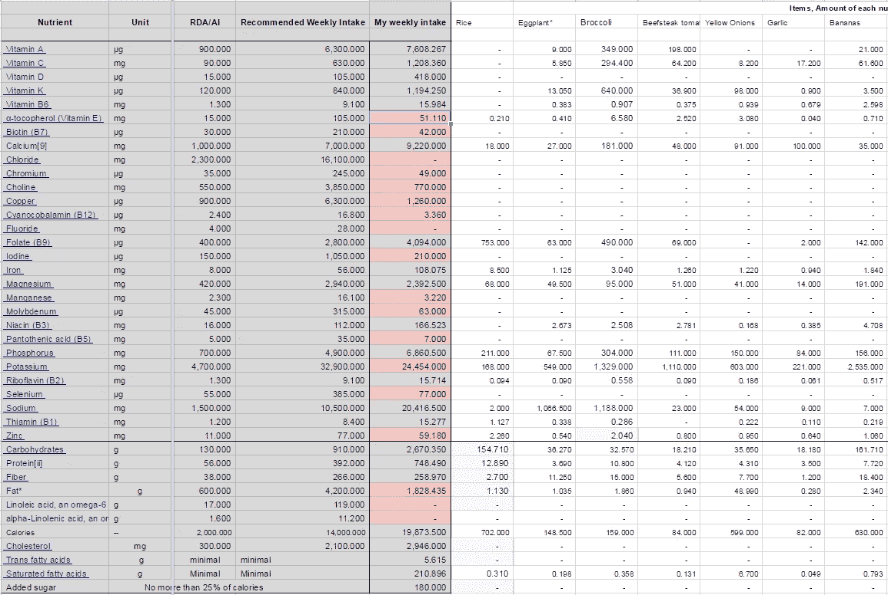

# 饮食经济

> 原文：<https://towardsdatascience.com/diet-economy-8b5728346f1d?source=collection_archive---------9----------------------->

在过去的几年里，我一直对食物消费的问题感兴趣。我们如何吃得健康又便宜？我决定看看我目前的饮食，看看它是如何累积的。幸运的是，我的饮食很简单。我在家坚持做 3 或 4 道菜，使用几乎相同的材料，因为多样化很贵。我的大部分膳食都是素食，以某种谷物为基础，加入蔬菜、豆类、鸡蛋和奶制品。我几乎只在 Trader Joe's 购物，因为价格和选择都很合理，而且我很喜欢好的品牌。所以很容易计算出我的饮食是否合理和/或划算。我的目标是获得我平均每周摄入的所有营养数据，看看它与推荐量相比如何。有什么我还没看够的吗？有什么我可以不要的吗？然后:我的饮食划算吗？有没有我可以吃的东西能以更便宜的价格获得同样的营养？以及其他诸如此类的问题。

我们如何决定一个人需要多少营养？维基百科总结了由美国医学研究所(IOM)发布的推荐每日营养摄入水平的不同指标，称为膳食参考摄入量:

*   预计平均需求量(EAR ),预计可满足 50%人口的需求；
*   国际移民组织食品和营养委员会预计可满足 97.5%的人的需要的推荐膳食供给量(RDA)；
*   充足的摄入量(AI)，这是 RDA 的一个宽松的替代品；

对于这个练习，我使用 RDA(或 AI ),因为它更可能适用于我，并且 IOM 给出了宏量和微量营养素的 RDA/AI。

为了计算我的摄入量，我起草了一份我一周内所吃的典型食物的电子表格，并从标签上的营养成分表或从美国农业部食物成分数据库输入所有的营养信息。其中大部分是原料或产品，如蒸粗麦粉、大米、牛奶、奶酪、茄子、土豆、洋葱、香蕉，还有一些工业加工的东西，如蔬菜酱、泡菜、醋渍甜菜、辣酱，还有我非常喜欢的[茄子酱](http://www.whatsgoodattraderjoes.com/2016/05/trader-joes-eggplant-garlic-spread-with.html)。(最近，当我不能回家做饭时，我也开始每天喝一瓶[Soylent](http://soylent.com)——这有助于简化事情，因为 Soylent 的量正好涵盖了我们日常饮食中所需大多数营养的 20%。Soylent 上的全部营养信息[在这里](http://files.soylent.com/pdf/soylent-drink-nutrition-facts-en.pdf)。)

经过几个小时无聊的数据输入，我得到了这张图表！(预览下面用红色突出显示的我缺乏的营养素。)

有几个地方的数据不是 100%干净的——例如，我不得不做一些谷歌搜索来找到某些蔬菜的几份大小或平均重量——大多数都记录在表格下面。有一些营养素没有确切的每日推荐量，或者在维基百科上列出，但似乎在其他地方没有提到——比如α-亚油酸(事实证明，在很多食物中没有发现它——但你可能知道它是一种[ω-3 脂肪酸](https://www.hsph.harvard.edu/nutritionsource/omega-3-fats/))。

但是它就在那里！我现在有了相对准确的数据，知道我每周的平均摄入量和我应该摄入的每种营养素的量是多少。我没有得到每天的量，而是取了每天的推荐量，乘以 7，得到一个不太精确但更容易与我自己的数据进行比较的每周量。所以这并不十分准确，但它足够接近于给我一个关于我一直处于低或高的事物的概念。我学到的一些东西:

*   我以为我吃得很少，但实际上我摄入的卡路里比我需要的要多 40%。
*   我没有摄入足够的脂肪(推荐量是你热量的 25-35%)，但我所有的其他宏量营养素(如蛋白质、纤维、碳水化合物)都很好！
*   我真正缺少的是维生素，如 B7、B12、B5 和 E，以及其他营养物质，如氯、铜、氟、碘、钼、钾、硒和锌。
*   一些我认为营养丰富的食物，比如我用来做沙拉和蒸粗麦粉的调味汁中的甜菜罐，实际上大部分只是糖！茄子酱也几乎只有钠和卡路里。我真的很喜欢这些东西的味道，但它们可能没有以经济有效的方式给我提供我需要的营养。

那我在这里做什么？如何让我的饮食完整？获取任何特定的营养物质都有很多选择。我的朋友[德瓦尔](https://devuroasts.wordpress.com/author/devuroasts/)建议把这变成一个正式的优化问题，使用美国农业部数据库、预算和营养价值作为约束条件，以及像 [Lindo 这样的线性优化软件。](http://www.lindo.com/)似乎是一个专门为这类问题设计的软件，我可能会在这篇文章的后续文章中介绍一下。目前，一个手动的、全面的方法就可以了:对于我缺乏的营养物质，比如钾，一个简单的谷歌搜索就会找到补充这些营养物质的廉价方法，比如香蕉、鳄梨或土豆。从那里，它只是计算每个选项的“钾的价格”:哪种食物是最便宜的补充钾的方法？其他营养素也是如此。我们还应该挑选与我所寻找的营养成分重叠或含有多种营养成分的食品，因为这意味着它可能更便宜。

所以在数据表的第二页，我列出了我所缺少的每种营养素的良好来源。我很快就做了几样东西，因为它们是肉或者我不喜欢吃。(那些是灰色的。)对于其中的大多数，我只是选择了出于某种原因而引起我注意的项目(我已经知道如何用它们烹饪，它们对一群人来说是常见的，我更喜欢它们)。绿色的项目是我决定添加到我的饮食中的项目(或者用类似的东西替换掉)，以完成我的营养摄入。

我想通过钾的实际计算。所以在那张桌子下面，有另一张桌子，上面只有含钾的物品，它们的钾含量，以及我家附近的乔氏商店的价格。最后两列是价格除以钾含量，显示了每一项中的“钾的价格”。平托豆是最便宜的，每克钾 0.29 美元，尽管小扁豆、香蕉和土豆也不贵多少。所以我可以选择其中任何一种来补充我的钾摄入量。

营养学远不是一门精确的科学，即使在我这么做的时候，我发现我知道的信息使我的结果不一定准确(例如，就在昨天，我的室友告诉我，男性的推荐卡路里摄入量通常是 2500，而不是 2000)。但我要说这仍然是一项有益的锻炼，因为我的发现与常识非常一致:确保你吃得足够多，许多人倾向于节省钾和ω-3 脂肪酸等营养素。跟踪那些！如果你觉得自己没有 100%地工作，你的营养摄入很可能就是原因。

注意事项:

—我使用了国际移民组织提供的典型饮食建议，但任何人都可以做出自己的调整:增加热量摄入，如果你想增肥，就增加蛋白质，其他你可能缺乏的营养物质，等等。尽管做你的研究。

—在对富含氯化物和胆碱的食物进行研究后，我发现我很可能没有摄入足够的氯化物和胆碱，因为它们存在于很多食物中！所以这些被排除在“缺乏”营养素的名单之外。