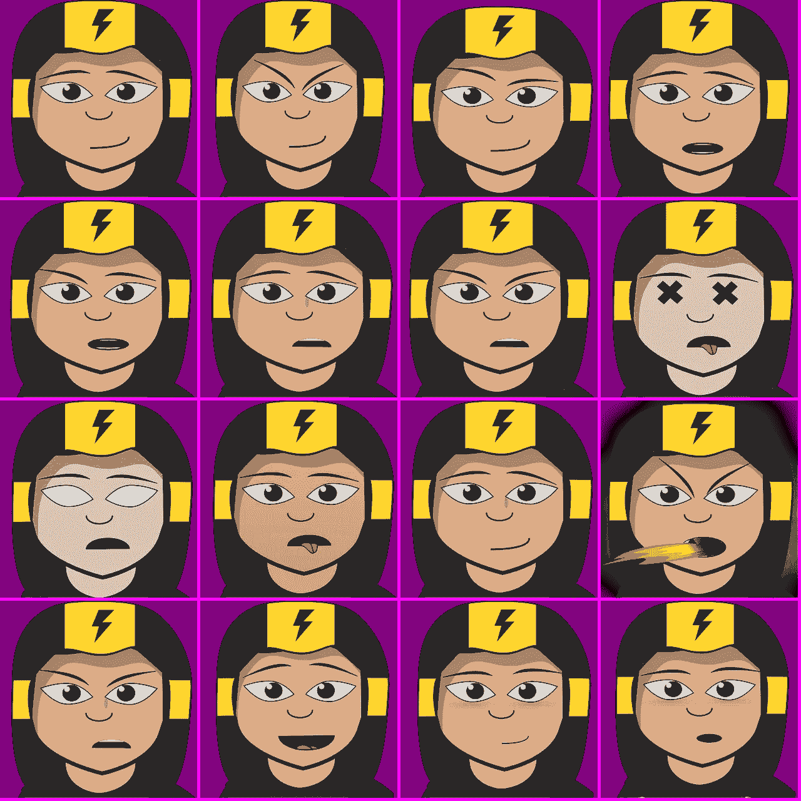

# 提高训练精度的不同方法

> 原文：<https://towardsdatascience.com/different-ways-of-improving-training-accuracy-c526db15a5b2?source=collection_archive---------5----------------------->

Image 1: Emotion recognition // [Source](https://pixabay.com/p-2025953/?no_redirect)

在[摆弄了一个情绪识别模型](/whats-the-difference-between-haar-feature-classifiers-and-convolutional-neural-networks-ce6828343aeb)之后，我决定继续探索这个领域。有什么比训练自己的情感识别网络更好的方法呢？

# 构建正确的模型

使用来自[的 fer2013 数据集，一个旧的 Kaggle 挑战](https://www.kaggle.com/c/challenges-in-representation-learning-facial-expression-recognition-challenge)，我在 Keras 中建立了一个通用的 CNN 模型并训练它，只是为了看看这将有多难。第一个模型有 7 个卷积层和 2 个漏失层:

经过训练，我意识到它无法达到 54%以上的验证准确率。

54%!光是看这个数字就让我对这个模型感到极度失望。

那我们试着把它弄大一点。我扩展了当前的层，并添加了一些卷积层和一些完全连接的层，使网络更深更广:

该模型达到了 58%的验证准确率。一个 4%的成就，当然，但代价是更大的计算能力。事实上，我试图在 MTCNN 人脸识别模型上运行这个模型，我的电脑崩溃了。一定会有更好的模式。

最后，我偶然发现了[这个为科恩-卡纳德和 MMI 面部表情数据库设计的模型](https://arxiv.org/pdf/1509.05371.pdf)，并将其用于 2013 年 fer 数据集。该模型使用两个 FeatEx 块在卷积之间创建单独的连接。

Image 2: FeatEx block // [Source](https://arxiv.org/pdf/1509.05371.pdf)

这款(惊喜惊喜！)能够达到 63%的训练准确率。此外，它将训练参数的数量减少到不到以前模型的一半。

# 确定正确的批量

当我搜索 FeatEx 模型时，我决定测试不同的批量大小，看看它是否对训练准确性有影响。

使用 my_newCNN 模型，我训练了两次:一次批量 32，一次批量 64。

批次大小为 32 的模型产生了 58.7%的验证准确度，而批次大小为 64 的模型产生了 59.7%的验证准确度。这是一个非常显著的差异。

每个数据集都有不同的属性。一些数据集可能需要较小的批量，而另一些数据集可能需要较大的批量。测试不同的批量大小以查看哪一个能为数据集产生最佳结果总是一个好主意。

# 数据扩充

由于 fer2013 数据集相对较小，我不得不进行数据扩充以获得更好的结果。数据扩充是指通过处理每幅图像来创建略有不同的副本，从而使现有的小数据集变大。因为我使用的是 Keras，所以我只是通过图像数据生成器传递我的训练图像。

因为我在训练情绪识别，所以水平翻转我的脸是有意义的，而不是垂直翻转。我设置了 10 度的旋转范围，因为在尝试的时候，总有一些人会稍微倾斜他/她的头。当运行预测时，我们总是会传入大小大致相同的人脸(每张图像首先经过人脸检测器，在将人脸传入情绪识别模型之前，该检测器会剔除人脸)，这让我考虑不使用缩放功能。最后，我选定了 0.1 的缩放范围，决定这样做更安全，以防面部检测器裁剪过大或过小的区域。

# 生成硬数据

最大的改进来自生成硬数据。与其一遍又一遍地训练模型，为什么不选择模型错误标记的图像，并专门在这些图像上训练模型呢？当然，这将导致模型在这些错误标记的图像上过度拟合。所以，在用硬数据训练后，我不得不再次运行正常训练(用所有训练图像)来平衡它。

我让模型预测每个训练图像，并将不正确的图像传递到一个数组中。

然后我像往常一样继续训练:

一次训练后，验证准确率下降到 41%，而训练准确率飙升到 83%。现在，我只需再次平衡模型，以减少验证和训练准确性之间的差异。

再次运行正常训练后，训练准确率下降到 68%，而验证准确率上升到 66%！从 63%到 66%，验证准确率提高了 3%。

只是为了好玩，我想操纵数据集以达到更高的准确性。就像在生成硬数据时一样，我通过 model.predict()遍历了所有图像。然而，这一次，我计算了所有图片的数量和每种情绪的错误标记图片的数量。

这是我得到的(用硬数据训练前的 FeatCNN 模型):

*   愤怒:960/3995
*   厌恶:46/436
*   恐惧:746/4097
*   开心:591/7215
*   悲伤:1388/4830
*   惊喜:484/3171
*   中立:2033/4965

有一点让我印象深刻:与所有其他情绪相比,“厌恶”的图片明显较少。与悲伤或快乐相比，厌恶是一种不太常见的情绪，我们可能会将太多的模型用于识别厌恶。如果我把“厌恶”从数据集中完全去掉，会发生什么？

我也决定发泄愤怒。查看训练图像，愤怒(和恐惧)都与悲伤非常相似，模型可能会错误地将一个标记为另一个。由于我宁愿有一个能够准确检测悲伤而不是愤怒或恐惧的模型，我决定删除其中一种情绪。该模型目前错误地将愤怒比恐惧更多地归类，所以我选择了消除愤怒。

现在，当阅读 CSV 文件中的图像和标签时，我只是拒绝阅读任何“愤怒”或“厌恶”的图像。正如我对所有培训文件所做的那样，我使用这个新数据集通过数据扩充和硬数据运行了一个模型。因为这只是为了好玩，我将批量大小设置为 64，而没有测试不同的大小，假设消除 2 种情绪并没有对数据集产生太大的影响。

你猜怎么着？最终模型达到了 71%的训练准确率和 70%的验证准确率。这比有全部 7 种情绪的情况高出大约 4%。我们不仅创建了一个更少变化的数据集，我们还消除了类似的情绪，并将模型专注于识别所有情绪，而不是区分愤怒、厌恶和悲伤。

70%好吗？乍一看…不是…真的。但在将这个模型连接到我的网络摄像头后，它令人惊讶地运行得相当令人满意。当然，也有一些问题:显然，如果没有真正的皱眉或痛哭，你就不会悲伤，而且看起来，如果没有惊讶的表情，你就无法开口。然而，除此之外，该模型可以非常准确地识别我的情绪，即使当我的脸部分模糊时(感谢数据集中的各种图像)。

可能有更好的情感识别模型，以及更复杂的训练方法来最小化损失并提高准确性，但这些只是在处理数据集时可以轻松使用的一些技巧。

在这里下载我的代码并运行我的情绪识别模型:【https://github.com/reinaw1012/emotion-recognition 

查看[这篇文章](/whats-the-difference-between-haar-feature-classifiers-and-convolutional-neural-networks-ce6828343aeb)，了解更多关于不同人脸检测算法的信息！

如果您有任何问题或意见，请在下面留下您的评论。如果你喜欢这篇文章，别忘了给它一些掌声！