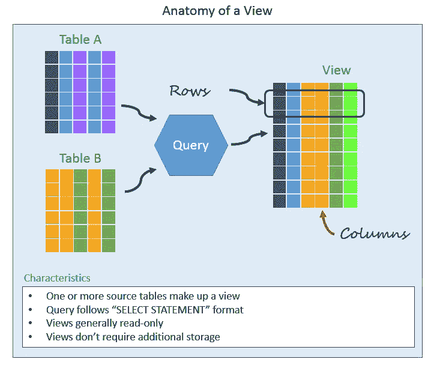
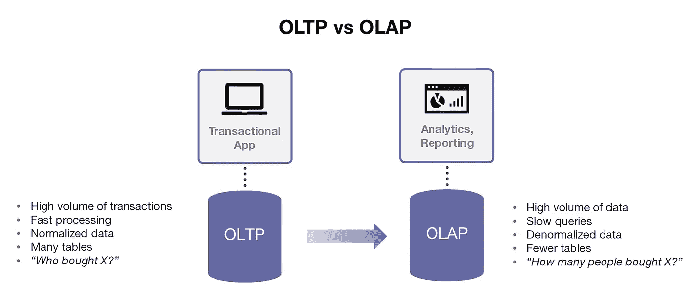
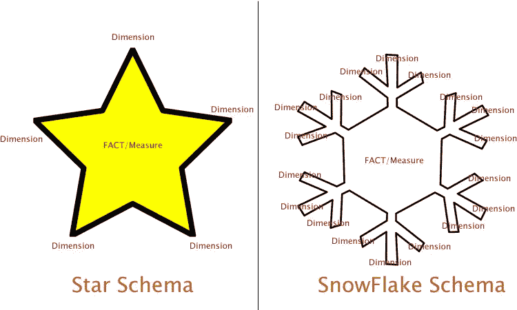
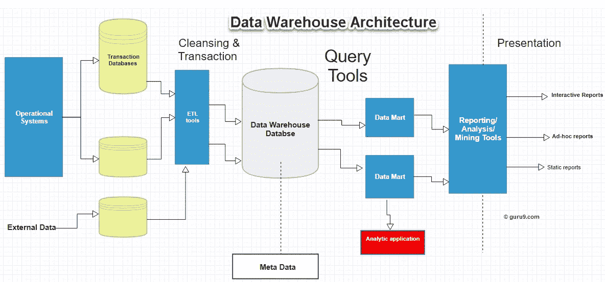
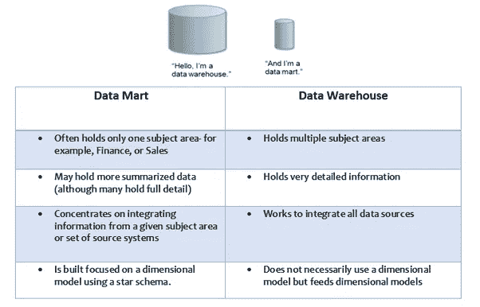

# 识别数据仓库:数据库和仓储导论

> 原文：<https://towardsdatascience.com/discerning-data-warehouses-an-introduction-to-databases-and-warehousing-cc9fc10f3283?source=collection_archive---------7----------------------->

在我作为数据科学顾问的新工作中，我立即需要学习大数据系统结构。这是我的研究中的一本入门书，可以让你对关键术语有一个基本的了解和快速的掌握。

# 什么是数据仓库？

一、什么是广义的仓库？这是一个很大的储物空间。举例来说，数据仓库(DWH)不是亚马逊仓库，而是存储数据的数字空间。

更具体地说，创建 DWH 的过程可以看作是通过提取-转换-加载(ETL)操作将原始数据输入移动到整合的存储系统中以用于分析。

DWH 是:

*   面向主题:数据按业务主题而不是应用程序进行分类和存储。
*   集成:从不同的来源收集给定主题的数据，并存储在一个地方。
*   时变:数据存储为一系列快照，每个快照代表一段时间。
*   非易失性:通常数据仓库中的数据不会被更新或删除。

# DWH 是由什么组成的？

嗯，是的，数据，但具体来说，它保存的是遗留数据或历史数据。有了这些历史数据，战略问题就可以用趋势和可视化来回答(因为人类在很大程度上非常不擅长解释表格形式的数据)。

DWH 可以通过源遗留数据将多个数据库联系在一起，从而创建这些关系模式。有了模式，DWH 将会更快更准确。

# 图式到底是什么？

最简单形式的模式仅仅意味着数据库中记录的定义，例如，模式可以说记录将由以下内容组成:

*   PersonID(唯一索引号)，
*   FamilyName (40 个字符)，
*   名字(40 个字符)，
*   出生日期

如果您知道模式，那么您的编程就会变得容易得多，因为您确切地知道在查询数据库时应该使用什么格式。但是，千万不要将*单独托付给数据库查询返回。每次都通过代码验证返回。*

*本质上，模式是你在数据库中定义的东西*，与数据库软件本身无关。创建数据库时，必须定义表的名称、这些表中的列、这些列将保存的数据类型，以及表和列之间的关系。这是一个模式。**

# *什么是数据库视图？*

*视图很方便，原因有几个。理解视图*、*的最简单方法是将其视为一个普通的 select 语句(例如，SELECT NAME FROM EMP WHERE ID>3 AND CITY = " OTTAWA ")，使其看起来像一个普通的表。*

*任何视图的基础都是 SELECT…这就是视图的创建方式。视图允许您获取复杂的 select 语句，并将它们转换成对其他用户来说看起来很干净的表格。*

*一个适当设计的视图还允许一个熟练的开发人员(通常是 DBA)优化一个特定的查询供其他人使用……而不需要确切地知道查询是如何进行的。最重要的是，创作者可以*调整*那个视图(让它更快或者修正它)，现在任何使用它的人都不必改变任何东西。*

*视图还可以用来限制来自不同用户组的某些信息…您可能有很多数据，只有一些用户可以看到全部，而其他人只需要看到特定的信息。为这些团队中的每一个创建视图允许他们只看到他们需要的数据，而不依赖于构建许多额外的表。把这些想象成预定义的过滤器…非常方便。不过要小心！正如我提到的，视图实际上只是在引擎盖下选择的…所以对视图的构造很差的查询(因为它们看起来像普通的表！)会导致性能不佳。*

```
*CREATE VIEW PopularBooks AS
SELECT ISBN, Title, Author, PublishDate
FROM Books
WHERE IsPopular = 1/* an example of a SQL View creation */*
```

**

*Visualization of how a View is constructed from a query.*

*在 DWH，**物化视图**可用于预计算和存储汇总数据，如销售额。这些环境中的物化视图通常被称为*汇总*，因为它们存储汇总的数据。它们还可以用于预先计算有或没有聚合的连接。物化视图用于消除与大型或重要查询类的昂贵连接或聚合相关的开销。*

*在分布式环境中，物化视图用于在分布式站点复制数据，并使用冲突解决方法同步在几个站点完成的更新。作为副本的物化视图提供了对数据的本地访问，否则就必须从远程站点访问数据。*

*两者的区别在于:*

*   *普通视图是一个定义虚拟表的查询——表中实际上没有数据，而是通过执行动态创建的。*
*   *物化视图是一种视图，查询在其中运行，数据保存在实际的表中。*

*当您告诉实体化视图刷新数据时，它就会刷新。*

*示例:*

*   *假设您在数据仓库中有一个事实表，其中包含从图书馆借过的每本书，以及日期和借书人。工作人员经常想知道一本书被借走了多少次。然后构建一个物化视图`select book_id, book_name, count(*) as borrowings from book_trans group by book_id, book_name`，设置它的更新频率——通常是仓库本身的更新频率。现在，如果有人针对某本书对`book_trans`表运行这样的查询，Oracle 中的查询重写功能将足够智能地查看物化视图，而不是遍历`book_trans`中的数百万行。*

*通常，出于性能和稳定性的原因，您会构建物化视图——脆弱的网络，或者在非工作时间进行长时间的查询。*

# *OLTP 与 OLAP*

*通常，数据每月、每周或每天从一个或多个联机事务处理(OLTP)数据库流入数据仓库。OLTP 传统上与关系数据库(RDB)相关联，而 OLAP 通常与 DWH 相关联。*

*在添加到数据仓库之前，数据通常在一个*暂存文件*中进行处理。数据仓库的大小通常从几十千兆字节到几兆兆字节不等，通常大多数数据存储在几个非常大的事实表中。*

**

*OLTP vs OLAP examples*

*OLAP 倾向于对大量数据(如 X 地区的销售总额)进行更多的汇总操作。我们也可以有 OLAP 模式:*

**

*Star Schema vs SnowFlake Schemas for OLAP*

# *什么是事实或维度？*

*事实是你的衡量标准。(例如，如果我们为一家娱乐公司使用 DWH，您的事实可以是座位数、剧院数、售出的门票等)。维度就像你的对象或分类信息。(如剧场名称、剧场城市)。*

> *重要的是要记住:数据库中的任何东西都是对象。*

# *业务用户发送查询时的 DWH 高级流程:*

*从运营系统获取数据->集成来自多个来源的数据->标准化数据并消除不一致->以适合于在任何时间轴上从集成的来源轻松访问和分析的格式存储数据。*

**

*Example DWH Architecture / Process Flow*

**

*More detailed DWH process*

# *什么是数据性能调优？*

*性能调优是非常主观的，也是一种非常开放的说法。性能调优的第一步是回答这个问题，“我们真的需要对我们的作业进行性能调优吗？”。SQL 索引是最有效的调优方法，但是在开发过程中经常被忽略。*

*在 ETL 阶段，大量数据被加载到 DWH 中。DBA 应该在数据库设计过程中考虑到这一点。*

*DBA 可以使用键聚集来确保插入的行不会在数据中创建热点。一种常见的方法是根据一个按顺序升序排列的值(比如一个标识列或一个序列)给新记录分配一个键，然后根据这个键对表进行聚集。结果是新插入的行被一起添加到表的一个部分中。*

*这些选项必须与索引设计相协调，因为表的物理聚集可能依赖于将其中一个索引指定为聚集索引。因为向表中添加一个代理键来聚集它必然意味着为该键创建一个聚集索引，所以这可能会影响表的索引总数。*

*不过，数据性能调优有点超出了本文的范围。有关 SQL 索引性能调优的更多信息，请查看[https](https://use-the-index-luke.com/)://use-the-index-Luke . com/*

# *他们是处于物理记忆还是短暂记忆？*

*瞬态数据是在应用程序会话中创建的数据，在应用程序终止后不会保存在数据库中。*

*而物理内存实际上保存在 RAM 或硬盘上。*

# *什么是数据集市？*

*一个*数据集市*包含对特定业务单位、部门或用户群有价值的公司数据的子集。通常，数据集市源自企业数据仓库。(例如，一个数据集市用于财务数据、销售数据、营销数据、社交媒体数据，另一个用于运营数据)。*

**

*Data Mart vs DWH*

# *有很多东西需要考虑，*

*但是我希望这对那些刚刚接触数据库、数据仓库和系统设计的人来说是一个很好的入门。在“大数据”时代，理解数据库和 DWH 对于当今的数据科学家来说至关重要。*