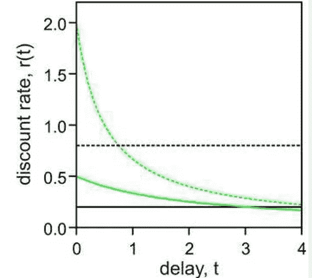

# 离散化。这不是一个词，但知道它的价值可以彻底改变你的决策。

> 原文：<https://towardsdatascience.com/discretification-its-not-a-word-but-knowing-its-value-can-revolutionize-your-decision-making-b33385bed84d?source=collection_archive---------21----------------------->

# **决定，决定**

分析的全部目的是为我们提供信息，让我们尽可能做出最佳决策。不幸的是，有时数据并不能使前进的道路变得清晰。这些困难的决定需要时间在利益相关者之间进行分类。

例如，假设你负责一个组织的营销部门，你正在测试一个特定的新活动。您选择一部分位置来展示广告，然后跟踪结果。在试用结束时，你会发现营销活动每花费 1 美元，就能为你的公司带来 4.5 美元的收入。这场运动值得推广吗？

这些类型的决策经常出现在使用分析的过程中。对于如何前进，很少有*明显的*答案。很明显，试验活动奏效了，但是它的效果*是否足够*来证明一项更重大的投资是合理的？一方面，它赚了钱！每美元 4.50 美元是一个稳定的回报，在你的业绩评估中不太可能被视为一个糟糕的决定(假设当你扩大规模时，它会显示类似的结果)。

另一方面，不仅仅是在更大的样本中表现不佳的风险，你还需要考虑如何更好地利用你的营销预算。如果你现有的营销策略每投入 1 美元就能产生 6 美元的收益，那会怎样？现在 4.50 美元的回报看起来不太好。

做决定的困难不仅仅是情绪上的负担；它耗费你公司的时间和金钱。此外，违背一个决策者的偏好以满足另一个决策者的偏好会带来政治上的复杂问题。我们如何避免做出艰难决定的漫长过程？

离散化！别费劲去谷歌了，因为你会一无所获。然而，不要因为字典里没有这个词，而让你变得更加果断。在讨论“离散化”的含义之前，让我们回顾一下两种基本的数据类型。

# **离散与连续数据**

毫无疑问，你以前听说过这些术语，但是让我们提醒你一下，以防万一。

离散数据只适合不同的类别。这类数据的一个很好的例子是一周中的每一天。尽管星期一晚上 11:59:59 和星期二上午 12:00:00 相差一秒钟，但这几秒钟是在完全不同的日子里。其他例子包括血型、国家和流派。

连续数据是从一个值流向下一个值的度量。温度是一个很好的例子，因为有些人可能认为华氏 90 度是“热”的，而其他人认为 20 度是“冷”的，温度读数之间没有绝对的差异。

商业中永远存在的一个例子是。。。钱！说到底，无论我们做什么决定，都归结到底线，这必然是一个持续的衡量。一般来说，从离散数据中做出决策更容易。每一类都可以导致一个特定的行动过程，需要更少的讨论。

不幸的是，因为我们大部分时间都在评估投资回报，所以在做决策时，我们很可能会处理连续的数据。改变我们看待数据的方式肯定会解决这个问题，这就把我们带到了。。。

# **“离散化”的含义**

该是笑点的时候了。

**“离散化”是将连续数据离散化的机制。**

如果你真的理解了这个概念，你可能会想“等一下，我们收集的数据类型本身就是离散的！数据可以是离散的，也可以是连续的，不可能两者都是！”你是对的。

但是，如果我们沿着连续的度量手动选择值，并声明它们属于特定的类别，会怎么样呢？例如，如果我们宣布 72.0 度及以上为“热”，35.0-71.9 度为“适中”，任何低于 35.0 度的为“冷”，我们就有了“离散化”的温度！我们的读数曾经是连续的，现在可以分成不同的类别。

那么，我们在哪里划分这些类别的界限呢？是什么让 35.0 度“冷”，35.1 度“中”？正是在这个关键时刻，做出了真正的决定。以这种方式应对挑战的好处在于，它是以数据为中心的，而不是以概念为中心的。让我们先在不使用离散化的情况下浏览一下我们的营销示例，然后再使用它。

您已经完成了对一项新营销活动的研究，每投入 1 美元，它就会产生 4.5 美元的收益。这个活动是你的老板营销总监的创意，他们对活动本身和结果感到自豪。

你、营销总监和营销副总裁之间召开会议，以确定该活动是否需要立即投资。您的主管敦促副总裁为该活动开绿灯；这是他们的项目，他们的鲜血、汗水和泪水表明这将有助于该组织。副总裁面临着提高营销费用利润率的压力，鉴于其他渠道的 6 美元回报，他们倾向于将资金投向其他地方。

最终，他们决定由你来决定。如果你继续这个项目，你可能会让副总裁觉得你做决定不是为了公司的利益，而是站在你的经理一边。否决这个想法，你就破坏了你和那个对你是否升职最有发言权的人的关系(更不用说每天和他们一起工作了)。

可以理解，你想尽可能小心。你需要一两周的时间来研究其他营销理念，如果资金没有投入到扩大试验活动中，这些营销理念可以用这些资金来实现。你认识的其他专业人士也会参与进来，努力帮助你做出最好的选择。

你最终决定。。。这真的重要吗？无论如何，你都在损害与关键利益相关者的关系，做出决定的过程需要时间，而时间就是金钱。

现在让我们看看，如果你把你的结果离散化，这个故事会如何发展。

在进行试验之前，你召集你、你的经理和营销副总裁开会。议程的首要任务是确定你们都同意需要达到的最低回报，以证明扩大活动规模的合理性。副总裁要求 6.50 美元，以确保这表明该部门正在提高盈利能力。你的经理平静地指着正在试用的地点，那很可能比其他人表现得更差。你的经理能够将副总裁的价格一路降到 5.75 美元作为分界点。

毫无疑问，你可以看到这将走向何方。结果显示，每一美元的花费只有 4.5 美元，远低于最低值。你只需发送一封电子邮件，通知主要利益相关者事实，并根据之前的协议停止追求新的营销策略。不需要额外的时间来考虑。

虽然你的经理可能会感到失望，但这个决定并不反映他们、他们的想法或他们的工作。它仅仅基于收集到的数据。这就是以数据为中心和以概念为中心的区别。这让所有相关人员免受政治纠纷的困扰。这是一个客观的决定，得到了所有关键利益相关者的支持。

这个过程中有一个重要的变量，它不仅对节省您和您的组织的时间和资源至关重要，而且还有助于改进决策本身！

# **时机决定一切**

也许你听说过一个著名的实验，他们现在给孩子们一块饼干，或者在 15 分钟内给他们两块饼干。选择抑制自己追求直接回报的冲动的孩子更有可能在职业生涯中取得成功。

延迟满足对我们有益，这不是秘密。但是，它与将我们的数据离散化以帮助我们决策有什么关系呢？

将这种方法与延迟满足联系起来的基本概念是时间。几年前，科学家们创建了一个函数，该函数可以根据结果发生所需的时间来捕捉人们如何评价不同的结果:

*前额叶皮层和冲动决策。金，素云，李，大韩。生物精神病学 2011 年 6 月 15 日；69(12):1140–1146*

这里的要点是，人们倾向于错误地低估预期对他们影响越大的结果的价值。在我们的例子中，当研究的结果出来并且必须做出决定时，该选择的影响将在不久的将来显现。根据图表，如果你在权衡是否推进新的营销策略，你更有可能给它开绿灯。你期待很快看到回报，这意味着你更重视这个结果，而不是花时间去寻找更好的营销途径，这些途径的好处在一段时间内不会被感受到。

通过提前划定如何离散化数据的界限来做出决策，您就不太容易产生这种偏见。即使你最终为活动开了绿灯，你也会在预期直接影响之前做得很好。较少倾向于这种偏见意味着更多的客观性，因此，更好的决策。

最后让我们看一个更简单的例子来说明这个概念。在热门电视节目《一掷千金》中，参赛者会得到一个公文包，里面装着数目不详的钱。基于他们面前的箱子的价值，他们不断地被给予选择是否要卖掉他们的公文包(可能从 0.01 美元到 1，000，000 美元不等)。

一个简单的例子:还剩两个公文包，其中一个是他们自己的。其中一个箱子价值 10 美元，另一个价值 20 万美元，但参赛者不知道哪个是哪个。“银行家”为他们的案子出价 95000 美元。他们接受交易了吗？

在节目中，很多娱乐来自于观看参赛者戏剧性地考虑他们的选择，并接受他们朋友和家人的建议。因为这些参赛者将立即获得奖金，赢得这些奖金的前景会影响他们的决策。也许他们会更好地接受一笔重要的交易，但他们在想，如果他们的案子有不太可能的百万美元，那该有多好？也许这是值得的，但他们担心做出错误的决定，把钱留在桌子上，当着数百万人的面？

当我们更接近于感受这些决定的影响时，这些让我们偏离客观决策的想法很可能会影响我们。如果参赛者走进游戏时知道他们会同意的金额，这将保护他们不失去客观性。

# 把所有的放在一起

我们现在知道，我们不仅必须离散化我们的数据以使我们的决策更容易，而且这样做的时间和方式也是至关重要的。让我们回顾一下这个过程应该如何工作。

1.**识别目标**

每个组织都有具体的、可衡量的目标(或者应该有)。无论你做出什么样的决策，这些数据都应该让你的团队做好实现这些目标的准备。任何不足都不值得你付出宝贵的资源。

2.**提前获得关键利益相关方的认可**

最重要的决定将会受到最严格的审查。与高管团队(或任何必要的人)就如何以及为什么做出决策进行明确的沟通，不仅能让所有人达成一致，还能在事情变糟时保护你。

3.**收集数据**

你知道你的目标，现在是让数据说话的时候了。

4.**分析并展示结果**

向你的团队汇报发现了什么，提醒他们你之前设定的目标。

5.**执行决定**

这是现在最容易的部分。鉴于从您的数据收集中获得的洞察力，每个人都同意采取行动，剩下的只是简单地坚持到底。

如果在进行“交易或不交易”之前，参赛者认真考虑了将显著改变他们生活的金额，他们可以酌情处理提供给他们的潜在交易。他们不会被聚光灯或观众、朋友和家人的催促而动摇。他们会冷静地打开案例，立即拒绝低于目标的交易，并在交易足够时立即接受交易。

这种快速、客观、不带偏见、不带感情色彩的决策过程会让这一集变得相当无聊。也许这就是为什么没有基于决定性数据分析师的真人秀节目。

*本文原载于*[*www.strataquant.com*](http://www.strataquant.com)