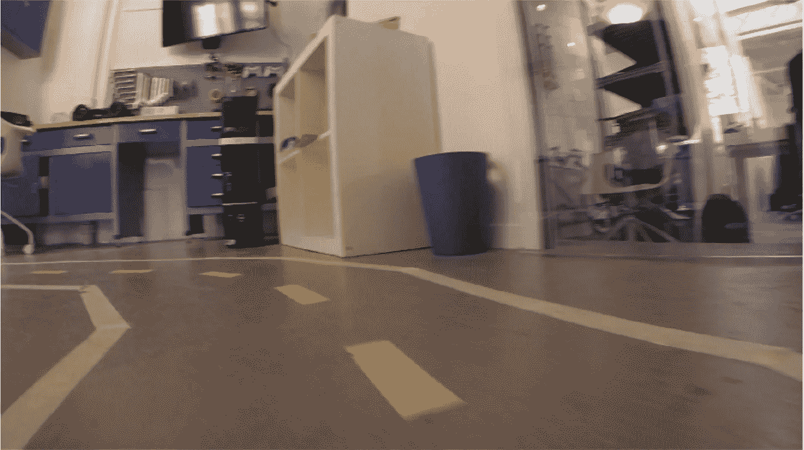

# 微型自主车辆中深度学习特征地图的可视化

> 原文：<https://towardsdatascience.com/displaying-convnets-feature-maps-on-real-time-video-with-keras-and-opencv-418b986adda7?source=collection_archive---------6----------------------->

我们开始制造 Axionaut 已经有几个月了，这是一辆[迷你自主无线电控制(RC)汽车](https://www.axionable.com/hello-axionaut-1er-prototype-de-vehicule-autonome-daxionable/)，并在巴黎的一些比赛中进行了比赛。到目前为止一切顺利，我们设法获得了好职位。然而，人们总是对控制车辆的卷积神经网络内部的实际情况感到好奇。

有一些关于如何[显示特征地图](https://hackernoon.com/visualizing-parts-of-convolutional-neural-networks-using-keras-and-cats-5cc01b214e59)和[过滤器](https://blog.keras.io/how-convolutional-neural-networks-see-the-world.html)的很棒的文章，在试图理解和编码 ConvNet 的特征地图时都很有帮助。我们还看到一些[很酷的 Nvidia 视频](http://www.youtube.com/watch?v=URmxzxYlmtg&t=16m51s)展示了自动驾驶汽车上的实时 ConvNet 神经元激活(但是，他们是如何做到的？).

所以，我们决定经历一遍，并尝试在我们的原型中复制这种体验。为此，我们使用了我们已经拥有的预训练的 [Keras ConvNet 自动驾驶模型](https://github.com/Axionable/Axionaut)，以及在训练和比赛时从车上拍摄的一些视频。

以此为起点，我们花了几天时间寻找经典问题的答案，如“网络如何看待世界”和“网络实际关注什么”。

体验的结果如下所示:

# 履行

如果你对我们如何做到这一点感到好奇，你首先需要了解的是，当在卷积层的视野中检测到相关特征时，卷积层的特征图是如何“触发”的。一个非常好的解释可以在 Harsh Pokharna 的文章中找到。

在这种情况下，我们的车就成了检测车道的‘专家’了！

但是，它是怎么做到的呢？其实背后并没有显式的编程。在训练期间，我们提供了所需的输出(左转、右转或直行)和示例道路图像，因此网络会自动“学习”车道是关键。

正如人类所做的那样，在不考虑任何其他因素(其他车辆、路标、行人或目的地)的情况下，车道为我们提供了关于正确决策的相关信息。我们向左转好吗？对吗？继续直走？

好吧，让我们回到正题上来。我们应该做的第一件事是访问感兴趣的卷积层，并绘制激活的热图。为此，我们使用了这个伟大的[库](https://github.com/philipperemy/keras-visualize-activations)的稍微修改版本。

激活的完整重建必然意味着考虑“深”和“浅”卷积层的贡献，如这里的[所解释的](https://arxiv.org/abs/1611.05418)。

为了简化，我们决定从单个卷积层估计激活，执行三次插值上采样而不是去卷积。在对整个网络的所有特征地图进行视觉检查之后，我们选择了第二个卷积层。

结果如下所示:

Input image

Feature map of the second convolutive layer

在这一点上，很明显网络主要是响应车道。下一步是重叠原始输入图像和激活，以一种干净地重叠具有高响应的区域而不损害原始图像的形状或颜色的方式。

OpenCV 来救援了！第一步是创建一个二元掩模，允许我们分割最高的激活，同时排除其余的。由于激活图的尺寸较小，还需要进行上采样。在此之后，我们将应用一些位运算来获得最终的合并图像。

第一个位运算是二进制掩码和激活映射之间的“与”。这个操作可以很容易地使用 OpenCV 实现，并允许分割最高地图的激活。

Binary mask

Bitwise “and” operation between mask and feature map

正如所料，我们获得了一个干净的车道分割完全由卷积神经网络。

在这一点上，我猜你可以想象得到最终图像所需的第二个位运算:加法。冷蓝色的出现是由于 Matplotlib (RGB)和 OpenCV (BGR)颜色格式之间的差异。你可以玩这个改变 Matplotlib 的颜色图来得到不同的颜色！

瞧，我们通过对网络激活的合理估计，获得了输入图像和特征图之间的最终合并。

Final merged image

现在，让我们呈现一个。avi 视频与结果。

# 问题

如果你有任何问题，我很乐意在评论中回答。包括所有代码和数据库在内的公共知识库的链接在[这里](https://github.com/Axionable/FeatureMaps)可以找到。别忘了在推特上关注我们。