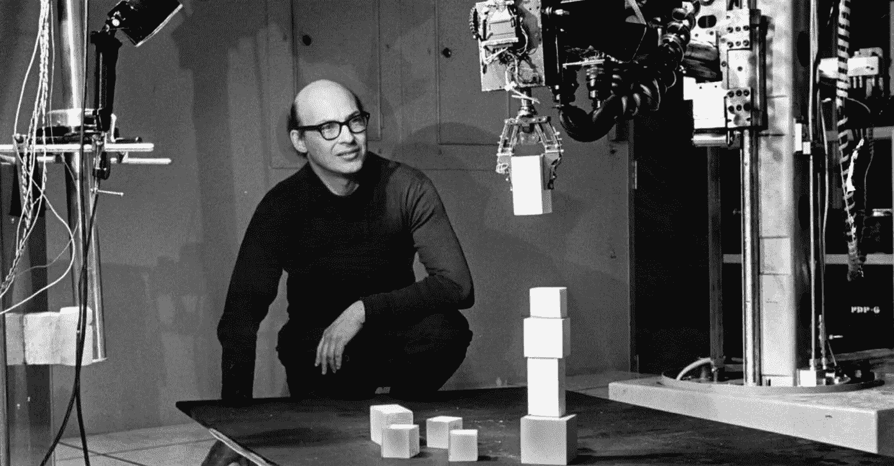
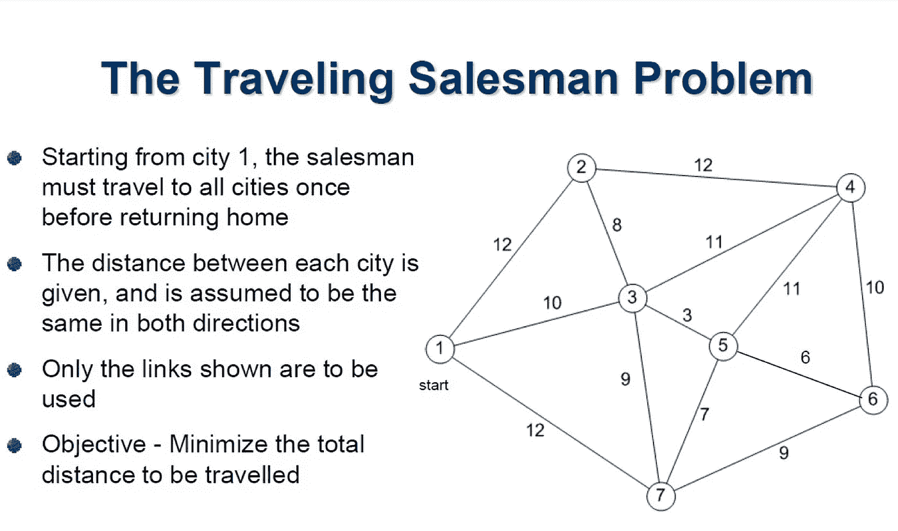

# 破坏性机器学习

> 原文：<https://towardsdatascience.com/disruptive-machine-learning-7eafd8088166?source=collection_archive---------7----------------------->

在过去的二十年里，当我们一直在学习如何互相学习——并且做得非常出色的时候，我们也在学习一些更基本的东西。

我们一直在学习如何学习。

这听起来很明显，毕竟，我们一直都在学习。人类就是这样，对吧？

但实际情况远不止如此。我们知道我们在学习，但实际上我们绝对知道我们如何学习。

直到我们试着教计算机任何东西，我们才明白这一点。

Dr. Marvin Minsky demonstrates an early AI system.

50 年前,“人工智能”的概念似乎不像是一个白日梦——在那些知道内情的人看来——而是我们在几年内就能完全解决的东西。我们有快速的计算机和聪明的计算机科学家，我们肯定会让所有这一切马上开始运行。

具有讽刺意味的是，直到我们试图让计算机学习时，我们才发现我们对自己如何学习知之甚少。

在过去五十年的大部分时间里，我们试图用我们在教室里使用的相同技术来“教”一台计算机。那根本不管用。

早在我们走进教室之前，我们就是海绵，吸收我们能找到的每一个经验，从中学习。没有教室，没有老师，只有一颗乐于接受、渴望的心。

小孩子实际上是最专注的科学家，进行实验，测试假设，发现世界规律。

我们知道这一点已经有一百年了，但是直到几年前，我们才把这个过程应用到机器上。

直到几年前，计算机还不够小或不够快，不太擅长这种学习。但是在过去的 20 年里，计算机的发展速度平均快了 1000 倍，所以我们现在有足够快的计算机，可以用类似于我们学习的方式来学习。

让我们来看两个例子——都是澳大利亚的科技初创公司。

其中的第一个，位于悉尼的[prediction](http://premonition.io/)，提供了一个非常简单的价值主张:它们提高了车队的效率。

预感可以做到这一点，因为车队中的每辆车都有一个带智能手机的司机，而智能手机连接到非常快速的移动宽带网络，将连续的位置信息输入预感。

Premonition 知道每辆车的位置，了解实时交通和天气状况，了解拟议的车队调度，然后提出建议，优化每辆车的路线——至少在理论上是这样。

路线优化是一个众所周知的难题，在数学上被称为“旅行推销员问题”。再加上现实世界的所有额外复杂性、实时数据和路线的实时变化，这就成了一个非常困难的问题。

因此，Premonition 建立了一个机器学习系统，它可以听取所有这些信息，并提出建议。但这只是开始。预感提出建议，然后听取建议的结果。这是一个好的建议吗？很糟糕吗？预感反馈其建议的结果——它从成功和错误中学习。

这是关键点:这种不断优化和改进的过程意味着使用预感服务的公司看到车队运营成本下降了 10%或 15%——仅仅通过与预感共享他们的数据。它不会在第一天就发生，但随着预感的学习，随着它对自己提出的建议变得更聪明，这些建议会得到改善，运营效率也会提高。

预感抓住了机器学习和 21 世纪商业之间交集的本质。它无缝地滑入，倾听，学习和提高。

对于像车队这样平淡无奇的事情来说，这已经足够令人惊讶了。但是另一家初创公司——Maxwell MRI(——正朝着一个更有趣的方向发展。

Maxwell MRI 将机器学习引入医学放射学，建立了一个能够提供早期可靠的前列腺癌检测的系统。这是一件大事，因为早期前列腺癌通常很难检测出来，如果像年轻人一样具有侵略性，可能会很快导致致命的诊断。

通过数以千计的病历和扫描，Maxwell MRI 学会了如何检测前列腺癌的症状，这是一项放射科医生觉得很难——而且往往不可能——的工作。麦克斯韦核磁共振成像填补了早期诊断和早期治疗的领先优势，这应该导致更好的结果，在癌症变得致命之前抓住它。

放射科医生应该受到麦克斯韦核磁共振的威胁吗？我们经常读到这些智能机器将如何让我们所有人失业，但如果你看看麦克斯韦尔 MRI 是如何工作的——以及预感是如何工作的——你会发现它非常适合组织的工作流程。Maxwell MRI 让放射科医生的工作变得更好，但它不会取代他们。

这也意味着，在训练有素的放射科医生有限的地区，如澳大利亚地区，Maxwell MRI 提供了否则根本不会出现的诊断能力。它成倍提高了放射科医生的效率。

当 IBM 在 2014 年来到澳大利亚推销他们的用于肿瘤学的[沃森(Watson for Oncology](https://www.ibm.com/watson/health/oncology-and-genomics/oncology/) )时，他们非常小心地强调他们的产品不会取代肿瘤学家，而是“肿瘤学家耳边的安静声音”，提供尽可能好的建议，以指导实现尽可能好的结果。

有时这比任何人预测的都有效:肿瘤学沃森最近诊断了一种癌症，这种癌症难倒了日本的每一位肿瘤学家——因为它有更多的知识可以利用，成千上万的病历，远远超过任何从业者所能看到的。

很难想象，在十年左右的时间里，任何大规模运营的组织都不会有几个机器学习系统在其中运行，帮助该组织生存和发展。

这就是事情开始变得非常有趣和具有破坏性的地方。机器学习不是单行道。它不仅仅属于组织。个人也会有这些系统。

大约二十年前，Furby 成为世界上最热门的玩具。孩子们喜欢 Furby，因为当他们和它玩耍时，它似乎在学习和成长。早在 1998 年，那只不过是聪明的剧院。

今天，我们定期与苹果的 Siri 和亚马逊的 Alexa 和谷歌助手进行对话。所有这些对话都提供给庞大的机器学习系统，帮助这些系统更好地理解我们对它们说的话。

在接下来的几年里，我们会看到学习变得更加具体，更加关注我们自己的个人需求。

毕竟，如果预感可以使用机器学习来提高车队的效率，麦克斯韦尔 MRI 可以使用机器学习来提高诊断的准确性，那么我们为什么不想使用机器学习来帮助提高我们的生活质量或谋生能力呢？

我们将使用机器学习来帮助我们利用机会。

这很快就引出了一些有趣的路径，因为我们正在走进的世界在组织中有许多机器学习系统，这些系统将很快开始与个人使用的许多机器学习系统进行交互。这些系统将开始互相学习。

当预感和你的个人机器学习系统研究出如何合作，以便你可以达到你的目标，那将是一个非常不同的世界。这个世界变得非常聪明，非常快。

我们刚刚通过万维网经历的那种转变——我们变得非常聪明，非常快，因为我们都在分享我们知道的东西——即将再次发生，但这一次是机器学习。

这将是我们和我们所知道的，以及机器和它们所知道的，所有人都在以每一个可以想象的有意义的方向相互交流。

我们将被所有这些智能引导着穿越那个世界——有些是我们的，有些是其他的，有些是机器。这对我们今天来说听起来很奇怪，但我认为这只是因为这是一个非常新的想法，我们对那个世界的样子没有一个完整的概念。

但你可以把它想象成一个真正的好朋友或值得信赖的知己，他不断给你提供一些小信息，总是帮助你在任何情况下都做到最好。

过了一会儿，有了这样的东西，我们会发现很难想象没有它我们怎么生活。

这就是我们对智能手机的感觉，仅仅在 iPhone 发布十年后。

这种容量的持续提高，才是真正的颠覆。这就是改变一切的改变。这就是组织需要准备和建设的目标。

我们已经走了很远了。我们已经有了这个分享和学习的巨大结构——尽管我们主要用它来记录我们的社会生活。但是分享比脸书更有意义，事实比维基百科更有用。

我们需要学会分享，我们今天就需要这样做，因为这是开启一切的钥匙。如果你自己做不到这一点，可以与其他擅长数字化转型的企业合作。数字化转型的基石是学习如何分享。

考虑如何与不断变得更聪明、更有能力、同样渴望分享和学习并使用分享和学习工具的客户合作。

在一个地方呆得太久，你会发现你的顾客已经跑在你前面，投入到另一家企业的怀抱。

接受这个事实，这个更聪明的未来伴随着一定程度的不确定性。

我们最近才知道，我们可以获得擅长做某些事情的机器学习系统——进行诊断，或安排交付，等等——但不能告诉我们为什么他们会做出这样的决定。

几乎可以说，这些机器学习系统已经变得如此“人性化”，它们是凭直觉工作的。我们有点怀疑地捍卫这一点是对的，但仅凭这一点就拒绝它是愚蠢的。在某些方面，一个更智能的世界对我们来说有点太智能了。许多事情将会“起作用”——但是在我们理解它们为什么起作用之前，还需要相当长的时间。

这有点怪异，几乎感觉有点不可思议。所以让我用一个故事来总结这一切:

nVidia CEO Jen-Hsun Huang reveals the hardware for autonomous automobiles.

在最近的消费电子展上，我看到了一辆配备了非常强大的机器学习系统的奥迪——它安装在一块与 iPad 大小相同的电路板上。

然后，汽车被编程为向人类司机学习，后者在一周内驾驶汽车 48 小时。48 小时后，机器学会了如何驾驶。

它开起来完美吗？大概不会。但它肯定行驶得足够稳定，以至于奥迪毫不犹豫地驾驶一辆已经学会如何自动驾驶的汽车带着人们去兜风。

他们将这款车战略性地放置在展会入口的正对面，这是奥迪承诺将在不到四年内交付的未来的指针。

这就是我们善于学习的地方，也是我们善于创造学习的东西的地方。我们才刚刚开始。

Here’s the full talk given at Computershare Innovation Day, May 2017.